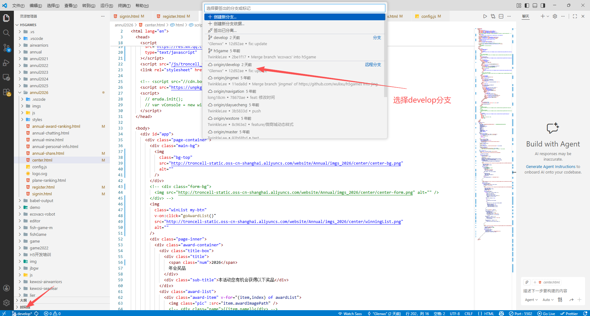
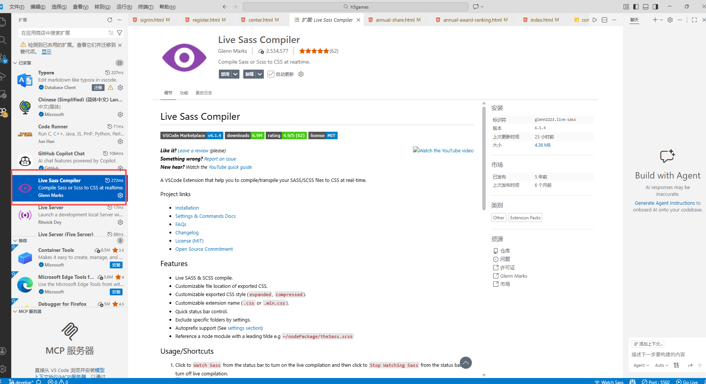
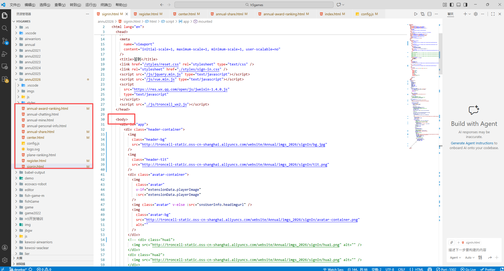
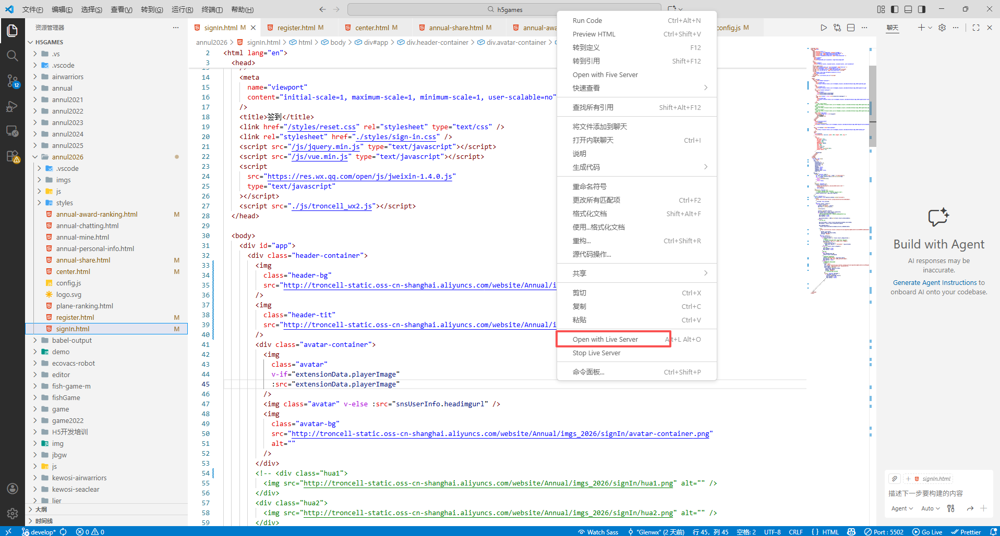
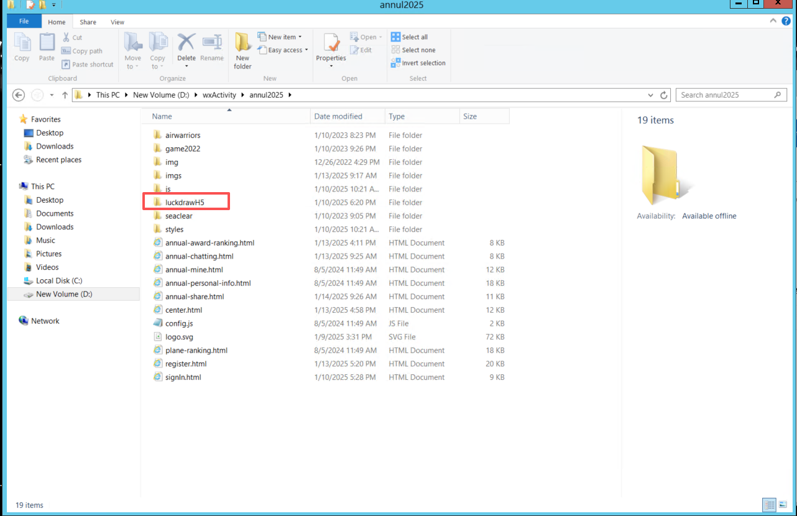

# 1.仓库

仓库地址：https://github.com/wulixu/h5games

# 2.拉取仓库代码

（1）在某一文件夹下右击，选择-在终端中打开

（2）输入：git clone https://github.com/wulixu/h5games.git

# 3.VSCODE配置

## 1.将拉下来的代码用VSCODE打开

## 2.切换分支：develop

## 3.安装插件：Live Sass Complier

## 4.修改文件内容

手机页面显示修改：更换注册、签到和活动中心页的图片。一般都在每个html文件的body里

如果需要注释可以按住：ctrl+/

## 5.预览

1.修改完成后，在对应的html，右击，点击open with live server，会在浏览器打开页面

**注意：注册页修改，修改此处状态，运行时直接跳转到对应页面**

## **6.样式修改：**

2.运行时尺寸切换成代码里的尺寸这样修改样式时，可以直接复制

## 7.H5页面抽奖配置

已在年会活动.md说明，修改样式和手机H5调整样式一样的方法

注意：显示头像画布的是个canves，需要在代码里修改和预览

# 5.服务器部署

部署服务器：包含H5抽奖页面

| 服务器          | 密码             | 系统    | 连接方式     | 部署文件夹地址          |
| --------------- | ---------------- | ------- | ------------ | ----------------------- |
| 139.196.240.230 | 1!TronCell2022!1 | windows | 远程桌面连接 | D:\wxActivity\annul2026 |

