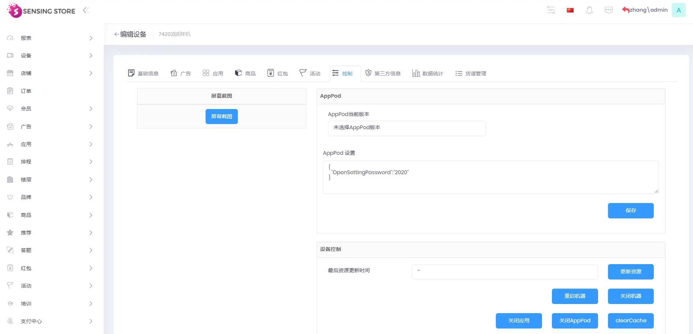

# SensingAds APK

# 目录
  - [1.Android版](#1android版)
    - [1.1 APK安装](#11-apk安装)
    - [1.2登录设备密钥](#12登录设备密钥)
    - [1.3更换设备密钥](#13更换设备密钥)
    - [1.4设置页面](#14设置页面)
  - [2.Windows版](#2windows版)
    - [2.1登录设备密钥](#21登录设备密钥)
    - [2.2更换设备密钥](#22更换设备密钥)
  - [3.设置介绍](#3设置介绍)
  - [4.常见问题](#4常见问题)

##  1.Android版

### 1.1 APK安装

方案一：adb命令安装

1. 安装adb环境 [参考文档](https://blog.csdn.net/weixin_55018452/article/details/121992202) 
   
2. 连接数据线，机器打开开发者模式

3. 在电脑端打开apk路径，按住shift键，鼠标右击，打开powershell窗口

4. 输入命令：adb install -r .\com.troncell.sample-v3.0.0-beta06-release.apk（apk名称）

方案二：优盘安装

1. 将apk放入U盘，直接插在机器上
   
2. 识别U盘后，文件管理里打开U盘，双击apk进行安装
### 1.2登录设备密钥

1. 安装完成后，打开SensingAds

2. 输入服务器地址：https://d-gw.api.troncell.com
   
   

3. 输入设备密钥，点击注册（注：若密钥在其他机器上登录过，会有红色字体提醒，需要单击红色字体后再点击注册）

4. 注册完成后，机器上提示正在同步资源（注：若修改了信息，并将信息重新发布到了设备，需要在设备下的控制里，点击更新资源，机器会提示正在同步资源）

### 1.3更换设备密钥

方法一：

1. 进入SensingAds，长按左下角，输入密码2021,进入注册页面（默认密码为2021，可进行修改）

修改方法：
再对应设备下的控制里，在AppPod 设置里输入修改密码

格式：
{
  "OpenSettingPassword":"2020"
}

1. 修改设备密钥后，点击注册

方法二：

1. 打开机器里的设置，找到应用SensingAds

2. 在SensingAds应用信息界面，单击清除数据后返回首页
   
3. 打开机器里的文件管理，搜索AppPod,打开AppPod文件夹，删除database文件夹

4. 打开apppod，输入密钥后点击登录

### 1.4设置页面
**步骤：注册页面-点击右下角小图标-进入设置页面**

   

（1）广告信息：打开广告信息，再进入播放界面，下方会显示具体播放信息

  

（2）Debug：打开Debug，再进入播放界面，播放H5内容时下拉可以刷新页面。关闭Debug，播放H5页面下拉不会刷新。

（3）服务器地址：若是独立部署，可更改服务器地址

## 2.Windows版
### 2.1登录设备密钥
1. 双击打开AppPod.exe,输入设备密钥，点击检查KEY.显示设备信息
     
   

2. 点击注册

3. 注册完成后，机器上提示资源下载中，左下角显示对应的租户、设备，右下角显示版本号。下载完成后显示播放内容
4. 
   

### 2.2更换设备密钥
1. 按下键盘里的F8，弹出设备注册界面

2. 重新输入密钥后，点击注册

3. 播放界面，按下键盘：Alt+F4，关闭播放界面

4. 若注册的设备已经在其他设备注册过，会提示注册失败，按下键盘F2，再点击注册即可
   
    
## 3.设置介绍

1. 入口：注册页，右下角设置图标，点击进入
2. 广告信息：开启广告信息，播放内容时下方显示参数详情；关闭广告信息则不显示。
3. Debug：开启debug，播放网页时可下拉刷新；关闭则无法下拉刷新

## 4.常见问题

 