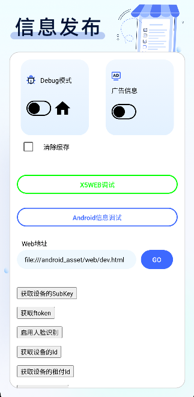

## 1.Android 版

## 一、功能总览

| 功能         | 业务含义                                                                                                    | 所属模块                | 入口                             |
| ------------ | ----------------------------------------------------------------------------------------------------------- | ----------------------- | -------------------------------- |
| **信息发布** | 数字标牌 / 广告播放系统。设备注册到云平台后，自动下载图片、视频、HTML 等内容到本地并通过 WebView 循环播放。 | `sensing-app-ads`       | `MainActivity` → 选择“信息发布”  |
| **参数设置** | 各子应用（Ads、Sample、Cashier、Shelf、Gate）的设备注册、云/Hub 地址、功能开关、串口等参数配置页面。        | 各 `sensing-app-*` 模块 | 由各子应用主界面通过密码回调进入 |

---

## 二、信息发布（数字标牌）

### 2.1 核心流程

```
启动 SplashActivity
    ↓
未注册 → RegisterActivity（参数设置/注册页）
    ↓
已注册 → WebActivity（内容播放页）
    ↓
MQTT / WebDataSyncWorker / FileDownloadWorker 实时/定时同步云端素材
    ↓
AgentWeb 加载本地/远程 H5 页面并播放
```

### 2.3 注册页功能项

注册页同时承担“参数设置”职责，可配置以下参数：

| 配置项          | 字段/State           | 说明                                                                  |
| --------------- | -------------------- | --------------------------------------------------------------------- |
| 云平台地址      | `host`               | 默认 `https://d-gw.api.troncell.com`，用于调用设备注册/信息接口       |
| SensingHub 地址 | `hubhost`            | 本地或远程 Hub 服务地址，建立长连接                                   |
| 设备秘钥        | `subKey`             | 设备在云平台的唯一标识，扫码或手动输入                                |
| 检查设备秘钥    | `onRegisterClick()`  | 校验 subKey，拉取设备信息并注册到云平台                               |
| 强制注册        | `_isForceRegister`   | 当本机 MAC 与已注册 MAC 不一致时，可点击错误文案强制使用本机 MAC 注册 |
| 版本信息        | `deviceInfo.version` | 显示当前 APK 版本号                                                   |
| 进入播放页      | `settingAction`      | 注册成功后跳转到 `WebActivity` 开始播放                               |

### 2.4 内容播放页功能

`WebActivity` 是信息发布的主运行界面：

| 功能           | 说明                                                                               |
| -------------- | ---------------------------------------------------------------------------------- |
| WebView 播放   | 使用 AgentWeb 加载 `file:///android_asset/web/dev.html` 或云端下发的 H5 地址       |
| JS 桥接        | H5 通过 `android` 对象调用原生能力；原生通过 `jsAccessEntrace.quickCallJs` 回调 H5 |
| 文件下载回调   | 收到 `StartDownloadFileActionFinish` 广播后，调用 H5 `FileDownloaded` 事件         |
| Hub 消息推送   | 通过 EventBus 接收 `SensingDeviceDataChangedInput`，调用 H5 `HubMessage` 事件      |
| 下拉刷新       | Compose 下拉刷新组件触发 WebView `reload()`                                        |
| 调试模式       | 开关 `debugMode`，控制日志与开发菜单                                               |
| 广告提示       | 开关 `isShowAdsHint`                                                               |
| 服务器 IP 保存 | 可临时修改并检测服务器地址可用性                                                   |
| 切换 X5 内核   | 可跳转 `X5WebActivity` 使用腾讯 TBS 浏览器内核                                     |
| 日志上传       | 主动调用 `TLogService.positiveUploadTlog` 上报日志                                 |



## 三、APK安装

### 1.1 APK 安装

方案一：adb 命令安装

1. 安装 adb 环境 [参考文档](https://blog.csdn.net/weixin_55018452/article/details/121992202)
2. 连接数据线，机器打开开发者模式
3. 在电脑端打开 apk 路径，按住 shift 键，鼠标右击，打开 powershell 窗口
4. 输入命令：adb install -r .\com.troncell.sample-v3.0.0-beta06-release.apk（apk 名称）

方案二：优盘安装

1. 将 apk 放入 U 盘，直接插在机器上
2. 识别 U 盘后，文件管理里打开 U 盘，双击 apk 进行安装

### 1.2 登录设备密钥

1. 安装完成后，打开 SensingApp
2. 输入云平台地址：https://d-gw.api.troncell.com
3. 输入 sensinghub 地址：http://192.168.1.7:8080（例）
4. 输入设备密钥
5. 点击检查设备密钥，可以查看设备信息(租户-店铺-设备名-设备类型-版本号))
6. 点击注册，进入应用选择页面


### 1.3 应用选择

可以选择对应的应用场景，选择信息发布


### 1.4 信息拉取

选择应用场景后，会提示正在同步资源（注：若修改了信息，并将信息重新发布到了设备，需要在 sensingstore 的后台，设备下的控制里，点击更新资源，机器会提示正在同步资源）

### 1.5 设置弹框

**1.密码设置**

在首页和补货页面，都可以长按右下角，输入密码跳到其他页面。

默认密码为 2021，可进行修改

修改方法：
在云后台对应设备下的控制里，在 AppPod 设置里输入修改密码
格式：
{
"OpenSettingPassword":"2020"
}


**2.弹框选项**

设备注册：可修改服务器地址、设备密钥等信息

上传日志：若贩卖机出现故障，可以点击上传日志

应用选择：进入应用选择页面

参数设置：返回参数设置界面

退出程序：退出软件


### 1.6 调试页面

（1）广告信息：打开广告信息，再进入播放界面，下方会显示具体播放信息

（2）Debug：打开 Debug，再进入播放界面，播放 H5 内容时下拉可以刷新页面。关闭 Debug，播放 H5 页面下拉不会刷新。


