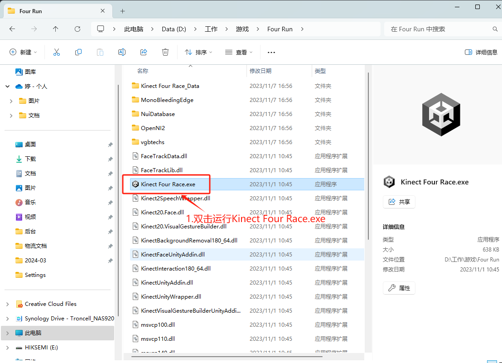
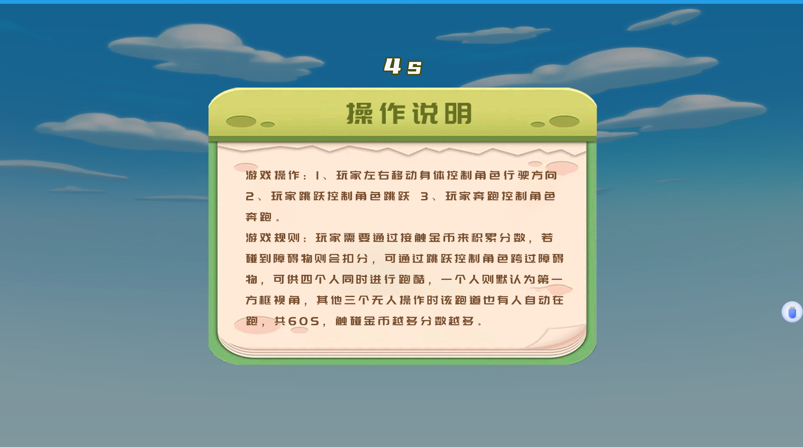
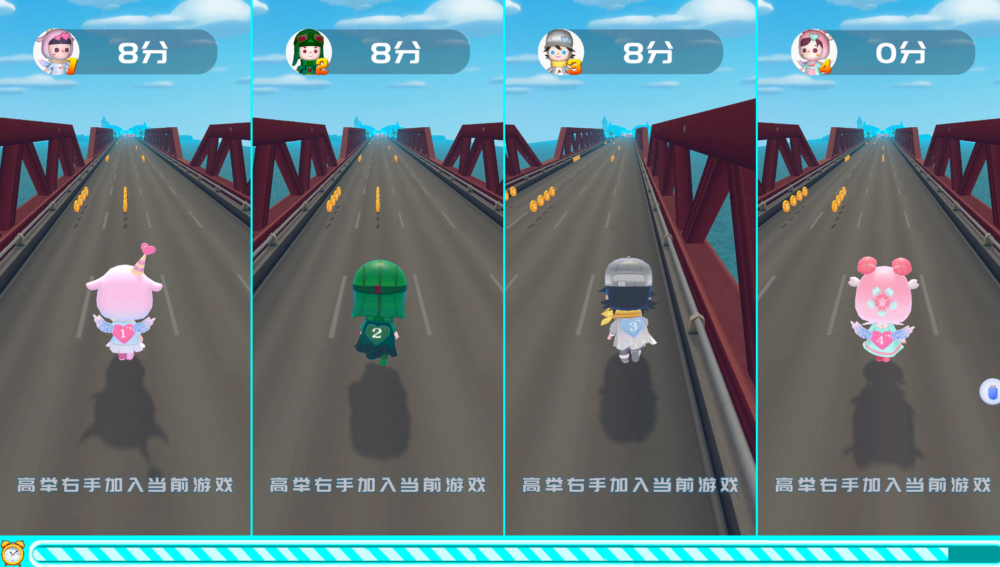

# 跑酷游戏设置

文件包 NAS 地址：/实施交付/2023 项目交付备份/创思 DEMO/体感游戏 DEMO/体感跑酷

# 1.GameSetting.xml 介绍

开发通过 unity3D 打包，在提供的文件夹下有 GameSetting.xml 文件

```
<?xml version="1.0"?>

<Game xmlns:xsd="http://www.w3.org/2001/XMLSchema"
  xmlns:xsi="http://www.w3.org/2001/XMLSchema-instance">
<IsDebug>1</IsDebug>

  <!-- 游戏密钥 -->

<SecurityKey>9949a62462ed4dea90e3215c681cc51b</SecurityKey>

  <!-- 设备密钥 -->

<SubKey>2b577f11849d41c59f78c72c7363b7c3</SubKey>

  <!-- 设备下游戏活动id -->

<DeviceActivityGameId>3277</DeviceActivityGameId>

  <!--说明场景的时长,单位为秒,负数为不起作用-->

<HintTime>6</HintTime>

<!--角色选择场景的时长,单位为秒,负数为不起作用-->

<SelectTime>6</SelectTime>

  <!--游戏场景的时长,单位为秒,负数为不起作用-->

<GameTime>45</GameTime>

<!--留照扫码场景的时长,单位为秒,负数为不起作用-->

<ScanTime>20</ScanTime>

<!--空闲回首页的时长,单位为秒,负数为不起作用-->

<IdleTime>30</IdleTime>

  <HomeScene>
    <!--选择时长,单位为秒,负数为不起作用-->
    <MaxShowTime>-1</MaxShowTime>
    <BgImage>home_bg.png</BgImage>
    <BgVideo></BgVideo>
  </HomeScene>
  <GuiderScene>
    <MaxShowTime></MaxShowTime>
    <BgImage>guider_bg.png</BgImage>
    <BgVideo></BgVideo>
  </GuiderScene>
  <SelectScene>
    <!--选择时长,单位为秒-->
    <MaxShowTime></MaxShowTime>
    <BgImage>select_bg.png</BgImage>
    <BgVideo></BgVideo>
    <Characters>
      <Character>
        <Spriter></Spriter>
        <Spriter></Spriter>
        <Spriter></Spriter>
        <Spriter></Spriter>
      </Character>
    </Characters>
  </SelectScene>
  <GameScene>
    <!--游戏时长,单位为秒-->
    <MaxShowTime>60</MaxShowTime>
    <BgImage>game_bg.png</BgImage>
    <BgVideo></BgVideo>
  </GameScene>
  <ResultScene>
    <!--扫码时长,单位为秒-->
    <MaxShowTime>20</MaxShowTime>
    <BgImage>result_bg.png</BgImage>
    <BgVideo></BgVideo>
  </ResultScene>
</Game>
```

## 2.运行游戏

### 2.1 美人鱼

体感跑酷：通过身体左右移动，碰撞到礼物或者炸弹。得到分数，获取积分或奖品。


扫描二维码领取照片


### 2.2 多人跑酷

1.双击打开文件包里的 Kinect Four Race.exe



2.进入游戏说明，倒数结束后进入游戏



3.开始游戏

多个通道，可以多人一起奔跑



4.游戏结束后，显示各通道的得分

倒计时结束后，退出游戏


