# 小程序申请文档

参考网站：https://www.kancloud.cn/judianxinxi/liucheng/2101782

注册小程序地址：https://mp.weixin.qq.com/wxopen/waregister?action=step1&source=mpregister&token=&lang=zh_CN

# 一、小程序申请

## 1.填写邮箱和密码

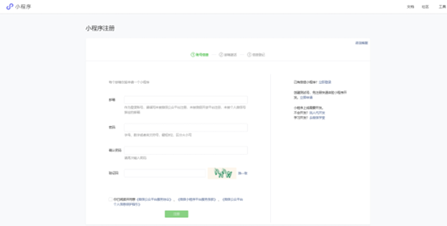

## 2.完成后，会收到邮箱验证，点击邮箱里得链接进行认证

## 3.进行信息填写

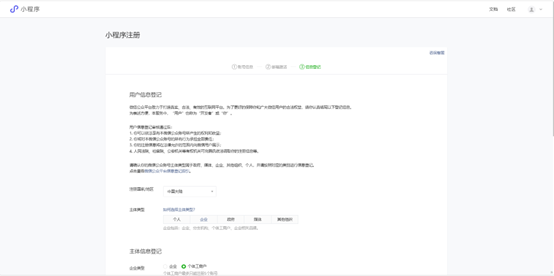

## 4.完成后，登录小程序进行认证

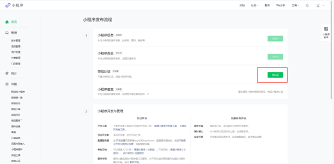

## 5.点击去认证

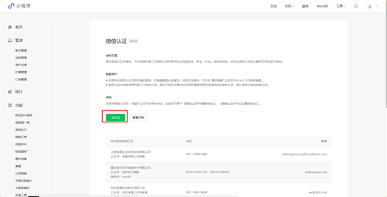

## 6.微信认证（1）同意内容

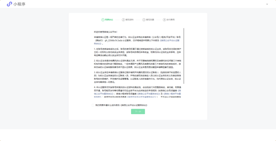

## 7.微信认证（2）填写公司内容

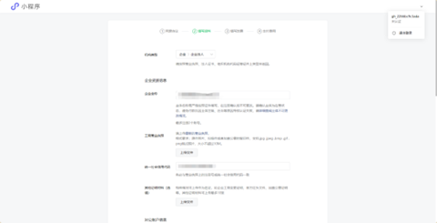

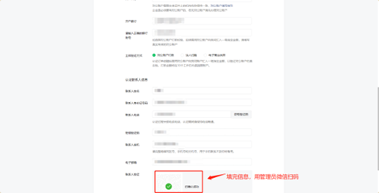

## 8.微信认证（3）填写发票信息，可以选择专票，电子票、不开发票的类型

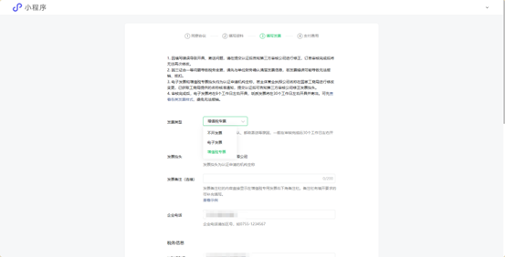

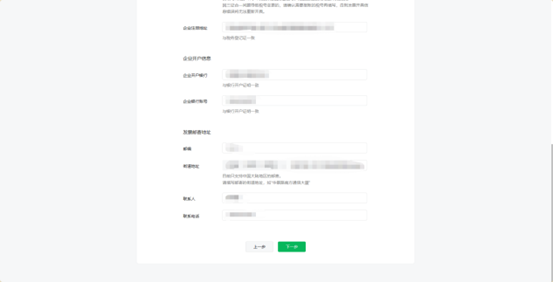

## 9.微信认证（4）扫码付款 300 元的注册费用

# 二、小程序信息完善

## 1、小程序信息填写

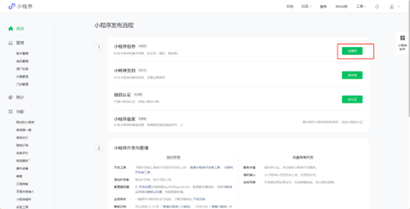

## 2.填写小程序名称、简称、头像和小程序介绍

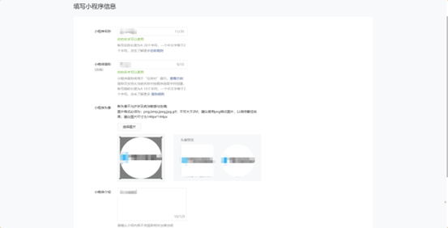

# 三、补充小程序类目

## 1.点击去补充

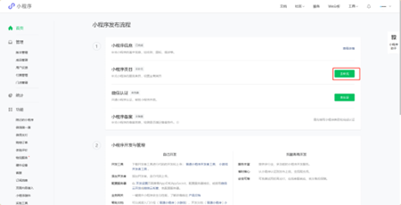

## 2.添加类目

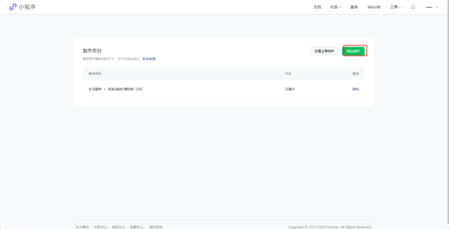

## 3.填写类目后管理员扫码

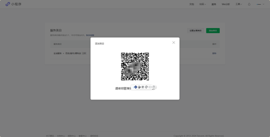

# 四、小程序备案

## 1.填写备案信息（根据要求填写主办单位的信息）

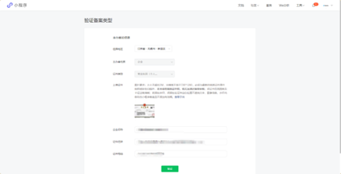

## 2.根据要求填写通讯地址、主体负责人信息、手机号、应急手机号和邮箱的地址（应急手机号和手机号不可以相同）

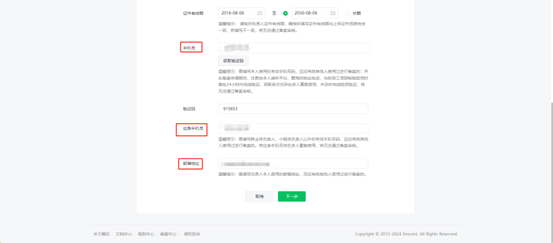

## 3.填写小程序名称

填写小程序的名称、服务内容标识、备注为必填（若不涉及前置审批项，则填写本次备案申请中的小程序主要服务内容为无人店小程序，主要负责的是作为公司的小程序，不涉及出版前置审批项）（根据客服后期电话进行修改）、填写小程序管理员的信息、手机号、应急手机号和邮箱地址，最后使用负责人的微信进行扫码进行人脸认证

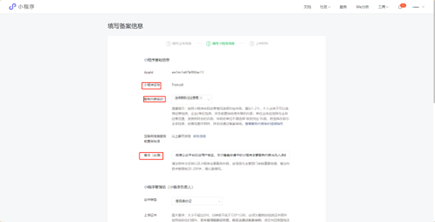

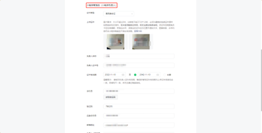

## 4.填写小程序负责人授权书，上传后选择提交，等待审核

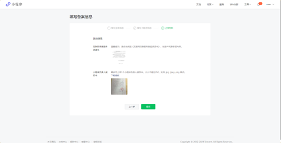

## 5.核对填写的内容，勾选同意后

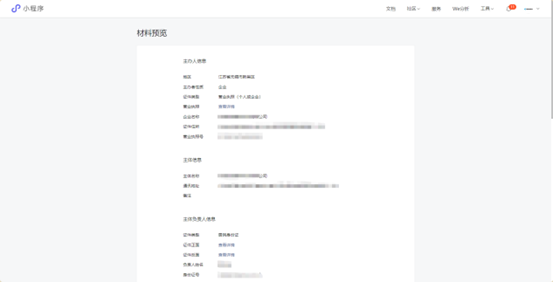

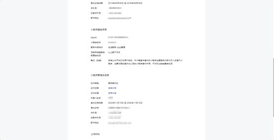

