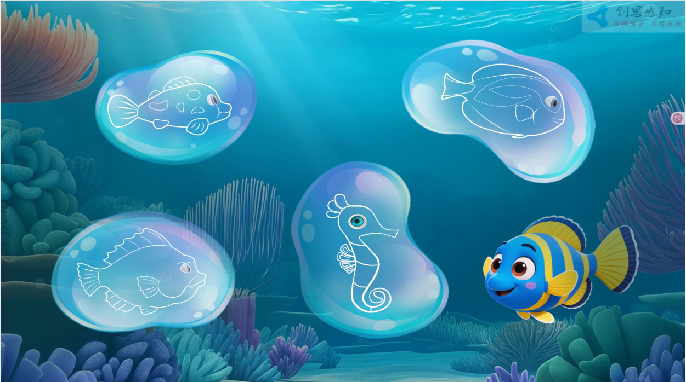
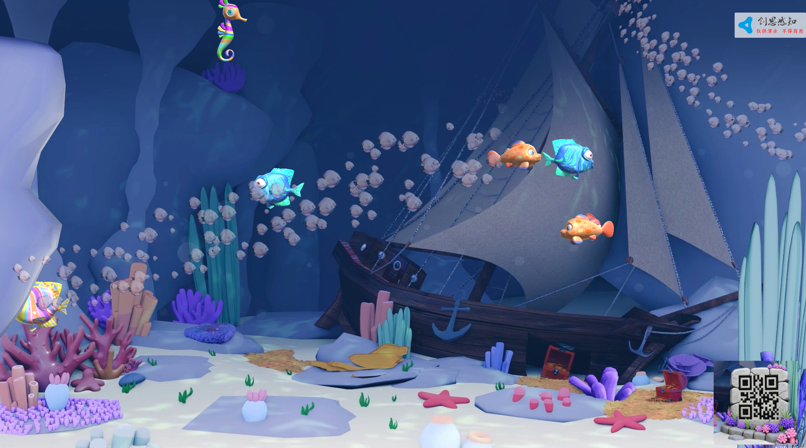
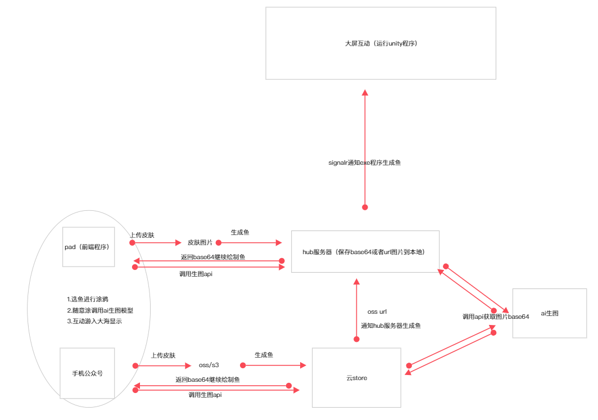

# **1.介绍：**

**本系统为一款面向儿童或家庭用户的** **沉浸式海洋主题互动体验系统** **，由两部分组成：**

- **Pad端/手机端（移动端）** **：作为用户操作入口，提供选择、操作等功能。**

  

- **大屏端（Unity 渲染）** **：作为主视觉展示平台，呈现动态海底世界场景，支持实时联动与动画反馈。**

  

**系统通过** **Pad端扫描二维码** **实现与大屏的连接，并在 Pad 上完成“选鱼 → 操作 → 动画触发”的闭环流程。整体风格温馨、卡通化，适合亲子互动场景。**

# **2.架构：**

# 3.流程及原型图

原型地址：https://modao.cc/proto/o4dFgp1Astq2t8NP57TGxq/sharing?view_mode=read_only&screen=rbpV6kAVHpQqR7TDM #涂鸦-分享
