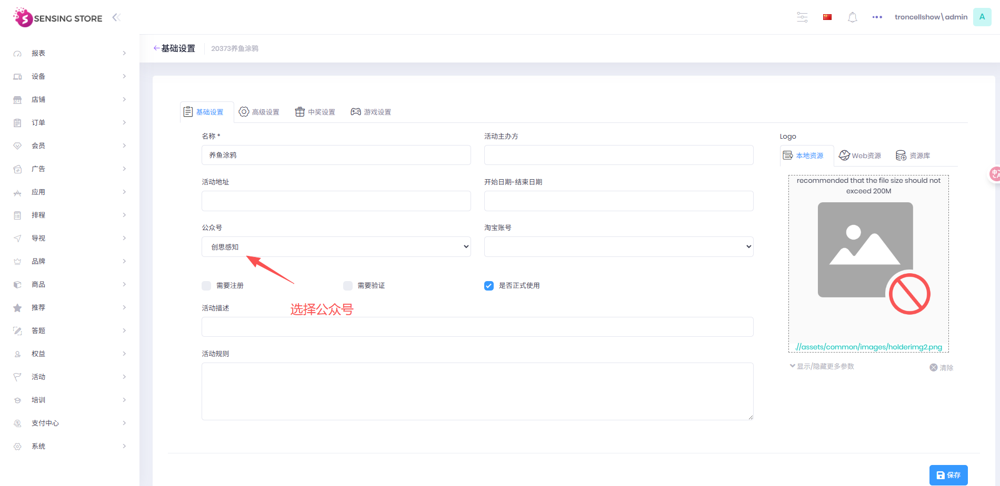
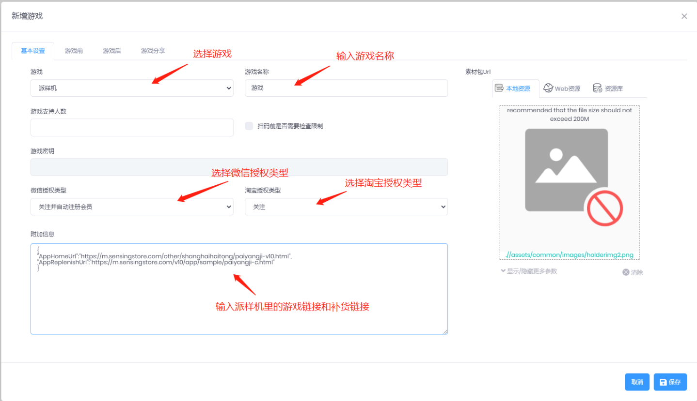

会活动包含H5 游戏和用户活动数据，参考租户：troncellshow

# 1.创建活动

| 参数         | 描述                                                                              |
| ------------ | --------------------------------------------------------------------------------- |
| 活动名称     | 活动名称, 必填 ,例如：新年活动                                                    |
| 活动模板     | 配置活动基本信息的模板,如模板无法满足您的需求,您可以选择不使用模板,新建自己的模板 |
| 是否正式使用 | 勾选后活动即可正式使用,否则为测试活动                                             |

操作步骤图示

# 2.编辑活动

基础设置

# 3.新增游戏

创建注册、签到和游戏

例子：注意再游戏链接后面加上对应的设备密钥和游戏密钥，用于PAD端的页面

{
"AppHomeUrl":"https://m.sensingstore.com/other/animal_world_pad/sketchpad.html",
"AppReplenishUrl":"https://m.sensingstore.com/v10/app/sample/paiyangji-c.html"
}

用于手机打开H5链接

# 4.活动发布

选择已上线的活动发布到设备，已创建过设备

操作步骤图示

# 5.应用发布

先在 host 里给租户授权游戏应用，活动里创建游戏的时候需要选择对应的应用（年会里，游戏活动中心显示，需要在host里创建应用和配置链接）

# 6.生成H5链接二维码

操作步骤： 1.打开网站：https://activity.api.troncell.com/swagger/index.html

2.搜索：/api/UserAction/PostPlayerData4ActionQrcodeLimit 或者/api/UserAction/PostPlayerData4ActionQrcodeOnline（键盘按下 Ctrl+F，弹出搜索框，粘贴后进行搜索）

3.单击接口：/api/UserAction/PostPlayerData4ActionQrcodeLimit，点击 Try it out
输入：QrType：beforegame/aftergame(具体看游戏里设置的是游戏前还是游戏后) SnsType：wechat SecurityKey:复制的游戏密钥

4.点击 Execute

5.返回结果中，复制链接并打开："qrCodeImage": "https://activity.api.troncell.com/showqrcode?qrcodeId=500765.

6.二维码配置在大屏端，扫码进入H5页面

操作步骤图示：

# 7.手机扫码进入H5页面

屏保：

**选择页面**

涂鸦页面

