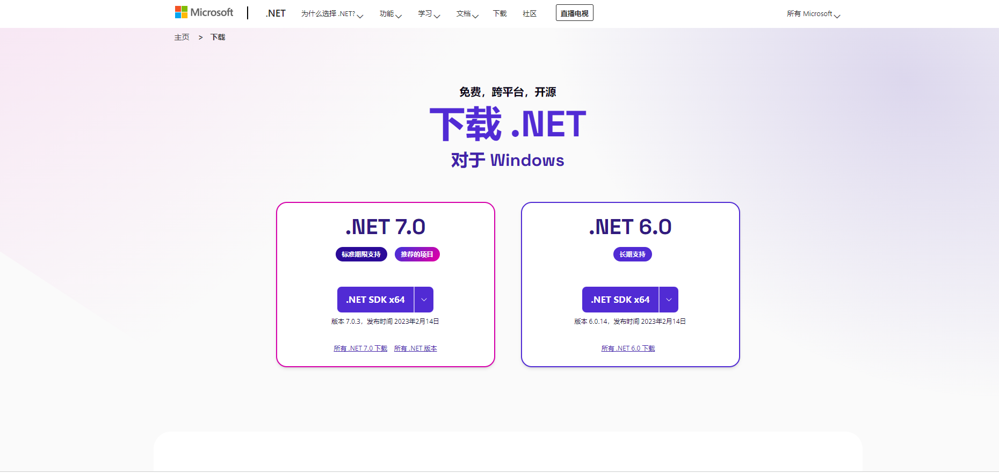
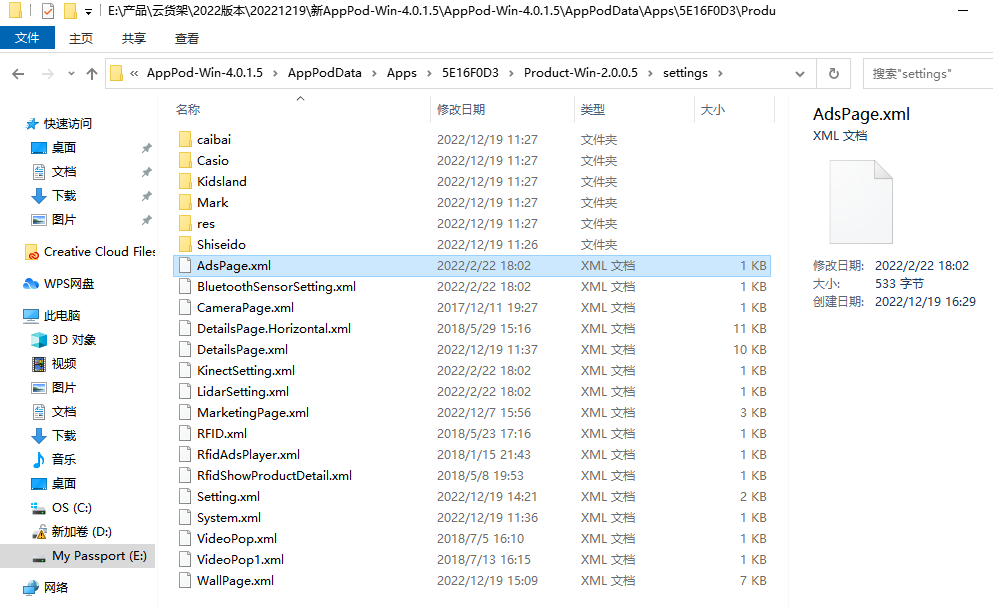
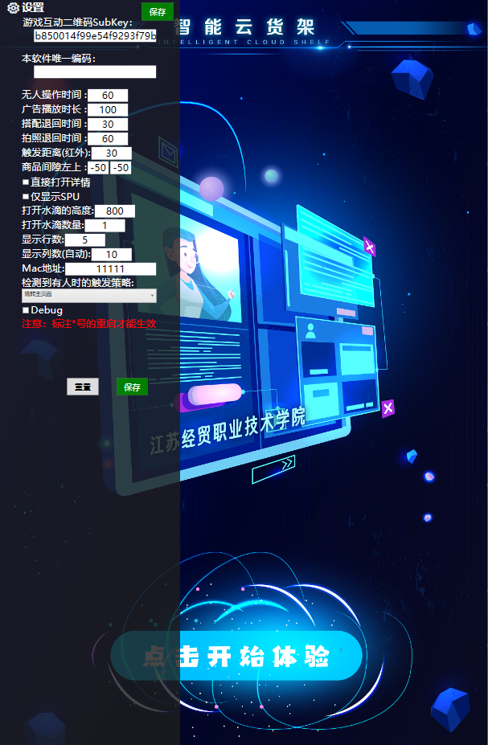
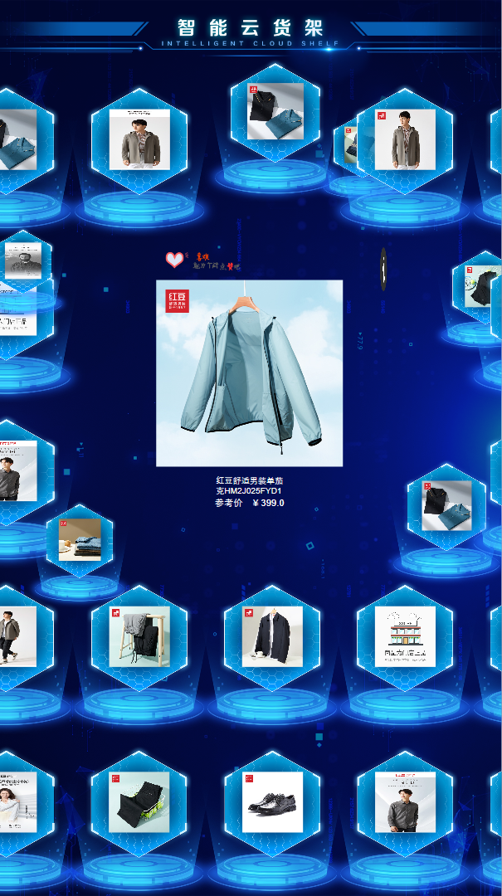
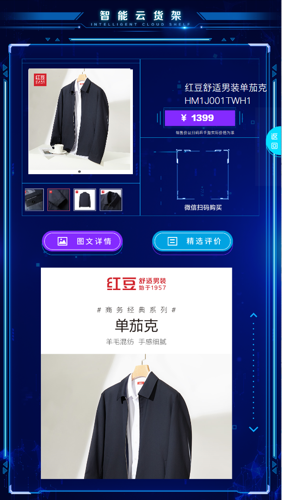
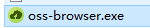
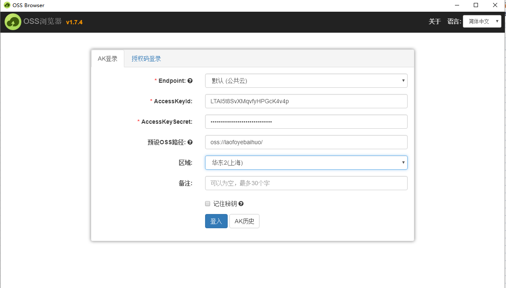
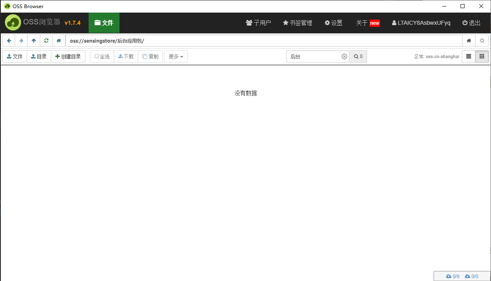
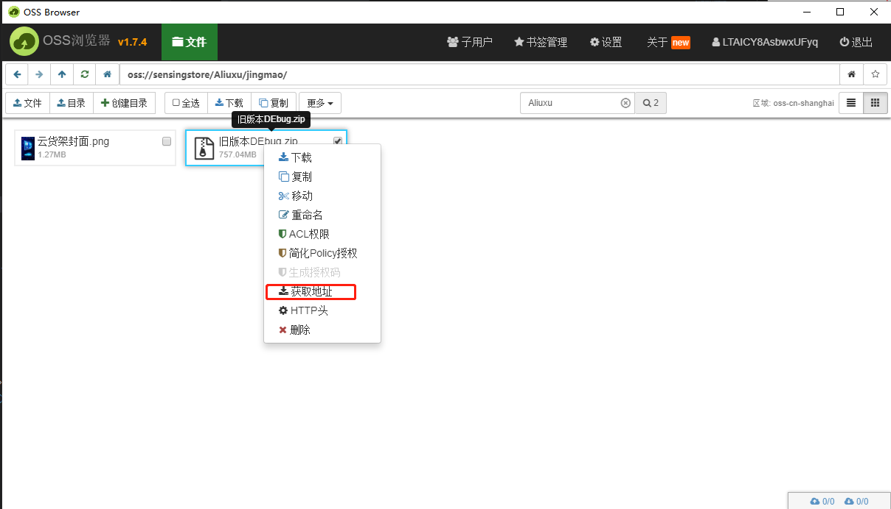
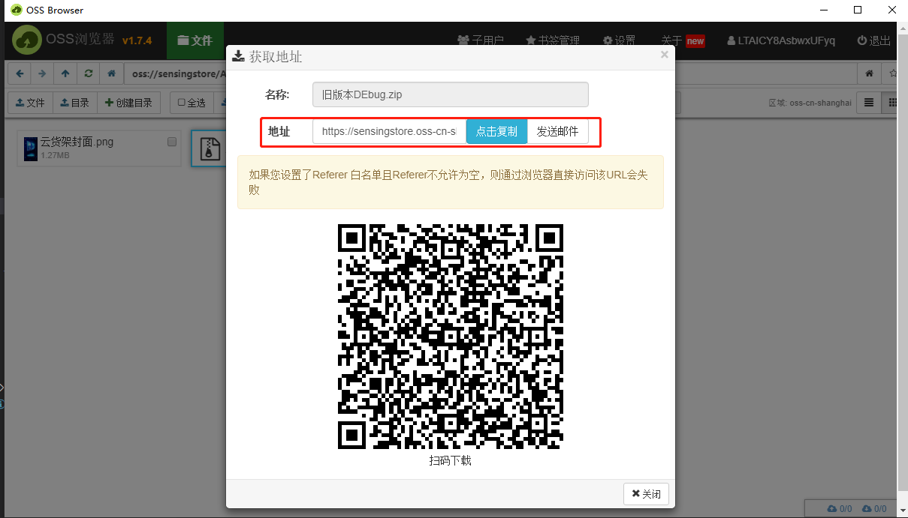

# 云货架介绍
通过APPPOD输入设备秘钥，连通SensingStoreCloud平台，下载商品、广告等内容，然后用云货架展示商品。windows云货架可配置商品展示信息、展示样式。

## 使用环境
云货架支持Windows

Android和H5（待定）
| 应用    | 系统版本 | 版本地址（NAS）                   |
| ------- | -------- | --------------------------------- |
| Product | Windows  | /产品发布/Release/Product/Windows |
| AppPod  | Windows  | /产品发布/Release/AppPod/Windows  |

## github仓库地址：


## 使用流程
1. 页面配置
   
   （1）Windows版本页面配置：通过APPPOD下载商品数据，product软件包里配置云货架样式

    云货架配置说明请参考：[云货架配置.md](  https://github.com/troncell/SensingDocs/blob/main/Docs/Product/%E4%BA%91%E8%B4%A7%E6%9E%B6%E9%85%8D%E7%BD%AE.md)
   

2. 生成商品图链接：客户提供商品图，自动化生成商品详情图、商品主图和资源列表图
   
   商品图片自动生成文档请参考：[商品图自动化生成.md]( )

3. 后台配置：进入[ai.SensingStore.com](https://ai.sensingstore.com/)后台，登录租户，配置设备、商品广告等信息，包含模块：设备、商品、广告等。
   
   后台配置说明请参考：[后台操作.md](https://github.com/troncell/SensingDocs/blob/main/Docs/Product/%E5%90%8E%E5%8F%B0%E6%93%8D%E4%BD%9C.md)

4. 应用安装
   
   （1）windows版安装，安装文档请参考：[应用安装.md](https://github.com/troncell/SensingDocs/blob/main/Docs/Product/%E5%BA%94%E7%94%A8%E5%AE%89%E8%A3%85.md)
 
# 云货架配置文档

## 1. 环境安装

   ###  1.1.net7.0安装

 https://dotnet.microsoft.com/zh-cn/download

 

  ###  1.2 SDK安装

## 2.  配置

### 2.1 配置文件路径

 路径：product文件夹下->Settings文件夹

 


### 2.2 配置介绍

 #### 2.2.1 **Setting.xml**

 运行云货架，键盘上按下F8，显示setting内容



```

 <?xml version="1.0" encoding="utf-8"?>
 <Setting>
<!-- 密钥 -->
  <WexinKey Value="b850014f99e54f9293f79b386f27470e">b850014f99e54f9293f79b386f27470e</WexinKey>
  <!-- 软件编码 -->
  <SoftwareCode Value=""></SoftwareCode>
  <!-- 无人操作时间 -->
  <IdleTime Value="60">60</IdleTime>
  <!-- 搭配退回时间 -->
  <MatchIdle Value="30">30</MatchIdle>
  <!-- 广告播放时长 -->
  <AdsPlayingTotalTime Value="100">100</AdsPlayingTotalTime>
  <!-- 拍照退回时间 -->
  <CameraIdle Value="60">60</CameraIdle>
  <!-- 数量 -->
  <Range Value="30">30</Range>
  <!-- 打开水滴高度 -->
  <ReplusorY Value="850">850</ReplusorY>
  <!-- 打开水滴数量 -->
  <ReplusorCount Value="1">1</ReplusorCount>
  <!-- 显示行数 -->
  <Row Value="5">5</Row>
  <!-- 显示列数 -->
  <Column Value="10">10</Column>
  <!-- 广告动画时间 -->
  <AdsAnimationTime Value="1">1</AdsAnimationTime>
  <!-- MAC地址 -->
  <Mac Value="11111">11111</Mac>
  <!-- 是否仅显示SPU -->
  <IsOnlyUseSpu Value="False">False</IsOnlyUseSpu>
<!-- 是否勾选Debug -->
  <ShowDebug Value="False">False</ShowDebug>
<!-- 用户检测行为 -->
  <UserDetectBehavior Value="0">0</UserDetectBehavior>
  <!-- 商品间隙 -->
  <CellMarginX Value="-50">-50</CellMarginX>
  <CellMarginY Value="-50">-50</CellMarginY>
  <!-- 文字颜色 -->
  <TextColor Value="Red">Red</TextColor>
  <!-- 是否直接打开详情 -->
  <OpenDialog Value="False">False</OpenDialog>
<!-- 循环半径 -->
  <CicleRadius Value="410">410</CicleRadius>
<!-- 扫描生命周期 -->
  <ScanLifeSpan Value="10">10</ScanLifeSpan>
<!-- 搜索分类 -->
  <SearchCategory Value="False">False</SearchCategory>
<!-- 相机宽度 -->
  <CameraWidth Value="1280">1280</CameraWidth>
  <!-- 能否拖动 -->
  <CanDrag Value="True">True</CanDrag>
  <!-- 初始化数量 -->
  <IntiCount Value="400">400</IntiCount>
<!-- 是否是方形图像 -->
  <IsSquareImage Value="True">True</IsSquareImage>
  <!-- 是否显示水印 -->
  <WaterMark Value="False">False</WaterMark>
  <!-- 减速度 -->
  <DesiredDeceleration Value="0.01">0.01</DesiredDeceleration>
  <!--点击启动菜单目录-->
  <ClickCount Value="1">1</ClickCount>
  <!--rfid检测到商品后详情页在那几屏弹出-->
  <ScreenIndexs>
    <ScreenIndex>0</ScreenIndex>
  </ScreenIndexs>
</Setting>
```

#### 2.2.2 **System.xml**
```

<?xml version="1.0" encoding="utf-8"?>
<System>
  <!--窗体的总显示范围，例：如果四连屏 Width="4320"-->
  <Resolution Width="1080" Height="1920" />
  <!--窗体的显示范围，包括起始位置和大小-->
  <DisplayBound Left="0" Top="0" Width="1080" Height="1920" AutoScale="True" />
  <!--搜索模式  True:正常搜索不弹出搜索面板       False:弹出搜索面板-->
  <SearchMode Value="False">False</SearchMode>
  <!--设置是否为DebugMode，False表示不是Debug模式，True表示为是Debug模式，在Debug模式下，支持鼠标操作-->
  <IsDebugMode Value="True">True</IsDebugMode>
  <!--是否使用小程序二维码-->
  <IsUseMiniprogram Value="False">False</IsUseMiniprogram>
</System>
```

#### 2.2.3 **WallPage.xml**


```
<?xml version="1.0" encoding="utf-8"?>
<Page Width="1080" Height="1920" Top="0" Left="0" OffsetY="194">
  <!--瀑布行速度-->
  <Rows>
    <Row Speed="-40" />
  </Rows>
  <!--布局类型: WaterFlow或FiveGrid-->
  <Layout Value="WaterFlow">WaterFlow</Layout>
  <!--单元格设置-->
  <WallItem Width="335" Height="405">
    <!--背景图-->
    <Background UriKind="Application" FileName="Assets\productb.png" Enable="True" />
    <!--图片展示框-->
    <ImageRect Left="103" Top="90" Width="130" Height="130" Enable="True"/>
    <!--商品名称-->
    <NameText Left="151" Top="370" MaxWidth="260" FontSize="100" FontFamily="PingFang SC Heavy" Foreground="#ffffff" Enable="False" />
    <!--商品价格-->
    <PriceText Left="205" Top="315" MaxWidth="380" FontSize="100" FontFamily="PingFang SC Heavy" Foreground="#ffffff" Enable="False" FontWeight="Heavy"/>
    <!--年龄段-->
    <AgeScopeText Left="92" Top="365" MaxWidth="10" FontSize="14" FontFamily="PingFang SC Medium" Foreground="#FFFFFFFF" Enable="False" />
  </WallItem>
  <BigWallItem Width="306" Height="400">
    <!--背景图-->
    <Background UriKind="Application" FileName="Assets\bigproductbg.png" Enable="True" />
    <!--图片展示框-->
    <ImageRect Left="50" Top="-20" Width="500" Height="500" Enable="True" />
    <!--商品名称-->
    <NameText Left="300" Top="560" MaxWidth="260" FontSize="30" FontFamily="PingFang SC Heavy" Foreground="#FF575757" Enable="True" />
    <!--商品价格-->
    <PriceText Left="300" Top="580" MaxWidth="380" FontSize="21" FontFamily="方正兰亭粗黑简体" Foreground="#ffffff" Enable="True" />
    <!--年龄段-->
    <AgeScopeText Left="92" Top="365" MaxWidth="10" FontSize="14" FontFamily="PingFang SC Medium" Foreground="#FFFFFFFF" Enable="True" />
  </BigWallItem>
  <!--水滴格设置-->
  <WallWaterItem Width="306" Height="400">

    <!--背景图-->
    <Background UriKind="Application" FileName="Assets\商品详情bg.png" Enable="True" />

    <!--图片展示框-->
    <ImageRect Left="0" Top="-90" Width="255" Height="255" Enable="True"/>

    <!--喜欢展示框-->
    <LikeRect Left="-270" Top="-350" Width="130" Height="130" Enable="True"/>

    <!--详情展示框-->
    <InfoRect Left="200" Top="-400" Width="130" Height="130" Enable="True"/>

    <!--二维码展示框-->
    <QrcodeRect Left="100" Top="90" Width="130" Height="130" Enable="False"/>

    <!--商品名称-->
    <NameText Left="-55" Top="305" MaxWidth="260" MaxHeight="80" FontSize="36" FontFamily="PingFang SC Heavy" Foreground="#ffffff" Enable="True" />

    <!--商品价格-->
    <PriceText Left="-380" Top="305" MaxWidth="380" MaxHeight="80" FontSize="36" FontFamily="PingFang SC Heavy" Foreground="#ffffff" Enable="True" FontWeight="Heavy"/>

    <!--促销商品价格-->
    <PromPriceText Left="-200" Top="305" MaxWidth="380" MaxHeight="80" FontSize="36" FontFamily="PingFang SC Heavy" Foreground="#ffffff" Enable="True" FontWeight="Heavy"/>

    <!--年龄段-->
    <AgeScopeText Left="0" Top="300" MaxWidth="10" MaxHeight="80" FontSize="14" FontFamily="PingFang SC Medium" Foreground="#FFFFFFFF" Enable="false" />

  </WallWaterItem>
  <Canvas Width="1080" Height="1920 " Left="0" Top="0">

    <Controls>

<!--回主页按钮-->
      <!-- <ImageButton Width="100" height="100" Left="970" Top="600">
        <FileSource UriKind="Application" Path="settings\caibai\page1\bt_home.png" />
        <Event>NavigateEvent?ToPage=HomePage</Event>
      </ImageButton> -->
      <!--底部栏图片-->
      <!-- <Image Width="1080" Height="64" Left="0" Top="1856">
            <FileSource UriKind="Application" Path="settings\caibai\wallpage\head_ads_1920.png" />
          </Image> -->
            <!--顶部栏图片-->
           <!-- <Image Width="1080" Height="63" Left="0" Top="0">
            <FileSource UriKind="Application" Path="settings\caibai\wallpage\1.png" />
          </Image> -->
      <!--Home按钮（暂时无用）-->
      <!-- <ImageButton Left="0" Top="960" Width="87" Height="87" IsShow="True">
        <FileSource UriKind="Application" Path="Assets\bt_home.png" />
        <Event>HomeEvent</Event>
      </ImageButton> -->
      <!--Search按钮-->
      <ImageButton Tag="0" Left="970" Top="750" Width="100" Height="100" IsShow="True">
        <FileSource UriKind="Application" Path="Assets\bt_search.png" />
        <Event>ToggleSearchEvent</Event>
      </ImageButton>
      <!--Search面板-->
      <SearchPanel Tag="0" Left="420" Top="320" Height="671" Width="660" IsShow="True"/>
      <!--Search结果面板-->
      <SearchResultPanel Tag="0" Left="0" Top="320" Height="660" Width="420" IsShow="True"/>

      <!--跳转广告动画-->
      <!-- <CustomElement Left="50" Top="145" Width="87" Height="87">
        <ActivatorInfo AssemblyFile="shouye" TypeName="shouye.UserControl1" />
      </CustomElement> -->

      <!--跳转广告按钮-->
        <!-- <ImageButton Width="200" height="200" Left="1940" Top="900">
          <FileSource UriKind="Application" Path="settings\caibai\page1\bt_home.png" />
         <Event>NavigateEvent?ToPage=HomePage</Event>
        </ImageButton> -->

    </Controls>
  </Canvas>
  <!--超时动画-->
  <TimeoutIndicator Enable="True" Timeout="10" Background="#88000000" Left="0" Top="0" Width="722" Height="722">
    <ActivatorInfo AssemblyFile="dengdai" TypeName="dengdai.UserControl1" />
  </TimeoutIndicator>
  <!--搜索面板价格区间-->
  <Prices>
    <Price>0-999</Price>
    <Price>1000-1999</Price>
    <Price>2000-4999</Price>
    <Price>5000-9999</Price>
  </Prices>
  <!--搜索面板关键字-->
  <Keywords>
  </Keywords>
  <!--商品过滤器-->
  <Filters>
    <CategoryProductFilter Enable="False">
      <CategoryIds>
        <CategoryId>2</CategoryId>
      </CategoryIds>
    </CategoryProductFilter>
  </Filters>
  <!--是否启用颜色搜索-->
  <IsShowMainColors Value="True">True</IsShowMainColors>
  <!--是否启用分类搜索-->
  <IsShowMainCategorys Value="True">True</IsShowMainCategorys>
  <!--是否启用关键字搜索-->
  <IsShowKeywords Value="True">True</IsShowKeywords>
  <!--是否启用标签搜索-->
  <IsMainTags Value="True">False</IsMainTags>
  <!--分类、红包、搜索在瀑布流是是否显示-->
  <ShowSetting IsShowCategory="False" IsShowCoupon="False" IsShowSearchCategory="False" />
  <!--猜你喜欢-->
  <GuessLike>
    <!--是否启用-->
    <Enable Value="False">False</Enable>
    <!--推荐个数-->
    <Count Value="3">3</Count>
  </GuessLike>

</Page>

```
#### 2.2.4 DetailsPage.xml



```

    <?xml version="1.0" encoding="utf-8"?>
    <Page Width="1080" Height="1920" Top="0" Left="0">
    <!--详细页-->
     <ActivatorInfo AssemblyFile="ProductDetails" TypeName="ProductDetails.KidslandDetail" />
    <!-- True 默认选中资源 False 默认选中sku-->
    <ShowItem Value="False">False</ShowItem>
    <!--本地二维码-->
    <LocalQrcodeUrl Value="http://www.baidu.com"></LocalQrcodeUrl>
    <!--UI配置-->
    <Canvas Left="0" Top="0" Width="1080" Height="1920">
    <Controls>
      <!--背景图-->
      <Image Width="1080" Height="1920">
        <FileSource UriKind="Application" Path="settings\caibai\details\bg.png" />
      </Image>
      <!--头部动画面板-->
      <Canvas Name="TopCanvas" Width="1080" Height="1920">
        <Controls>

     <!--标题-->
    <TextBlock Left="700" Top="310" Height="90" Width="390" Binding="Title" Text="标题" Padding="10,0,0,0" FontSize="35" TextWrapping="Wrap" TextAlignment="Left" Foreground="#ffffff" FontFamily="PingFang SC" FontWeight="light" />
          <!--子标题-->
          <!-- <TextBlock Left="639" Top="182" Height="47" Width="426" Binding="SubTitle" Text="子标题" Padding="15,0,0,0" FontSize="36" TextWrapping="Wrap" Foreground="#6b6b6b"/> -->

    <!-- <TextBlock Left="660" Top="253" Width="74" Height="38" FontSize="24" Foreground="#b12929" Text="参考价" FontFamily="FZLanTingHei-EL-GBK" /> -->
    <!--价格-->
    <TextBlock Left="736" Top="433" Height="61" Width="150" Binding="Price" Text="价格" FontSize="31" Foreground="#ffffff" FontFamily="FZLanTingHei-EB-GBK" FontWeight="heavy" />
          <!--描述-->
          <TextBlock Left="676" Top="498" Width="250" Height="18" FontSize="15" Foreground="LightGray" Text="销售价以扫码后手淘实际价格为准" FontFamily="FZLanTingHei-EL-GBK" />
          <!--品牌-->
          <!-- <TextBlock Left="600" Top="609" Height="39" Width="138" Binding="BrandName" Text="BrandName" TextAlignment="Center" FontSize="20" Foreground="#ffffff" FontFamily="FZLanTingHei-EB-GBK" FontWeight="light"/> -->
          <!--库存-->
         <TextBlock Left="600" Top="709" Height="46" Width="222" Binding="Quantity" Text="Quantity" TextAlignment="Center" FontSize="15" Foreground="#ffffff" FontFamily="FZLanTingHei-EB-GBK" FontWeight="light"/>
          <!--二维码-->
          <QrcodeControl QrcodeUrlBinding="QrcodeUrl" Left="704" Top="594" Height="151" Width="151"/>
          <!--二维码背景图-->
          <Image Width="400" Height="400" Left="112" Top="265">
            <FileSource UriKind="Application" Path="settings\caibai\details\pobg.png" />
          </Image>
          <!--FlipView-控件-->

    <Border Left="108" Top="261" Width="400" Height="400">
            <Child>
              <FlipView ItemsSourceBinding="MediaItems" SelectedIndexBinding="MediaSelectedIndex">
                <ItemTemplate>
                  <Image SourceBinding="ImageUrl" />
                </ItemTemplate>
              </FlipView>
            </Child>
          </Border>-->
    <!--关键属性-->
          <!-- <MediaList ItemWidth="86" SelectedBrush="#c7595e" Top="720" Left="99" Height="86" Width="86" DataContextBinding="KeyPropertySelector">
            <VideoPlayIcon UriKind="Application" Path="settings\res\play.png" />
          </MediaList> -->
    <!--资源图-->
          <MediaList ItemWidth="86" SelectedBrush="#c7595e" Top="720" Left="99" Height="86" Width="386" DataContextBinding="MediaSelector">
            <VideoPlayIcon UriKind="Application" Path="settings\res\play.png" />
          </MediaList>

    <!-- <Image Width="170" Height="170" Left="690" Top="361">
            <FileSource UriKind="Application" Path="settings\caibai\details\1.png" />
          </Image> -->
    <!--二维码猫头动画-->
    <!-- <CustomElement Left="696" Top="330" Width="157" Height="193">
            <ActivatorInfo AssemblyFile="MaioMaioTou" TypeName="MaioMaioTou.UserControl1" />
          </CustomElement> -->
    <!--扫码提示文字-->
    <!-- <Image Width="266" Height="51" Left="652" Top="514">
            <FileSource UriKind="Application" Path="settings\caibai\details\dr_txt.png" />
          </Image> -->
    <!--二维码-->
    <!-- <QrcodeControl QrcodeUrlBinding="QrcodeUrl" Left="793" Top="589" Height="151" Width="151" /> -->
    <!--大图展示控件-->
    <!--<BigShowControl MediaBinding="MediaPlayer" Left="34" Top="34" Width="600" Height="600" />-->

    <!--返回按钮-->
    <CustomElement Width="59" Left="1021" Top="482">
            <ActivatorInfo AssemblyFile="fanhui2" TypeName="fanhui2.UserControl1" />
          </CustomElement>

    <ImageButton Command="CloseCommand" Width="100" Height="300" Left="980" Top="410" Zindex="15">
            <FileSource UriKind="Application" Path="settings\caibai\page1\12.png" />
          </ImageButton>

    </Controls>
      </Canvas>

    <!-- <CustomElement Width="110" Height="220" Left="970" Top="830">
          <ActivatorInfo AssemblyFile="shoushi" TypeName="shoushi.UserControl1" />
        </CustomElement> -->

    <!-- 滑动图片详情图 -->
    <Image Width="36" Height="456" Left="956" Top="1194">
        <FileSource UriKind="Application" Path="settings\caibai\details\滑动按钮.png" />
      </Image>

    <!--底部动画面板-->
    <Canvas Name="BottomCanvas" Width="1080" Height="1920">
        <Controls>
          <TabControl Width="1080" Height="950" Top="879" SelectedIndexBinding="ShowType">
            <Items>
              <!--商品详情页-->
              <TabItem>
                <Header>
                  <Canvas>
                    <Controls>
                      <!--商品详情按钮-->
                      <ImageRadioButton IsCheckedBinding="IsSelected" Width="309" Height="93" Left="162">
                        <FileSource UriKind="Application" Path="settings\caibai\details\图文详情1.png"/>
                        <SelectedFileSource UriKind="Application" Path="settings\caibai\details\图文详情2.png"/>
                      </ImageRadioButton>

     </Controls>
                  </Canvas>
                </Header>
                <Content>
                  <Canvas>
                    <Controls>
                      <!-- <Image Width="426" Height="33" Left="330" Top="127">
                        <FileSource UriKind="Application" Path="Settings\Kidsland\text1.png"/>
                      </Image>-->
                      <!--绽放控件-->

    <Viewbox Width="750" Top="120" Left="158">
                        <Child>
                          <!--H5页-->
                          <HtmlPanel Background="Transparent" Width="748" Height="950" TextBinding="HtmlDescription" />
                        </Child>
                      </Viewbox>
                    </Controls>
                  </Canvas>
                </Content>
              </TabItem>
              <!--累计评价页-->
              <TabItem>
                <Header>
                  <Canvas>
                    <Controls>
                      <!--累计评价按钮-->
                      <ImageRadioButton IsCheckedBinding="IsSelected" Width="309" Height="93" Left="584">
                        <FileSource UriKind="Application" Path="settings\caibai\details\精选评价1.png"/>
                        <SelectedFileSource UriKind="Application" Path="settings\caibai\details\精选评价2.png"/>
                      </ImageRadioButton>
                    </Controls>
                  </Canvas>
                </Header>
                <Content>
                  <Canvas>
                    <Controls>
                      <!-- <Image Width="426" Height="33" Left="320" Top="127">
                        <FileSource UriKind="Application" Path="Settings\Kidsland\text2.png"/>
                      </Image>-->
                      <!--无评价图-->
                      <Image Width="402" Height="264" Left="320" Top="206" IsShowBinding="IsCommentsEmpty">
                        <FileSource UriKind="Application" Path="Settings\Kidsland\programHolder.png"/>
                      </Image>
                      <TextBlock Left="610" Top="115" Width="374" Height="48" FontSize="22" Foreground="Pink" Text="更多评价请扫码至线上查看" FontFamily="FZLanTingHei-EL-GBK" />
                  <!--滑动面板-->
                      <ScrollViewer Left="144" Top="142" Width="799" Height="940" PanningMode="VerticalOnly">
                        <Content>
                  <!--评价列表-->
                          <ItemsControl ItemsSourceBinding="Comments">
                            <ItemTemplate>
                              <Canvas Width="799" Height="287">
                                <Controls>
                                  <!--名称-->
                                  <TextBlock Left="0" Top="40" Binding="UserName" FontSize="24" Padding="10,0,0,5" Foreground="#323232" FontFamily="PingFang SC" />
                                  <!--评价内容-->
                                  <TextBlock Top="114" Left="0" Width="799" Binding="Content" FontSize="25" Foreground="#4e4e4e" TextWrapping="Wrap" VerticalAlignment="Center" FontFamily="PingFang SC"/>
                                  <!--下划线-->
                                  <Border Background="#cacaca" Width="780" Height="1" Top="267" Left="9" />
                                </Controls>
                              </Canvas>
                            </ItemTemplate>
                          </ItemsControl>
                        </Content>
                      </ScrollViewer>
                    </Controls>
                  </Canvas>
                </Content>
              </TabItem>
            </Items>
          </TabControl>
        </Controls>
      </Canvas>
    </Controls>
    </Canvas>
    </Page>
```

### 2.3 product文件包压缩后上传
#### 2.3.1 oss登录（用于上传product文件包）

#### 2.3.1.1 软件下载安装
方案一官网下载： [工具下载地址](https://help.aliyun.com/document_detail/209974.html)

方案二NAS地址：/产品发布/Release/Product/Windows/工具包


1. 双击打开oss-browser.exe

   

2. 输入：AccessKey ID、AccessKey Secret（由管理员提供）

3. 点击登入
   
    
#### 2.3.1.2 上传文件包到oss

1. 进入文件夹后台应用包

 

2. 获取文件包地址
   右击上传的文件包 -> 选择获取地址 ->点击复制地址

    
    