# 生成商品链接文档

- [1. 环境安装](#1-%E7%8E%AF%E5%A2%83%E5%AE%89%E8%A3%85)
  * [1.1 安装node](#11-%E5%AE%89%E8%A3%85node)
  * [1.2 安装VS Code](#12-%E5%AE%89%E8%A3%85vs-code)
  * [1.3 安装Python](#13-%E5%AE%89%E8%A3%85python)
  * [1.4 vscode安装后，双击打开，安装vscode插件](#14-vscode%E5%AE%89%E8%A3%85%E5%90%8E%E5%8F%8C%E5%87%BB%E6%89%93%E5%BC%80%E5%AE%89%E8%A3%85vscode%E6%8F%92%E4%BB%B6)
- [2. oss登录（用于上传图片）](#2-oss%E7%99%BB%E5%BD%95%E7%94%A8%E4%BA%8E%E4%B8%8A%E4%BC%A0%E5%9B%BE%E7%89%87)
  * [2.1软件下载安装](#21%E8%BD%AF%E4%BB%B6%E4%B8%8B%E8%BD%BD%E5%AE%89%E8%A3%85)
  * [2.2 上传图片到oss](#22-%E4%B8%8A%E4%BC%A0%E5%9B%BE%E7%89%87%E5%88%B0oss)
  * [2.3 文件夹整理](#23-%E6%96%87%E4%BB%B6%E5%A4%B9%E6%95%B4%E7%90%86)
- [3.打开VScode](#3%E6%89%93%E5%BC%80vscode)
  * [3.1 使用VS Code打开上面创建的文件夹](#31--%E4%BD%BF%E7%94%A8vs-code%E6%89%93%E5%BC%80%E4%B8%8A%E9%9D%A2%E5%88%9B%E5%BB%BA%E7%9A%84%E6%96%87%E4%BB%B6%E5%A4%B9)
  * [3.2 修改1.py、2.py和3.py的内容后，直接执行](#32-%E4%BF%AE%E6%94%B91py2py%E5%92%8C3py%E7%9A%84%E5%86%85%E5%AE%B9%E5%90%8E%E7%9B%B4%E6%8E%A5%E6%89%A7%E8%A1%8C)
  * [1.6 1.py、2.py和3.py各自生成表格](#16-1py2py%E5%92%8C3py%E5%90%84%E8%87%AA%E7%94%9F%E6%88%90%E8%A1%A8%E6%A0%BC)
  * [1.7 将生成的三个表格里对应的链接复制到1表格（导入的表格）中](#17-%E5%B0%86%E7%94%9F%E6%88%90%E7%9A%84%E4%B8%89%E4%B8%AA%E8%A1%A8%E6%A0%BC%E9%87%8C%E5%AF%B9%E5%BA%94%E7%9A%84%E9%93%BE%E6%8E%A5%E5%A4%8D%E5%88%B6%E5%88%B01%E8%A1%A8%E6%A0%BC%E5%AF%BC%E5%85%A5%E7%9A%84%E8%A1%A8%E6%A0%BC%E4%B8%AD)
# 1. 环境安装

## 1.1 安装node

方案一官网下载： [工具下载地址](https://nodejs.org/zh-cn/download/)

方案二NAS地址：/产品发布/Release/Product/Windows/工具包

##  1.2 安装VS Code

官网下载VSCode并进行安装

[https://code.visualstudio.com/Download](https://code.visualstudio.com/Download)

## 1.3 安装Python

方案一官网下载： [工具下载地址](https://www.python.org/getit/)

方案二NAS地址：/产品发布/Release/Product/Windows/工具包

**安装时注意环境变量配置**

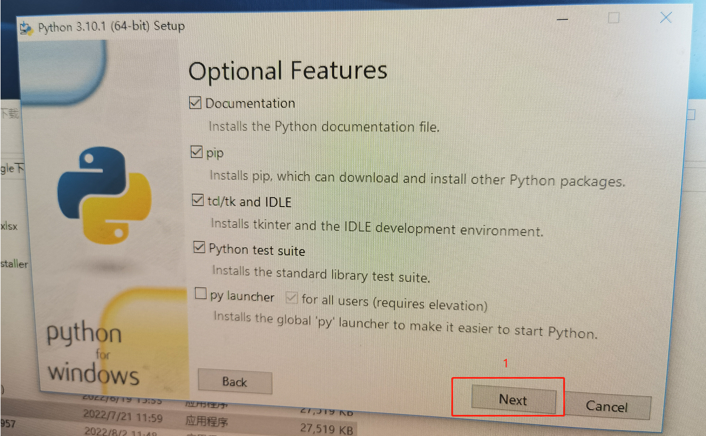
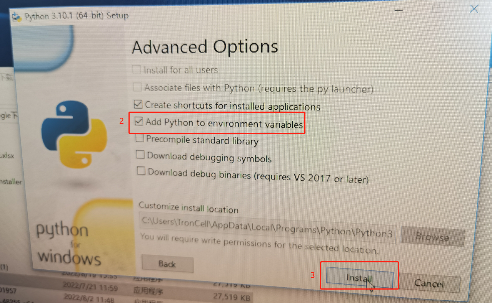

## 1.4 vscode安装后，双击打开，安装vscode插件

（1）在搜索框中输入code runner 进行搜索，单击install

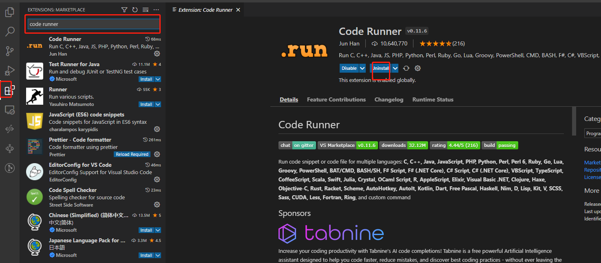

（2）在终端里输入pip install openpyxl，回车

# 2. oss登录（用于上传图片）

## 2.1软件下载安装
方案一官网下载： [工具下载地址](https://help.aliyun.com/document_detail/209974.html)

方案二NAS地址：/产品发布/Release/Product/Windows/工具包

1. 双击打开oss-browser.exe

   

2. 输入：AccessKey ID、AccessKey Secret（由管理员提供）

3. 点击登入
   
    
## 2.2 上传图片到oss

1. 新建文件夹

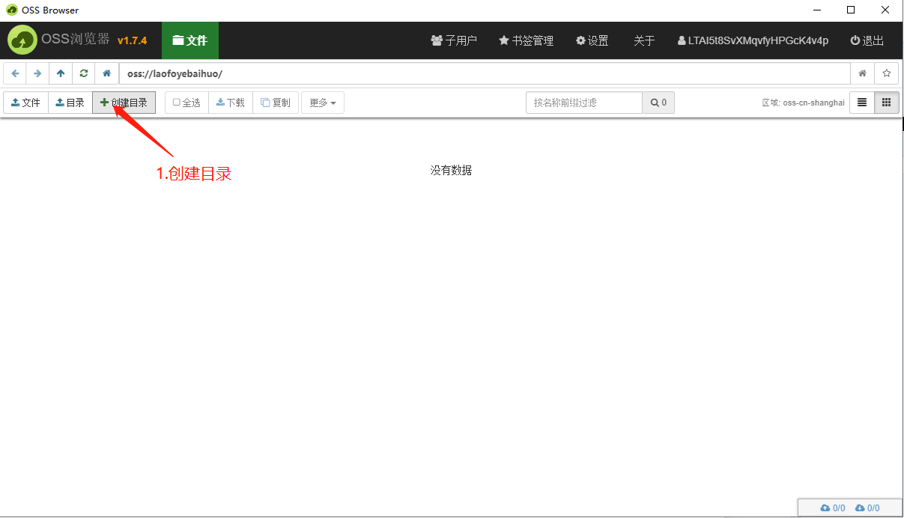
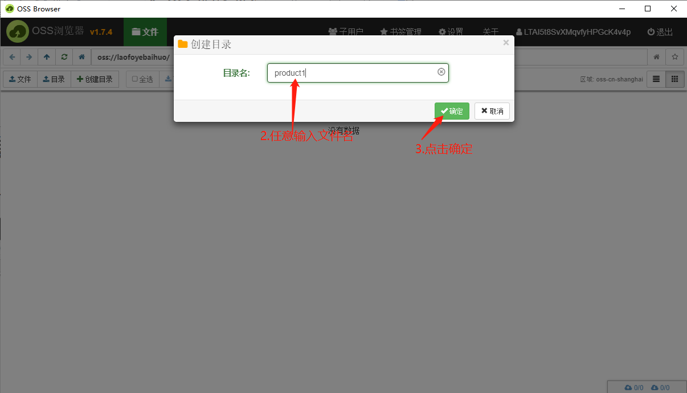
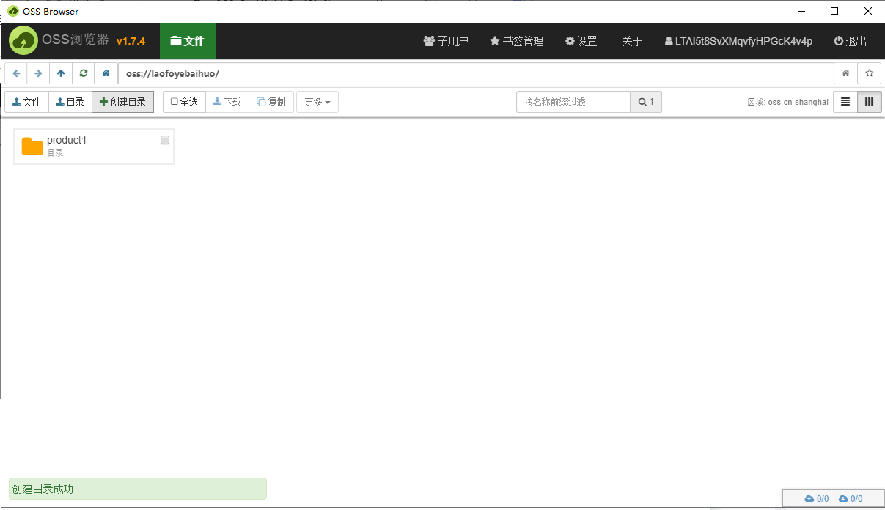

2.  双击打开创建的文件夹，将需要生成的商品编号的文件夹上传在此文件夹内

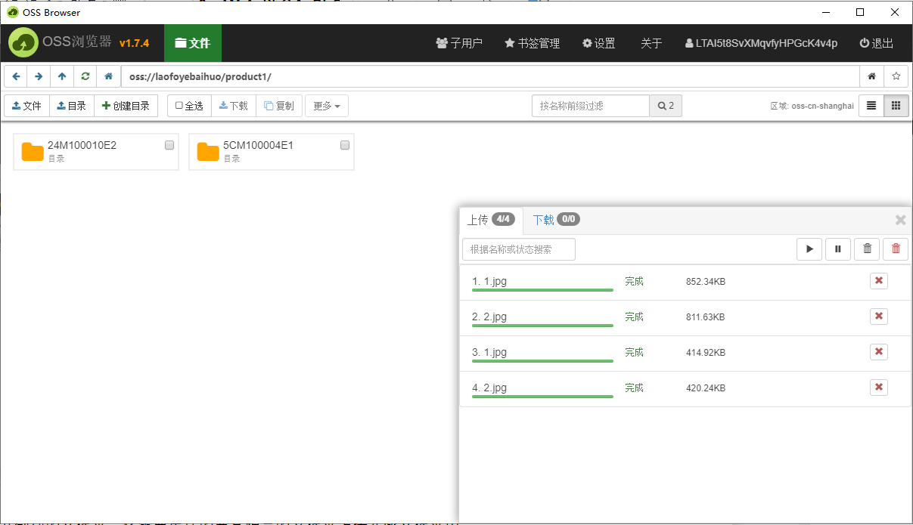

商品编号文件夹包含内容：

每个商品文件夹的名称为商品spu，需要将所有商品文件夹上传到oss

每个商品文件夹里有images和800两个文件夹

Images文件夹：商品详情图

800文件夹：第一张图默认为商品主图，后面的图片为资源列表图

## 2.3 文件夹整理

1. 新建文件夹，文件夹里包含1.py、2.py、3.py代码（会提供），1.xlsx（导入表格），以及商品文件夹图片

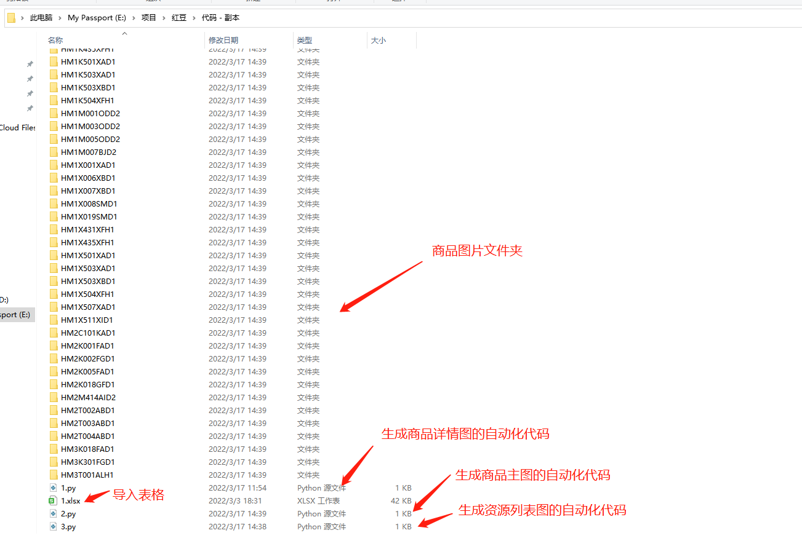

# 3.打开VScode

## 3.1  使用VS Code打开上面创建的文件夹

## 3.2 修改1.py、2.py和3.py的内容后，直接执行

**1.py、2.py和3.py文件NAS地址：/产品发布/Release/Product/Windows/工具包**

注：1.py、2.py和3.py修改内容一致

 （1）修改图片的文件夹地址打开一张图片的链接，复制链接到新建的文件夹名称 https://laofoyebaihuo.oss-cn-shanghai.aliyuncs.com/product1/24M100010E2/1.jpg

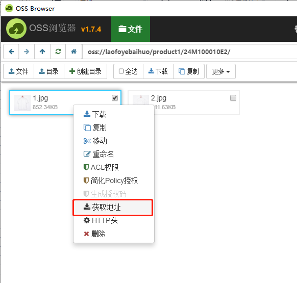

（2）修改表格里数据范围

    例如：   for x in range(2, 143)  

    修改143，为表格里最后一行数据的下一行

（3）保存

（4）执行

1.py：详情图

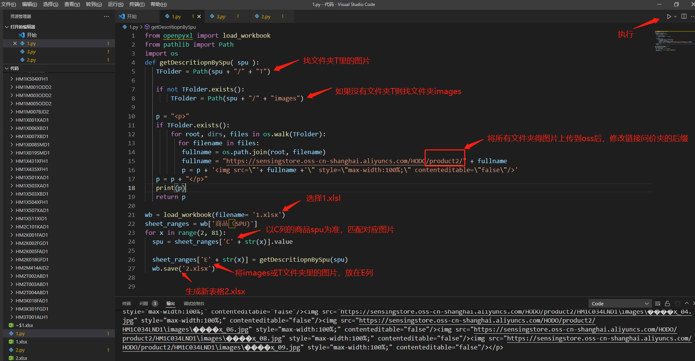

2.py：商品主图

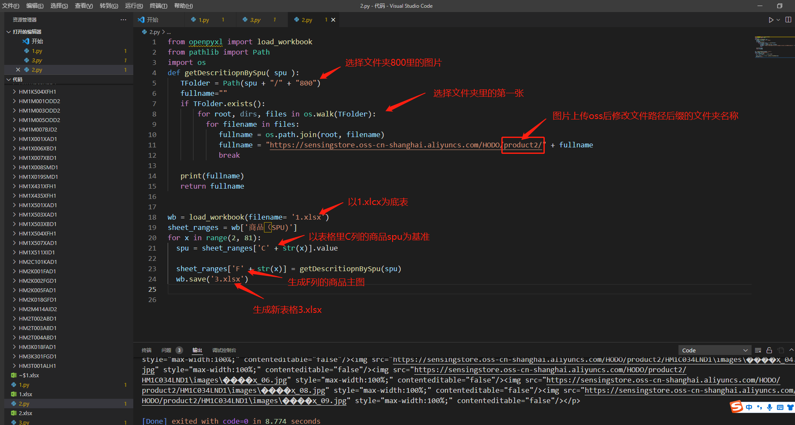

3.py: 资源列表图

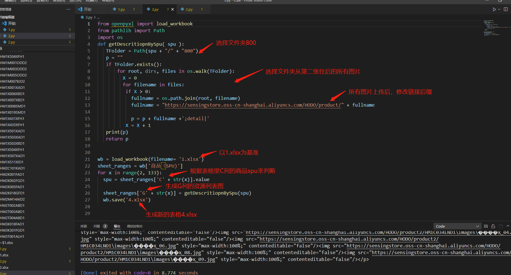

## 1.6 1.py、2.py和3.py各自生成表格

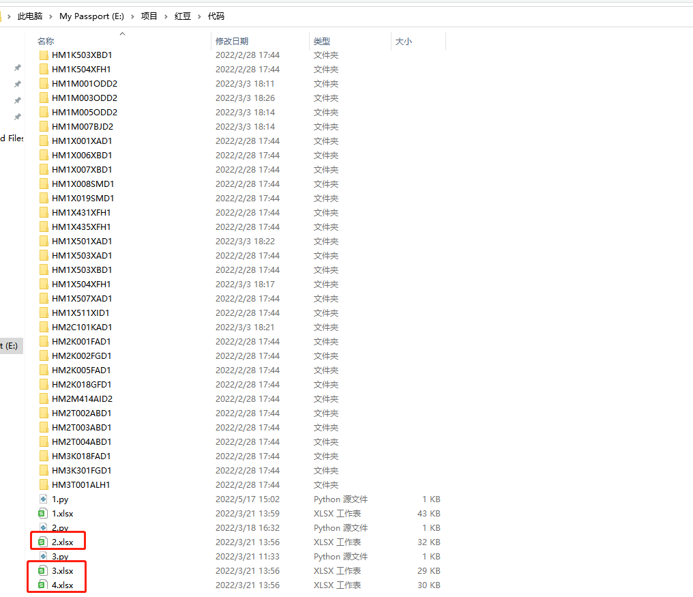

## 1.7 将生成的三个表格里对应的链接复制到1表格（导入的表格）中

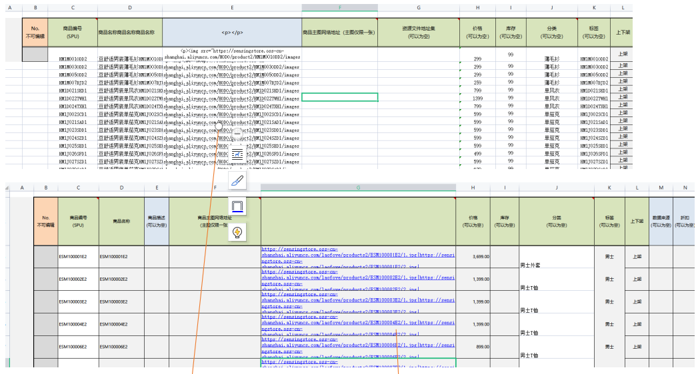

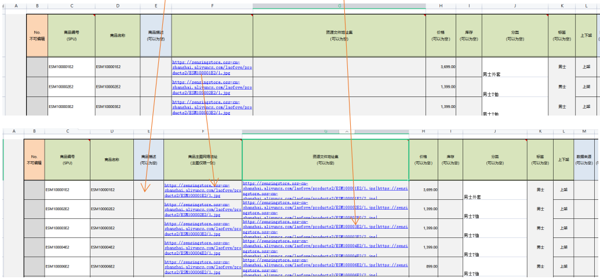