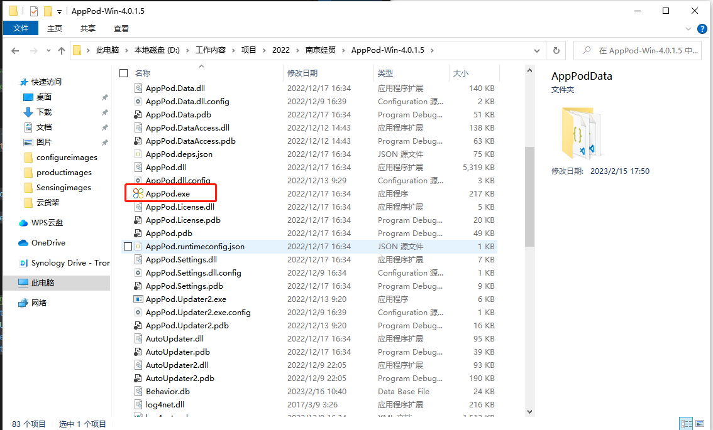

# 目录
# 1. Windows版安装

## 1.1 安装Wwindows版AppPod

 **需要通过APPPOD下载商品数据**

1. 双击运行AppPod.exe

## 1.2登录设备密钥
1. 双击打开AppPod.exe,输入设备密钥，点击检查KEY.显示设备信息
     
   

2. 点击注册

3. 注册完成后，机器上提示资源下载中，左下角显示对应的租户、设备，右下角显示版本号。下载内容显示在：AppPodData文件夹里。下载完成后自动打开ProductWallShow.exe，显示云货架内容

   

## 1.3更换设备密钥
1. 按下键盘里的F8，弹出设备注册界面

2. 重新输入密钥后，点击注册

3. 播放界面，按下键盘：Alt+F4，关闭播放界面

4. 若注册的设备已经在其他设备注册过，会提示注册失败，按下键盘F2，再点击注册即可
   
    
