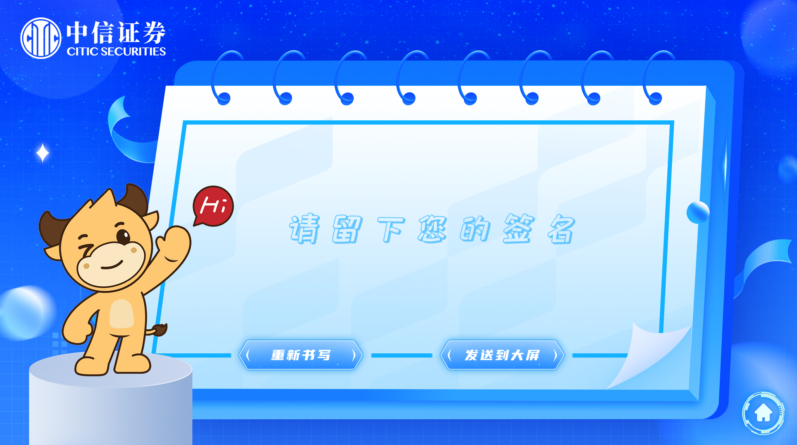

# 目录
- [1. 软件包](#1-%E8%BD%AF%E4%BB%B6%E5%8C%85)
  * [1.1 软件包地址](#11-%E8%BD%AF%E4%BB%B6%E5%8C%85%E5%9C%B0%E5%9D%80)
  * [1.2 配置路径](#12-%E9%85%8D%E7%BD%AE%E8%B7%AF%E5%BE%84)
  * [1.3 修改素材注意事项](#13-%E4%BF%AE%E6%94%B9%E7%B4%A0%E6%9D%90%E6%B3%A8%E6%84%8F%E4%BA%8B%E9%A1%B9)
- [2 修改文件](#2-%E4%BF%AE%E6%94%B9%E6%96%87%E4%BB%B6)
  * [2.1 页面配置结构](#21-%E9%A1%B5%E9%9D%A2%E9%85%8D%E7%BD%AE%E7%BB%93%E6%9E%84)
  * [2.2 参数介绍](#22-%E5%8F%82%E6%95%B0%E4%BB%8B%E7%BB%8D)
    + [2.2.1 `style`常见参数](#221-style%E5%B8%B8%E8%A7%81%E5%8F%82%E6%95%B0)
    + [2.2.2 `myFunction`参数](#222-myfunction%E5%8F%82%E6%95%B0)
    + [2.2.3 `animation`参数](#223-animation%E5%8F%82%E6%95%B0)
  * [2.3 页面参数介绍](#23--%E9%A1%B5%E9%9D%A2%E5%8F%82%E6%95%B0%E4%BB%8B%E7%BB%8D)
    + [2.3.1 增加页面](#231-%E5%A2%9E%E5%8A%A0%E9%A1%B5%E9%9D%A2)
    + [2.3.2 为页面增加背景](#232-%E4%B8%BA%E9%A1%B5%E9%9D%A2%E5%A2%9E%E5%8A%A0%E8%83%8C%E6%99%AF)
    + [2.3.3 为页面增加元素](#233-%E4%B8%BA%E9%A1%B5%E9%9D%A2%E5%A2%9E%E5%8A%A0%E5%85%83%E7%B4%A0)
    + [2.3.4 为元素增加功能](#234-%E4%B8%BA%E5%85%83%E7%B4%A0%E5%A2%9E%E5%8A%A0%E5%8A%9F%E8%83%BD)
    + [2.3.5 为页面增加签字区域](#235-%E4%B8%BA%E9%A1%B5%E9%9D%A2%E5%A2%9E%E5%8A%A0%E7%AD%BE%E5%AD%97%E5%8C%BA%E5%9F%9F)
- [3 案例](#3-%E6%A1%88%E4%BE%8B)
  * [3.1 案例参数](#31-%E6%A1%88%E4%BE%8B%E5%8F%82%E6%95%B0)
  * [3.2 案例图](#32-%E6%A1%88%E4%BE%8B%E5%9B%BE)
- [4. 修改网络配置](#4-%E4%BF%AE%E6%94%B9%E7%BD%91%E7%BB%9C%E9%85%8D%E7%BD%AE)
# 1. 软件包
## 1.1 软件包地址

NAS地址：/产品发布/Release/SensingPlatform/SignatureWall
## 1.2 配置路径
所有的配置内容的路径统一在signature-win32-x64/resources/app/build下，以下该路径统一称为：*/

## 1.3 修改素材注意事项
本项目提供以下操作：

1. 文件替换 将相应的静态文件替换后，页面展示的素材在重启signature.exe后替换。

2. 文件添加 默认不会引入页面，需要在*/elementConfig.json中进行使用。

3. 文件删除 应当注意在删除文件时，要确保页面中没有使用相应的素材

# 2 修改文件
在*/elementConfig.json中进行修改


## 2.1 页面配置结构

```
- Step 页面
  - background 背景
  - elements 元素
  - canvasContainer 签字墙范围
  - canvas 签字墙生成图片大小
  - canvasBgImg 签字墙生成图片的背景图片
  - canvasProduct 签字墙生成图片中的签字
```
## 2.2 参数介绍

### 2.2.1 `style`常见参数

| Key    | Value | Type   | Unit | info                    |
| ------ | ----- | ------ | ---- | ----------------------- |
| width  | 200px | String | px/% | 元素宽度                |
| height | 200px | String | px/% | 元素高度                |
| left   | 200px | String | px/% | 元素到左侧屏幕的距离    |
| top    | 200px | String | px/% | 元素到上侧屏幕的距离    |
| zIndex | 1     | String | 0    | 元素在Z轴（图层）的层次 |

### 2.2.2 `myFunction`参数

goStep1AndClearCanvas, goStep1, goStep2, goStep3, goStep4, goStep5, goStep6, reset, submit, goStep2AndSendUDP

 | Value                 | info                 |
 | --------------------- | -------------------- |
 | goStep1AndClearCanvas | 返回首页并清除签字墙 |
 | goStep2AndSendUDP     | 前往签字墙           |
 | reset                 | 重置签字内容         |
 | submit                | 提交签字内容         |

### 2.2.3 `animation`参数

 | Value | info |
 | ----- | ---- |
 | scale | 伸缩 |

##  2.3  页面参数介绍

### 2.3.1 增加页面

在`*/elementConfig.json`中最外层的大括号内添加：

```
// 非编辑区域
{
  // 可编辑区域
  "step1":{}
}
```

### 2.3.2 为页面增加背景

在相应的`step`中增加或者修改字段"background":

```
"step1": {
    "background": {
      "form": "img",
      "url": "./bg1.png",
      "style": {
        "width": "100%",
        "height": "100%",
        "left": "0",
        "right": "0"
      }
    }
  }
```

`background`相应字段
| Key                | Value                      | Type          | info     |
| ------------------ | -------------------------- | ------------- | -------- |
| form <red>*</red>  | 可选（img或者video）       | String        | 素材格式 |
| url <red>*</red>   | ./xxx.png                  | String        | 素材路径 |
| style <red>*</red> | [样式参数](#style常见参数) | CssProperties | 元素样式 |

### 2.3.3 为页面增加元素

在相应页面的`elements`字段中添加或者修改一个元素数组：

> 应当注意元素只能是图片，不可以是视频。

```
{
  "step1":{
    "element":[
    {
        "url": "./btn-1.png",
        "myFunction": "goStep2AndSendUDP",
        "style": {
          "width": "19%",
          "left": "43%",
          "top": "53%",
          "zIndex": "1"
        },
        "animation": "scale"
      },
      {
        "url": "./pen.png",
        "style": {
          "width": "17.13%",
          "left": "61.98%",
          "top": "35%",
          "zIndex": "1"
        }
      }
  ]
  }
}
```

`element` 相应字段

| Key                | Value                      | Type          | info     |
| ------------------ | -------------------------- | ------------- | -------- |
| url <red>*</red>   | ./xxx.png                  | String        | 素材路径 |
| myFunction         | goStep1                    | String        | 元素功能 |
| style <red>*</red> | [样式参数](#style常见参数) | CssProperties | 元素样式 |
| animation          | [动画参数](#参数文档)      | CssProperties | 元素动画 |

### 2.3.4 为元素增加功能

在相应元素中添加字段`myFunction`:

```
{
  "url": "./btn-1.png",
  "myFunction": "goStep2AndSendUDP",
  "style": {
    "width": "19%",
    "left": "43%",
    "top": "53%",
    "zIndex": "1"
  }
}
```

`myFunction`参数详见[函数参数](#myfunction参数)

### 2.3.5 为页面增加签字区域

在相应页面添加 `canvasContainer`,`canvas`,`canvasBgImg`,`canvasProduct` 四个参数：

```
{
  "Step2":{
    ...
    //书写区域
    "canvasContainer": {
      "width": "60.68%",
      "height": "50.4%",
      "top": "21.33%",
      "left": "25.83%"
    },
    //生成图片大小
    "canvas": {
      "width": 470,
      "height": 470
    },
    //生成图片背景
    "canvasBgImg": {
      "url": "./base64bg.png",
      "width": 470,
      "height": 470
    },
    //生成图片上的书写内容
    "canvasProduct": {
      "width": 320,
      "height": 136,
      "offsetX": 75,
      "offsetY": 167
    }
  }
}
```

`canvasContainer` 签字墙所在位置与大小

| Key                 | Value | Type   | Unit | info                 |
| ------------------- | ----- | ------ | ---- | -------------------- |
| width <red>*</red>  | 200px | String | px/% | 元素宽度             |
| height <red>*</red> | 200px | String | px/% | 元素高度             |
| left <red>*</red>   | 200px | String | px/% | 元素到左侧屏幕的距离 |
| top <red>*</red>    | 200px | String | px/% | 元素到上侧屏幕的距离 |

`canvas` 签字生成图片的大小

| Key                 | Value | Type   | info     |
| ------------------- | ----- | ------ | -------- |
| width <red>*</red>  | 200   | Number | 元素宽度 |
| height <red>*</red> | 200   | Number | 元素高度 |

`canvasBgImg` 签字图片的背景图片

| Key                 | Value          | Type   | info     |
| ------------------- | -------------- | ------ | -------- |
| url <red>*</red>    | ./base64bg.png | String | 素材路径 |
| width <red>*</red>  | 200            | Number | 元素宽度 |
| height <red>*</red> | 200            | Number | 元素高度 |

`canvasProduct` 签字图片中的签字内容,**该图片宽度与高度应当与`canvasContainer`的相应参数成比例。**

| Key                  | Value | Type   | info                     |
| -------------------- | ----- | ------ | ------------------------ |
| width <red>*</red>   | 200   | Number | 元素宽度                 |
| height <red>*</red>  | 200   | Number | 元素高度                 |
| offsetX <red>*</red> | 0     | Number | 元素到图片左侧边框的距离 |
| offsetY <red>*</red> | 0     | Number | 元素到图片上侧边框的距离 |

# 3 案例
## 3.1 案例参数
```
{
  "step1": {
    "background": {
      "form": "img",
      "url": "./bg1.png",
      "style": {
        "width": "100%",
        "height": "100%",
        "left": "0",
        "right": "0"
      }
    },
    "elements": [{
        "url": "./btn-1.png",
        "myFunction": "goStep2AndSendUDP",
        "style": {
          "width": "19%",
          "left": "43%",
          "top": "53%",
          "zIndex": "1"
        },
        "animation": "scale"
      },
      {
        "url": "./pen.png",
        "style": {
          "width": "17.13%",
          "left": "61.98%",
          "top": "35%",
          "zIndex": "1"
        }
      }
    ]
  },
  "step2": {
    "background": {
      "form": "img",
      "url": "./bg2.png",
      "style": {
        "width": "100%",
        "height": "100%",
        "left": "0",
        "top": "0"
      }
    },
    "elements": [{
        "url": "./hint.png",
        "style": {
          "left": "36.25%",
          "top": "47.4%"
        }
      },
      {
        "url": "./cow.png",
        "style": {
          "left": "3.64%",
          "bottom": "0"
        }
      },
      {
        "myFunction": "goStep1AndClearCanvas",
        "url": "./backhome.png",
        "style": {
          "left": "92.08%",
          "top": "85.74%"
        }
      },
      {
        "myFunction": "reset",
        "url": "./restart.png",
        "style": {
          "width": "17.5%",
          "height": "10.55%",
          "left": "28.96%",
          "top": "74%"
        }
      },
      {
        "myFunction": "submit",
        "url": "./submit2.png",
        "style": {
          "width": "17.5%",
          "height": "10.55%",
          "left": "54.22%",
          "top": "74%"
        }
      }
    ],
    "canvasContainer": {
      "width": "60.68%",
      "height": "50.4%",
      "top": "21.33%",
      "left": "25.83%"
    },
    "canvas": {
      "width": 470,
      "height": 470
    },
    "canvasBgImg": {
      "url": "./base64bg.png",
      "width": 470,
      "height": 470
    },
    "canvasProduct": {
      "width": 320,
      "height": 136,
      "offsetX": 75,
      "offsetY": 167
    }
  }
}
```

## 3.2 案例图
**Step1页面**

**Step2页面**


#  4. 修改网络配置

在 `./netConfig.json`中进行修改

该文件共有4个参数：

```
{
"UdpIp": "192.168.3.66",
"UdpPort": 5678,
"ApiIp": "192.168.3.66",
"ApiPort": 5001
}
```

`UdpIp`与`UdpPort` 对应接受图片的主机ip与端口

`ApiIp`与`ApiPort` 对应打开后台应用`gameServer`的主机ip与端口

