# 1.商品分类

## 1.1 新增商品分类

1.管理商品的所属类别，便于区分管理 2.详情参考下图：

## 1.2 管理分类

Warning

请确认无误后删除，删除后的商品分类及其子分类无法恢复

修改：修改当前分类信息
添加子分类：在当前分类下添加子分类
删除：删除当前分类及其子分类

# 2.商品属性

## 2.1 添加商品属性和属性值

Note 1.新增商品的特征属性，便于管理 SKU 属性 2.商品属性参数设定直接与 Sku 关联，请谨慎设定 3.新增商品属性,还需要添加相应的属性值

| 参数           | 描述                                                                |
| -------------- | ------------------------------------------------------------------- |
| 名称           | 商品属性名称，必填                                                  |
| 是否为销售属性 | 销售属性：能够区分 Sku 的属性，可以有多个销售属性，例如尺码，材质等 |
| 是否为显图属性 | 显图属性：决定 Sku 主图的属性，属性列表中只能有一个显图属性         |

操作步骤：
新增商品属性：点击商品下的商品属性 → 点击新增商品属性 → 编辑号信息后 → 点击保存
添加商品属性值：选择创建的商品属性 → 点击操作下的编辑按钮 → 点击属性值 → 填写属性值名称后 → 点击保存
操作步骤图示：
添加商品属性：

添加属性值：

## 2.2 管理属性

Warning

商品属性编辑或删除会直接影响商品中的 Sku 属性,可能会造成 Sku 主图丢失等后果，一般情况下不推荐修改或删除

# 3.商品列表

## 3.1 新增商品

Note

1.若您需要建立大量商品，您可以选择 EXCEL 导入 方式 2.商品列表显示模式有两种，分别为列表模式和图显模式

列表模式：以类似表格的模式展示商品信息，展示更多信息

图显模式：以图片模式展示商品信息，直观展示商品样式

| 参数     | 描述                                             |
| -------- | ------------------------------------------------ |
| 名称     | 商品名称，必填                                   |
| 编号     | 商品唯一编码，必填且不能重复                     |
| 价格区间 | 商品的价格，可以为固定数值，也可以为区间         |
| 商品分类 | 商品的所属类别                                   |
| 高级设定 | 点击【详细信息】，查看您需要填写商品的更详细信息 |
| OuterID  | 商品对外的 ID                                    |
| RfidCode | 感应标签                                         |
| Barcode  | 条形码                                           |

操作步骤图示：

## 3.2 编辑商品

操作步骤图示：

## 3.3 sku

### 3.3.1 新建 sku

warning:一个商品下可以建多可 sku

| 参数          | 描述                                                                               |
| ------------- | ---------------------------------------------------------------------------------- |
| 名称          | SKU 名称，必填                                                                     |
| SkuId         | SKU 唯一编码，必填且不能重复                                                       |
| 价格区间      | sku 的价格，可以为固定数值，也可以为区间                                           |
| 高级设定      | 点击【详细信息】，查看您需要填写 sku 的更详细信息                                  |
| OuterID       | sku 对外的 ID                                                                      |
| 关键/显图属性 | 区分 Sku 主图的属性，默认关键/显图属性为属性列表里是否为默认显图属性显示“是”的属性 |
| RfidCode      | 感应标签                                                                           |
| Barcode       | 条形码                                                                             |

操作步骤图示：

### 3.3.2 编辑 sku

操作步骤图示：

### 3.3.3 sku 上下线

Note
由于 Sku 属于商品下，可以通过上线商品的方式附带上线 Sku;也可以单独上线某个 Sku（若要商品上线同时 sku 也要上线，则商品和 sku 必须都是下线状态）

| 批量操作          | 描述                    |
| ----------------- | ----------------------- |
| 批量上线/上线选中 | 将选中的 SKU 设置成上线 |
| 批量下线/下线选中 | 将选中的 SKU 设置成下线 |
| 上线所有          | 将所有 SKU 设置成上线   |
| 下线所有          | 将所有 SKU 设置成下线   |
| 批量删除          | 将所有 SKU 删除         |

操作步骤图示
申请上线

申请下线

### 3.3.4 删除 sku

Warning

1.请确认无误后删除，删除后的 sku 无法恢复 2.要删除的 sku 必须为下线状态，系统中上线的 sku 没有【删除】操作按钮

操作步骤图示：
删除

批量删除

### 3.3.5 添加制作流程

1.点击制作流程

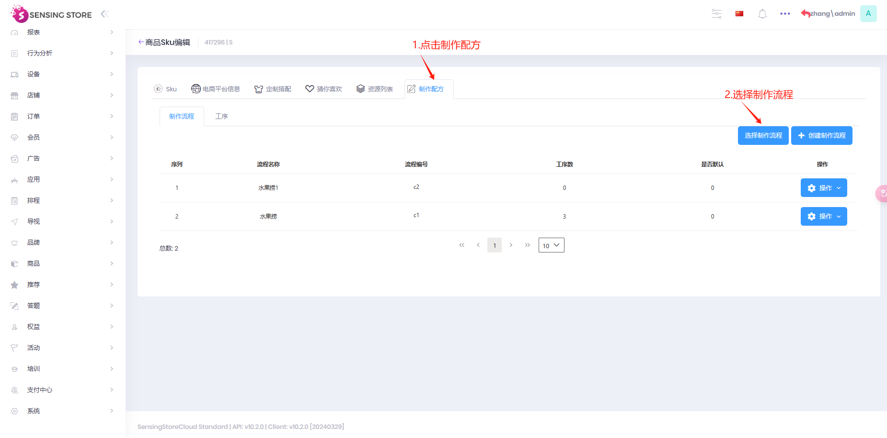

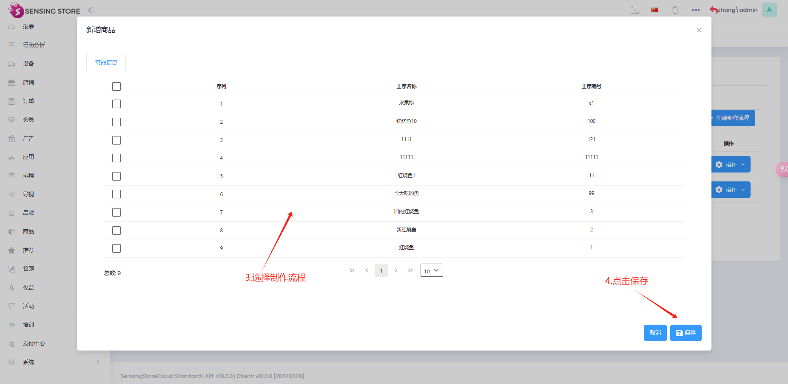

2. 选择工序

   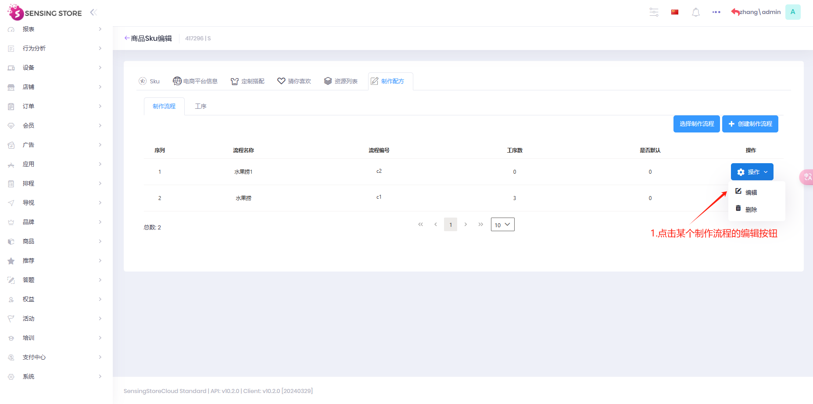

   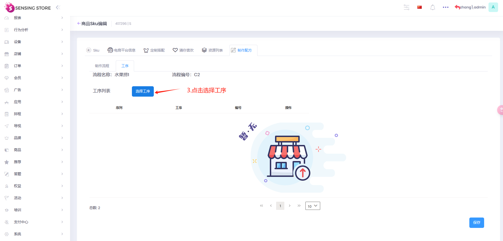

   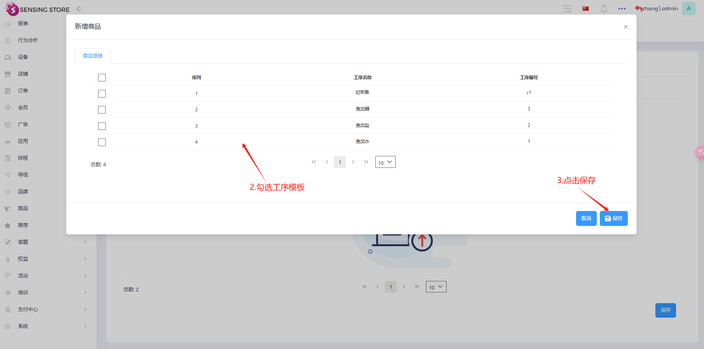

   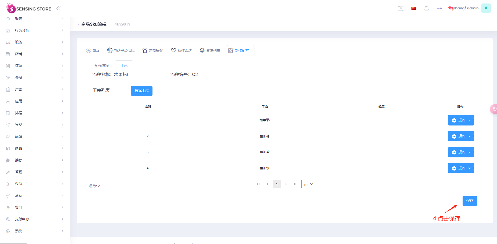

## 3.4 电商平台信息

电商品台信息：商品以及 SKU 均有电商平台信息，在此处您可以填写商品或者 SKU 在其他线上购物平台的信息

操作步骤图示：

新建电商平台信息

管理电商平台信息

## 3.5 资源列表

Note 1.添加商品各种资源，可以为图片、视频或模型资源;上传方式可以选择本地方式上传、外部链接或本地资源库 2.添加 sku 资源，在 sku 列表，单击 sku 的操作按钮，单击编辑，其余操作步骤和商品添加资源一致

| 参数 | 描述                                 |
| ---- | ------------------------------------ |
| 名称 | 资源名称                             |
| 用途 | 可以在此处填写资源用途，便于区别资源 |
| 排序 | 资源排序                             |
| 描述 | 资源描述                             |

操作步骤图示
添加资源

管理资源

## 3.6 商品发布

1.选择已上线的商品告发布到设备、店铺或者组织机构

| 功能         | 描述                                         |
| ------------ | -------------------------------------------- |
| 发布选中     | 发布选中的上线商品到设备、店铺或组织机构     |
| 发布所有     | 发布所有的上线商品到设备、店铺或组织机构     |
| 发布搜索结果 | 发布列表显示搜索的商品到设备、店铺或组织机构 |

| 发布类型 | 描述                                                                                 |
| -------- | ------------------------------------------------------------------------------------ |
| 追加     | 将选择的商品追加到发布对象中，若之前存在，则为更新                                   |
| 更新     | 仅发布当前选中的商品，其他既存的都将被撤回，之前发布对象中的商品将被覆盖             |
| 撤回     | 撤回发布对象中的所有商品或勾选的商品，撤回后，发布对象中将无任何商品或撤回勾选的商品 |

| 发布对象 | 描述                                                                   |
| -------- | ---------------------------------------------------------------------- |
| 设备     | 图标为电脑的项，发布到设备后，可以进入设备的商品列表下查看             |
| 店铺     | 图标为店铺的项，发布到店铺后，可以进入店铺的商品列表下查看             |
| 组织机构 | 图标为组织机构的项，发布到组织机构后，可以进入组织机构的商品列表下查看 |

操作步骤图示：

## 3.7 删除商品

Warning

请确认无误后删除，删除后的商品无法恢复

要删除的商品必须为下线状态，系统中上线的商品没有【删除】操作按钮

操作步骤图示：

单个删除

批量删除

## 3.8 商品上下线

Note
由于 Sku 属于商品下，上线商品的的时候可以勾选“商品下的 SKU 全部上线”，Sku 会和商品同步上线（若要商品上线同时 sku 也要上线，则商品和 sku 必须都是下线状态）

| 批量操作          | 描述                   |
| ----------------- | ---------------------- |
| 批量上线/上线选中 | 将选中的商品设置成上线 |
| 批量下线/下线选中 | 将选中的商品设置成下线 |
| 上线所有          | 将所有商品设置成上线   |
| 下线所有          | 将所有商品设置成下线   |

操作步骤图示
上线商品

下线商品

## 3.9 设置标签

前提条件：已经创建过商品标签

操作步骤图示：

设置标签

清除标签

管理标签

新建标签

## 3.10 设置分类

前提条件：已经创建过商品标签

操作步骤图示：

设置标签

清除标签

管理标签

新建标签

## 3.11 商品导入

SPU 或 SKU 的编号若重复，数据会覆盖

**3.11.1 商品（SPU) sheet**

| 参数         | 描述                                                                                                                                                                                                                                                                                           |
| ------------ | ---------------------------------------------------------------------------------------------------------------------------------------------------------------------------------------------------------------------------------------------------------------------------------------------- |
| 商品编号     | 商品唯一编码，必填且不能重复                                                                                                                                                                                                                                                                   |
| 商品名称     | 商品名称，必填                                                                                                                                                                                                                                                                                 |
| 商品描述     | 可以传副文本                                                                                                                                                                                                                                                                                   |
| 商品主图     | 推荐使用有 CDN 加速的 OSS 服务器 http 的外部图片地址。 例：https://img.alicdn.com/bao/uploaded/i3/94399436/TB2ekayvsuYBuNkSmRyXXcA3pXa_!!94399436-0-item_pic.jpg                                                                                                                          |
| 资源文件地址 | 多个资源的情况下，用竖线隔开。（支持图片，视频，音频等） 若需要添加用途,用途为 rfid，格式："rfid"资源链接 若资源没有用途，直接添加链接 "AAl"https://sensingstore.oss-cnshanghai.aliyuncs.com/HODO/IMAGE/HL8M007ODD2/800/2.jpg                                                   |
| 价格         | 商品价格                                                                                                                                                                                                                                                                                       |
| 库存         | 商品库存                                                                                                                                                                                                                                                                                       |
| 分类         | 多重分类的情况下，用半角，隔开 多级分类的情况，用半角 - 分开 注意：一般填写一个分类，分类如果再后台创建了，那就直接和这个分类绑上，如果后台没有创建，会默认创建成父分类，如果父-子 ，后台没有创建分类会自动创建这个父分类和子分类 例子：帽子,T 恤,鞋子      男装-西服,男装-短裤 |
| 标签         | 商品标签在后台创建好                                                                                                                                                                                                                                                                           |
| 上下架       | 默认商品上架或下架，必填                                                                                                                                                                                                                                                                       |
| 数据来源     | 创思平台，淘宝，京东，Oracle，百盛 ERP，商派 ERP                                                                                                                                                                                                                                               |
| 折扣         | 商品折扣 例子：0.6                                                                                                                                                                                                                                                                        |
| 颜色         | 默认有个颜色属性，可以填写属性值，如：黄色、蓝色。后台若没有创建填写的颜色会自动新增此颜色                                                                                                                                                                                                     |
| RGB          | 颜色的 rgb 值，会导入在属性值里的描述字段                                                                                                                                                                                                                                                      |
| 满减         | 商品是否参与满减活动。例如：1000-100                                                                                                                                                                                                                                                           |
| 针对性别     | 适合人群。男，女，不限                                                                                                                                                                                                                                                                         |
| 针对年龄段   | 适合年龄段。可以填区间或者具体某个年龄段。例如：30-40 或者 30                                                                                                                                                                                                                                  |
| 排序         | 商品排序                                                                                                                                                                                                                                                                                       |
| 所属品牌     | 商品所属品牌，若填写的品牌未在后台创建，导入后会自动创建此品牌                                                                                                                                                                                                                                 |
| 品牌标签     | 品牌绑定标签，可以在后台提前新建好品牌标签                                                                                                                                                                                                                                                     |
| 副标题       | 商品副标题，可填写文本信息                                                                                                                                                                                                                                                                     |
| 关键字       | 关键子，可以填写文本信息                                                                                                                                                                                                                                                                       |
| 备注         | 暂时未用到                                                                                                                                                                                                                                                                                     |
| 区域         | 商品所属区域                                                                                                                                                                                                                                                                                   |
| 保质期       | 商品保质期例子                                                                                                                                                                                                                                                                                 |

**3.11.2 单品(SKU)**

| 参数         | 描述                                                                                                                                                                                                                                         |
| ------------ | -------------------------------------------------------------------------------------------------------------------------------------------------------------------------------------------------------------------------------------------- |
| 商品编号     | 商品唯一编码，必填且不能重复。编号必须在第一个表格商品（SPU) 里有此编号，或者改商品编号已在后台                                                                                                                                              |
| skuid        | 商品 sku 唯一编码，必填且不能重复                                                                                                                                                                                                            |
| sku 名称     | sku 名称，必填                                                                                                                                                                                                                               |
| sku 描述     | 暂时未用到                                                                                                                                                                                                                                   |
| sku 主图     | 推荐使用有 CDN 加速的 OSS 服务器 http 的外部图片地址。 例：https://img.alicdn.com/bao/uploaded/i3/94399436/TB2ekayvsuYBuNkSmRyXXcA3pXa_!!94399436-0-item_pic.jpg                                                                        |
| sku 资源列表 | 多个资源的情况下，用竖线隔开。（支持图片，视频，音频等） 若需要添加用途,用途为 rfid，格式："rfid"资源链接 若资源没有用途，直接添加链接 "AAl"https://sensingstore.oss-cnshanghai.aliyuncs.com/HODO/IMAGE/HL8M007ODD2/800/2.jpg |
| 关键属性     | 需要先在后台创建好关键属性，填写关键属性的名称                                                                                                                                                                                               |
| 属性值       | 填写关键属性里的属性值                                                                                                                                                                                                                       |
| 其他属性     | 前面为属性，冒号后为属性值，有多个不同属性时，可用半角逗号隔开 例：尺码:L,大小:小                                                                                                                                                       |
| 价格         | sku 价格                                                                                                                                                                                                                                     |
| 库存         | sku 库存                                                                                                                                                                                                                                     |
| 重量         | sku 重量                                                                                                                                                                                                                                     |
| 上下架       | 默认商品上架或下架，必填                                                                                                                                                                                                                     |
| 数据来源     | 创思平台，淘宝，京东，Oracle，百盛 ERP，商派 ERP                                                                                                                                                                                             |
| 针对性别     | 适合人群。男，女，不限                                                                                                                                                                                                                       |
| 针对年龄段   | 适合年龄段。可以填区间或者具体某个年龄段。例如：30-40 或者 30                                                                                                                                                                                |
| 排序         | sku 排序                                                                                                                                                                                                                                     |
| rfid 编号    | sku 的 rfid 编号                                                                                                                                                                                                                             |
| 备注         | 备注信息                                                                                                                                                                                                                                     |
| 促销价       | sku 促销价                                                                                                                                                                                                                                   |
| Barcode      | 条形码                                                                                                                                                                                                                                       |

**3.11.3 商品线上库存(SPU-Online-Stock)**

| 参数         | 描述                                                                                            |
| ------------ | ----------------------------------------------------------------------------------------------- |
| SPU          | 商品唯一编码，必填且不能重复。编号必须在第一个表格商品（SPU) 里有此编号，或者改商品编号已在后台 |
| 电商平台类型 | 官方电商，淘宝，京东电商，唯品会，百盛 iSHOP                                                    |
| 线上店价格   | 价格                                                                                            |
| 库存         | 库存                                                                                            |
| 二维码地址   | 二维码链接地址                                                                                  |
| 备注         | 备注信息                                                                                        |

**3.11.4 单品线上库存(SKU-Online-Stock)**

| 参数         | 描述                                                                                                |
| ------------ | --------------------------------------------------------------------------------------------------- |
| SPU          | 商品唯一编码，必填且不能重复。编号必须在第一个表格商品（SPU) 里有此编号，或者改商品编号已在后台     |
| SKU          | 商品 sku 唯一编码，必填且不能重复。编号必须在第二个表格单品(SKU)里有此编号，或者改 sku 编号已在后台 |
| 电商平台类型 | 官方电商，淘宝，京东电商，唯品会，百盛 iSHOP                                                        |
| 线上店价格   | 价格                                                                                                |
| 库存         | 库存                                                                                                |
| 二维码地址   | 二维码链接地址                                                                                      |
| 备注         | 备注信息                                                                                            |

**3.11.5 线下库存(Instore-Stock)**

| 参数     | 描述                                                                                                                                                                                    |
| -------- | --------------------------------------------------------------------------------------------------------------------------------------------------------------------------------------- |
| 商品编号 | 商品唯一编码，必填且不能重复。编号必须在第一个表格商品（SPU) 里有次编号，或者改商品编号已在后台                                                                                         |
| skuid    | 商品 sku 唯一编码，必填且不能重复。编号必须在第二个表格单品(SKU)里有此编号，或者改 sku 编号已在后台                                                                                     |
| sku 名称 | sku 名称                                                                                                                                                                                |
| 库存     | 设备下或店铺下对应 sku 的库存                                                                                                                                                           |
| 位置     | sku 在设备下的所在位置                                                                                                                                                                  |
| 发布     | 商品是发布或回撤，sku 可以发布到设备或店铺，sku 可以回撤设备或店铺下的此 sku，如果 sku 全部撤回，spu 信息还是在设备或店铺下。如果想要撤回 spu 和下面的 sku，那只需填写 spu,sku 不用填写 |
| 店铺     | sku 和 spu 所要发布到的店铺名称                                                                                                                                                         |
| 设备     | sku 和 spu 所要发布到的设备名称                                                                                                                                                         |
| 货道编号 | sku 发布到货架设备下的对应货道，每个货道只有一个商品                                                                                                                                    |
| 关联设备 | sku 关联的电子价签设备                                                                                                                                                                  |
| 备注     | 暂时未用到                                                                                                                                                                              |
| 货道类型 | 顺序掉，随机掉，托盘，挂钩，散称 5 种类型，为空时不更新货道类型                                                                                                                         |

# 4.猜你喜欢和搭配

## 4.1 新增猜你喜欢和搭配

Note：新建搭配可参考新建新建猜你喜欢

| 参数     | 描述                                           |
| -------- | ---------------------------------------------- |
| 名称     | 猜你喜欢名称，必填                             |
| 唯一编码 | 猜你喜欢唯一编码，必填且不能重复               |
| 描述     | 猜你喜欢描述                                   |
| 排序     | 添加排序                                       |
| 添加 sku | 添加喜欢的 sku，可以选择多个，至少添加一个 sku |

操作步骤图示

## 4.2 管理猜你喜欢或搭配

Note:
管理搭配可参考管理猜你喜欢

编辑：修改猜你喜欢相关信息

删除：删除猜你喜欢

## 4.3Excel 导入：批量导入

1.批量导入猜你喜欢：

操作步骤图示

| 参数         | 描述                               |
| ------------ | ---------------------------------- |
| No.          | 序号， 不可以编辑                  |
| 猜你喜欢名称 | 猜你喜欢名称，必填                 |
| 唯一编码     | 必填，不可重复                     |
| 图片名称     | 猜你喜欢图，请使用外部链接地址方式 |
| 商品编号     | SKU 编号，必填，不能为空           |

2.批量导入搭配

| 参数     | 描述                           |
| -------- | ------------------------------ |
| No.      | 序号， 不可以编辑              |
| 搭配名称 | 搭配名称，必填                 |
| 唯一编码 | 必填，不可重复                 |
| 图片名称 | 搭配图，请使用外部链接地址方式 |
| 商品编号 | SKU 编号，必填，不能为空       |

# 5.商品工艺

## 5.1 工艺和原材料

1.新增工艺和原材料

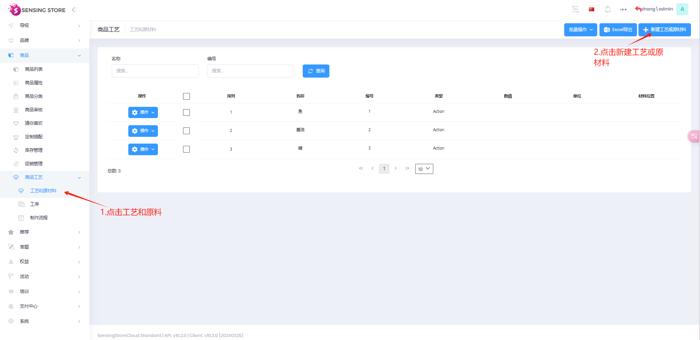

| 参数     | 描述                         |
| -------- | ---------------------------- |
| 名称     | 原料或工艺名称，必填         |
| 编号     | 原料或工艺编号，必填         |
| 数值     | 原料数量                     |
| 单位     | 单位，可在 host 账户创建单位 |
| 类型     | 原料或动作                   |
| 材料位置 | 原料缩放位置                 |
| 图片     | 原料图片                     |

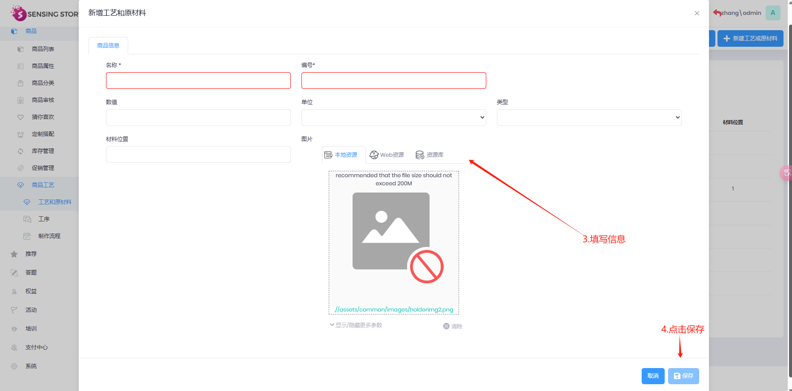

## 5.2 新增工序

1.新增工序

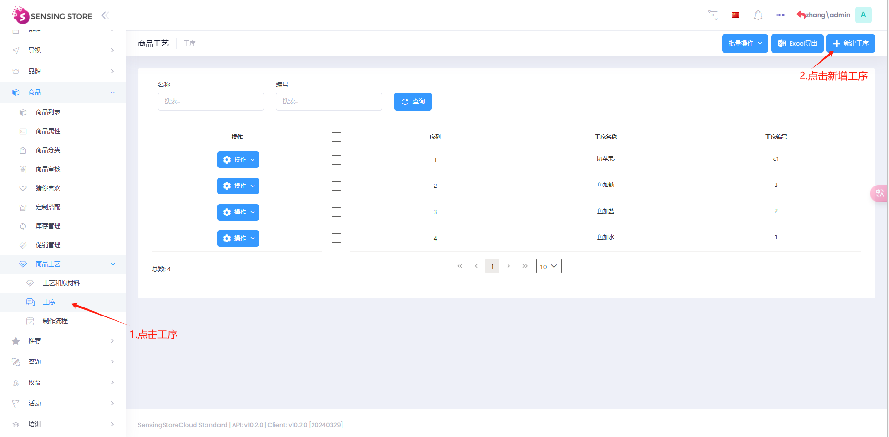

| 参数     | 描述               |
| -------- | ------------------ |
| 工序名称 | 填写工序名称，必填 |
| 工序编号 | 填写工序编号，必填 |

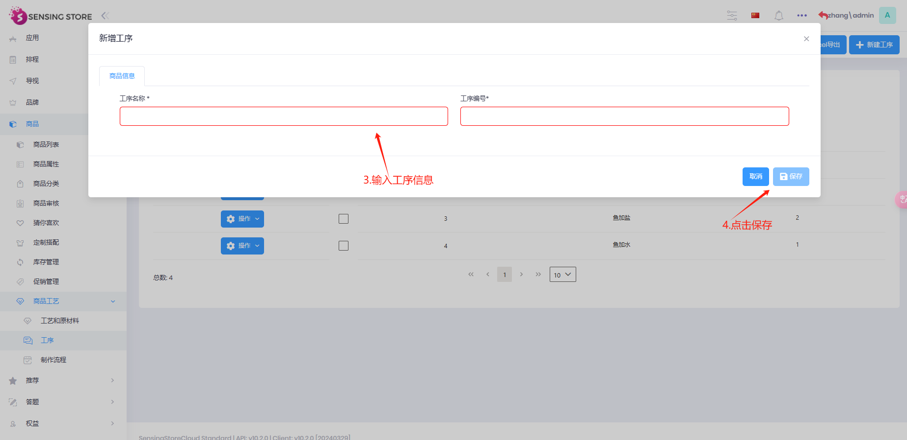

2.添加工艺和原材料

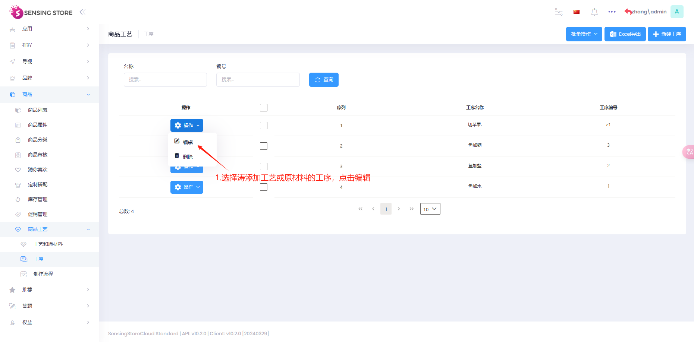

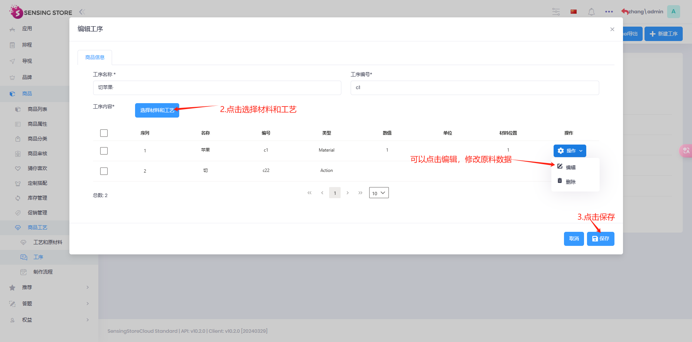

## 5.3 新增制作流程

1.新增制作流程

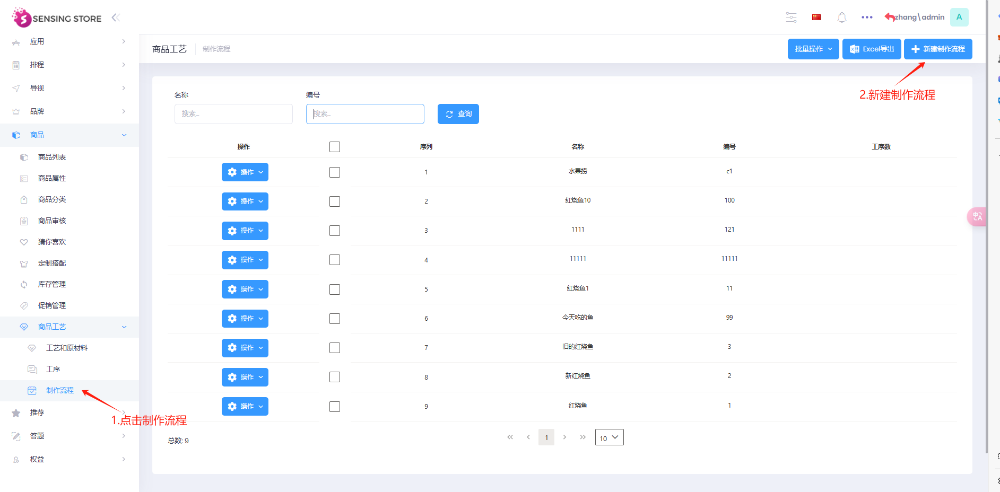

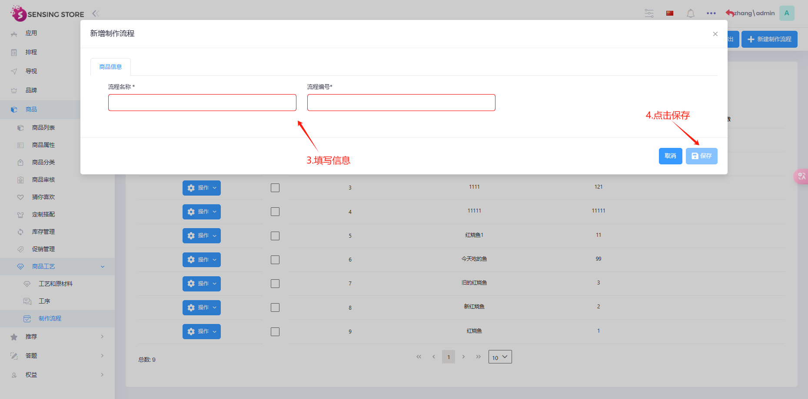

2.添加工序

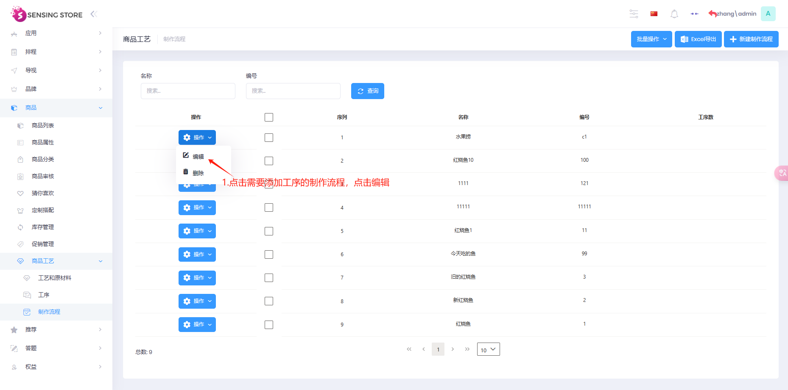

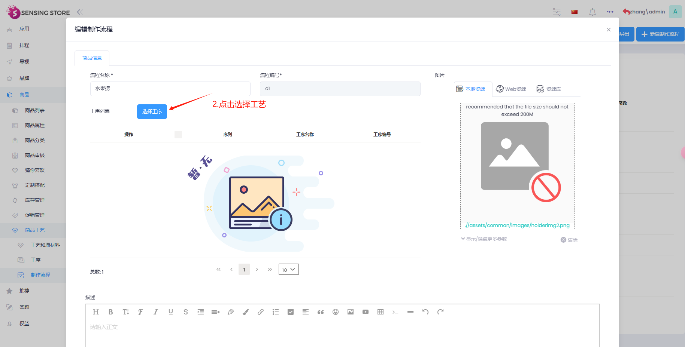

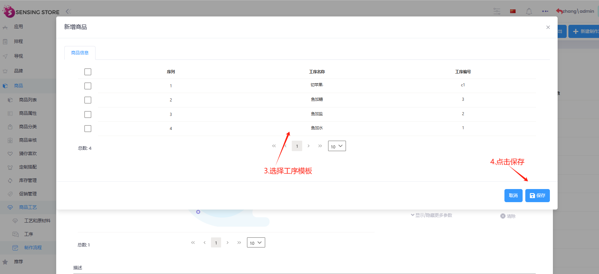

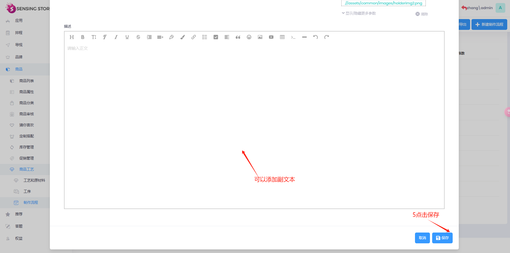
