## StoreHub 部署文档

适用场景：需要新装一台 Storehub 服务器

适用人群：公司实施人员。

# 1.工具准备

软件：xshell，，navicat （地址：/实施交付/常用装机安装包/Storehub 安装工具包）

工具：主机，U 盘

| 系统要求 |                                |
| -------- | ------------------------------ |
| 操作系统 | centos7 以上（推荐 7.9）       |
| 运行环境 | docker                         |
| 依赖环境 | rabbitmq（mqtt）、mysql:8.0.20 |

# 2.重装系统

## **2.1 刷 u 盘**

打开 Rufus 软件 （如图所示）

1.选择 U 盘作为重装系统启动盘

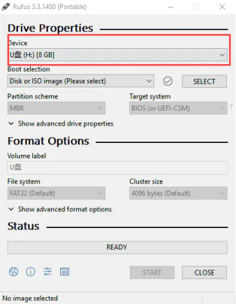

2.选择镜像文件进行写入，这里选择前面下载的 CentOS7.iso 文件

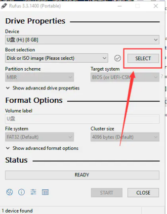

3.可以看到镜像文件名被读取进来了


4.点击 start，ISO 文件开始写入 U 盘

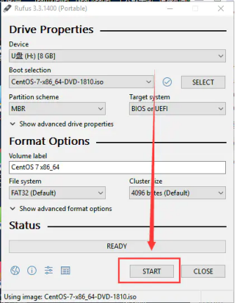

5.弹出的提示，点击默认的


6.这里是提示 U 盘原本的东西将被清空，点击 OK

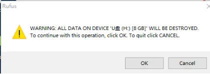

7.正在制作启动盘，大概要 10 分钟左右


8.制作完成，我们可以看 U 盘的变化


以上步骤就是制作 U 盘启动的步骤。

## 2.2 打开 BIOS，U 盘启动

可上网搜索：电脑如何启动 bios 并设置 U 盘启动

可参看：https://blog.csdn.net/COCO56/article/details/105155259

## 2.3.将 u 盘插入主机，重启主机，安装 centos7

1.**选择安装 Centos7，回车**


**2.语言设置**


**3.网络设置**

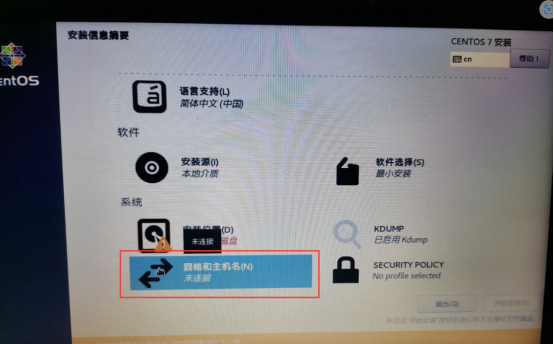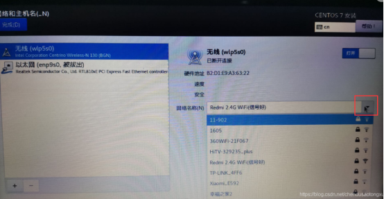

**4.选择磁盘**


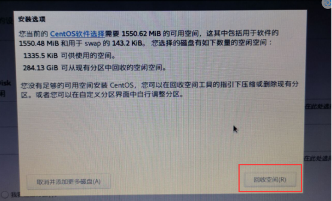


**5**选择软件安装

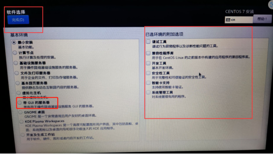

选择带 GUI 的服务器 就会带桌面

如果选择最小安装就只有字符界面

**6.开始安装**

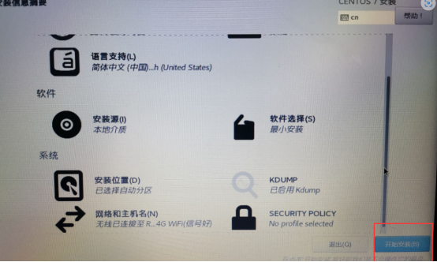


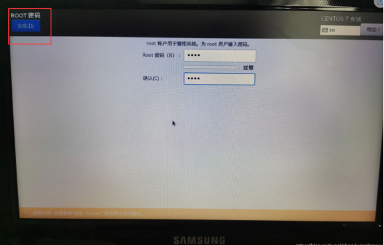

创建 root 账户有最大的权限

可以创建一个用户做为普通用户

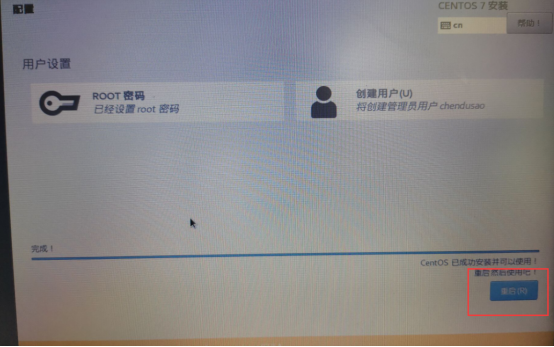

**7**安装完成


# 3.部署 StoreHub 后端

#### 3.1 连接服务器

1.下载 Xshell 软件 ，地址：https://www.xshell.com/zh/xshell/

2.打开 Xshell 软件，点击新建会话，输入 主机 ip、用户名和密码，连接服务器

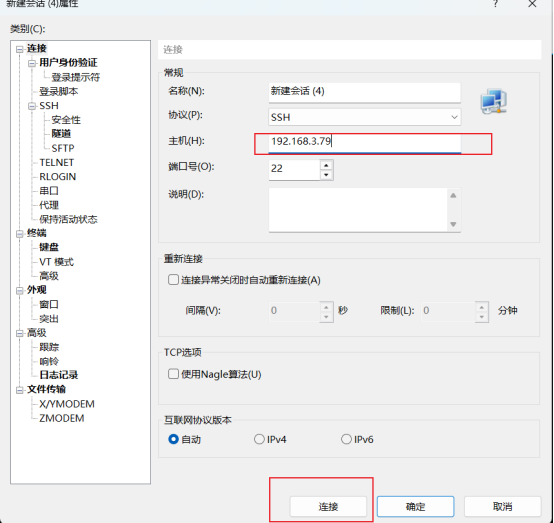

3.点击“接受并保护”

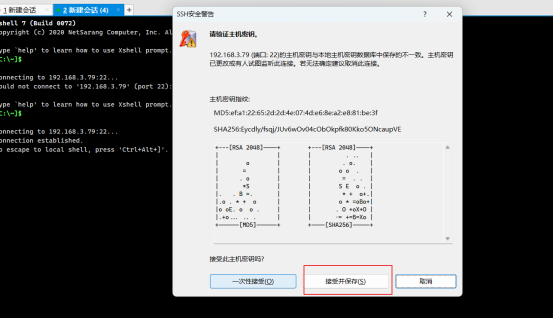

4.输入账户（root）


5.输入密码


#### 3.2 安装 docker 环境

参考：

https://blog.csdn.net/zz96405784848/article/details/150106940.

1 查看是否安装 docker

docker --version


没有安装 docker

2.如若没有，安装 docker。

#安装阿里云镜像

sudo wget -O /etc/yum.repos.d/CentOS-Base.repo http://mirrors.aliyun.com/repo/Centos-7.repo

#更新 yum 包

yum -y update


yum install -y yum-utils device-mapper-persistent-data lvm2


3.安装 docker

wget https://mirrors.aliyun.com/docker-ce/linux/centos/docker-ce.repo -O
/etc/yum.repos.d/docker-ce.repo

#如果没有 wget 命令则 yum install wget 安装

#安装 docker 环境这样安装都是最新的版本

yum -y install docker-ce

#验证是否安装成功


#启动 docker 开机自启

systemctl enable --now docker

#查看是否运行

systemctl status docker


### 3.3. 部署 mysql

**3.3.1 创建宿主机挂载目录**

mkdir -p /mnt/mysql/{conf,data,logs}

**3.3.2 设置挂载目录权限**

**sudo chown -R 999:999 /mnt/mysql/data**

**sudo chown -R 999:999 /mnt/mysql/logs**

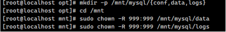

**3.3.3 准备 MySQL  配置文件(自己创建)**

**vi /mnt/mysql/conf/my.cnf**

流程：

#按 I 进入编辑模式

#粘贴下方内容

```
[mysqld]
# MySQL 数据存储路径
datadir=/var/lib/mysql

# MySQL 错误日志路径
log-error=/var/log/mysql/error.log

# 启用远程连接
bind-address=0.0.0.0

# 设置字符集为 utf8mb4
character-set-server=utf8mb4

# 默认排序规则为 utf8mb4_0900_ai_ci，若需兼容 MySQL 5.7 可使用 utf8mb4_unicode_ci
collation-server=utf8mb4_0900_ai_ci
```


#按 Esc 退出编辑模式

#输入:wq

**3.3.4 拉取 mysql 镜像**

docker pull mysql:8

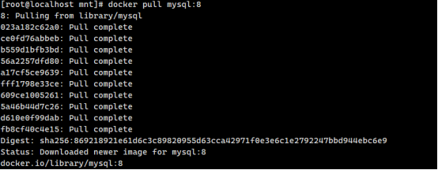

#运行容器

docker run -d \

--name mysql8 \

-e MYSQL_ROOT_PASSWORD=123456 \

-p 3306:3306 \

-v /mnt/mysql/conf/my.cnf:/etc/mysql/my.cnf \

-v /mnt/mysql/data:/var/lib/mysql \

-v /mnt/mysql/logs:/var/log/mysql \

mysql:8

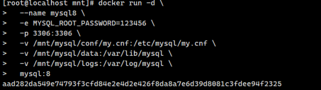

#查看是否运行成功

docker ps


**3.3.5 配置 MySQL 远程连接权限**

docker exec -it mysql8 mysql -u root -p

#输入容器创建时设置的 root 用户密码 123456

#Enter password: yourpassword

```
-- 允许 root 用户从任何 IP 地址连接
GRANT ALL PRIVILEGES ON *.* TO 'root'@'%';
-- 刷新权限
FLUSH PRIVILEGES;
```

然后输入 exit;退出


## 3.4 创建数据库

**1.打开 navicat**

主机 ip 192.168.3.79（这里是你布置的 hub 服务器的 ip）

账户:root

密码：123456


**2.创建数据库**


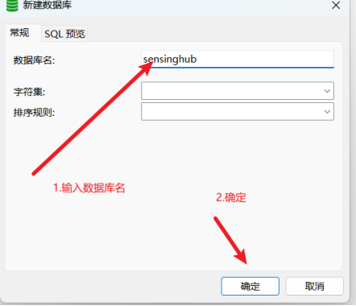

## 3.5 部署 rabbitmq

#登陆到公司的阿里云,需要输入账号密码：1qaz@WSX （具体的需要想具体的公司要 mq 账号和密码）

docker login --username=qule@1120777826858507 registry.cn-shanghai.aliyuncs.com

#运行 rabbitmq

```
docker run -d --name rabbitmq-container \
 -p 1883:1883 \
 -p 8883:8883 \
 -p 5672:5672 \
-p 4369:4369 \
-p 5671:5671 \
-p 15672:15672 \
-p 25672:25672 \
-e RABBITMQ_DEFAULT_USER="troncell" \
-e RABBITMQ_DEFAULT_PASS="1qazTronCell@WSX" \
-v /etc/localtime:/etc/localtime:ro \
 registry.cn-shanghai.aliyuncs.com/troncellapi/rabbitmq:5.1
```

备注：镜像拉完，退出登录，输入 docker logout

## 3.6 创建目录

**1.依次运行下方命令：**

cd /opt/

mkdir storehub

cd storehub

mkdir backend

mkdir front

查看是否创建成功：


**2.拷贝 publish 文件**

问开发要 publish 文件 将文件拷贝到/opt/storehub/backend/publish 目录下

**方案一：**

2.安装 filezilla 软件

3.输入服务器 IP、密码连接服务器

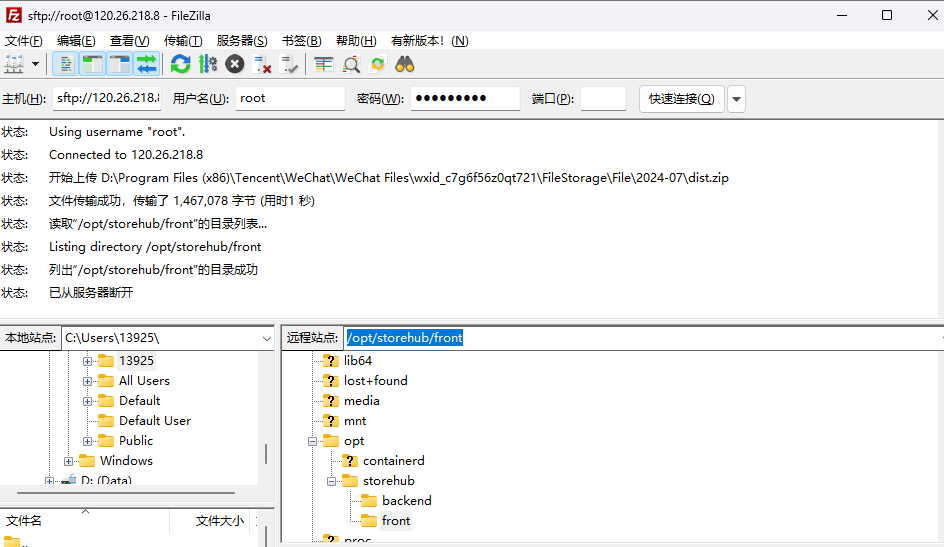

4.将 publish.zip 包拷贝到/opt/storehub/backend/目录下

5. xshell 进入对应目录下： cd /opt/storehub/backend
6. 输入：ls，查看 zip 文件
7. 安装解压：yum install unzip
8. 解压 zip 包：unzip publish.zip（tab 补全）

```shell

# 先拉取storehub的镜像
docker pull registry.cn-shanghai.aliyuncs.com/troncellapi/sensinghub:v3
# 运行
docker run -d --restart always -p 8080:8080 -p 9123:9123 -v /opt/storehub/backend/publish:/app -u $(id -u):$(id -g) -e TZ=Asia/Shanghai registry.cn-shanghai.aliyuncs.com/troncellapi/sensinghub:v3
# 修改配置文件
cd /opt/storehub/backend/publish/
vim appsettings.json
# 修改下面框起来的配置，按i进入编辑模式
# 第一个换成自己上面部署的mysql的数据库信息
server改为服务器ip，pwd：修改为123456，database修改为sensinghub
# 第二个框起来的换成上面部署的rabbitmq的账号和密码（一般不修改），hostman修改成服务器ip
# 退出并保存：按ecs 输入:mq
# 重启storehub容器
docker restart 97a
# 浏览器打开swagger地址：http://IP:8080/swagger/index.html
```

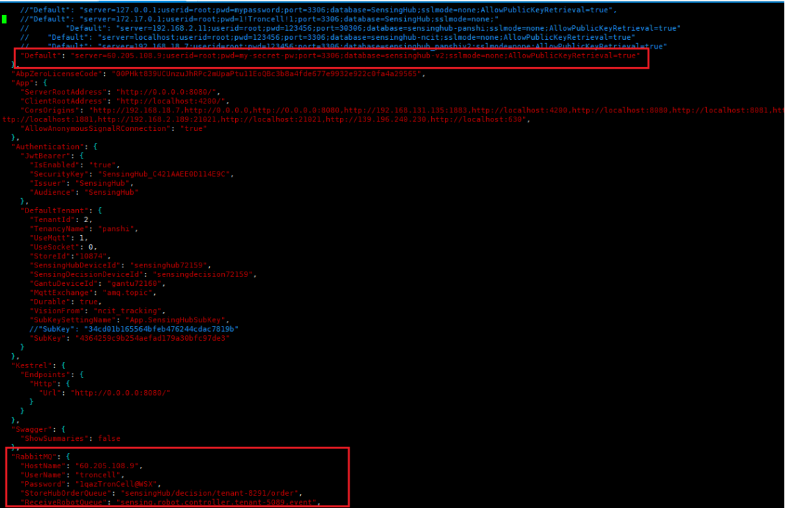

方案二：

直接使用 Xshell 工具

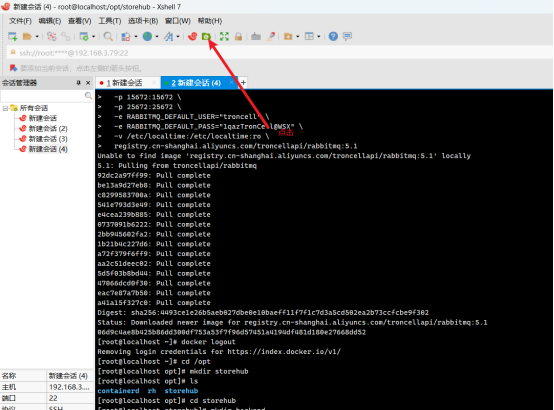

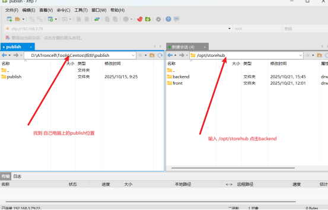

将自己电脑上的 publish 拖入/opt/storehub/backend 中


找到 appsetting.json，修改数据库名和密码以及 MQ

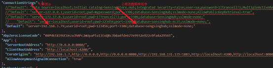

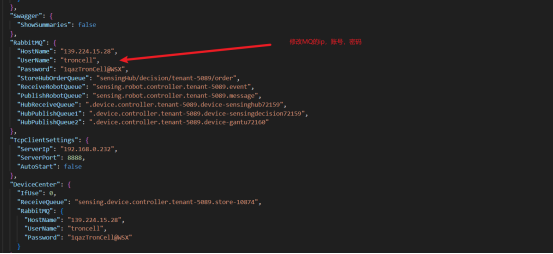

## **3.7.#重启**

#先拉取 storehub 的镜像

docker pull registry.cn-shanghai.aliyuncs.com/troncellapi/sensinghub:v3

#运行

docker run -d --restart always -p 8080:8080 -p 9123:9123 -v

/opt/storehub/backend/publish:/app -u $(id -u):$(id -g) -e TZ=Asia/Shanghai

registry.cn-shanghai.aliyuncs.com/troncellapi/sensinghub:v3

docker ps

Docker restart   0068

Docker restart  d6


## 3.8 验证是否成功

1.用 navicat   查看数据库 如果表中有此类数据 则说明成功。


2.访问 ip 如果有以下页面则成功。

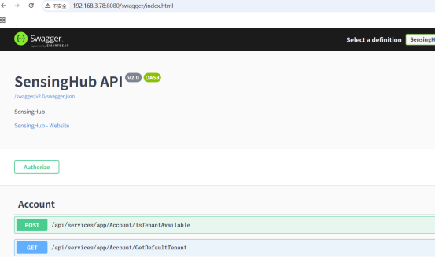

# 4. 部署 storehub 前端应用

## 1._安装 Docker Compose_

```
sudo curl -L "https://github.com/docker/compose/releases/latest/download/docker-compose-$(uname -s)-$(uname -m)" -o /usr/local/bin/docker-compose
# 启动服务
sudo systemctl start docker
sudo systemctl enable docker
# 验证安装
docker-compose --version
```

```shell

cd ..
# 构建前端镜像
docker build -t storehub:1.0 .

# 运行前端应用
docker run -d --restart always -v /opt/storehub/front/dist:/usr/share/nginx/html -p 80:80 storehub:1.0
```

操作如图所示：

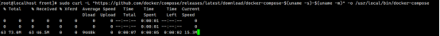


## 2.拷贝 dist 文件

将服务器 ip 告诉开发并问其要 dist 压缩包。

进入对应目录下，解压 zip 作文件


## **3.创建 docker-compose.yml**

cd /opt/storehub/front/

vim docker-compose.yml

流程：

#按 I 进入编辑模式

#粘贴下方内容

#按 Esc 退出编辑模式

```
version: '3.8'

services:
  frontend:
    image: nginx:alpine
    container_name: sengsinghub-frontend
    ports:
      - "8068:8068"
    volumes:
      - ./dist:/usr/share/nginx/html
      - ./conf/nginx.conf:/etc/nginx/nginx.conf
    restart: always
```

#输入:wq
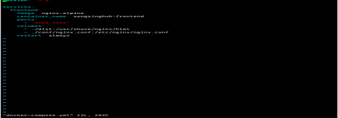

#启动
docker-compose up -d

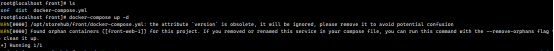

## 4.创建 nginx.conf

mkdir conf

cd   conf

vim nginx.conf

流程：

#按 I 进入编辑模式

#粘贴下方内容

#按 Esc 退出编辑模式

#输入:wq

```
events {
    worker_connections 1024;
}

http {
    include       mime.types;
    default_type  application/octet-stream;

    # 性能优化
    gzip on;
    gzip_vary on;
    gzip_min_length 1024;
    gzip_types text/plain text/css application/json application/javascript text/xml application/xml application/xml+rss text/javascript;

    server {
        listen 8068;
        root /usr/share/nginx/html;
        index index.html;

        # 支持前端路由
        location / {
            try_files $uri $uri/ /index.html;
        }

        # 静态资源缓存
        location /static/ {
            expires 1y;
            add_header Cache-Control "public, immutable";
        }

        location /assets/ {
            expires 1y;
            add_header Cache-Control "public, immutable";
        }
    }
}
```

## 5.重启


# 5.部署后先要创建租户

id：是云平台的租户 id


# 6.在浏览器输入 ip 地址，进入前端页面

访问网页:http://ip:8068/#/login（这里 ip 是你服务器的地址 ip）

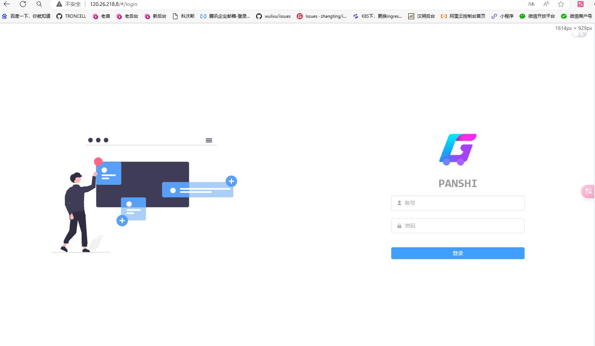

```

```
