# 1.hub 介绍

采用 StoreHub，StoreHub 是一个本地化的多功能的 Web 服务，主要负责同一场所下的所有智能设备的基础设置管理、设备下的多媒体资源管理、设备中应用软件中实时事件的分发以及对应的数据收集.将本地和决裁融合为一个前端使用

# 2.github 仓库地址

StoreHub 前端仓库地址：https://github.com/wulixu/SensingHub

StoreHub 后端仓库地址：https://github.com/troncell/sensinghub_front/tree/storehub

# 4.StoreHub 后台介绍

## 4.1 登录

1.输入链接地址，进入登录页面

2.输入用户名和密码

3.点击登录

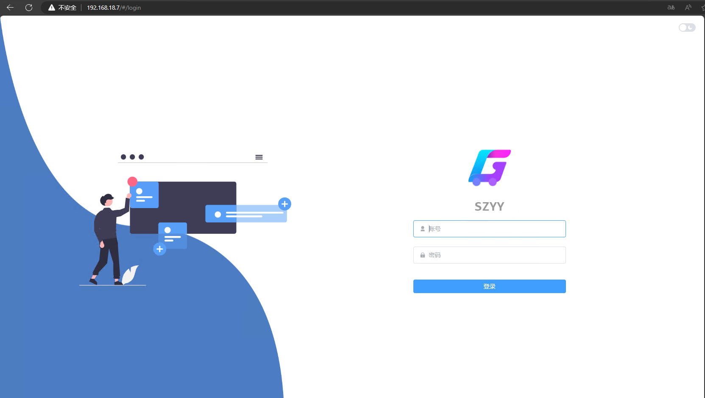

## 4.2 首页

若未绑定店铺显示为空。若绑定店铺，统计店铺的设备、商品、订单数量（订单微云端订单的统计）

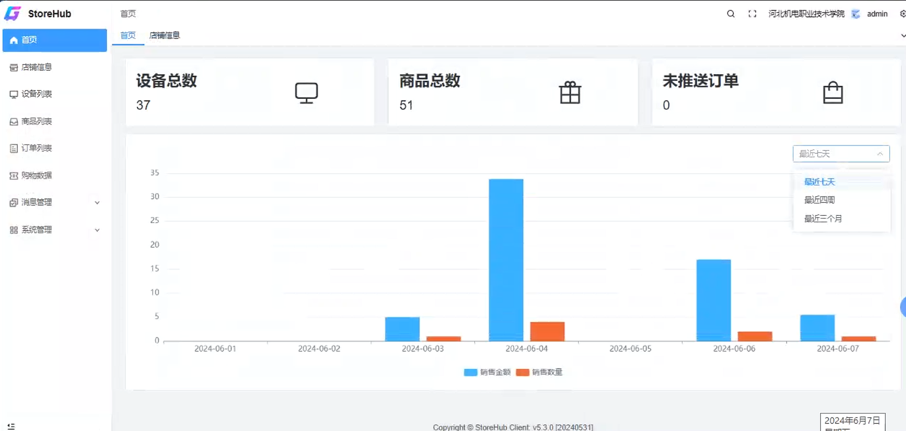

## 4.3 店铺信息

### 4.3.1 店铺信息

1.绑定店铺：第一次登录，需要绑定 sensingstore 云端的租户，并绑定租户下的某个店铺

2.解绑租户：可以解绑云端租户，解绑后，该租户下的所有信息全部清空（绑定后一般不会解绑）

3.解绑店铺：可以解绑云端租户下的店铺，解绑后，该店铺下的所有信息全部清空（绑定后一般不会解绑）

4.推单方式：自动推单和手动推单。自动推单：决裁创建订单后自动给云平台推单。手动推单：决裁创建订单后，不自动忘云平台推单（目前只有自动推单）

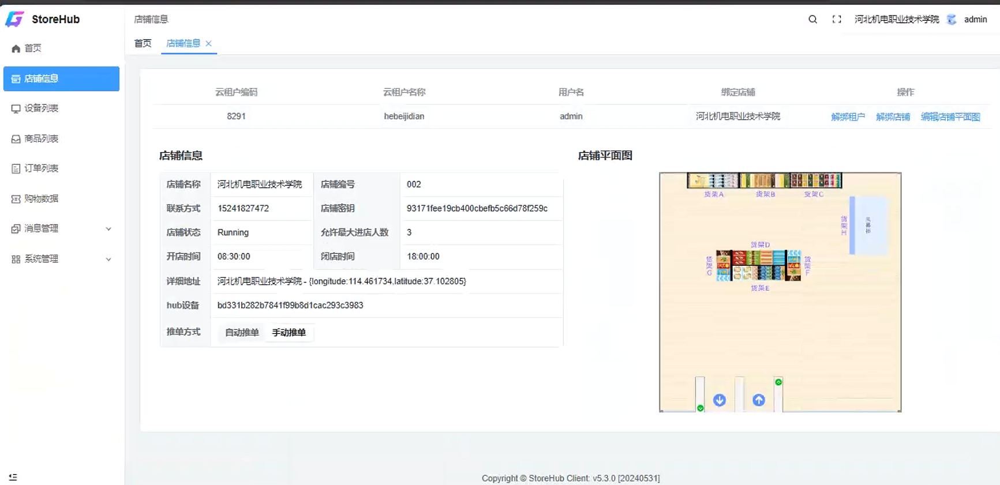

### 4.3.2 编辑店铺平面图

1.现在本地配置好，再点击编辑店铺平面图，把配置好的 json 复制进去并保存

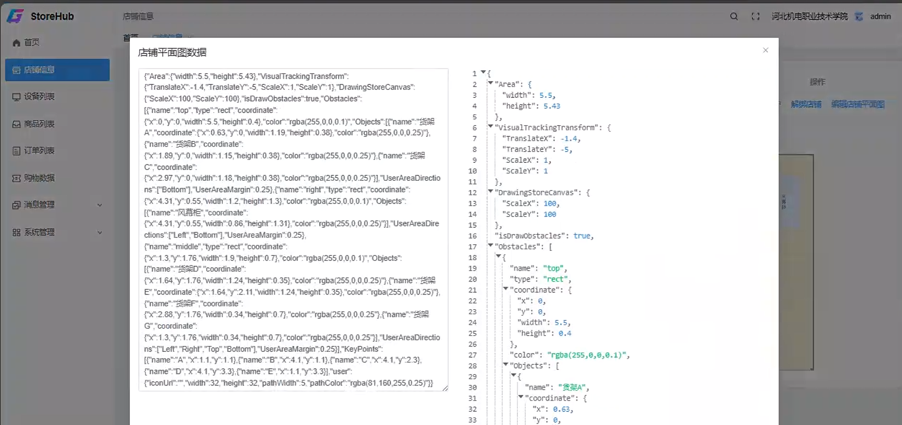

#### 4.3.2.1StoreHub 店铺布局配置

1.开发提供布局配置一览文件包，文件包 DAS 地址：\\Troncell_NAS920\产品发布\Release\UnmannedShop

2.在 config.json 文件里修改，双击打开 layout.html，读取 config 文件夹里的 config.json，即可预览配置信息

3.config.json 配置说明

> json 数据不支持注释，复制请删除

```json
{
  // 实际场景中的尺寸，以米为单位
  "Area": {
    "width": 5.5,
    "height": 5.43
  },
  // 按照实际场景中的尺寸，以笛卡尔坐标系为基础，x轴向右，y轴向上，进行平移至Canvas的默认原点位置(左上角)，坐标系为x轴向右，y轴向下。
  // Translate是图片左上角的原点与视觉原点的偏差数值，若坐标轴与视觉原点坐标方向相反，Scale则乘以-1
  "VisualTrackingTransform": {
    "TranslateX": -1.4,
    "TranslateY": -5,
    "ScaleX": 1,
    "ScaleY": 1
  },
  // 画布的缩放比例
  "DrawingStoreCanvas": {
    "ScaleX": 100,
    "ScaleY": 100
  },
  // 是否绘制障碍物在画布上
  "isDrawObstacles": false,
  // Obstacles为障碍物区域的坐标及大小，可以配置多个
  "Obstacles": [
    {
      "name": "top",
      "type": "rect",
      "coordinate": {
        "x": 0,
        "y": 0,
        "width": 5.5,
        "height": 0.4
      },
      "color": "rgba(0,191,255,0.1)",
      // 障碍物区域内货架位置，可不配置；若不配置，请保留为空数组
      "Objects": [
        {
          "name": "货架A",
          "coordinate": {
            "x": 0.63,
            "y": 0,
            "width": 1.19,
            "height": 0.38
          },
          "color": "#00BFFF"
        }
      ],
      // 该障碍物内坐标点可以偏移的位置
      "UserAreaDirections": ["Left", "Right", "Top", "Bottom"],
      // 偏移后到障碍物的距离
      "UserAreaMargin": 0.25
    }
  ],
  // KeyPoints为关键路径点，当轨迹穿过货架时，根据关键路径点计算，补齐路径；关键路径点越多越好
  "KeyPoints": [
    { "name": "A", "x": 1.1, "y": 1.1 },
    { "name": "B", "x": 4.1, "y": 1.1 },
    { "name": "C", "x": 4.1, "y": 2.3 },
    { "name": "D", "x": 4.1, "y": 3.3 },
    { "name": "E", "x": 1.1, "y": 3.3 }
  ],
  // 绘制用户的头像，为正方形，以像素为单位，没有上传图片则使用默认头像
  "user": {
    "iconUrl": "",
    "width": 32,
    "height": 32,
    "pathWidth": 5,
    "pathColor": "rgba(81,160,255,0.25)"
  }
}
```

## 4.4 设备列表

显示从云端同步过来的设备（只有查看，无修改功能）

搜索：可根据设备名称搜索

拉取设备：同步绑定的云端租户下绑定店铺的设备

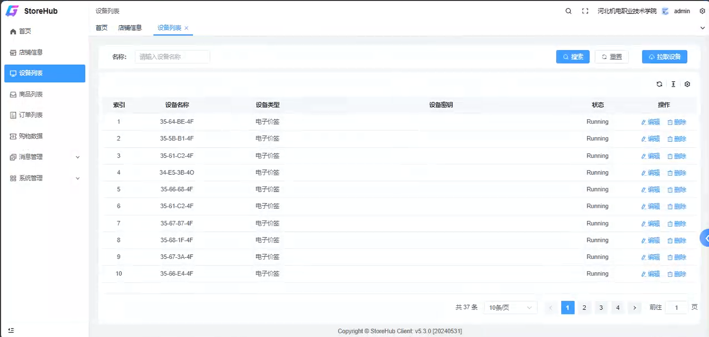

### 4.4.1 设备详情

1.设备信息：

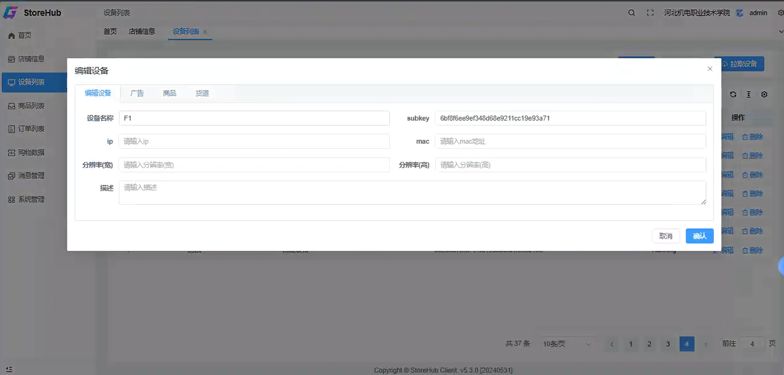

2.设备下广告

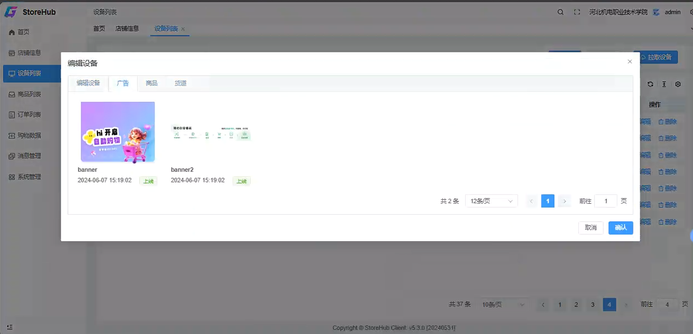

3.设备下商品

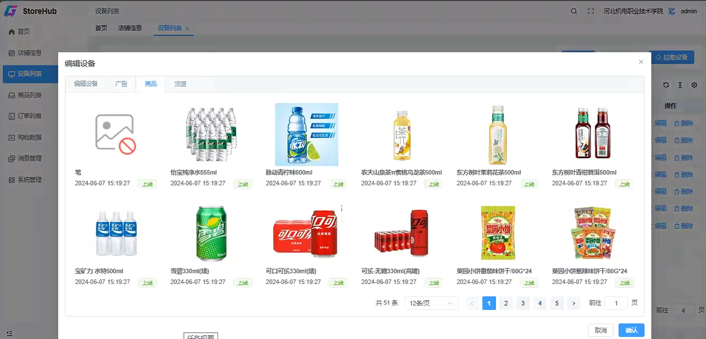

4.货道信息

点击货道，右侧显示货道信息的详情

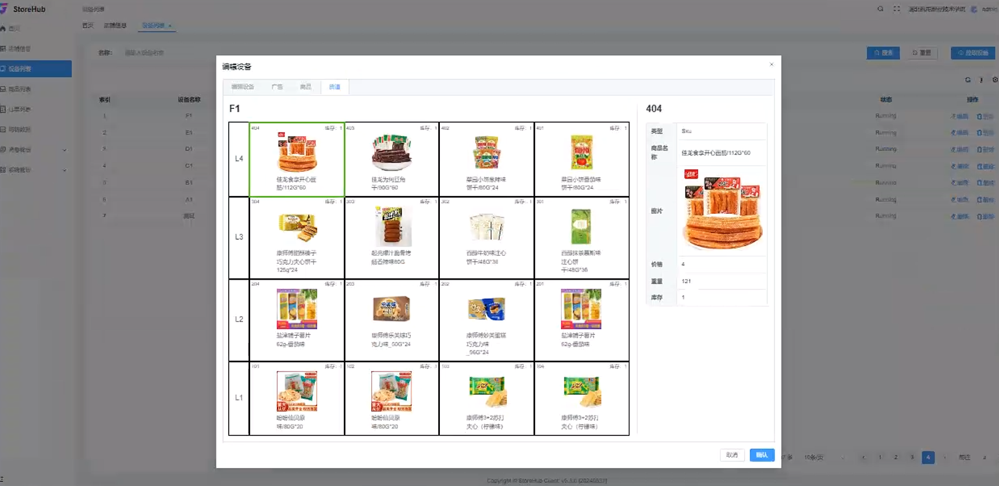

## 4.5 商品列表

显示从云端租户里为 hub 设备下同步过来的商品（只有查看，无修改功能）

搜索：可根据商品名称搜索

拉取商品：同步绑定的云端租户下绑定店铺的 hub 设备下的商品

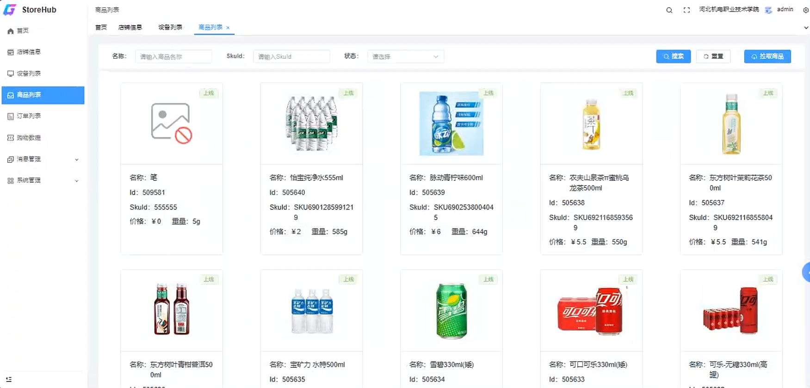

## 4.6 订单列表（决裁提供的接口）

1.订单列表：

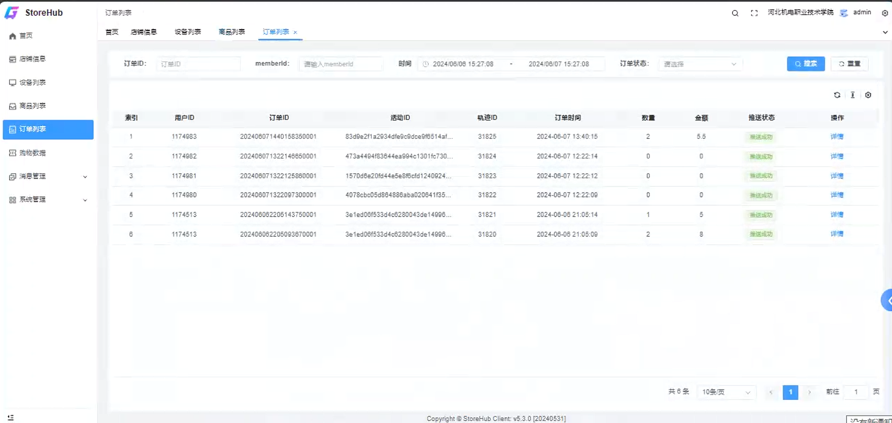

2.订单详情

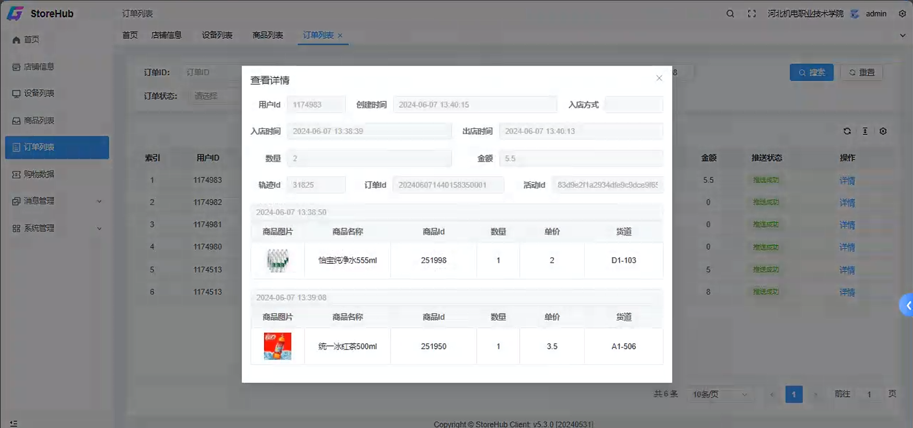

## 4.7 购物数据（决裁提供的接口）

### 4.7.1 轨迹列表

搜索：可以按用户 id，活动时间，活动状态进行搜索

轨迹：查看轨迹详情

详情：查看当前轨迹的订单详情

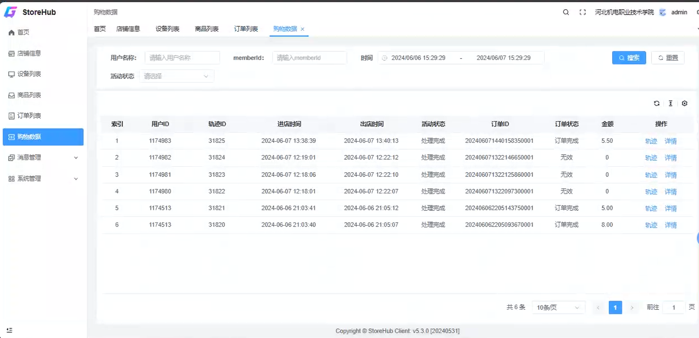

## 4.8 消息管理

### 4.8.1 设备消息

查看所有设备发出来的消息，包含闸机、货架

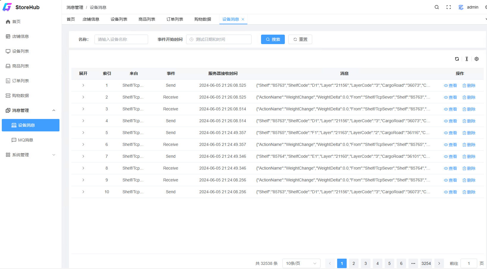

### 4.8.2MQ 消息

包含 MQ 里所有监听的消息，包含所有 check 消息

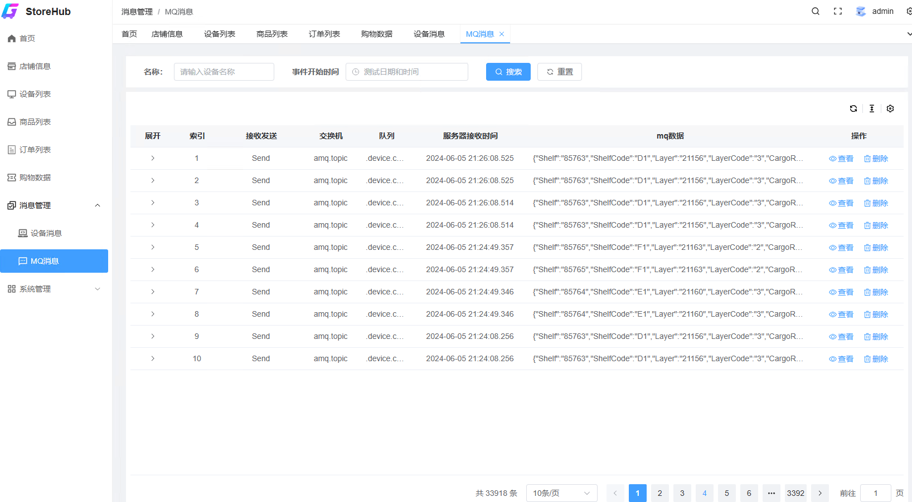

## 4.9 系统管理

### 4.9.1 任务管理

需要配置 hub 和决裁的同步任务，一般有一下几种

hub 同步店铺：http://ip 地址/api/services/app/SyncFromSensingStore/SyncStoreInfo

hub 同步货架：http://ip 地址/api/services/app/SyncFromSensingStore/SyncShelfDevices

hub 同步商品：http://ip 地址/api/services/app/SyncFromSensingStore/SyncProducts

决裁同步商品：http://192.168.18.7:81/sms/v1/job/service/product/info

决裁同步货架：http://ip 地址/sms/v1/job/service/self/info

获取边缘服务器 dau：http://ip 地址/api/services/app/Panshi/GetDeviceDau

更新实时库存：http://ip 地址/api/services/app/Panshi/SyncStock

更新货道信息（包含货道合并）http://ip 地址/api/services/app/Panshi/SendDevicesToEdge

更新货道绑定的商品：http://ip 地址/api/services/app/Panshi/SendSkusToEdge

磐石相关接口：
``

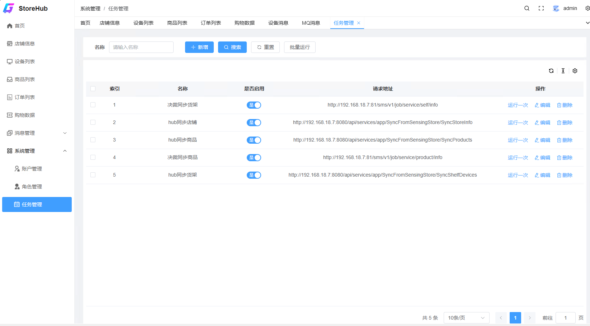

可以新增/修改同步任务（目前 cron 表达式：00\*\*\*？配置的是整点会进行同步）

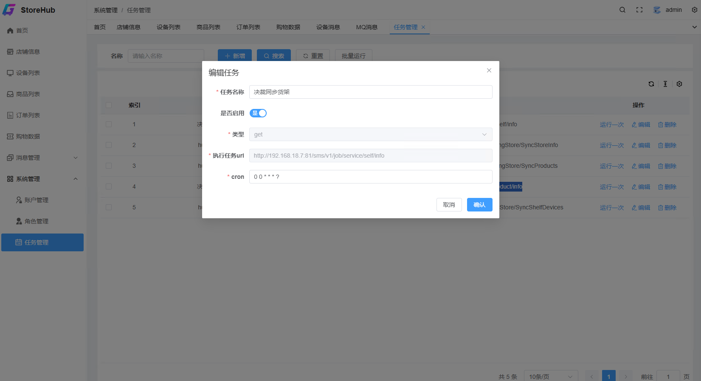
