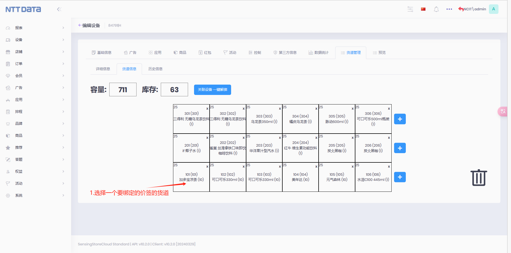
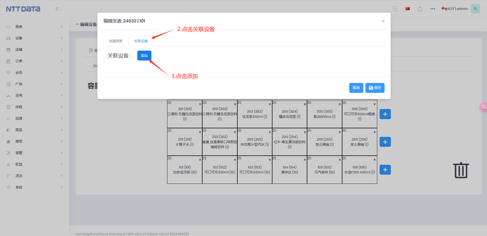
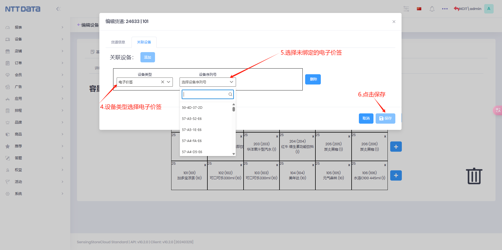

# 目录

- [目录](#目录)
- [1. 租户登录](#1-租户登录)
- [2.商品](#2商品)
  - [2.1 创建商品分类](#21-创建商品分类)
  - [2.2 创建商品属性](#22-创建商品属性)
  - [2.3 创建商品](#23-创建商品)
  - [2.4 创建 sku](#24-创建-sku)
  - [2.5 上线商品和 sku](#25-上线商品和-sku)
- [3.设备](#3设备)
  - [3.1 创建设备](#31-创建设备)
  - [3.2 新增价签设备](#32-新增价签设备)
  - [3.3 发布商品到设备](#33-发布商品到设备)
  - [3.4 新建货道](#34-新建货道)
  - [3.5 货道绑定电子价签](#35-货道绑定电子价签)
  - [3.6 表格导入绑定](#36-表格导入绑定)
- [4.店铺](#4店铺)
  - [4.1 创建店铺](#41-创建店铺)
  - [4.2 店铺里添加设备](#42-店铺里添加设备)
  - [4.3 发布商品到店铺](#43-发布商品到店铺)
- [5.同步 hub 设备商品信息](#5同步-hub-设备商品信息)
- [6.支付中心](#6支付中心)
  - [6.1 添加微信支付分支付](#61-添加微信支付分支付)
- [7.小程序绑定](#7小程序绑定)
- [8.线下订单创建](#8线下订单创建)
- [9.订单列表](#9订单列表)

参考租户：NCIT

# 1. 租户登录

前提：已创建过租户

操作步骤：
点击修改 → 切换至租户为勾选状态 → 输入租户名称 → 点击切换至此租户 → 输入用户名、密码 → 点击登录

租户名：输入租户名称，仅能输入英文与数字

用户名：输入用户名称或用于注册账号的登陆邮箱亦可

密码：输入登陆密码，若为第一次登陆未设置密码，需要在邮箱中的验证邮件中找到随机密码并修改

登陆：若确认账号信息无误却无法登陆，可进入 host 账户查看或重新设置密码

操作步骤图示：

登录成功后如下图：

注：（不同的账号根据拥有的权限登录后初始页面可能会有变化）

# 2.商品

## 2.1 创建商品分类

1.管理商品的所属类别，便于区分管理 2.详情参考下图：

## 2.2 创建商品属性

Note 1.新增商品的特征属性，便于管理 SKU 属性 2.商品属性参数设定直接与 Sku 关联，请谨慎设定 3.新增商品属性,还需要添加相应的属性值

| 参数           | 描述                                                                |
| -------------- | ------------------------------------------------------------------- |
| 名称           | 商品属性名称，必填                                                  |
| 是否为销售属性 | 销售属性：能够区分 Sku 的属性，可以有多个销售属性，例如尺码，材质等 |
| 是否为显图属性 | 显图属性：决定 Sku 主图的属性，属性列表中只能有一个显图属性         |

操作步骤：
新增商品属性：点击商品下的商品属性 → 点击新增商品属性 → 编辑号信息后 → 点击保存

添加商品属性值：选择创建的商品属性 → 点击操作下的编辑按钮 → 点击属性值 → 填写属性值名称后 → 点击保存

操作步骤图示：

添加商品属性：

添加属性值：

## 2.3 创建商品

Note

1.若您需要建立大量商品，您可以选择 EXCEL 导入 方式 2.商品列表显示模式有两种，分别为列表模式和图显模式

列表模式：以类似表格的模式展示商品信息，展示更多信息

图显模式：以图片模式展示商品信息，直观展示商品样式

| 参数     | 描述                                             |
| -------- | ------------------------------------------------ |
| 名称     | 商品名称，必填                                   |
| 编号     | 商品唯一编码，必填且不能重复                     |
| 价格区间 | 商品的价格，可以为固定数值，也可以为区间         |
| 商品分类 | 商品的所属类别                                   |
| 高级设定 | 点击【详细信息】，查看您需要填写商品的更详细信息 |
| 商品主图 | 商品图片                                         |

操作步骤图示：

## 2.4 创建 sku

warning:一个商品下可以建多可 sku

| 参数          | 描述                                                                               |
| ------------- | ---------------------------------------------------------------------------------- |
| 名称          | SKU 名称，必填                                                                     |
| SkuId         | SKU 唯一编码，必填且不能重复                                                       |
| 价格区间      | sku 的价格，可以为固定数值，也可以为区间                                           |
| 高级设定      | 点击【详细信息】，查看您需要填写 sku 的更详细信息                                  |
| 关键/显图属性 | 区分 Sku 主图的属性，默认关键/显图属性为属性列表里是否为默认显图属性显示“是”的属性 |
| 重量          | 物品重量                                                                           |
| Barcode       | 条形码                                                                             |

操作步骤图示：

## 2.5 上线商品和 sku

Note
由于 Sku 属于商品下，上线商品的的时候可以勾选“商品下的 SKU 全部上线”，Sku 会和商品同步上线（若要商品上线同时 sku 也要上线，则商品和 sku 必须都是下线状态）

| 批量操作          | 描述                   |
| ----------------- | ---------------------- |
| 批量上线/上线选中 | 将选中的商品设置成上线 |
| 批量下线/下线选中 | 将选中的商品设置成下线 |
| 上线所有          | 将所有商品设置成上线   |
| 下线所有          | 将所有商品设置成下线   |

操作步骤图示
上线商品

# 3.设备

## 3.1 创建设备

新增货架设备和 hub 设备，设备需要发布到对应店铺下：

（1）hub 设备：需要将同步到 sensinghub 的商品发布到设备

（2）货架设备：需要将货架里所放得商品发布到货架设备

| 参数       | 描述                                                   |
| ---------- | ------------------------------------------------------ |
| 名称       | 设备名称，必填                                         |
| 设备类型   | 设备类型，必填，选择自助贩卖                           |
| 系统类型   | 选择 windows 系统和 Android 系统，必填                 |
| Mac 地址   | 设备网卡硬件地址                                       |
| 电商类别   | 设备下售卖商品的线上店类型，如不填，无法生成购物二维码 |
| 硬件序列号 | 硬件唯一编码                                           |
| 设备编码   | 设备唯一编码                                           |

Warning:

1. 设备新增后为下线状态
2. 如需要使用设备，请先上线设备（具体参考设备上线）

操作步骤图示：单击设备列表 → 单击新增设备 → 输入设备信息 → 单击保存

操作步骤图示：

## 3.2 新增价签设备

## 3.3 发布商品到设备

发布商品到电子价签、货架和 hub 设备

操作步骤图示：

2.发布所有商品到 hub 设备，用来同步所有商品

## 3.4 新建货道

1.创建货架框架

2.新增货道

| 参数     | 描述                                               |
| -------- | -------------------------------------------------- |
| 货道名称 | 货道名称, 必须填写                                 |
| OuterId  | 此项为固定格式,例如：0A、0B、0C,此项与机器货道对应 |
| Slave    | 变送器                                             |
| Channel  | 通道                                               |
| 库存容量 | 当前的货道的库存容量                               |
| 货物信息 | 货道中的货物信息                                   |
| 类型     | 商品或 sku                                         |
| 库存     | 当前货道存放货物的容量                             |

类型：
奖项：当前设备下的活动里的奖项列表里的奖品
若您的奖项不是商品，那么您需要新建一个活动，配置相应的奖项
Sku 和商品：当前租户下的商品列表里的产品

库存：
库存必须小于等于库存容量

## 3.5 货道绑定电子价签

关联设备一键解绑：可以把当前货架下的所有货道和电子价签进行解绑

保存后电子价签也会和当前货道绑定的商品进行绑定

## 3.6 表格导入绑定

商品导入表格里面的线下库存(Instore-Stock)sheet

| 参数     | 描述                                                                                                                        |
| -------- | --------------------------------------------------------------------------------------------------------------------------- |
| 商品编号 | 商品唯一编码，必填且不能重复。编号必须在第一个表格商品（SPU) 里有次编号，或者改商品编号已在后台                             |
| skuid    | 商品 sku 唯一编码，必填且不能重复。编号必须在第二个表格单品(SKU)里有此编号，或者改 sku 编号已在后台                         |
| sku 名称 | sku 名称                                                                                                                    |
| 库存     | 设备下或店铺下对应 sku 的库存                                                                                               |
| 位置     | sku 在设备下的所在位置                                                                                                      |
| 发布     | 商品是发布或回撤，sku 可以发布到设备或店铺，sku 可以回撤设备或店铺下的此 sku，如果 sku 全部撤回，spu 信息还是在设备或店铺下 |
| 店铺     | sku 和 spu 所要发布到的店铺名称                                                                                             |
| 设备     | sku 和 spu 所要发布到的设备名称                                                                                             |
| 货道编号 | sku 发布到货架设备下的对应货道，每个货道只有一个商品                                                                        |
| 关联设备 | sku 关联的电子价签设备                                                                                                      |
| 备注     | 暂时未用到                                                                                                                  |

# 4.店铺

## 4.1 创建店铺

| 参数             | 描述                                                                 |
| ---------------- | -------------------------------------------------------------------- |
| 名称             | 必填，店铺名称                                                       |
| 店铺编号         | 店铺编号                                                             |
| 开店时间         | 店铺开店时间                                                         |
| 闭店时间         | 店铺关店时间                                                         |
| 联系方式         | 手机号                                                               |
| 详细地址         | 例：河北机电职业技术学院 - {longitude:114.465692,latitude:37.101022} |
| 地图详细地址     | 地图上选择位置                                                       |
| 允许最大入店人数 | 设置允许最大入店人数                                                 |
| 店铺状态         | 店铺正常营业 店铺维护，暂停营业 无限制营业                 |
| 联系方式         | 填写手机号码                                                         |

## 4.2 店铺里添加设备

## 4.3 发布商品到店铺

# 5.同步 hub 设备商品信息

1.进入部署 hub 的服务器，打开 swagger 地址 例：http://192.168.1.7:8080/swagger/index.html

2.进入 swagger，登录用户名和密码

3.点击商品和同步货架的接口。将 sensingstore 的信息同步给 sensinghub（目前默认每天早上 6 点 hub 会自动同步）

注意：若新增商品，需要将商品先发布到 hub 设备后再进行接口同步；若更新商品数据也需要进行接口同步

# 6.支付中心

## 6.1 添加微信支付分支付

| 参数           | 描述                                                                                             |
| -------------- | ------------------------------------------------------------------------------------------------ |
| APPid          | 填写小程序 appid                                                                                 |
| 来源           | 选择微信支付                                                                                     |
| 商户编号       | 填写商户编号                                                                                     |
| 支付密钥       | 填写商户里 API 安全里设置的 APIv2 密钥                                                           |
| 微信支付密钥   | 填写商户里 API 安全里申请 API 证书。申请后下载证书，复制  apiclient_key.pem 文件里的内容进行填写 |
| 微信支付序列号 | 填写商户里 API 安全里申请 API 证书。申请后填写证书序列号                                         |
| 服务号         | 支付分申请的服务号                                                                               |

# 7.小程序绑定

# 8.线下订单创建

接口：https://order.api.troncell.com/api/services/app/SensingShop/CreateOfflineOrder

如果是支付分订单，isPayScoreOrder 必须为 true

# 9.订单列表

