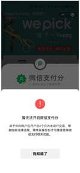

# 1.无人店小程序产品流程

## 1.1 流程图

即时地址：https://js.design/f/JZrPbl?p=57aTbdvBMf&mode=design&linkelement=-c20EWtkn-NQVvKkWHxQX

# 2.小程序页面功能介绍

## 1.注册页

界面：

**页面功能描述：**

1.扫描小程序二维码，直接进入授权页面并弹出地理位置的授权

2.勾选同意用户协议，再点击授权手机号，弹出手机号弹框进行授权，授权后进入首页

3.勾选同意用户协议，点击暂不登陆，也进入首页

4.点击用户协议和隐私政策，跳转至详情页面

## 2.首页

界面：

**1.** **店铺：显示店铺名称**

点击导航按钮，可以跳转到地图页面，点击地图跳转到第三方导航 app；如果没有授权位置信息需先弹框授权

**接口：获取店铺列表及店铺信息，店铺信息包括：店铺的位置（经纬度）、开店和关店时间、店铺名称等**

**2.** **扫一扫：**（暂未开发）

点击扫一扫，打开手机摄像头进入扫描界面

例如：扫码领取优惠券、查找商品等

**3.** **轮播图**

广告轮播图播放（不能点击）

**4.** **店铺营业时间**

显示店铺营业时间

**5.** **我的入店码**

新用户，点击我的入店码先进行登录授权。授权后继续弹出微信支付分的授权。若同意，授权后显示进店二维码的弹框。

**6.** **进店指南**

点击进入进店指南页面

**7.** **最新活动**

显示最新活动的图片（不能点击）；

**8.** **人气商品**

显示购买前 10 的商品

## 3.商品

界面（搜索）

页面功能说明

**1.** **商品分类**

显示所有大分类，点击大分类显示对应的分类图和商品

**2.** **商品信息**

显示商品图片、名称、价格、规格、标签以及所在货架位置

点击位置图标，弹窗显示货架示意图片

## 4.扫码

界面：

1.未登录时，点击底部的二维码图标，弹出授权登录的弹框进行授权登录

2.已获取用户手机号，未开启微信支付分，点击底部的二维码图标，弹框里显示开通微信支付分的按钮，授权后显示进店二维码；若微信支付信用分没有或不够弹框提示，不会生成进店二维码

3.获取用户手机号和开通微信支付分成功后，点击底部的二维码图标，直接弹框显示进店二维码

4.二维码图片有时间限制，每次点击二维码图标都会生成不同的码，失效的二维无法入店。

## 5.订单

### 5.1 订单列表

界面

页面功能说明

1. 订单列表：显示全部、已支付、待支付订单
2. 已支付订单
    状态显示已完成
    显示评价和查看详情按钮
3. 待支付订单
    状态显示待支付
    显示重新支付和查看详情按钮

### 5.2 订单详情

界面

页面功能说明

1. 显示订单信息：订单编号、订单创建时间、近点时间、店铺名称、状态以及订单里的商品
2. 显示评价按钮：点击评价可以对订单进行评价
3. 显示客服联系图标，点击后弹框显示联系电话

### 5.3 评价页面

界面

页面功能说明

1. 选择星级和反馈类型（订单多算、订单少算、结算正确），输入反馈内容，点击提交

## 7.我的

界面

页面功能说明

**1.个人信息**

未登录时：显示未登录，点击可授权登录

登陆后：显示用户头像、名称和手机号

扫一扫：点击扫一扫，打开手机摄像头进入扫描界面（暂未开发）
例如：扫码领取优惠券

**2.微信免密支付**

未登录时，点击微信免密支付先弹出授权登录的弹框

已登录未开通，点击微信免密支付，弹出微信支付分开通的弹框，授权后显示已开通

**3.人脸认证注册**

未登录时，点击人脸注册先授权登录

登陆后，点击人脸认证注册，进入人脸注册页

点击开始检测，弹出拍摄/从相册选择得弹框，然后进行人脸上传

**4.意见反馈**

未登录时，点击意见反馈先授权登录

登陆后，填写反馈信息也可以上传图片（图片最多 6 张），提交

