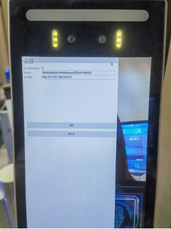
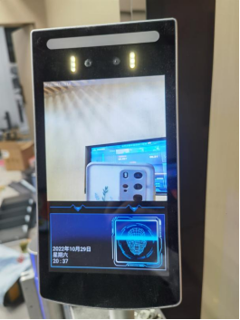
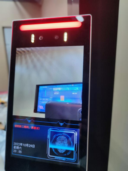

# 1. 安装和测试闸门

## 1.1 安装闸门
1. 安装sensing-gate.apk ，可以放在U盘里插入机器上安装，或者通过命令安装：adb install -r .\sensing-gate.apk

2. 进入闸门软件后，点击左下角进入配置界面

   配置内容：

   设备密钥 Subkey：38d4c6a6691b46dbacee5f5dc4188952

   Hub地址：：http://192.168.1.7:8080  (具体根据项目由开发提供)

   

3. 点击保存
4. 页面显示
    

   如果hub未填写，页面右下角会显示红色字体：hub未连接)
5. 开机若需要自启动，需要在机器里设置
   
# 2.闸门测试
1. 扫描正确的二维码

   提示：XXX，欢迎惠顾!

     

2. 扫描失效的二维码

   提示：请刷新二维码，再重试！

   

3. 出门提示：有会员，成功出店！
   
   进出门会有对应的事件发送

 # 3. 异常情况

   情况1：若出现连接事件线后门自动打开，可能是后台进程开的太多

   解决方案：需要关掉后台所有进程，再重新打开软件