## StoreHub 部署文档

### 1. 基础准备

| 系统要求 |                                |
| -------- | ------------------------------ |
| 操作系统 | centos7 以上（推荐 7.9）       |
| 运行环境 | docker                         |
| 依赖环境 | rabbitmq（mqtt）、mysql:8.0.20 |

#### 1.1 连接服务器

1.下载 Xshell 软件 ，地址：https://www.xshell.com/zh/xshell/

2.打开 Xshell 软件，点击新建会话，输入 ip、用户名和密码，连接服务器

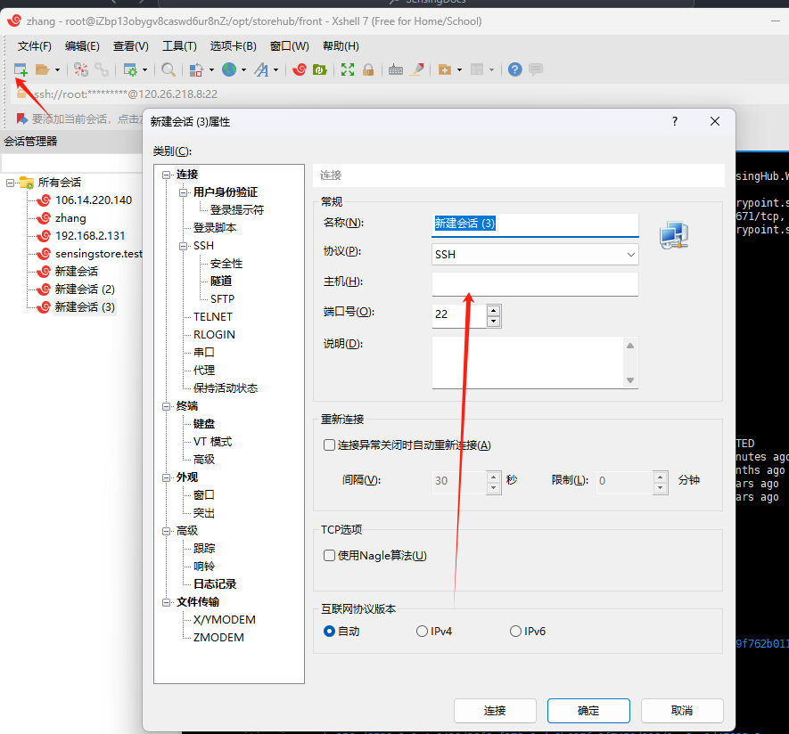

#### 1.2 安装 docker 环境

```shell
# 如果没有docker环境先安装
# 进入opt目录
cd /opt
# 查看
ls
# 安装docker
wget https://mirrors.aliyun.com/docker-ce/linux/centos/docker-ce.repo -O /etc/yum.repos.d/docker-ce.repo

# 如果没有wget命令 则yum install wget安装
# 安装docker环境 这样安装都是最新的版本
yum -y install docker-ce
# 启动docker 开机自启
systemctl enable --now docker
# 查看是否运行
systemctl status docker
```

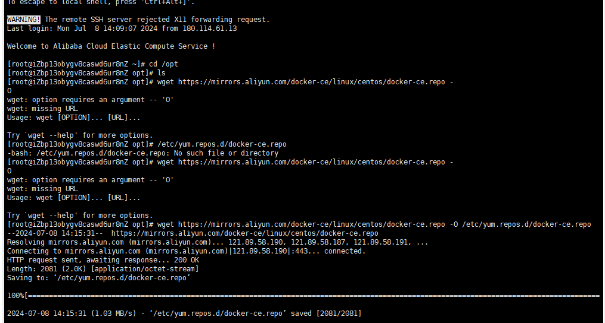

### 2. 部署 mysql

#### 2.1 配置运行 mysql

```shell
# 拉取mysql镜像
docker pull mysql:8.0.20
# 运行容器
docker run -p 3307:3306 --name mysql -e MYSQL_ROOT_PASSWORD=123456 -d mysql:8.0.20
# 查看是否运行成功
docker ps
```

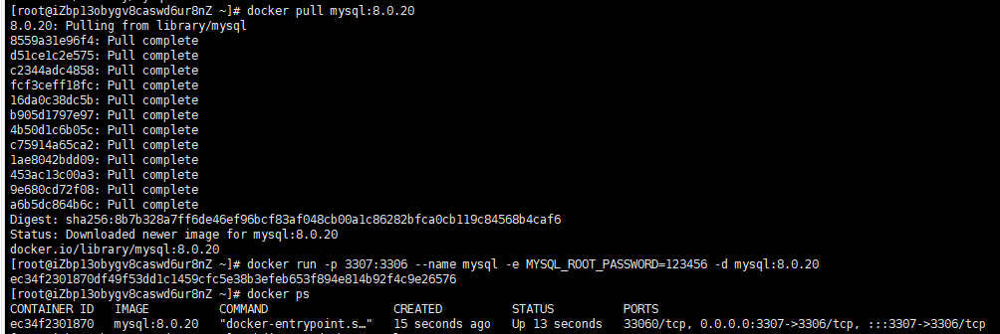

```shell
# 创建持久化挂载目录
mkdir -p /docker/mysql/
docker cp  mysql:/etc/mysql /docker/mysql/
```

```shell
# 删除容器重新配置
docker stop mysql
docker rm -f mysql

# 配置mysql
cd /docker/mysql/mysql/conf.d
vim my.cnf


# 复制黏贴下面内容并保存退出

流程：
# 按I进入编辑模式
# 粘贴下方内容
# 按Esc退出编辑模式
# 输入:wq
[mysqld]
user=mysql
character-set-server=utf8
default_authentication_plugin=mysql_native_password
secure_file_priv=/var/lib/mysql
expire_logs_days=7
sql_mode=STRICT_TRANS_TABLES,NO_ZERO_IN_DATE,NO_ZERO_DATE,ERROR_FOR_DIVISION_BY_ZERO,NO_ENGINE_SUBSTITUTION
max_connections=1000

[client]
default-character-set=utf8

[mysql]
```

```shell
#运行mysql，将下方的内容复制到xshell里，按回车

docker run \
-p 3306:3306 \
--name mysql \
--restart always \
-v /docker/mysql/mysql:/etc/mysql \
-v /docker/mysql/logs:/logs \
-v /docker/mysql/data:/var/lib/mysql \
-v /etc/localtime:/etc/localtime \
-e MYSQL_ROOT_PASSWORD=123456 \
-d mysql:8.0.20
```

#### 2.2 创建数据库

```shell
# 进入到数据库容器内
docker ps
```

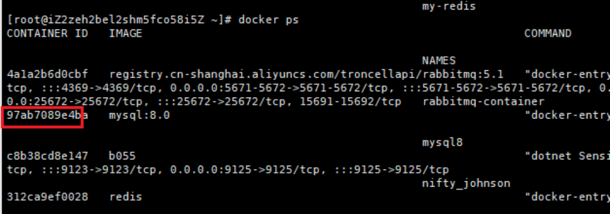

```shell
# 以上面图片为例找到自己mysql运行的容器id 97ab需要替换成自己的
docker exec -it 97ab /bin/bash
```

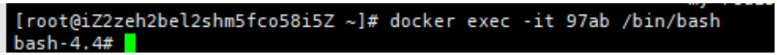

```shell
# 进来后执行
mysql -u root -p
```

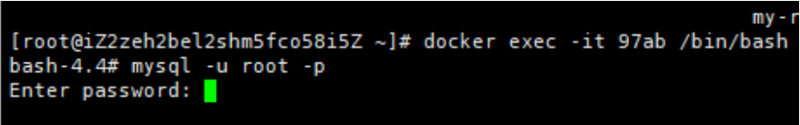

```shell
# 输入123456
```

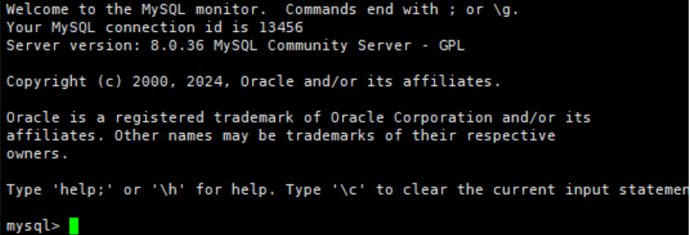

```shell
#执行并退出  下面创建的数据库名称记住
create database sensinghub;
# 退sql
exit;
# 退容器
exit;
```

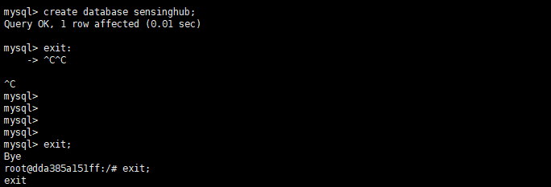

### 3. 部署 rabbitmq

```shell
# 登陆到公司的阿里云,需要输入账号密码
docker login --username=qule@1120777826858507 registry.cn-shanghai.aliyuncs.com
# 运行rabbitmq

docker run -d   --name rabbitmq-container   -p 1883:1883   -p 8883:8883   -p 5672:5672   -p 4369:4369   -p 5671:5671   -p 15672:15672   -p 25672:25672   -e RABBITMQ_DEFAULT_USER="troncell"   -e RABBITMQ_DEFAULT_PASS="1qazTronCell@WSX"   -v /etc/localtime:/etc/localtime:ro   registry.cn-shanghai.aliyuncs.com/troncellapi/rabbitmq:5.1
```

备注：镜像拉完，退出登录，输入 docker logout

### 4.部署 storehub

1.问开发要 publish 文件 将文件拷贝到/opt/storehub/backend/publish 目录下

2.安装 filezilla 软件

3.输入服务器 IP、密码连接服务器

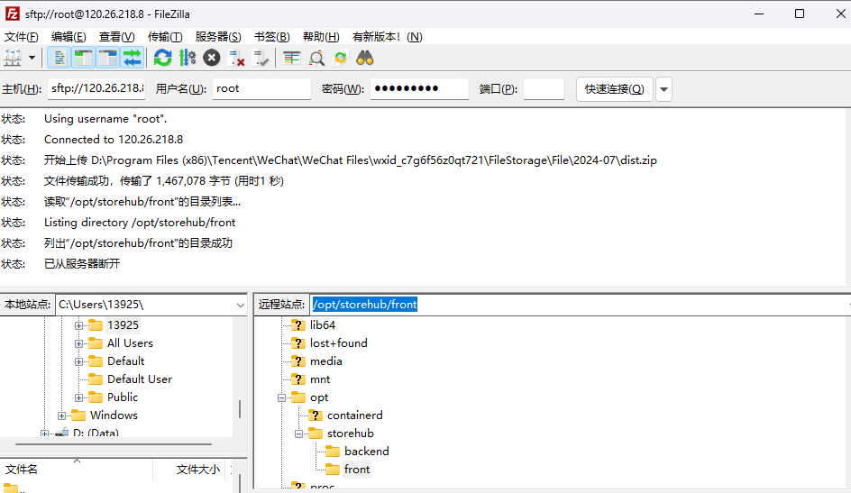

4.将 publish.zip 包拷贝到/opt/storehub/backend/目录下

5. xshell 进入对应目录下： cd /opt/storehub/backend
6. 输入：ls，查看 zip 文件
7. 安装解压：yum install unzip
8. 解压 zip 包：unzip publish.zip（tab 补全）

```shell

# 先拉取storehub的镜像
docker pull registry.cn-shanghai.aliyuncs.com/troncellapi/sensinghub:v3
# 运行
docker run -d --restart always -p 8080:8080 -p 9123:9123 -v /opt/storehub/backend/publish:/app -u $(id -u):$(id -g) -e TZ=Asia/Shanghai registry.cn-shanghai.aliyuncs.com/troncellapi/sensinghub:v3
# 修改配置文件
cd /opt/storehub/backend/publish/
vim appsettings.json
# 修改下面框起来的配置，按i进入编辑模式
# 第一个换成自己上面部署的mysql的数据库信息
server改为服务器ip，pwd：修改为123456，database修改为sensinghub
# 第二个框起来的换成上面部署的rabbitmq的账号和密码（一般不修改），hostman修改成服务器ip
# 退出并保存：按ecs 输入:mq
# 重启storehub容器
docker restart 97a
# 浏览器打开swagger地址：http://IP:8080/swagger/index.html
```

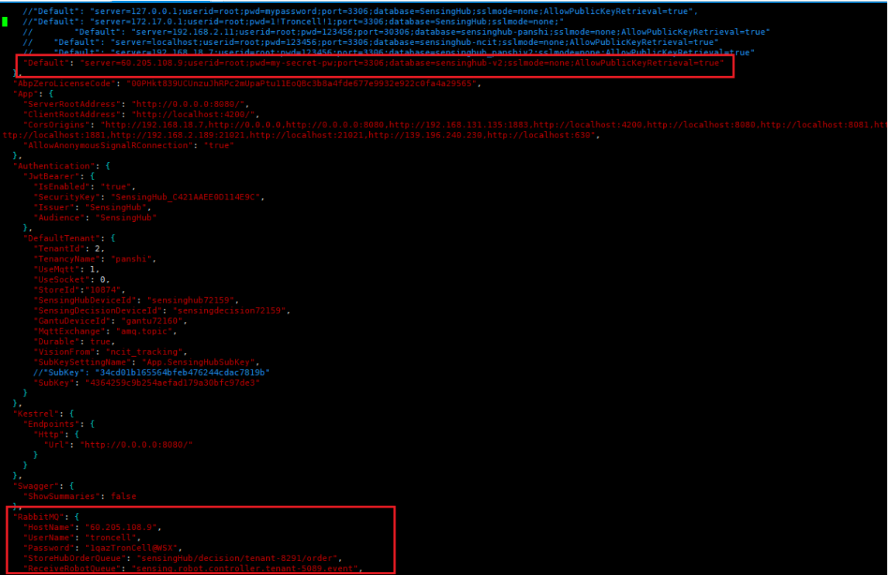

### 5. 部署 storehub 前端应用

问开发要 dist 文件，在 vite.config.ts 文件里修改 ip 地址

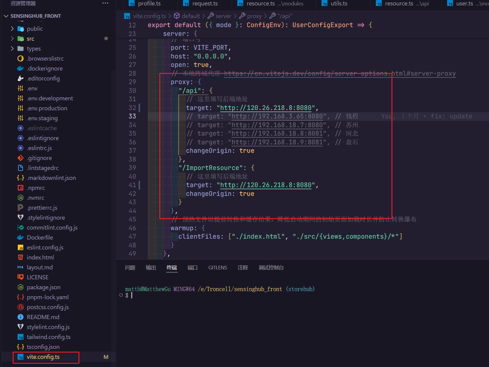

```shell
#
# 通过filezilla软件将dist.zip文件拷贝到/opt/storehub/front/
# 进入对应目录下，解压zip作文件
# 准备Dockerfile文件
vim Dockerfile
# 输入i进入编辑模式，复制黏贴下面内容 并退出保存（按ECS,:wq）
FROM nginx:1.21
COPY ./dist /usr/share/nginx/html/
COPY ./config/default.conf /etc/nginx/conf.d/default.conf
EXPOSE 80
CMD ["nginx", "-g", "daemon off;"]

# 准备nginx的配置文件
cd /opt/storehub/front/
mkdir config
cd config
vim default.conf
# 复制黏贴下面内容,输入i进入编辑模式,修改后并退出保存（按ECS,:wq）
# 注意下面http://192.168.1.7:8080 换成自己服务器的ip 退出并保存
server {
    listen       80;
    listen  [::]:80;
    server_name  localhost;

    location / {
        root   /usr/share/nginx/html;
        index  index.html index.htm;

        # CORS headers are sent along with requests to the root
        add_header 'Access-Control-Allow-Origin' '*' always;
        add_header 'Access-Control-Allow-Methods' 'GET, POST, OPTIONS, PUT, DELETE, PATCH' always;
        add_header 'Access-Control-Allow-Headers' 'DNT,User-Agent,X-Requested-With,If-Modified-Since,Cache-Control,Content-Type,Range,Authorization' always;
    }

    location /api {
        # Proxy settings
        proxy_pass http://192.168.1.7:8080/api;
        proxy_http_version 1.1;
        proxy_set_header Upgrade $http_upgrade;
        proxy_set_header Connection 'upgrade';
        proxy_set_header Host $host;
        proxy_cache_bypass $http_upgrade;

        # CORS headers are sent along with requests to /api
        add_header 'Access-Control-Allow-Origin' '*' always;
        add_header 'Access-Control-Allow-Methods' 'GET, POST, OPTIONS, PUT, DELETE, PATCH' always;
        add_header 'Access-Control-Allow-Headers' 'DNT,User-Agent,X-Requested-With,If-Modified-Since,Cache-Control,Content-Type,Range,Authorization' always;

        # Handle OPTIONS requests for /api
        if ($request_method = 'OPTIONS') {
            add_header 'Access-Control-Allow-Origin' '*' always;
            add_header 'Access-Control-Allow-Methods' 'GET, POST, OPTIONS, PUT, DELETE, PATCH' always;
            add_header 'Access-Control-Allow-Headers' 'DNT,User-Agent,X-Requested-With,If-Modified-Since,Cache-Control,Content-Type,Range,Authorization' always;
            add_header 'Access-Control-Max-Age' 1728000;
            add_header 'Content-Type' 'text/plain charset=UTF-8';
            add_header 'Content-Length' 0;
            return 204;
        }
    }

    # More locations can be added here

    # Error pages
    error_page  500 502 503 504  /50x.html;
    location = /50x.html {
        root   /usr/share/nginx/html;
    }
}

```

```shell

cd ..
# 构建前端镜像
docker build -t storehub:1.0 .

# 运行前端应用
docker run -d --restart always -v /opt/storehub/front/dist:/usr/share/nginx/html -p 80:80 storehub:1.0
```

# 6.部署后先要创建租户

id：是云平台的租户 id

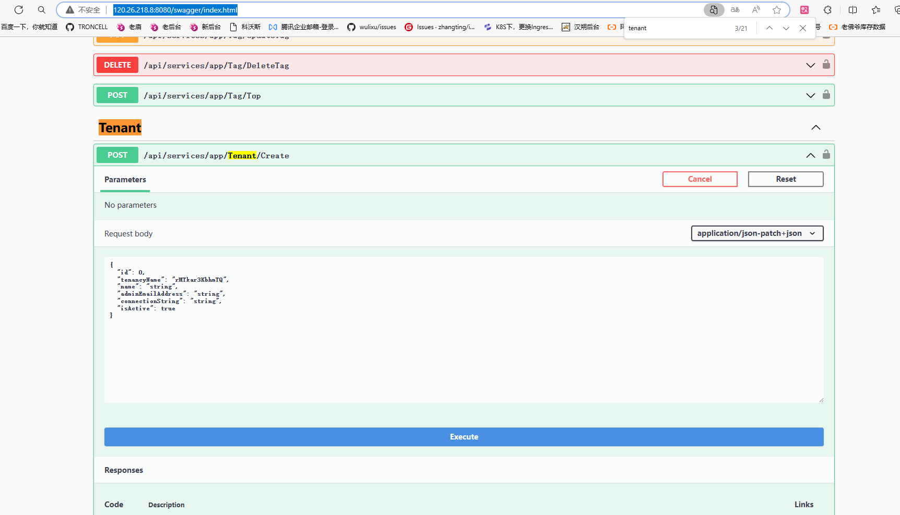

# 7.在浏览器输入 ip 地址，进入前端页面

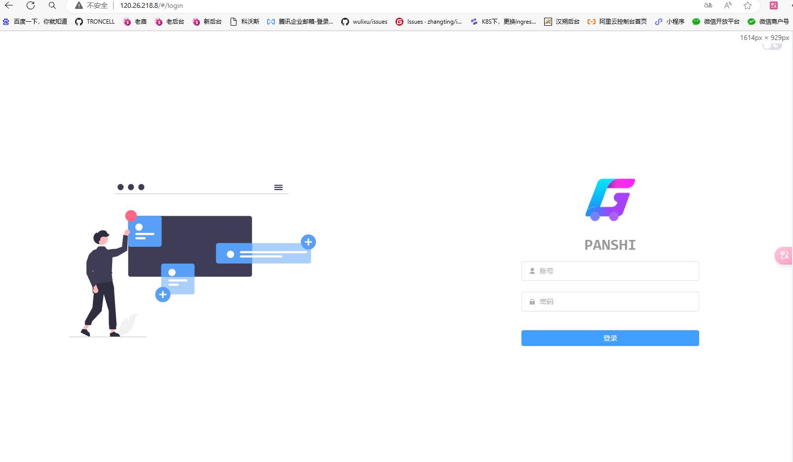
