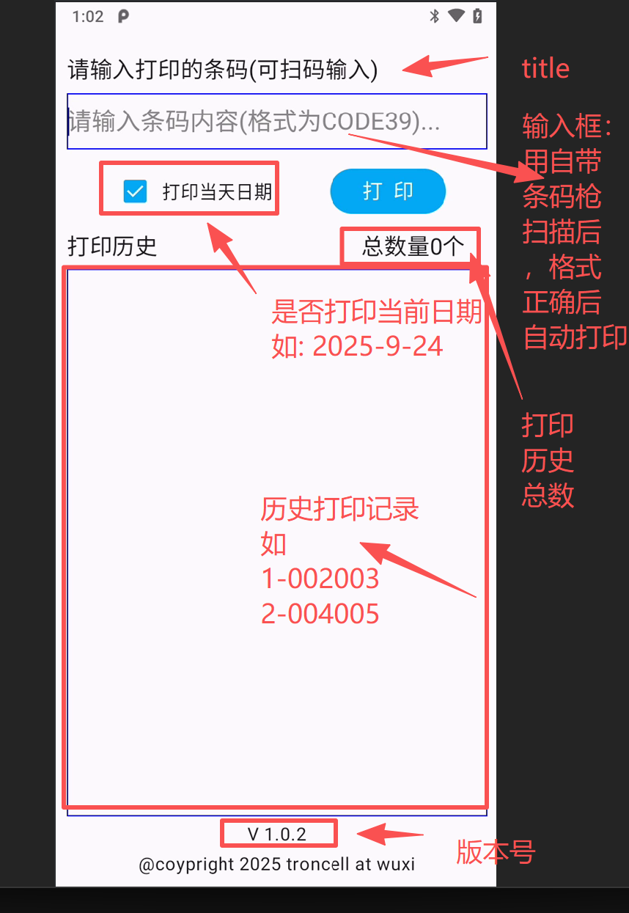

自带出纸的扫码枪 APK

## 1.设备：

## 2.功能描述：

1.人工输入打印模式

在请输入打印条码的输入框里，人工输入打印内容，点击打印后设备自动打印

1. 通过扫描进行打印

人工按住设备右侧的扫描按钮（电源键下方的红色按钮），扫描条形码格式正确后，设备自动打印

打印内容格式：Android 系统 9.0 不支持小写字母,如果有小写字母，会提示参数错误

3.打印当天日期

（1）不勾选打印当天日期，打印时直接打印扫描的条码

（2）勾选打印当天日期，打印时自动当天日期进行打印。

1. 打印历史

显示打印的历史记录，按倒序排列，最新打印的显示在最上方（设备重启后会清空）

1. 总数量

统计打印的数量

1. 版本号显示

V1.0.1 显示当前 APK 的版本号

## 3.版本

因为扫码枪硬件升级，目前设备的 Android 系统有两个：Android8.1.0 和 Android9

Android8.1.0 对应的版本是：V1.0.1

Android9 对应的版本是：V1.0.2

 

软件 NAS 备份地址：\\\\192.168.3.8\\实施交付\\2025 年项目交付备份\\2025.9.24 防错扫码枪
