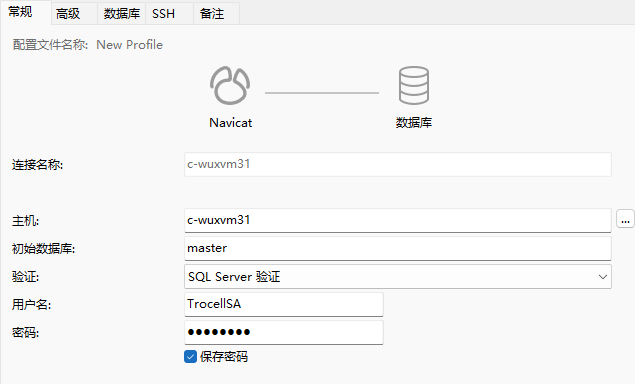

# 1.项目介绍

## 1.1.江森对中

简介：非接触式激光对中设备，对中设备为瑞典产品，测距设备为日本产品，均为行业头部，精准稳定厂家出品蓝牙连接精度高可精确到 0.01mm 专用工业 PAD（防摔）便携性高，方便操作 使用原生平台开发，使用 wifi 传输字段信息而非传图有后台系统可以记录测量值，测量时间，操作人 ID，方便回溯，保留接口对接能力，可对接公司 MES 等系统，可延展性高。

## 1.2.江森回氟

简介：通过引入江森自控的回氟智空系统，实现冷媒的高效回收和再利用，减少环境污染，提高制冷系统的运行效率。同时，通过智能化管理手段，提高操作便捷性和系统稳定性，为用户提供更优质的服务和解决方案。

## 1.3.江森铭牌

简介：全自动金属铭牌柔性打印系统(可兼容手动):，最深刻度为 0.1mm，铭牌尺寸 1.支持激光打印，种类多大几十种。支持纸质打印，纸质打印机设备由客户提供 。柔性自动上下料机构。铭牌内容信息来源多样，MES 系统，设计图纸等，需要自动获取信息，特殊情况可人工干预。铭牌控制系统，把获取的铭牌信息，根据型号，可控制机械部分进行打印，同时提供友好的人工操作界面。

## 1.4.江森小车

简介：更智能化的检测手段，自动读取等技术，引入辅助 PDA 设备， 可移动式办公(后续拓展)。兼容多种电气测试仪，检测的过程可记录，可追溯。测试的项目同步于 MES，必要的数据回传到 MES 系统

# 2.江森内网服务器

| 服务器            | 连接方式         | 地址         | 账户              | 密码                            |
| ----------------- | ---------------- | ------------ | ----------------- | ------------------------------- |
| 后台服务          | Windows 远程桌面 | 10.111.32.23 | M5398962\troncell | Bairiyishanjinhuangheruhailiu1# |
| 数据库 SQL Server | Navicate         | c-wuxvm31    | TrocellSA         | TrocellSA@2025                  |

