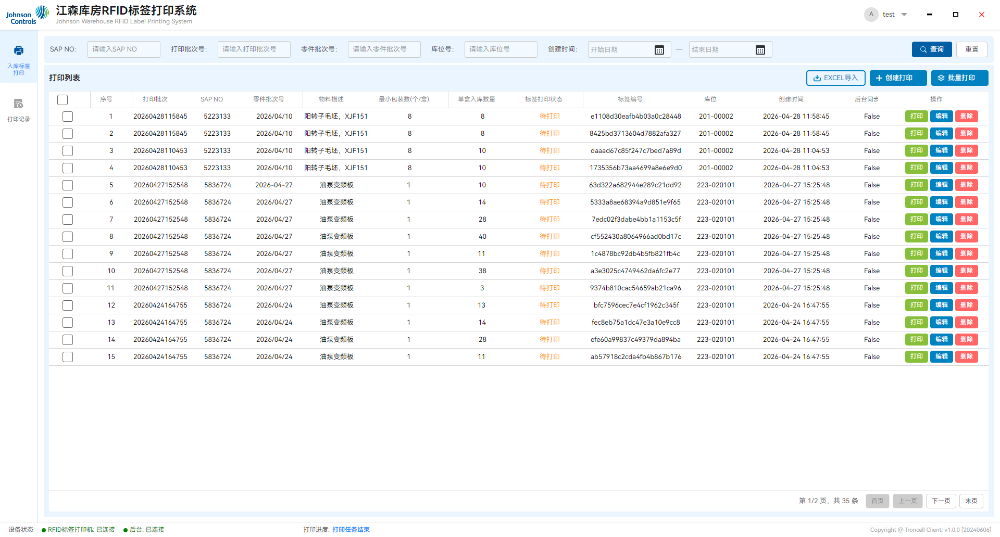
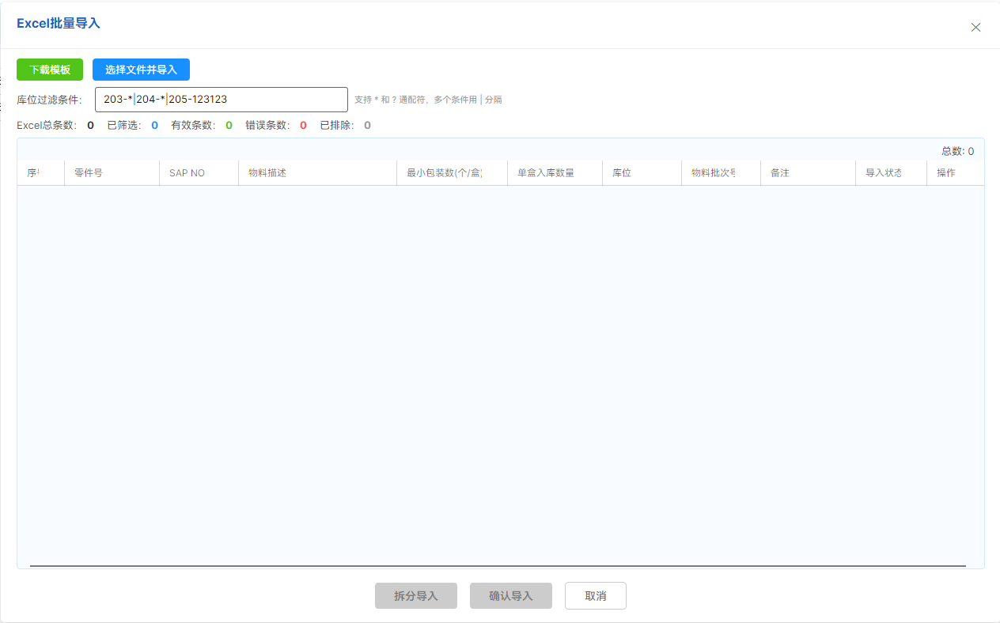
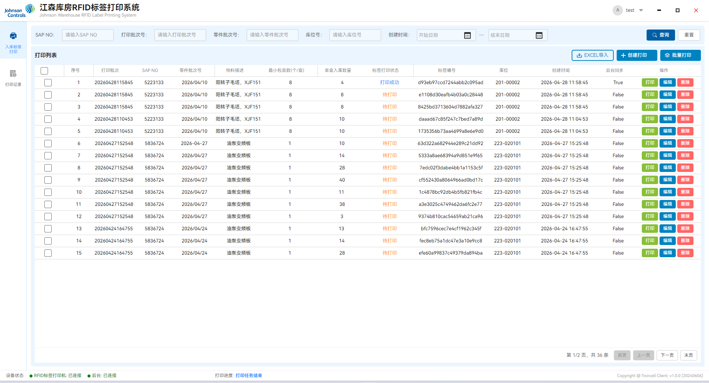
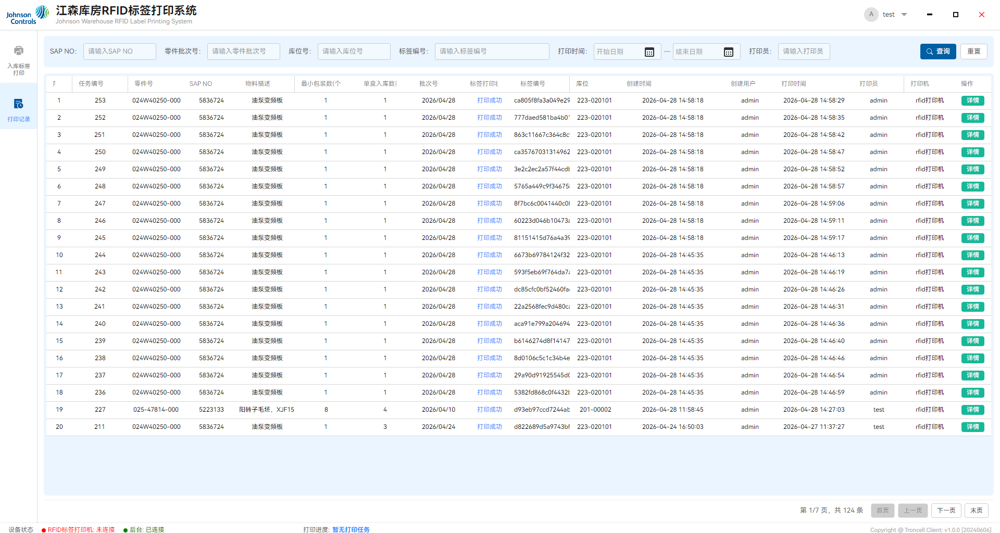

# 江森库房RFID标签打印系统 - 用户手册

**版本**: v1.0.0
**日期**: 2024年6月6日
**适用对象**: 江森库房操作人员

---

## 1. 系统概述

江森库房RFID标签打印系统是一款用于仓库入库管理的桌面应用程序，主要功能包括：

- **入库标签打印**: 创建、编辑、打印RFID入库标签
- **批量打印**: 支持批量选择和连续打印多个标签
- **Excel导入**: 支持通过Excel批量导入打印任务
- **打印记录查询**: 查看历史打印记录和详细信息
- **后台同步**: 打印数据自动同步到后台管理系统

### 1.1 系统特点

- 支持AUTOID LP735 RFID打印机
- 自动识别打印机设备
- 实时显示设备状态和打印进度
- 支持多条件组合查询

---

## 2. 系统要求与安装

### 2.1 硬件要求

| 项目     | 要求                     |
| -------- | ------------------------ |
| 操作系统 | Windows 10/11 (64位)     |
| 处理器   | Intel Core i3 或同等性能 |
| 内存     | 4GB 及以上               |
| 硬盘空间 | 500MB 可用空间           |
| 显示器   | 分辨率1280x768及以上     |
| 打印机   | AUTOID LP735 RFID打印机  |

### 2.2 软件要求

- **.NET 10 运行时**（如使用框架依赖版本）
- 安装打印机驱动程序

### 2.3 安装步骤

1. **获取安装包**
   - 从供应商创思处获取软件安装包
   - 解压到本地目录（如 `D:\江森RFID标签打印\`）

2. **检查配置文件**
   - 确保以下配置文件存在于程序目录：
     - `appsettings.json` - 系统配置
     - `MachineConfigs-001.xml` - 设备配置
     - `rfid-printer.xml` - 打印机配置
     - `Print/Templates/Template-70-30.dlt` - 标签模板

3. **连接打印机**
   - 使用USB线缆连接打印机
   - 确认打印机电源已开启
   - 等待系统自动识别设备

4. **启动程序**
   - 双击 `RfidTagPrinting.App.exe` 运行程序
   - 首次启动可能需要等待几秒钟

---

## 3. 登录系统

### 3.1 登录界面

启动程序后显示登录窗口：


### 3.2 登录步骤

1. **输入工号**: 在"请输入工号"输入框中输入您的员工编号
2. **输入密码**: 在"请输入您的密码"输入框中输入密码
3. **点击登录**: 点击蓝色的【登录】按钮
4. **等待验证**: 系统验证账号信息，成功后进入主界面

### 3.3 登录失败处理

- **账号错误**: 请确认工号是否正确
- **密码错误**: 请重新输入密码，注意大小写
- **网络错误**: 检查网络连接是否正常

---

## 4. 主界面介绍

### 4.1 界面布局


主界面分为以下几个区域：

#### 顶部标题栏

- 显示系统名称：江森库房RFID标签打印系统
- 显示当前登录用户信息
- 窗口控制按钮（最小化、最大化/还原、关闭）

#### 左侧导航栏

| 按钮         | 功能说明             |
| ------------ | -------------------- |
| 入库标签打印 | 进入标签打印管理页面 |
| 打印记录     | 查看历史打印记录     |

#### 右侧内容区

- 显示当前选中功能的具体内容
- 支持页面切换动画效果

#### 底部状态栏

| 状态项         | 说明                                         |
| -------------- | -------------------------------------------- |
| RFID标签打印机 | 显示打印机连接状态（绿色=正常，红色=异常）   |
| 后台           | 显示后台服务连接状态（绿色=正常，红色=异常） |
| 打印进度       | 显示当前打印任务进度                         |

### 4.2 退出登录

1. 点击右上角用户名旁的 ▼ 下拉箭头
2. 选择【退出登录】
3. 确认后返回登录界面

---

## 5. 入库标签打印

### 5.1 页面概述

入库标签打印是系统的主要功能页面，包含：

- 查询条件区
- 数据列表区
- 操作按钮区
- 分页控制区

  

### 5.2 查询功能

#### 查询条件

| 条件项     | 说明             | 示例                    |
| ---------- | ---------------- | ----------------------- |
| SAP NO     | SAP物料编号      | 5223133                 |
| 打印批次号 | 标签打印批次编号 | 20260428115845          |
| 零件批次号 | 零件生产批次号   | 2026-01-02              |
| 库位号     | 仓库库位编号     | 223-020101              |
| 创建时间   | 任务创建日期范围 | 2024/01/01 - 2024/12/31 |

#### 查询操作

1. **输入条件**: 在相应输入框中填写查询条件
2. **点击查询**: 点击【查询】按钮执行搜索
3. **重置条件**: 点击【重置】按钮清空所有条件，重新点查询按钮，查询全部

### 5.3 数据列表

列表显示以下信息列：

| 列名         | 说明                     |
| ------------ | ------------------------ |
| 选择框       | 勾选进行批量打印         |
| 序号         | 当前页数据序号           |
| 打印批次     | 打印任务批次号           |
| SAP NO       | SAP物料编号              |
| 零件批次号   | 零件生产批次号           |
| 物料描述     | 物料名称描述             |
| 最小包装数   | 每盒标准包装数量         |
| 单盒入库数量 | 实际入库数量             |
| 标签打印状态 | 待打印/打印成功/打印失败 |
| 标签编号     | RFID标签唯一编号         |
| 库位         | 目标存放库位             |
| 创建时间     | 任务创建时间             |
| 后台同步     | 是否已同步到后台         |
| 操作         | 打印/编辑/删除按钮       |

### 5.4 功能操作

#### 5.4.1 Excel批量导入

Excel导入功能支持从Excel文件批量导入打印任务，提供**库位过滤**和**两种导入模式**（直接导入/拆分导入）。

##### 操作步骤

1. 点击【EXCEL导入】按钮，打开导入对话框

   

2. 点击【下载模板】获取标准导入模板
3. 按模板格式填写数据并保存，必填项已标红。
4. 点击【选择文件并导入】，选择填写好的Excel文件
5. 系统自动解析并显示预览数据，后台没有对应物料和库位的无法导入。
6. 确认无误后，选择导入方式：
   - 【确认导入】- 直接按Excel数据导入
   - 【拆分导入】- 按最小包装数自动拆分后导入

7. 导入成功后返回主界面查看新数据

##### 界面说明

导入对话框分为以下区域：

**操作栏**

| 按钮           | 功能                  |
| -------------- | --------------------- |
| 下载模板       | 下载标准Excel导入模板 |
| 选择文件并导入 | 选择Excel文件并解析   |

**库位过滤条件**

- 支持按库位编码过滤导入数据
- 支持通配符：`*`（匹配任意多个字符）、`?`（匹配单个字符）
- 支持多条件：使用 `|` 分隔多个过滤条件
- 示例：`203-*|204-*|205-123123` 表示导入库位以"203-"或"204-"开头，或等于"205-123123"的数据

**统计摘要**

| 指标        | 说明                           |
| ----------- | ------------------------------ |
| Excel总条数 | Excel文件中的原始数据条数      |
| 已筛选      | 符合库位过滤条件的数据条数     |
| 有效条数    | 数据验证通过的有效记录数       |
| 错误条数    | 数据验证失败的错误记录数       |
| 已排除      | 不符合库位过滤条件的排除记录数 |

**数据预览表**
显示解析后的数据，包含以下列：

- 序号、零件号、SAP NO、物料描述
- 最小包装数(个/盒)、单盒入库数量
- 库位、物料批次号、备注
- 导入状态（成功/失败及原因）
- 操作（删除单条记录）

**底部按钮**

| 按钮     | 功能                   | 说明                           |
| -------- | ---------------------- | ------------------------------ |
| 拆分导入 | 按最小包装数拆分后导入 | 适用于需要按标准包装拆分的场景 |
| 确认导入 | 直接按原始数据导入     | 适用于直接打印的场景           |
| 取消     | 关闭导入对话框         | 不保存任何数据                 |

##### Excel模板格式

**必需列**（红色星号标记）：

| 列名     | 说明         | 数据要求                       |
| -------- | ------------ | ------------------------------ |
| SAP NO   | SAP物料编号  | 必填，必须与系统物料主数据一致 |
| 送货数量 | 实际入库数量 | 必填，数字格式                 |
| 库位编码 | 目标库位编号 | 必填，必须与系统库位数据一致   |
| 批次号   | 零件批次号   | 必填，日期格式                 |


**非必填列**：

| 列名     | 说明                             |
| -------- | -------------------------------- |
| PN       | 零件号（系统自动根据SAP NO填充） |
| 物料描述 | 物料名称（系统自动根据SAP NO填充 |
| 备注     | 备注信息                         |

##### 两种导入模式

**模式一：确认导入（直接导入）**

按Excel中的原始数据直接导入，不做任何拆分处理。

适用场景：

- Excel中的数量已经是实际需要打印的数量
- 不需要按标准包装拆分

**模式二：拆分导入**

系统自动按以下条件分组并拆分：

- 分组条件：供应商代码 + SAP NO + 库位 + 批次号
- 拆分规则：按【最小包装数】自动拆分

拆分示例：

```
原始数据：SAP NO=10001, 送货数量=550, 最小包装数=200
拆分结果：
  - 第1条：数量 200（整包）
  - 第2条：数量 200（整包）
  - 第3条：数量 150（零头）
```

适用场景：

- 送货数量较大，需要按标准包装拆分打印
- 每个包装箱需要独立标签

> **注意**: 拆分导入要求【最小包装数】必须大于0，否则无法拆分

##### 数据验证规则

导入时系统自动验证以下规则：

| 验证项   | 验证内容                       | 错误提示                       |
| -------- | ------------------------------ | ------------------------------ |
| SAP NO   | 是否为空，是否存在于物料主数据 | "SAP NO为空" / "XXX物料不存在" |
| 送货数量 | 是否为有效数字                 | "送货数量无效"                 |
| 库位编码 | 是否存在于库位主数据           | "XXX库位不存在"                |
| 批次号   | 为空时自动填充当前日期         | 自动处理                       |

##### 错误处理

- **错误记录**：验证失败的记录会标记为错误状态，显示具体错误原因
- **单条删除**：可在操作列点击【删除】移除错误记录
- **批量处理**：建议在Excel中修正错误后重新导入

> **提示**: 只有【有效条数】大于0时，【确认导入】和【拆分导入】按钮才可用

#### 5.4.2 创建打印任务

1. 点击【创建打印】按钮
2. 在弹出的对话框中填写：
   - **SAP NO\***（必填）: 输入或选择SAP物料编号
   - **单盒入库数量\***（必填）: 输入实际入库数量
   - **库位\***（必填）: 选择目标库位
   - **零件批次号**: 选择零件批次日期。默认当天
   - **备注**: 填写备注信息（可选）
3. 选择SAP NO后，系统自动填充：
   - 零件号
   - 最小包装数
   - 物料描述
4. 点击【确定】保存任务

#### 5.4.3 单条打印

1. 在操作列点击【打印】按钮
2. 系统自动连接打印机并打印标签
3. 打印完成后更新状态为"打印成功"
4. 标签编号自动写入RFID芯片5. 点击查询按钮更新打印状态到后台，打印成功的任务在打印列表消失，在打印记录显示。

   

#### 5.4.4 批量打印

1. 在列表左侧勾选需要打印的记录
2. 点击【批量打印】按钮
3. 系统自动按顺序打印选中标签
4. 底部状态栏显示打印进度
5. 点击【结束打印】可中断批量打印

> **注意**: 批量打印过程中无法进行其他操作

#### 5.4.5 编辑任务

1. 在操作列点击【编辑】按钮
2. 修改需要更新的字段
3. 点击【确定】保存修改

> **限制**: 已打印的任务不能编辑SAP NO

#### 5.4.6 删除任务

1. 在操作列点击【删除】按钮
2. 确认删除操作
3. 任务从列表中移除

### 5.5 分页功能

| 按钮   | 功能           |
| ------ | -------------- |
| 首页   | 跳转到第一页   |
| 上一页 | 向前翻一页     |
| 下一页 | 向后翻一页     |
| 末页   | 跳转到最后一页 |

页面信息显示格式：`显示第 1-10 条，共 100 条`

---

## 6. 打印记录查询

### 6.1 页面概述

打印记录页面用于查询历史打印任务，包含更详细的打印信息。



### 6.2 查询条件

| 条件项     | 说明               |
| ---------- | ------------------ |
| SAP NO     | SAP物料编号        |
| 零件批次号 | 零件生产批次号     |
| 库位号     | 仓库库位编号       |
| 标签编号   | RFID标签编号       |
| 打印时间   | 实际打印的日期范围 |
| 打印员     | 执行打印操作的用户 |

### 6.3 记录详情

列表显示字段比入库标签页面更多：

| 列名         | 说明              |
| ------------ | ----------------- |
| 任务编号     | 系统内部任务ID    |
| 零件号       | 零件编号          |
| SAP NO       | SAP物料编号       |
| 物料描述     | 物料名称          |
| 最小包装数   | 标准包装数量      |
| 单盒入库数量 | 实际入库数量      |
| 批次号       | 打印批次号        |
| 标签打印状态 | 打印成功/打印失败 |
| 标签编号     | RFID标签编号      |
| 库位         | 目标库位          |
| 创建时间     | 任务创建时间      |
| 创建用户     | 创建任务的用户    |
| 打印时间     | 实际打印时间      |
| 打印员       | 执行打印的用户    |
| 打印机       | 使用的打印机名称  |

### 6.4 查看详情

1. 在操作列点击【详情】按钮
2. 弹出窗口显示完整任务信息
3. 查看后点击关闭按钮返回

---

## 7. 常见问题与故障排除

### 7.1 登录问题

#### Q: 登录时提示"网络错误"

**解决方法**:

1. 检查电脑网络连接是否正常
2. 确认后台服务是否运行
3. 联系管理员检查服务器状态

#### Q: 忘记密码怎么办

**解决方法**: 联系系统管理员重置密码

### 7.2 打印机问题

#### Q: 状态栏显示"打印机未连接"

**可能原因及解决**:

| 现象       | 原因           | 解决方法           |
| ---------- | -------------- | ------------------ |
| 红色指示灯 | 打印机未连接   | 检查USB线缆连接    |
| 红色指示灯 | 打印机电源关闭 | 开启打印机电源     |
| 红色指示灯 | 驱动程序异常   | 重新安装打印机驱动 |

#### Q: 点击打印无反应

**解决步骤**:

1. 确认打印机状态为绿色正常
2. 检查打印机是否有纸张
3. 检查碳带是否安装正确
4. 重启程序后重试

#### Q: 打印内容不清晰

**解决方法**:

1. 检查打印头是否清洁
2. 更换新的碳带

### 7.3 数据问题

#### Q: 查询不到数据

**检查事项**:

1. 确认查询条件是否正确
2. 尝试点击【重置】后重新查询
3. 检查网络连接是否正常
4. 确认后台服务是否可用

#### Q: SAP NO无法选择

**解决方法**:

1. 确认网络连接正常
2. 等待数据加载完成
3. 联系管理员同步物料数据

### 7.4 系统问题

#### Q: 程序启动后闪退

**解决方法**:

1. 检查是否安装了.NET 10运行时
2. 确认配置文件是否完整
3. 检查RFID SDK文件是否存在
4. 联系管理员重新部署程序

#### Q: 界面显示异常

**解决方法**:

1. 调整显示器分辨率至1280x768以上
2. 调整系统显示缩放比例为100%
3. 重启程序后重试

### 7.5 操作问题

#### Q: 批量打印如何停止

**解决方法**: 点击【结束打印】按钮停止批量打印任务

#### Q: 误删了任务能否恢复

**说明**: 删除操作不可恢复，请谨慎操作。已删除任务可重新创建。

---

## 8. 注意事项

1. **打印前检查**: 每次打印前确认标签纸和碳带充足
2. **及时同步**: 确保网络畅通，数据能正常同步到后台

---

## 9. 技术支持

如有任何问题，请联系：

- **系统管理员**: [填写管理员联系方式]
- **技术支持热线**: [填写技术支持电话]
- **电子邮箱**: [填写支持邮箱]

---

**文档版本**: v1.0.0
**最后更新**: 2024年6月6日
**编制单位**: Troncell
