# SensingHub WMS 仓库管理系统用户操作手册

**文档版本** ：V1.0

**更新日期** ：2026 年 04 月 29 日

## 一、系统概述

### 1.1 系统简介

SensingHub WMS 是一款基于 RFID 技术的智能仓库管理系统，主要功能包括：

- **物料全生命周期管理**：从入库、盘点到出库的全程追踪
- **RFID 标签管理**：支持标签创建、入库
- **多维度库存查询**：支持按物料、标签等多种方式查询
- **智能盘点**：自动生成盘点单，支持差异分析
- **仓库架构管理**：多仓库、多库位的层级管理

### 1.2 系统要求

| 项目   | 要求                                |
| ------ | ----------------------------------- |
| 浏览器 | Chrome 90+ / Edge 90+ / Firefox 90+ |
| 分辨率 | 推荐 1920×1080 及以上               |

---

## 二、登录与界面介绍

### 2.1 登录系统

1. 打开浏览器，输入系统地址：`http://[服务器地址]

   此地址为项目部署时的服务器地址（有甲方IT提供）

   

2. 在登录页面输入：
   - **账号**：您的用户名
   - **密码**：您的登录密码
   - 默认管理员账号和密码：admin 123qwe

3. 点击【登录】按钮进入系统

### 2.2 通用操作说明

#### 列表页面通用功能

| 功能 | 操作说明                         |
| ---- | -------------------------------- |
| 查询 | 在搜索框输入条件，点击【查询】   |
| 重置 | 点击【重置】清空所有搜索条件     |
| 分页 | 点击页码或使用分页控件切换页面   |
| 刷新 | 点击刷新图标重新加载数据         |
| 创建 | 点击【创建】按钮打开创建弹窗     |
| 编辑 | 点击行末【编辑】按钮             |
| 删除 | 点击行末【删除】按钮，确认后删除 |
| 详情 | 点击行末【详情】按钮查看详细信息 |

## 三、仓库管理

### 3.1 库房管理

**路径**：库存管理 → 仓库→库房列表

管理仓库的基本信息。


#### 3.1.1查询

- **查询**：按房编码 / 名称筛选
- **重置**：清空条件

| 查询条件 | 类型       | 说明             |
| -------- | ---------- | ---------------- |
| 库房编码 | 文本输入框 | 输入库房编码查询 |
| 库房名称 | 文本输入框 | 输入库房名称查询 |

#### 3.1.2创建/编辑库房

字段说明

| 字段     | 说明                       |
| -------- | -------------------------- |
| 库房编码 | 必填，唯一标识             |
| 库房名称 | 必填，显示名称             |
| 库房类型 | 普通仓库/门店仓库/RFID仓库 |
| 状态     | 启用/停用/盘点中           |
| 位置     | 库房地址                   |
| 联系人   | 负责人                     |
| 联系电话 | 联系方式                   |
| 备注     | 备注信息                   |

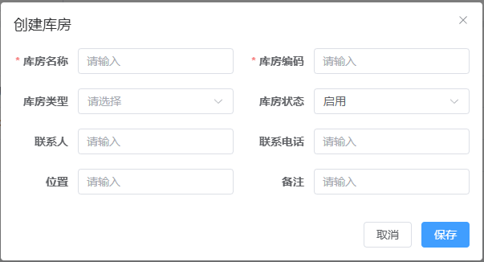

#### 3.1.3删除库房

删除库房时，请确认该库房已无物料库存。**若库房存在库存，请勿删除**

### 3.2 库区管理

**路径**：仓库管理 → 库区

管理仓库内的功能区域划分。


#### 3.2.1查询条件

- 库区名称、库区编号进行查询

#### 3.2.2创建编辑库区

默认已创建

| 属性     | 说明     |
| -------- | -------- |
| 库区名称 | 显示名称 |
| 库区编码 | 唯一标识 |
| 所属库房 | 关联库房 |
| 库区类型 | 非必填   |
| 库房状态 | 默认启用 |
| 备注     | 备注信息 |

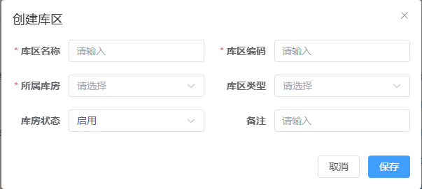

#### 3.2.3删除库区

删除库区时，请确认该库区已无物料库存。**若库区存在库存，请勿删除**

### 3.3 库位管理

**路径**：仓库管理 → 库位列表

管理具体的存储位置。

查询：可根据库区和库位名称/编码进行查询

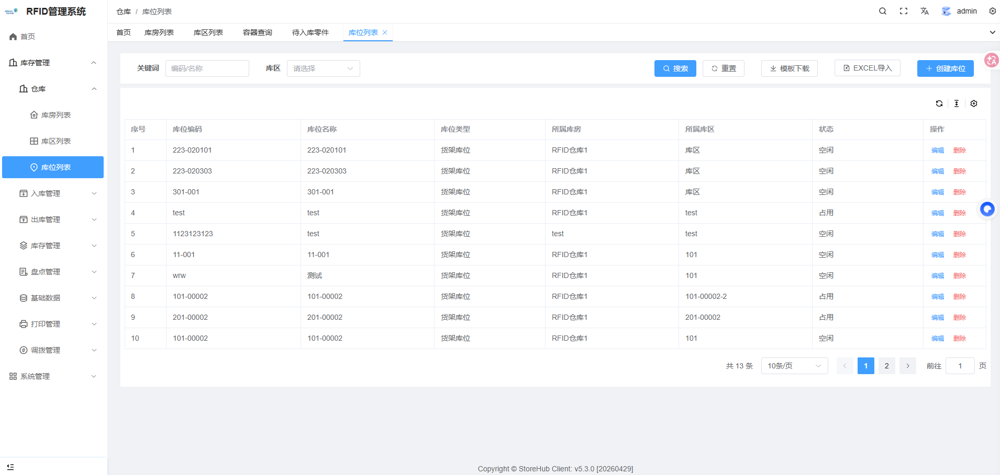

#### 3.3.1 库位属性

| 属性     | 说明                          |
| -------- | ----------------------------- |
| 库位名称 | 显示名称，必填                |
| 库位编码 | 唯一标识，必填                |
| 所属库区 | 关联的库区，必填              |
| 库位类型 | 货架/地面/流动货架/自动化立库 |
| 库位状态 | 空闲/占用/锁定/禁用           |
| 存储模式 | 直接存放/容器存放/混合        |
| 货架信息 | 货架名称、层数、列数          |
| 承重体积 | 最大承重(kg)、最大体积(m³)    |

#### 3.3.2 创建库位

1. 点击【创建】按钮
2. 填写基本信息：
   - 库位名称（必填）
   - 库位编码（必填）
   - 所属库区（必填，默认选中第一项）

3. 点击【保存】

   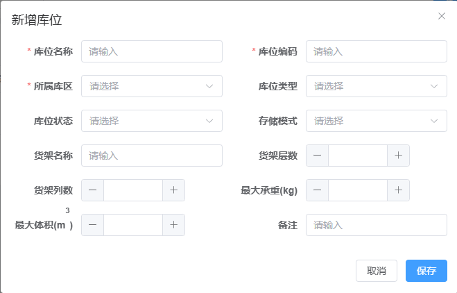

#### 3.3.3库位导入

下载模板：

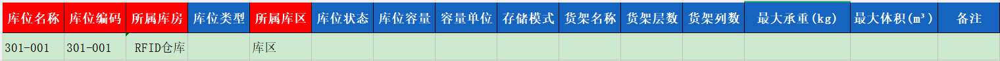

所属库房和所属库区需在后台预先创建，创建时只需填写以下信息：

- **库位名称**
- **库位编码**

#### 3.3.4库位删除

删除库位时，请确认该库位已无物料库存。**若库位存在库存，请勿删除**

---

## 四、基础数据管理

### 4.1 物料管理

**路径**：基础数据 → 物料管理

**功能说明** **：管理仓库中的所有物料信息，包括物料编码、SAP号、零件号、物料描述等。**

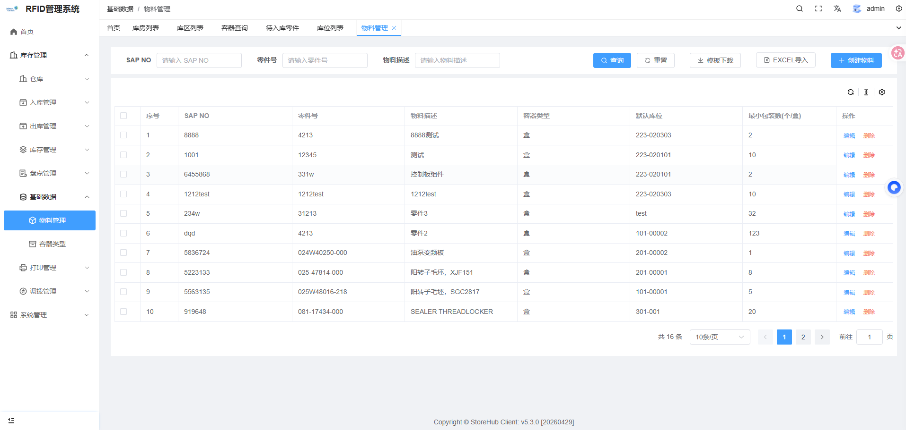

#### 4.1.1 查询物料

1. 在搜索区域输入以下条件（可选）：
   - **SAP NO**：SAP系统物料编号
   - **零件号**：零件标识号
   - **物料描述**：物料名称关键词
2. 点击【查询】按钮
3. 列表显示符合条件的物料

#### 4.1.2 创建物料

1. 点击【创建物料】按钮
2. 在弹窗中填写以下信息：

| 字段       | 必填 | 说明                  |
| ---------- | ---- | --------------------- |
| 物料编码   | ✓    | 物料唯一标识，填SAPNO |
| SAP NO     | ✓    | SAP系统物料号         |
| 零件号     | ✓    | 零件标识号            |
| 物料描述   | ✓    | 物料名称或描述        |
| 容器类型   | ✓    | 选择物料存放容器类型  |
| 默认库位   | -    | 物料默认存放的库位    |
| 最小包装数 | ✓    | 每盒/每包数量，默认1  |

3. 点击【保存】完成创建

   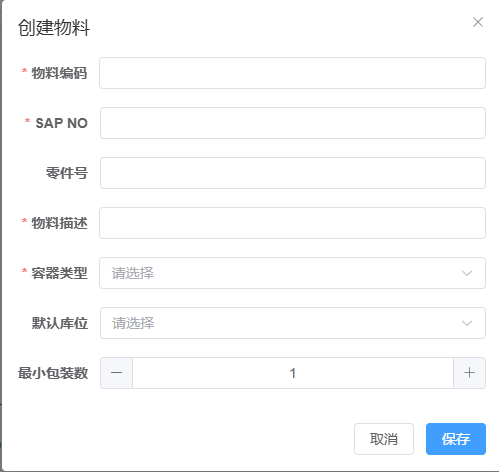

#### 3.1.3 编辑物料

1. 在列表中找到目标物料
2. 点击【编辑】按钮
3. 修改需要更新的字段
4. 点击【保存】完成修改

#### 3.1.4 删除物料

1. 在列表中找到目标物料
2. 点击【删除】按钮
3. 在确认弹窗中点击【确定】
   注意：删除物料时，请确认库位是否有改物料库存。**若存在库存，请勿删除**

#### 3.1.5 批量导入物料

1. 点击【模板下载】获取 Excel 模板
2. 按照模板格式填写物料数据：

| 列  | 字段名     | 说明       |
| --- | ---------- | ---------- |
| A   | 物料编码   | 必填       |
| B   | SAP NO     | 必填       |
| C   | 零件号     | 必填       |
| D   | 物料描述   | 必填       |
| E   | 容器类型   | 必填       |
| F   | 最小包装数 | 必填，数字 |

3. 点击【EXCEL导入】选择填写好的文件
4. 等待系统导入完成

### 4.2 容器类型管理

**路径**：基础数据 → 容器类型

管理物料存放的容器类型，如：托盘、箱子、盒子等。

#### 操作说明

- **创建**：点击【创建】按钮，填写类型名称、编码、描述
- **编辑**：点击【编辑】修改容器类型信息
- **删除**：点击【删除】删除未使用的容器类型

---

## 五、入库管理

### 5.1 待入库零件

**路径**：入库管理 → 待入库零件

显示打印完成的标签列表，支持单个和批量入库，支持 RFID 扫描快速入库。

#### 5.1.1 入库流程

```
后台选择需要入库的物料/扫码枪扫描RFID标签 → 点击入库按钮 → 确认入库信息 → 确认入库
```

#### 5.1.2 操作步骤

1. 勾选需要入库的物料

2.点击批量入库

选择入库类型\*\*：

- 采购入库
- 退货入库
- 调拨入库
- 盘点入库
- 其他入库

1. **确认信息**：
   - 系统自动显示物料信息
   - 核对物料编码、数量

2. **完成入库**：
   - 点击【确认入库】
   - 系统生成入库记录，入库的标签从待入库零件列表消失

如果使用扫码枪入库，请查看扫码枪操作手册

### 5.2 入库历史

**路径**：入库管理 → 入库历史

查询所有已完成的入库记录。

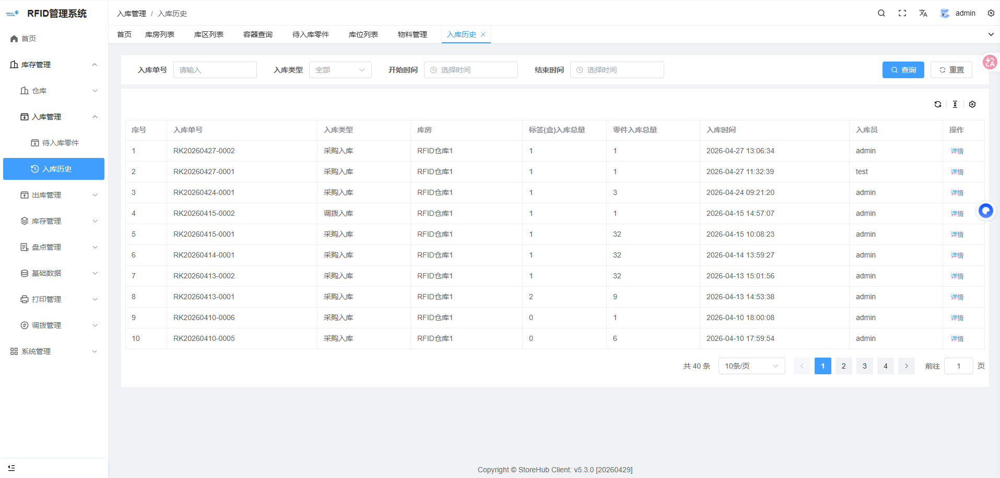

#### 5.2.1功能按钮

- **查询**：按条件筛选记录
- **重置**：清空条件
- **详情**：查看入库单明细

| 查询条件 | 说明                     |
| -------- | ------------------------ |
| 入库单号 | 入库单号                 |
| 入库类型 | 采购/退货/调拨/盘点/其他 |
| 开始时间 | 入库开始时间             |
| 结束时间 | 入库结束时间             |

---

## 六、出库管理

### 6.1 出库历史

**路径**：出库管理 → 出库历史

查询所有出库记录，支持多种出库类型。

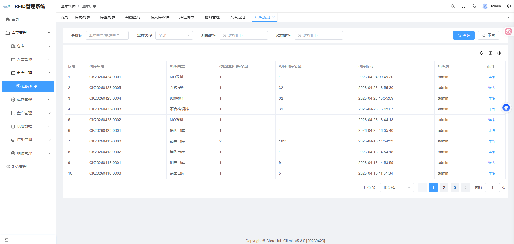

#### 6.1.1 查询出库记录

1. 设置查询条件：
   - **关键词**：出库单号
   - **出库类型**：选择具体类型
   - **时间范围**：开始时间和结束时间

2. 点击【查询】按钮
3. 查看列表结果

#### 6.1.2 查看出库详情在列表中找到目标记录

1. 点击【详情】按钮
2. 查看出库明细

   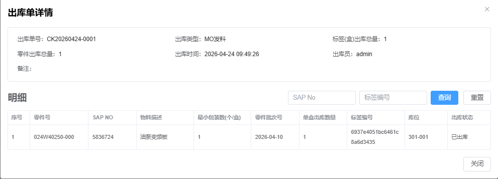

## 七、盘点管理

**路径**：库存管理 → 盘点

管理盘点任务，生成盘点差异报告。

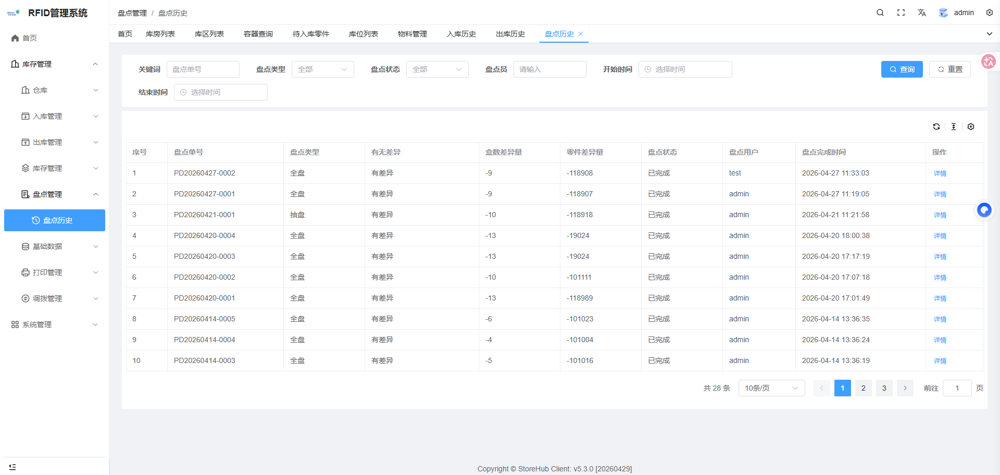

#### 7.1 盘点流程

扫码枪盘点流程具体参考《扫码枪的使用手册》

```
扫码枪创建盘点单 → 扫码枪执行盘点扫描 → 扫码枪提交 →后台生成差异报告
```

### 7.2盘点统计说明

零件统计

| 指标   | 计算方式                    |
| ------ | --------------------------- |
| 总数   | 系统记录的零件总数          |
| 一致   | 盘点零件数量 = 系统零件数量 |
| 不一致 | 盘点零件数量 ≠ 系统零件数量 |

标签盒统计

| 指标   | 计算方式            |
| ------ | ------------------- |
| 总数   | 系统记录的盒数      |
| 一致   | 盘点盒数 = 系统盒数 |
| 不一致 | 盘点盒数 ≠ 系统盒数 |

### 7.3 SAP汇总标签页

**搜索条件**：

- SAP查询：输入SAP号筛选
- 是否有差异：选择"有差异"或"无差异"

**功能按钮**：

- **查询**：筛选数据
- **SAP汇总导出**：导出Excel文件

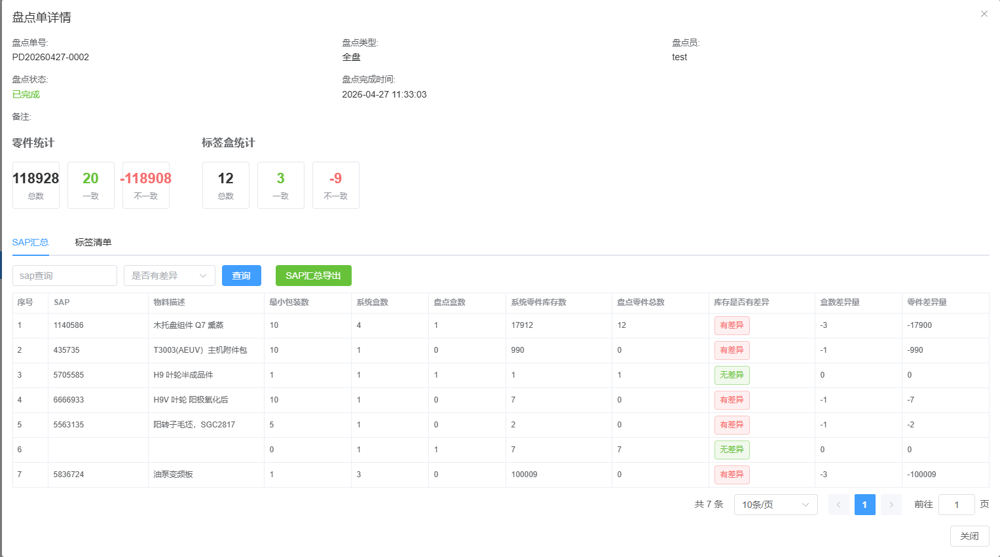

### 7.4标签清单标签页

**搜索条件**：

- SAP查询、是否有差异

**功能按钮**：

- **查询**：筛选数据
- **标签清单导出**：导出Excel文件
  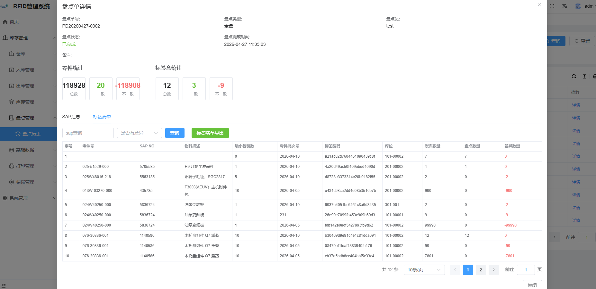

### 7.5导出操作

1. 点击【SAP汇总导出】或【标签清单导出】
2. 系统生成导出任务
3. 自动下载Excel文件

## 八、库存管理

### 8.1 库存查询

**路径**：库存管理 → 库存查询

查询当前仓库中的库存情况。

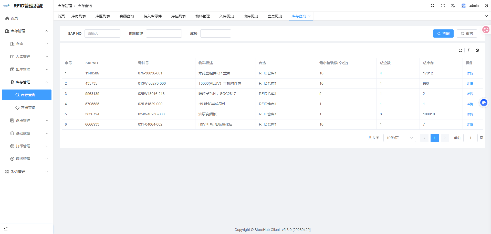

#### 8.1.1 查询条件

可以根据SAP NO、物料描述、库房筛选

#### 8.1.2物料库存详情

- 在列表中找到目标记录
- 点击【详情】按钮
- 查看对应SAP的所有标签明细

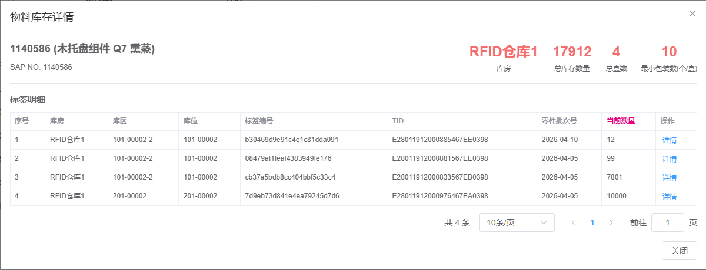

#### 8.1.3 查看标签出入库明细

1. 在物料库存详情页
2. 查看该标签的完整流转记录

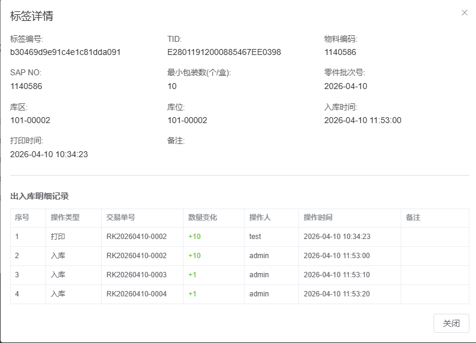

### 8.2 容器查询

**路径**：库存管理 → 容器查询

按标签（容器）维度查询库存。

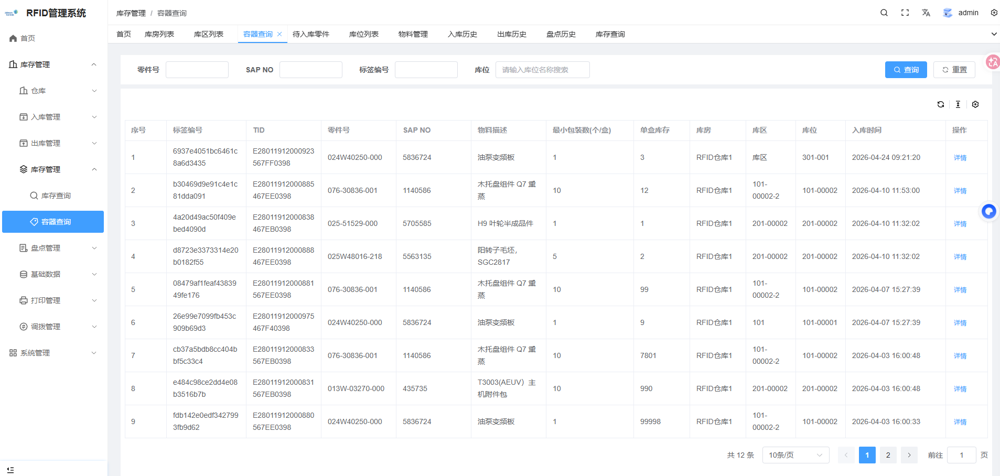

#### 8.2.1查询条件

输入零件号、SAPNO、标签编号或库位进行查询

#### 8.2.3详情

查看该标签的完整流转记录

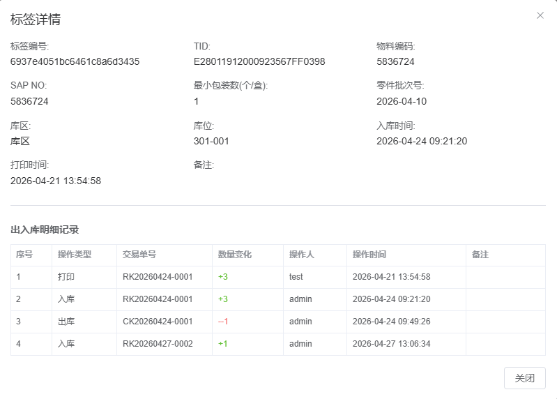

## 九、标签打印管理

### 9.1 标签历史

**路径**：标签打印 → 标签历史

查询已打印的标签记录.

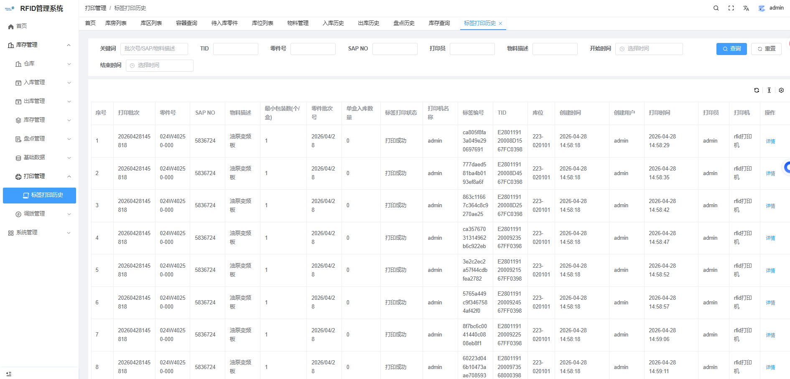

---

## 十、系统管理

### 10.1 用户管理

**路径**：系统管理 → 用户

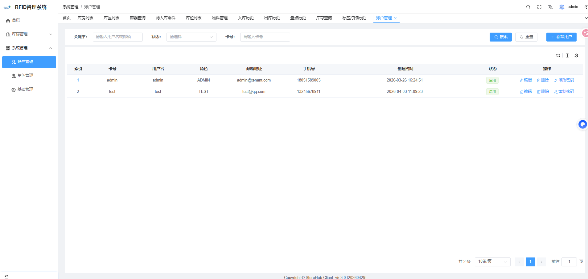

#### 10.1.1 创建用户

1. 点击【创建】按钮
2. 填写用户信息：

| 字段     | 必填        | 格式要求        |
| -------- | ----------- | --------------- |
| 账号名   | ✓           | 4-20位字母数字  |
| 用户昵称 | ✓           | 任意字符        |
| 卡号     | ✓           | 任意字符        |
| 邮箱地址 | ✓           | 有效邮箱格式    |
| 手机号   | ✓           | 11位手机号      |
| 密码     | ✓（创建时） | 6-20位英文/数字 |
| 角色     | ✓           | 至少选择一个    |

3. 点击【确认】完成创建

#### 10.1.2 编辑用户

1. 找到目标用户，点击【编辑】
2. 修改需要更新的字段
3. 点击【确认】保存

#### 10.1.3 删除用户

1. 找到目标用户，点击【删除】
2. 确认删除操作

### 10.2 角色管理

**路径**：系统管理 → 角色

管理系统角色和权限分配。

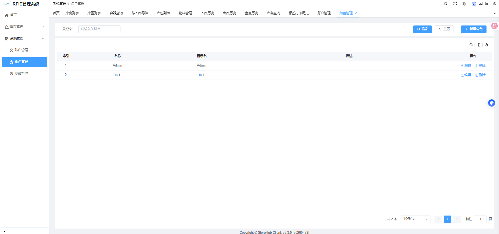

### 10.3 系统配置

**路径**：系统管理 → 系统配置

配置系统参数--客户无需修改

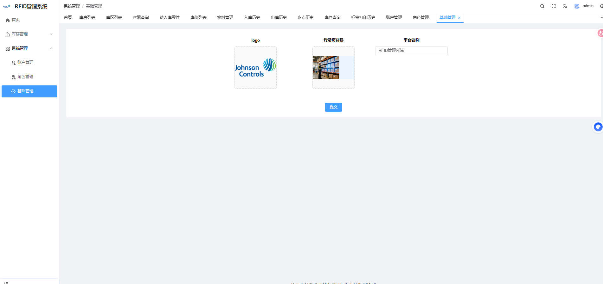

---

---

_本手册仅供参考，具体操作以实际系统为准。如有疑问，请联系系统管理员。_
