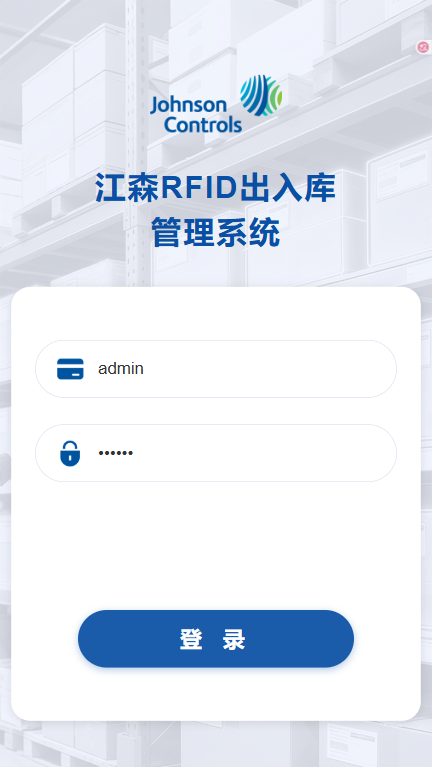
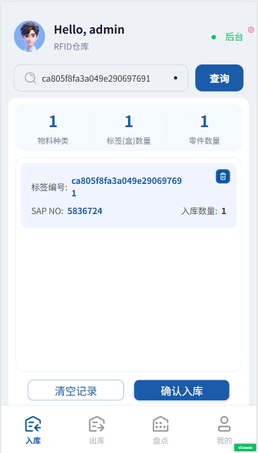
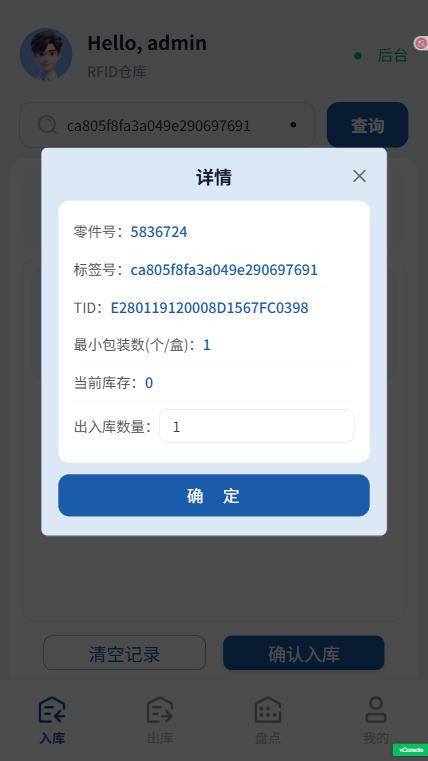
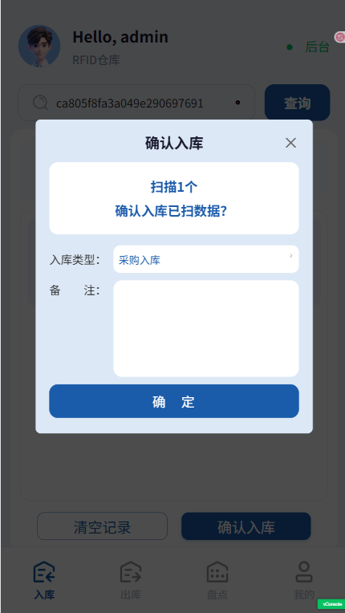
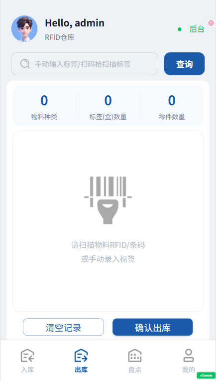
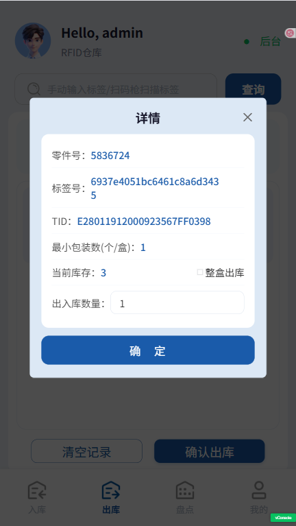
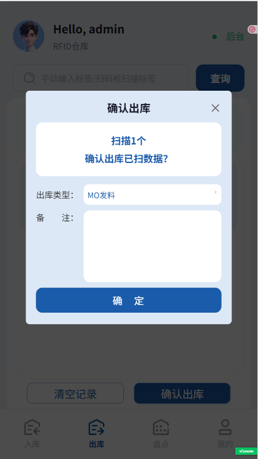
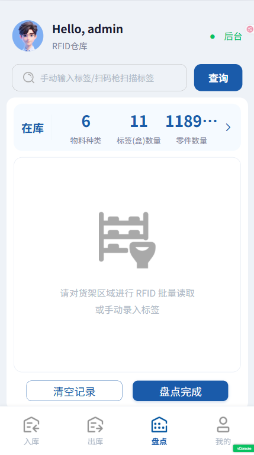
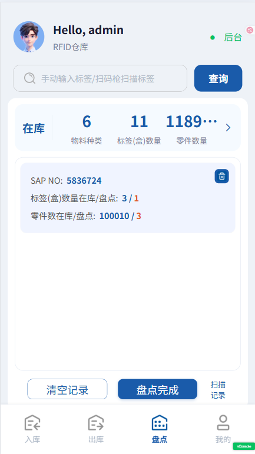

# 江森RFID出入库管理系统 - 用户使用手册

## 目录

1. [系统简介](#系统简介)
2. [登录系统](#登录系统)
3. [入库管理](#入库管理)
4. [出库管理](#出库管理)
5. [盘点管理](#盘点管理)
6. [标签打印](#标签打印)(待定)
7. [常见问题](#常见问题)

---

## 一、系统简介

江森RFID出入库管理系统是一款基于RFID技术的仓库管理移动端应用，支持入库、出库、盘点和标签打印(待定)等功能。系统通过扫描RFID标签实现物料的快速识别和管理。

### 1.1系统特点

- 支持RFID标签扫描和手动输入
- 批量入库/出库操作
- 批量盘点
- 标签打印管理(待定)

### 1.2运行环境

- Android
- 支持扫码枪和RFID读写器

---

## 二、登录系统

打开安卓APK,进入登录页面

### 2.2登录步骤

1. **输入工号**：在第一个输入框输入您的工号
2. **输入密码**：在第二个输入框输入您的登录密码
3. **点击登录**：点击"登录"按钮进入系统

   

### 2.3仓库和后台状态显示

首次登录后，系统会显示配置的默认仓库

显示后台服务连接状态（绿色=正常，红色=异常）

### 2.4退出登录

在"我的"页面点击"退出登录"按钮，即可退出系统重新登录。

---

## 三、入库管理

### 3.1功能说明

将已打印的标签入库到仓库中，增加对应零件的库存数量。支持两种方式入库：

- **新标签入库** ：打印后的标签首次入库
- **已有标签入库** ：仓库中已有标签追加数量

| 场景               | 说明                                                             |
| ------------------ | ---------------------------------------------------------------- |
| **标签数量归零**   | 当标签上的零件库存数量为**0** 时，系统自动判定该标签已出库       |
| **已出库标签**     | 出库后的标签**无法再次入库**，不可重复使用                       |
| **重新入库怎么办** | 如需重新入库，必须**重新打印标签**并贴到物料盒上，再执行入库操作 |

### 3.2操作步骤

#### 1. 扫描物料标签

- **方式一（RFID扫描）**：使用RFID扫码枪扫描物料标签
- **方式二（手动输入）**：在搜索框输入标签编号，点击"查询"

#### 2. 查看已扫描列表

- 页面显示已扫描的物料列表
- 统计信息：物料种类、标签数量、零件总数

  

- 详情：可以修改入库零件数量

  

#### 3. 删除单项

如需删除某个物料：点击该项右侧的删除图标

#### 4. 确认入库

1. 扫描完所有物料后，点击"确认入库"按钮
2. 选择入库类型：
   - 正常入库
   - 盘点入库
   - 其他

3. 填写备注（可选）
4. 点击"确定"完成入库

   

#### 5. 清空记录

如需清空当前扫描的所有物料，点击"清空记录"按钮。

## 四、出库管理

### 4.1功能说明

出库管理用于将仓库中的物料出库。

### 4.2操作步骤

#### 1. 扫描物料标签

- 扫描要出库的物料RFID标签
- 或手动输入标签编号查询

#### 2. 设置出库数量

扫描后自动弹出详情弹窗：

- **整盒出库**：勾选后自动填充当前库存数量
- **自定义数量**：取消勾选，手动输入出库数量
- 点击"确定"保存

  

#### 3. 确认出库

1. 扫描完所有要出库的物料
2. 点击"确认出库"按钮
3. 选择出库类型
4. 默认选中"MO发料"
5. 填写备注（可选）
6. 点击"确定"完成出库

   

### 4.2注意事项

- 出库数量不能超过当前库存
- 出库后库存实时更新
- 支持整盒和零件出库

---

## 五、盘点管理

### 5.1功能说明

盘点管理用于核对仓库实际库存与系统库存是否一致。

### 5.2操作步骤

#### 1. 进入盘点页面

点击底部"盘点"标签进入盘点页面

#### 2. 查看在库和盘点信息

- 默认显示"在库"统计，点击箭头，查看“盘点”统计
- 显示物料种类、标签数量、零件总数

#### 3. 开始盘点

**方式一：批量扫描**

1. 系统自动开启UHF读写器
2. 将读写器靠近货架
3. 系统自动批量读取标签

**方式二：手动添加**

1. 输入标签编号
2. 点击"查询"
3. 自动添加标签

#### 4. 查看盘点结果

- "盘点"视图里
- 显示每个物料的：标签和零件的盘点以及在库数量
- 

#### 5. 查看未盘点标签

点击某个物料，可查看该物料未盘点的标签列表。

#### 6. 完成盘点

1. 确认盘点数据无误
2. 点击"盘点完成"按钮
3. 选择盘点类型
4. 填写备注
5. 点击"确定"提交

#### 7. 清空记录

如需重新开始盘点，点击"清空记录"按钮。

### 5.3注意事项

- 扫描时请勿切换页面
- 盘点提交后会清空当前盘点数据
- 同一标签重复扫描不会重复计数

---

## 六、标签打印

### 6.1功能说明

标签打印用于创建和管理RFID标签打印任务。

### 6.2操作步骤

#### 1. 扫描SAP二维码

- 扫描物料包装上的SAP二维码
- 或手动输入SAP编号

#### 2. 查看物料信息

系统自动显示物料信息：

- SAP编号
- 零件号
- 物料描述
- 最小包装数
- 库位
- 批次号

#### 3. 创建打印任务

如需手动创建：

1. 点击"批量创建"
2. 填写表单：
   - SAP编号（必填）
   - 单盒入库数量（必填）
   - 库位（必填）
   - 备注（可选）
3. 点击"确定"创建

#### 4. 管理任务列表

- 查看已创建的打印任务
- 删除不需要的任务
- 统计总数

#### 5. 清空任务

点击"清空记录"可清空所有打印任务。

---

## 七、常见问题

### 1. 扫描不到标签怎么办？

- 检查标签是否在读取范围内
- 确认标签是否损坏
- 尝试手动输入标签编号
- 检查网络连接

### 2. 提示"标签已存在"是什么意思？

表示该标签已经在当前列表中，无需重复添加。

### 3. 切换页面时提示数据丢失？

这是正常现象。如果当前页面有未提交的数据，切换页面时会提示确认。

- 点击"确定"：清空数据并切换
- 点击"取消"：保留数据，不切换

### 4. 如何修改出库数量？

点击列表中的物料项，在弹出的详情窗口中修改数量。

### 5. 盘点时为什么有些标签扫不到？

可能原因：

- 标签距离过远
- 标签被遮挡
- UHF读写器未正常开启
- 标签不属于当前仓库

### 7. 系统卡顿或无响应？

- 检查网络连接
- 刷新页面重新登录

## 技术支持

如遇到无法解决的问题，请联系：

- 系统管理员
- 技术支持团队

---

**版本**：V1.0
**最后更新**：2025年4月
