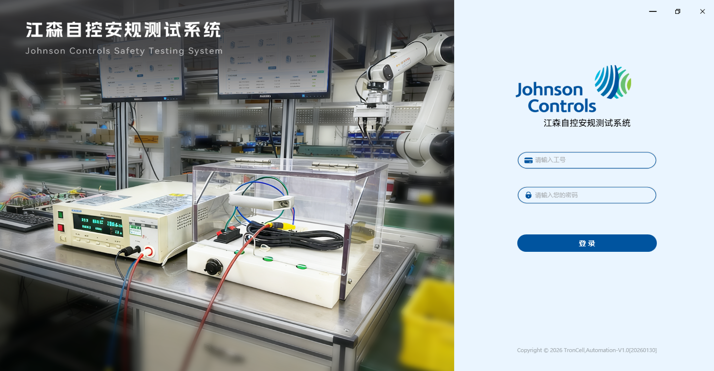
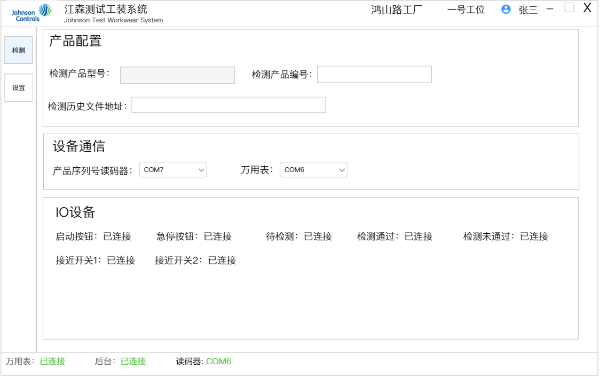
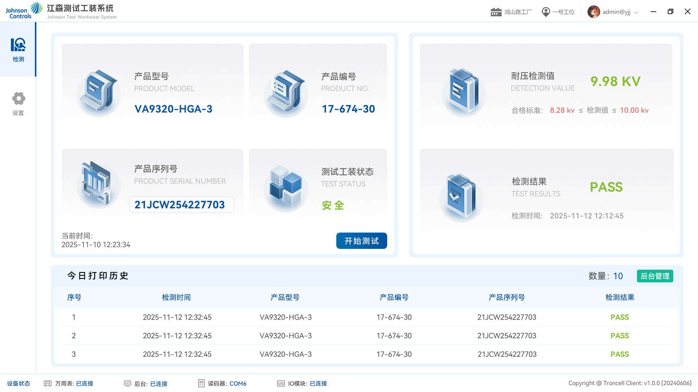

# **功能需求说明书：安规测试系统上位机**

## **1. 系统概述**

**本系统为“安规测试系统”上位机软件，用于和硬件连接，测试产品耐压值，记录测试数据，数据本地保存和上传后台及mes。**

## 2.启动软件

在桌面双击运行 LAUS.exe

## 3.登录

输入卡号、用户名和密码登录（账户信息在后台录入）

工号：admin

密码：123qwe

## 4.设置页面

**功能说明：**

1.检测产品型号和检测产品编号：检测产品型号和产品编号在后台维护，通过扫描产品编号自动带出产品型号。如果没有维护，扫码产品编号，产品型号提示不存在

2.检测历史文件地址：检测记录保存在本地，每天用当天日期保存为EXCEL表格。不修改默认保存在桌面，修改后保存到修改后的地址。

3.设备通信：扫码枪和万用的的com口设置

4.IO设备状态：显示硬件的IO状态

## 5.检测页面

功能描述：

1.产品型号和产品编号：从设置页读取，和设置页的产品型号和编号保持一致

2.产品序列号：扫描枪扫描产品序列号。扫码枪扫描要清空检测数据结果，点击测试后重新显示测试结果

3.测试工装状态：硬件是否在安全状态。盖子打开（不安全状态）就清空序列号

4.开始测试：检测页面万用表已连接、IO在线、测试工装安全、填了序列号，测试按钮才高亮，可以点击进行测试

5.检测结果：耐压检测值和检测结果，测试后显示检测结果。检测结果生成后，允许发起重新检测，序列号无需再次扫描验证。如果服务器连不上，数据存到本地，恢复网络后，数据上传到后台

6.今日打印历史：显示当天测试的历史，检测结果需要存本地、传到后台和江森。

7.后台管理：点击跳转到后台网页地址，可以登录账号登录后台

硬件：

1.有检测实物按钮，和检测页开始测试按钮功能一致，可以测试时实物按钮会高亮，可以按下测试

2.测试通过，通过灯高亮，测试失败，失败灯高亮

3.急停按钮，可测试按钮要灭不能测试，页面弹窗，如果在测试按下急停，给万用表发停止测试的信号，急停恢复后，可以继续测试
