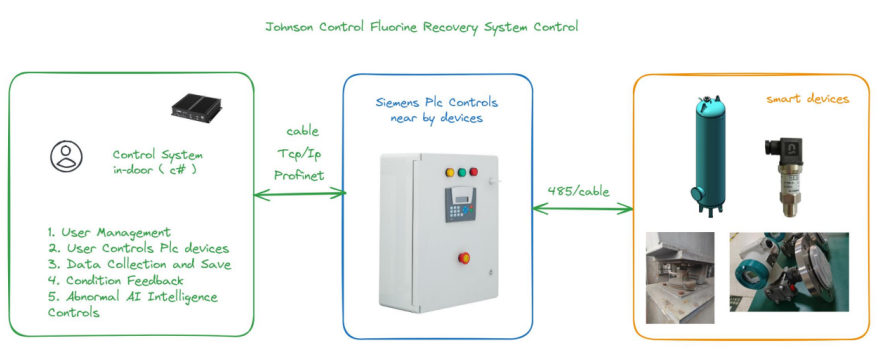
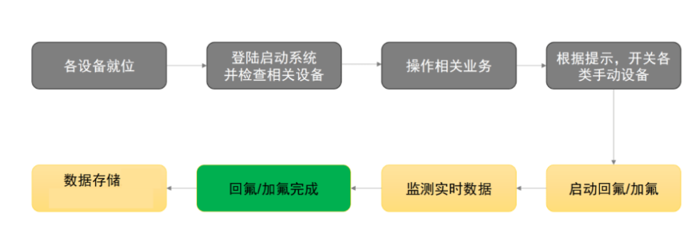

# 1.江森回氟项目介绍

1.简介：通过引入江森自控的回氟智空系统，实现冷媒的高效回收和再利用，减少环境污染，提高制冷系统的运行效率。同时，通过智能化管理手段，提高操作便捷性和系统稳定性，为用户提供更优质的服务和解决方案。

\项目信息文件 NAS 地址：\192.168.3.8\实施交付\2024 年项目交付备份\2024.9.15 江森回氟系统\回氟部署文档

2.整体架构

3.操作流程

4.设备要求

| 名称                              | 技术栈/要求                  | 作用                     | 软硬件要求                                                                                                                                                                                    | 江森部署                                                                                 |
| --------------------------------- | ---------------------------- | ------------------------ | --------------------------------------------------------------------------------------------------------------------------------------------------------------------------------------------- | ---------------------------------------------------------------------------------------- |
| 上位机                            | net core9.0 Wpf C# | 提供工位的检测界面及功能 | 上位机安装位置提供网线或能被足够强度的无线网络覆盖，固定 IP 地址 PLC 设备接入和上位机的同一网络，固定 IP 地址                                                                            |                                                                                          |
| 数据库                            | SQL                          | 存储检测数据             | 1.SQL Server 2016 及以上 2.硬件要求:4 核 CPU，内存 16G 或以上，存储 500G 3.江森数据库：c-wuxvm16                                                                                    | 数据库是 AEC_FreonDB                                                                     |
| Web Api 服务 Api Web App     | asp.net core 8.0 C#     | 提供业务逻辑及数据访问   | 1.Windows server 2016 及以上，IIS 7.0 及以上 2.CPU4 核 CPU，内存 16G 或以上，存储 500G 3.https tls1.2 及以上 A 端口 ：8081（目前是 http） 4.江森服务器部署地址：10.111.32.23   | 访问地址：http://10.111.32.23:8081/swagger/index.html                                    |
| Web 管理后台 Admin Pages App | Vue3.0 Vite Html   | 提供管理操作界面         | 1.Windows server2016 及以上，IIS 7.0 及以上 2.硬件要求 4 核 CPU，内存 16G 或以上，存储 500G 3.https tls1.2 及以上端口 ：8849（目前是 http） 4.江森服务器部署地址：10.111.32.23 | 访问地址：http://10.111.32.23:8849 用户名：test 账号：123456 密码：123qwe |

# 2.仓库地址

| 分类         | 仓库地址                                                                                                           | 说明      |
| ------------ | ------------------------------------------------------------------------------------------------------------------ | --------- |
| hub 前端仓库 | https://github.com/troncell/sensinghub_front/tree/return-fluoride                                                  | vue3+vite |
| 上位机软件   | https://github.com/troncell/Sensing.Plc.Wpf                                                                        |           |
| hub 后端仓库 |                                                                                                                    |           |
| 原型图地址   | https://modao.cc/proto/QS7Ew88sh5v0umXtC8dO9/sharing?view_mode=read_only&screen=rbpUf05tFfR3saql2 #加回氟系统-分享 | 墨刀      |

# 3.使用手册

| 序号 | 文档名称       | 说明                                               | 文档地址                                                                                                                                                                                                                                                                       |
| ---- | -------------- | -------------------------------------------------- | ------------------------------------------------------------------------------------------------------------------------------------------------------------------------------------------------------------------------------------------------------------------------------ |
| 1    | 后台操作手册   | 后台说明，包含机组和储罐的创建以及加回氟的操作记录 | [SensingDocs/Project Docs/Johnson/江森回氟/后台操作手册.md at main · troncell/SensingDocs](https://github.com/troncell/SensingDocs/blob/main/Project%20Docs/Johnson/%E6%B1%9F%E6%A3%AE%E5%9B%9E%E6%B0%9F/%E5%90%8E%E5%8F%B0%E6%93%8D%E4%BD%9C%E6%89%8B%E5%86%8C.md)            |
| 2    | 上位机操作手册 | 上位机使用文档                                     | [SensingDocs/Project Docs/Johnson/江森回氟/上位机操作手册.md at main · troncell/SensingDocs](https://github.com/troncell/SensingDocs/blob/main/Project%20Docs/Johnson/%E6%B1%9F%E6%A3%AE%E5%9B%9E%E6%B0%9F/%E4%B8%8A%E4%BD%8D%E6%9C%BA%E6%93%8D%E4%BD%9C%E6%89%8B%E5%86%8C.md) |
