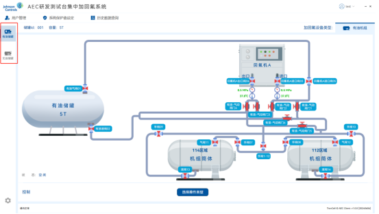
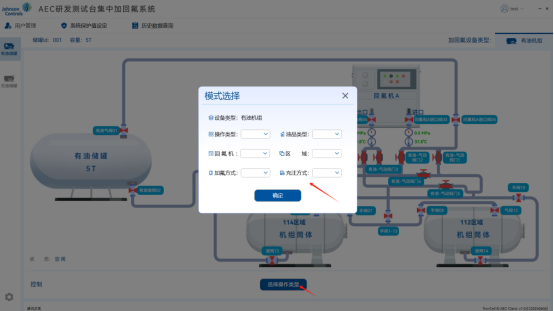
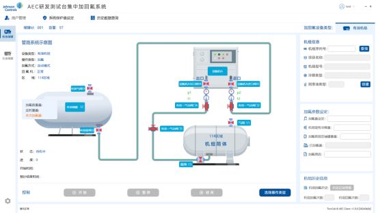
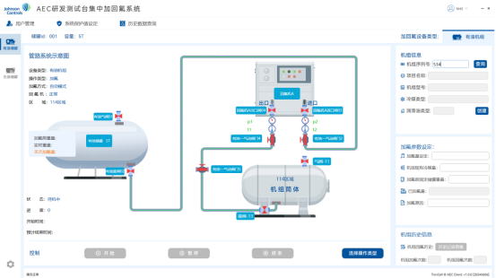
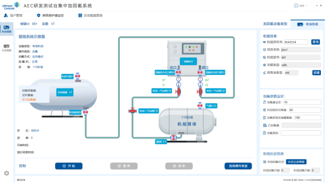

回氟系统上位机操作手册

## 1.启动软件

在桌面双击运行 LAUS.exe

## 2.登录

输入卡号、用户名和密码登录（账户信息在后台录入）

## 3.选择固定储罐

登陆后，左侧菜单栏选择要启用得固定储罐

## 4.选择操作类型（加氟/回氟）

1.点击请选择操作类型进行模式选择

2.确定后显示加氟或回氟界面

## 5.创建目标设备

点击创建，输入机组序列号、项目名称、机组型号、冷媒类型、润滑油类型后，点击保存

## 设置加氟或回氟参数

**〈1〉机组加氟**

加氟量设定：本次加氟量设定

机组现有冷媒量：目标设备现有冷媒量

加氟前固定储罐重量：无需填写，自动读取固定储罐重量

已加氟量：无需填写，加氟过程中自动计算

加氟原因：非必填

**〈2〉机组回氟**

回氟量设定：本次回氟量设定

机组现有冷媒量：目标设备现有冷媒量

回氟前固定储罐重量：无需填写，自动读取固定储罐重量

已回氟量：无需填写，回氟过程中自动计算

回氟百分比：无需填写，回氟百分比=已回氟量/机组现有冷媒量（回全部考虑回氟百分比回到 95%，没有回到需要高级操作员确认）

回氟原因：非必填

**〈3〉储罐加氟**

固定储罐加氟前重量：无需填写，自动读取固定储罐重量

移动储罐加氟前重量：目标设备工作前重量，整个移动储罐的重量（里面的冷媒+皮重+转运架）

移动储罐还能存储重量:=移动储罐最大存储重量-当前移动储罐里存储的 (当前移动储罐里存储的=移动储罐当前重量-皮重-转运架)

转运架重量：手动填写

本次加氟量：手动填写，需要小于或等于当前移动储罐还能存储量

已加氟量：无需填写，加氟过程中自动计算

加氟原因：非必填

**〈4〉储罐回氟**

固定储罐回氟前重量：无需填写，自动读取固定储罐重量

移动储罐回氟前重量：目标设备工作前重量，整个移动储罐的重量（里面的冷媒+皮重+转运架）

移动储罐还能抽取重量:不能超过称重罐最大能抽取的，小于等于当前存储的重量-冷媒罐最小承受重量 ， (当前移动储罐里存储的=移动储罐当前重量-皮重-转运架)

转运架重量：手动填写

本次回氟量：手动填写，小于当前移动储罐里抽取的量

已回氟量：无需填写，回氟过程中自动计算

回氟百分比：无需填写，已回氟量/当前存储重量

回氟原因：非必填

## 7.点击开始

① 手阀确认：如果对应路线手阀均已开启，点击确认

② 加/回氟信息确认：如果确认点击确定

③ 开工操作员：录入开工操作员信息，点击确定

④ 加/回氟确认：如果确认，点击确定开始加/回氟工作

## 工作中

## 加/回氟结束

① 手动结束确认：确认后，设备停止工作

自动结束：加/回氟量达到设定值，设备自动停止工作

② 信息确认：停止后，弹出信息确认框

② 完工操作员确认/管理员确认

注意：机组回全部考虑回氟百分比回到 95%，没有回到需要高级操作员确认。

## 查看操作记录

路径：点击菜单栏历史数据查询，或者点击右侧历史记录查看

**页面功能说明：**

1.可以查询以往的操作记录

**2.搜索按钮**：显示机组和移动储罐的操作记录，可以根据不同条件查询

**3.详细按钮：**点击详细，可以查看记录的具体信息
