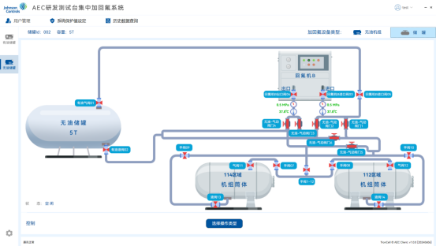

## 上位机

### 1.1 登录

**界面展示：**

**页面功能说明：**

输入卡号、用户名和密码登录（账户信息在后台录入）

### 1.2 顶部菜单栏

### 1.2.1 用户管理

点击用户管理可以跳转到后台用户管理页面，管理用户

### 1.2.2 系统保护值设定

**界面展示：**

**页面功能说明：**

1.可以设置温度和压力的预警值和停机值，可以设置重量变化的时间停机阈值

2.预警和停机警告弹框：分两套系统，有油储罐和无油储罐弹窗

### 1.2.3 历史数据查询：

**界面展示：**

**页面功能说明：**

1.可以查询以往的操作记录

**2.搜索按钮**：显示机组和移动储罐的操作记录，可以根据不同条件查询

**3.详细按钮：**点击详细，可以查看记录的具体信息

### 1.3 左侧菜单栏

### 1.3.1 有油储罐

**界面展示：**加氟回氟设备类型：有油机组

### 1.3.2 无油储罐

**界面展示：**加氟回氟设备类型：无油机组、储罐（移动储罐）

1.无油机组

2.储罐（移动储罐）

### 1.4 设备类型

### 1.4.1 有油储罐-有油机组

1.选择操作类型：

**操作类型选择后，显示对应的路线图和参数，未开始工作前可以修改操作类型（具体可参考下方 6 条路线图）**

注意：112 区域和 114 区域各只有一个，如果无油储罐 112 区域在工作，那有油储罐是不能选择 112 区域的

2 录入机组信息

**界面展示：**

**页面功能说明：**

1. 可以通过手动输入机组条码，可模糊搜索查询机组信息。双击确认选择机组

   

2. 可以创建机组信息，点击创建按钮，信息框可以输入，输入完成后点击保存并弹框确认，确认后将添加得机组信息同步至后台系统
3. 加氟参数设置

| 参数                     | 描述                     |
| ------------------------ | ------------------------ |
| 加氟量设定               | 本次要加氟量，操作员填写 |
| 加氟前储罐重量           | 固定有油储罐的重量       |
| 已加氟量                 | 加氟过程中动态量         |
| 机组现有冷媒量、加氟原因 | 操作员填写               |

1. 回氟参数设置

| 参数           | 描述                                                                                                                                             |
| -------------- | ------------------------------------------------------------------------------------------------------------------------------------------------ |
| 回氟量设定     | 本次要回氟量（需要低于机组现有冷媒量）                                                                                                           |
| 机组现有冷媒量 | 操作员填写，机组没有最大冷媒量的设定                                                                                                             |
| 回氟前储罐重量 | 固定有油储罐的重量                                                                                                                               |
| 已回氟量       | 回氟过程中动态量                                                                                                                                 |
| 回氟百分比     | 回氟百分比=已回氟量/机组现有冷媒量 1.回部分不考虑回氟百分比是否回到 95% 2.只有回全部考虑回氟百分比回到 95%，没有回到需要高级操作员确认 |
| 回氟原因       | 操作员手动填写                                                                                                                                   |

5.机组历史信息：

(1)没有机组信息时,历史记录查看按钮置灰

(2)有机组信息后，显示加氟和回氟的次数，点击历史记录查看可以看到以往的记录

3.工作流程

（1）开始（加氟)流程

1. 点击开始按钮，弹框提示当前路线上的手阀需要开启

   

2. 确认开启后，确认加氟信息是否正确

   

3. 确认加氟信息后，输入开始操作员信息

   

4. 输入后，确认开始加氟

   

**注：上位机点开始，先检查对应硬件是否正常，有异常要先报异常，不能开始。连接如果有异常的时候可以在底部状态栏显示，分有油和无油储罐**

（2）结束加氟流程

自动加氟结束：弹窗显示加氟结束后的信息，点击确认后，输入完工操作员的信息。完成后操作记录上传至后台系统。弹窗提示用户是否继续加氟。

手动结束加氟：手动结束。如果没有回到或加到对应值，需要高级管理员确认，高级管理员确认后才能停

4.暂停加氟

加氟暂停，可点击开始继续加氟

5.状态说明

待机中：未工作时显示待机中

工作中：加氟开始后显示工作中

暂停中：点击暂停，显示暂停中

6.按钮状态

工作中：开始按钮置灰，加氟暂停和加氟结束可以点击，选择操作类型按钮置灰

暂停中：暂停按钮置灰，开始和结束按钮可以点击，选择操作类型按钮置灰

已完成：结束后，暂停、结束按钮置灰

未开始：开始、暂停、结束按钮置灰（选择好操作类型，信息都已填入，填入后开始按钮高亮）

空闲中：暂停、结束按钮置灰（未选择操作类型）

### 1.4.2 无油储罐-无油机组

**1.选择操作类型**

**选择：无油机组**

**操作类型：加氟 加氟方式：自动/手动加氟/气态加氟 回氟机：启用 /液泵异常**

**操作类型：回氟 回氟机：正常/液泵异常 回氟方式：气态回收/回气加液/液态回收**

**操作类型选择后，显示对应的路线图和参数，未开始工作前可以修改操作类型（具体可参考下方 6 条路线图）**

2 录入机组信息

**界面展示：**

功能描述：功能和有油储罐的有油机组一致，可参考 1.4.1 有油储罐-有油机组

### 1.4.3 无油储罐-储罐

1.选择操作类型

**选择：储罐**

**操作类型：加氟 加氟方式：自动/手动加氟/气态加氟 回氟机：启用 /液泵异常**

**操作类型：回氟 回氟机：正常/液泵异常 回氟方式：气态回收/回气加液/液态回收**

**操作类型选择后，显示对应的路线图和参数，未开始工作前可以修改操作类型（具体可参考下方 6 条路线图）**

1. 录入储罐信息

**界面展示：**

**页面功能说明：**

1.可以通过手动输入储罐编号，可模糊搜索查询储罐信息

2 可以创建储罐信息，点击创建按钮，信息框可以输入，输入完成后点击保存并弹框确认，确认后将添加得储罐信息同步至后台系统

3.加氟参数设置

| 参数                 | 描述                                                                                                                                    |
| -------------------- | --------------------------------------------------------------------------------------------------------------------------------------- |
| 加氟量设定           | 本次要加氟量，操作员填写 需要小于或等于当前移动储罐还能存储量                                                                      |
| 加氟前固定储罐重量   | 固定无油储罐的重量                                                                                                                      |
| 已加氟量             | 加氟过程中动态量                                                                                                                        |
| 移动储罐当前重量     | 操作员填写 整个移动储罐的重量（里面的冷媒+皮重+转运架）                                                                            |
| 移动储罐还能存储重量 | 需要计算，储罐当前重量写了后计算出来。=移动储罐最大存储重量-当前移动储罐里存储的 当前移动储罐里存储的=移动储罐当前重量-皮重-转运架 |
| 转运架重量           | 手动填写                                                                                                                                |

4.回氟参数设置

| 参数                 | 描述                                                                                                     |
| -------------------- | -------------------------------------------------------------------------------------------------------- |
| 回氟量设定           | 本次要回氟量 手动填写，小于移动储罐里当前移动储罐里抽取的量                                         |
| 固定储罐回氟前重量   | 固定无油储罐的重量                                                                                       |
| 移动储罐回氟前重量   | 手动填写移动储罐重量                                                                                     |
| 移动储罐还能抽取重量 | 自动计算，储罐当前重量写了后计算出来。称重罐当前存储的重量-冷媒罐最小承受重量                            |
| 转运架重量           | 手动填写                                                                                                 |
| 已回氟量             | 回氟过程中动态量                                                                                         |
| 回氟百分比           | 回氟百分比=已回氟量/当前存储重量 储罐没有回全部和回部分之分，回氟百分比不需要考虑回氟百分比达到 95% |
| 回氟原因             | 操作员手动填写                                                                                           |

5.储罐历史信息：

(1)没有储罐信息时,历史记录查看按钮置灰

(2)有储罐信息后，显示加氟和回氟的次数，点击历史记录查看可以看到以往的记录

3.工作流程和机组流程一致，可参考上方的机组工作流程

### 1.5 加氟回氟路线（6 种）

### 1.5.1 加氟-自动加氟-回氟机正常

有油机组、无油机组、储罐路线一致

**操作参数：**

操作类型：加氟，回氟机：正常，加氟方式：自动加氟。区域：112/114

**气动阀门：**

有油机组：有油-气动阀门 2、有油-气动阀门 4

无油机组、储罐：无油-气动阀门 2、无油-气动阀门 4

### 1.5.2 加氟-手动加氟

有油机组、无油机组、储罐路线一致

**操作参数：**

操作类型：加氟，回氟机：正常，加氟方式：手动加氟 区域：112/114

**气动阀门：**

有油机组：有油-气动阀门 6

无油机组、储罐：无油-气动阀门 6

### 1.5.3 加氟-自动气态加氟-液泵异常

有油机组、无油机组、储罐路线一致

**操作参数：**

操作类型：加氟，回氟机：液泵异常，加氟方式：自动气态加氟 区域：112/114

**气动阀门：**

有油机组：有油-气动阀门 4，有油-气动阀门 5

无油机组、储罐：无油-气动阀门 4，无油-气动阀门 5

### 1.5.4 回氟-回氟机正常（气态/液态）

有油机组、无油机组、储罐路线一致

**操作参数：**

1.无油机组/储罐：操作类型：回氟，回氟机：正常，回氟方式：气态/液态 充注方式：回全部/回部分 区域：112/114

2.有油机组：

操作类型：回氟，回氟机：正常，油品类型：k+机组 回氟方式：气态/液态 充注方式：回全部/回部分 区域：112/114

操作类型：回氟，回氟机：正常，油品类型：非 k+机组 回氟方式：气态 充注方式：回全部/回部分 区域：112/114

**气动阀门：**

有油机组：有油-气动阀门 1，有油-气动阀门 3

无油机组、储罐：无油-气动阀门 1，无油-气动阀门 3

### 1.5.5 回氟-液泵异常（推拉回收：回气加液）

有油机组、无油机组、储罐路线一致

**操作参数：**

1. 无油机组/储罐：操作类型：回氟，回氟机：液泵异常，回氟方式：回气加液 充注方式：回全部/回部分 区域：112/114
2. 有油机组：

操作类型：回氟，回氟机：正常，油品类型：k+机组 回氟方式：回气加液 充注方式：回全部/回部分 区域：112/114

**气动阀门：**

有油机组：有油-气动阀门 4，有油-气动阀门 6

无油机组、储罐：无油-气动阀门 4，无油-气动阀门 6

### 1.5.6 回氟-液泵异常（气态）

有油机组、无油机组、储罐路线一致

**操作参数：**

1. 无油机组/储罐：操作类型：回氟，回氟机：液泵异常，回氟方式：气态 充注方式：回全部/回部分 区域：112/114
2. 有油机组：

操作类型：回氟，回氟机：液泵异常，油品类型：非 k+机组/k+机组 回氟方式：气态 充注方式：回全部/回部分 区域：112/114

**气动阀门：**

有油机组：有油-气动阀门 1，有油-气动阀门 3

无油机组、储罐：无油-气动阀门 1，无油-气动阀门 3

## 2.后台操作系统

### 2.1 后台登录

**界面展示：**

### 2.2 机组操作记录

**界面展示：**

**功能说明：**

1. 显示机组加氟和回氟操作记录历史。可根据机组条码、项目名称、操作类型、操作员、时间来搜索机组
2. 点击详情，可以查看具体的操作信息

### 2.3 储罐操作记录

**界面展示：**

**功能说明：**

1. 显示储罐加氟和回氟操作记录历史。可根据储罐编号、储罐存储介质、操作类型、操作员、时间来搜索储罐
2. 点击详情，可以查看具体的操作信息

### 2.4 称重罐操作记录（单独 PLC 设备的操作记录）

**界面展示：**

**功能说明：**

1.显示称重罐加氟和回氟操作记录历史。可根据储罐编号、储罐存储介质、操作类型、操作员、时间来搜索储罐

2.点击详情，可以查看具体的操作信息

### 2.5 移动储罐信息

**界面展示：**

**功能说明：**

1. **列表：显示移动储罐列表**
2. **搜索：可以根据储罐管理编号/储罐存储介质进行搜索**
3. **创建：可以创建移动储罐信息**

### 2.6 机组信息

**界面展示：**

**功能说明：**

**1.列表：显示机组信息列表**

**2.搜索：可以根据机组序列号/机组型号/项目名称进行搜索**

**3.创建：可以创建机组信息**

### 2.7 固定储罐

**界面展示：**

**功能说明：**

**1.列表：显示固定储罐列表（默认只有有油和无油储罐）**

**2.搜索：可以根据储罐编号进行搜索**

### 2.8 角色管理

**界面展示：**

**功能说明：**

创建/编辑：可以创建/编辑不同的角色，不同角色设置不同的权限

### 2.9 用户管理

**界面展示：**

**功能说明：**

1. 用户列表：显示所有用户信息
2. 搜索：可以根据卡号或用户名进行搜索
3. 创建：可以创建新用户

## 大屏-PLC 控制部分

### 3.1 有油储罐/无油储罐页面

**界面展示：**

功能说明：

1. 不工作时，plc 默认展示所有路线示意图
2. 上位机点击开始后，将机组/移动储罐信息、加氟/回氟信息、选择的设备类型、需要打开的阀门、目前工作的状态、操作人传给 plc。plc 显示对应的信息，并开始打开对应的气动阀门工作。
3. 阀门和回氟机开关顺序问题：

- 开的时候所有阀门都打开后，再启动回氟机。
- 关的时候要先关回氟机再关阀门。
- 阀门开关顺序按流向顺序开阀门，关和开的顺序一致。前一个阀门打开后再开后面一个。

1. 显示状态警告：异常停机弹窗，预警：温度和压力预警，工作：工作中，暂停：任务暂停
2. 急停：停回氟机并关闭阀门 。按下急停后反馈给上位机，上位机显示急停前的数据，并弹框要管理员确认
3. 暂停：只停回氟机不用关闭阀门
4. 复位：硬件有问题修复后可以点复位
5. 只有点击暂停后，才可以点开始按钮。结束后，开始、暂停、结束按钮全部置灰，重新开始只能上位机控制。暂停和结束后需要通知给上位机。结束的操作记录 plc 要需要保存到本地（以防上位机挂了，历史数据没有了，上位机恢复后，数据还要传给上位机）。
6. 如果 PLC 突然断了，比如没电了，plc 需要存储断电前的数据，断电后回氟机、阀门也关闭。电恢复后，将之前的数据上传至上位机，告知加氟或回氟了多少，之前的加氟或回氟结束
7. 读到气动阀、回氟机、温度、压力有没有联通，如果没有要跳警告并告知上位机而且不能开始工作。无油和有油可以分开报警

### 3.2 控制页面

**界面展示：**

功能说明：对应储罐在工作时，不能控制单个阀门

### 3.3 硬件

**界面展示：**

功能说明：

1.灯光

绿灯：工作状态

黄灯：待机或准备状态

红灯：故障或报警状态

2.屏幕里有油和无油各有一个急停按钮，因为两套急停需要分开，实物按钮去掉显示备用

3.启动和暂停实物按钮不需要，因为在屏幕上也有按钮，按钮将字去掉显示备用按钮

## 单独 PLC 设备控制部分

### 4.1 登录页面

**界面展示：**

功能说明：存储几个账号密码在 plc 里，输入账号进行登录

### 4.2 加氟页面

**界面展示：**

功能说明：

1. 称重罐：下拉选择称重罐
2. 加氟设备：冷媒罐或者机组，如果选择冷媒罐，下拉选择冷媒罐；如果选择机组，可以直接输入机组信息
3. 加氟参数设置

加氟量设定：本次要加氟量，手动填写，需要小于或等于当前移动储罐还能存储量

冷媒罐初始重量：加氟前称重罐重量

冷媒罐实时冷媒量：实时已加的重量

移动储罐还能抽取重量：需要计算，储罐当前重量写了后计算出来。称重罐的重量-冷媒罐最小承受重量

当前称重罐存储的=称重罐当前重量-皮重-转运架

转运架重量：手动填写

1. 控制

开始：点击后，需确认是否开始，确认后开始加氟。

暂停：点击后暂停加氟。

结束：点击加氟结束，需确认是否结束，确认后保存加氟数据

### 4.3 回氟页面

**界面展示：**

**功能说明：**

1.称重罐：下拉选择称重罐

2.回氟设备：冷媒罐或者机组，如果选择冷媒罐，下拉选择冷媒罐；如果选择机组，可以直接输入机组信息

3.回氟参数设置

回氟氟量设定：本次要回氟量，手动填写

冷媒罐初始重量：加氟前称重罐重量

冷媒罐实时冷媒量：实时已辉的重量

移动储罐还能存储重量：需要计算，储罐当前重量写了后计算出来。=称重罐最大存储重量-当前移动储罐里存储的

当前称重罐存储的=称重罐当前重量-皮重-转运架

转运架重量：手动填写

4.控制

开始：点击后，需确认是否开始，确认后开始回氟。

暂停：点击后暂停回氟。

结束：点击回氟结束，需确认是否结束，确认后保存回氟数据

### 4.4 设置页面

**界面展示：**

功能说明：

1.拉取储罐信息：联网后，可以手动拉取后台的储罐信息，存储到 plc 里，可以下拉储罐进行选择。（机组信息手动录入）

2.上传：工作结束后，自动停止，需要将加氟或回氟的信息保存在本地，联网后可将操作记录的数据上传到后台。（plc 存储有限，可以定时删除老数据或者新的数据替换老数据）

3.数据即将满了需要添加提醒：--待确认（在调研是否可以）

警告：数据库空间即将满，请及时上传数据以避免影响正常使用
