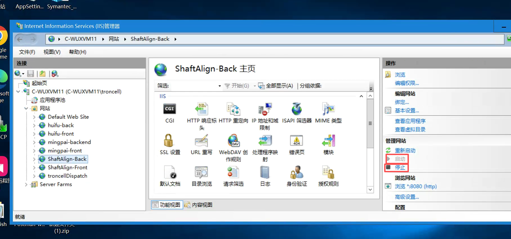

# 后台部署文档

## 1.环境

1. 数据库要求 ： Windows server 2022 7 代 i5 8G 内存 储存 100G iis 部署。
2. 数据库设置，使用 SQL SERVER Managemet 将目录“数据库”下的文件 SensingStore.Hub.bak 还原。数据库导入需要提前在本地测试通过
3. 安装 IIS

## 2.安装 IIS

1.进入电脑或服务器控制面板，找到程序和功能。

2.选择左侧的打开或关闭 Windows 功能

3.打开后出现了安装 Windows 功能的选项菜单，注意选择的项目，下面这张图片把需要安装的服务都已经选择了，大家可以按照图片勾选功能，然后点击确定按钮安装。

点击确定->完成安装 IIS 步骤->操作完成。

4.安装环境

（1）dotnet-hosting-7.0.10-win.exe

（2）dotnet-sdk-7.0.400-win-x64.exe

（3）node-v18.17.1-x64.exe

5.新建网站 1：jiangsen-back 端口为 8080

路径选择解压文件 xinfa 下的 publish 文件夹

6.新建网址 2：jiangsen-front

路径选择解压文件 sensingHub 文件夹

端口：8848

其他同上 确认即可

7.修改应用程序池 双击 jiangsen-back,

.NET CLR 选择无托管代码

8.提升 iis 权根为 LocalSystem

应用程序池->点击 bokong-backend->右击高级设置->进程模型->修改标识为 LocalSystem

安装完毕之后先看看能否访问前后台，如果没问题的话就 OK 了

## 3.注意事项

1 目前遇到的最大的问题就是数据库连接问题需要 publish 里的 appsettings.json 配置里配置数据库，是否是数据库问题需查看日志

下面的 ip 该修改的修改，该添加的添加

2. 部署后后台不能删除的问题，需要替换现场的 webconfig

 3.部署后，服务器上能打开后台地址，但是插了网线用其他电脑就访问不到，是因为防火墙里没有做对外映射端口，防火墙要开入站端口

## 4.更换数据传送地址

1.打开部署后端的文件目录，找到 appsettings.json 文件.

2.userId：访问地址权限的用户名

pwd：访问地址权限的密码

usePwd：是否启用用户名和密码

path：数据存放的地址

3.修改后，重启后台服务，重启后

4.重新启动后，点击浏览，网页可以打开说明启动成功

