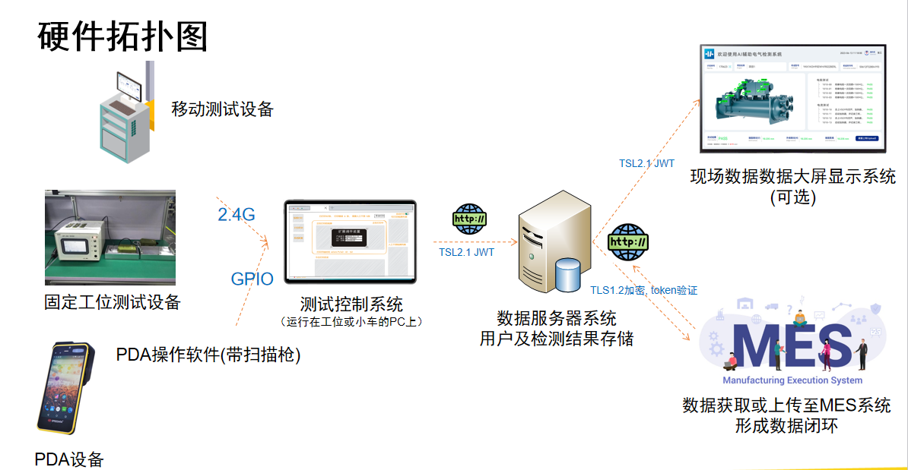
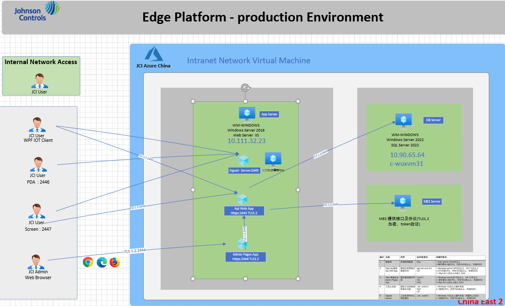

## 1.江森测试小车项目介绍

简介：更智能化的检测手段，自动读取等技术，引入辅助 PDA 设备， 可移动式办公(后续拓展)。兼容多种电气测试仪，检测的过程可记录，可追溯。测试的项目同步于 MES，必要的数据回传到 MES 系统

## 2.硬件拓扑图

## 3.网络架构

## 4.设备要求

| 名称                              | 技术栈/要求                  | 作用                     | 软硬件要求                                                                                                                                                                     | 江森部署                   |
| --------------------------------- | ---------------------------- | ------------------------ | ------------------------------------------------------------------------------------------------------------------------------------------------------------------------------ | -------------------------- |
| 上位机                            | net core9.0 Wpf C# | 提供工位的检测界面及功能 | 1.Windows10 及以上操作系统 2.8 核 CPU，内存 16G 以上，存储 500G                                                                                                           | 部署在小车上面             |
| 数据库                            | SQL                          | 存储检测数据             | 1.SQL Server 2016 及以上 2.硬件要求:4 核 CPU，内存 16G 或以上，存储 500G 3.江森数据库：c-wuxvm31                                                                     | 数据库是：WXAC_TroncellHub |
| Web Api 服务 Api Web App     | asp.net core 8.0 C#     | 提供业务逻辑及数据访问   | 1.Windows server 2016 及以上，IIS 7.0 及以上 2.CPU4 核 CPU，内存 16G 或以上，存储 500G 3.https tls1.2 及以上 A 端口 ：2443 4.江森服务器部署地址：10.111.32.23   |                            |
| Web 管理后台 Admin Pages App | Vue3.0 Vite Html   | 提供管理操作界面         | 1.Windows server2016 及以上，IIS 7.0 及以上 2.硬件要求 4 核 CPU，内存 16G 或以上，存储 500G 3.https tls1.2 及以上端口 ：2444 4.江森服务器部署地址：10.111.32.23 |                            |

## 5.仓库地址

| 分类         | 说明      | 仓库地址                                                                                                          |
| ------------ | --------- | ----------------------------------------------------------------------------------------------------------------- |
| hub 前端仓库 | vue3+vite | https://github.com/troncell/sensinghub_front/tree/testCar                                                         |
| 上位机软件   | WPF       | https://github.com/troncell/Sensing.ElectricalTest/tree/main                                                      |
| hub 后端仓库 | abp       | https://github.com/wulixu/SensingHub/tree/test-car                                                                |
| PDA 页面     | vue3+vite | https://github.com/troncell/Projects-2023/tree/main/2023/testTrolley/PDA                                          |
| 大屏软件     | vue3+vite | https://github.com/troncell/Projects-2023/tree/main/2023/testTrolley/LargeScreen                                  |
| 原型地址     | 墨刀      | https://modao.cc/proto/1NDHdAgVsx2cwe8cCvlHji/sharing?view_mode=read_only&screen=rbpUv2FEMAQeeuWNI #测试小车-分享 |
