## 测试小车后台操作手册

# 后台登录

后台地址：http://10.111.32.23:8850/#/login

**界面展示：**

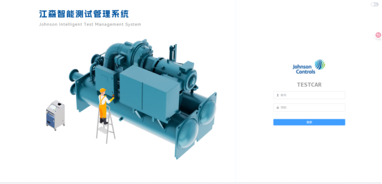

**功能说明：**

输入账户、密码登录后台

账号：1001

密码：123qwe

# 检测记录

界面展示：

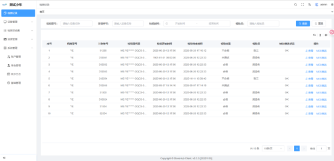

**功能说明：**

**1.列表：** 显示检测记录列表，包含未检测、检测中、检测完成的记录

**2.搜索**：可以根据：机组型号、计划单号、检验时间、检验员查询数据

**3.查看**：可以查看单个计划单的检测详情

页面展示：

(1)搜索：可以根据检测项代码和检测项进行搜索

(2)记录：点击记录，可查看单个检测项的信息

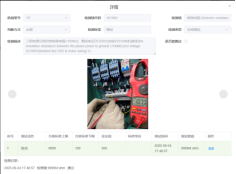

1. 更新：更新检测项信息，更新后回清空之前的检测结果，需要重新检测。一般用于新增的检测项或检测项步骤内容更新
2. **Mes 推送**：点击 MES 推送，将数据同步给 MES

# 3.设备管理

## 3.1 设备分组

备注：本次未使用到

界面展示：

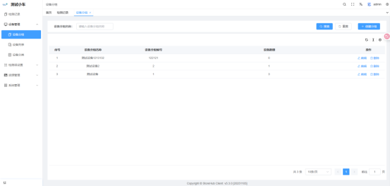

功能说明：

1. **列表：** 显示设备分组列表
2. **创建分组：**

|              |                                  |
| ------------ | -------------------------------- |
| 参数         | 描述                             |
| 设备分组名称 | 分组名称，必填                   |
| 设备分组编号 | 分组编号，必填，不能重复         |
| 描述         | 文字描述                         |
| 选择设备     | 可以添加设备麻将多个设备编为一组 |

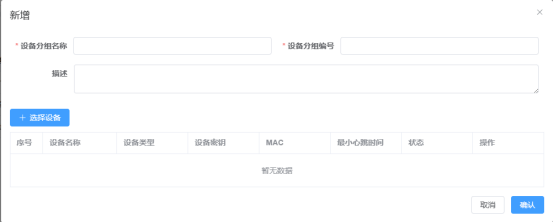

3.**删除**：删除设备分组

## 3.2 设备列表

界面展示

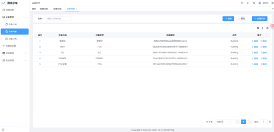

功能说明：

1. **列表**：显示设备列表
2. **创建设备**

|            |                         |
| ---------- | ----------------------- |
| 参数       | 描述                    |
| 名称       | 名称，必填              |
| 设备类型   | 下拉选择设备类型        |
| 系统类型   | 下拉选择设备类型        |
| MAC 地址   | 设备注册后显示 MAC 地址 |
| 硬件序列号 | 唯一，必填              |
| 设备编码   | 设备编码                |
| 地址       | 设备地址                |
| 描述       | 文字描述                |

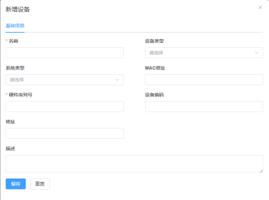

3.**删除**：删除设备信息

## 3.3 设备分类

界面展示：

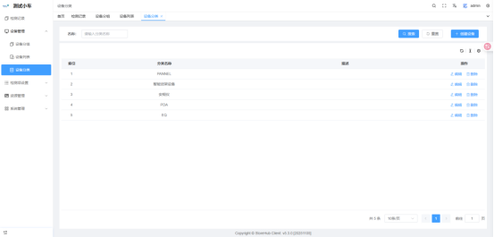

功能描述

1. **设备分类列表**：显示创建的设备分类
2. **创建/编辑设备分类**：创建或编辑设备分类

   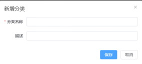

3. **删除：** 可以删除创建的设备分类

# 检测项设置

## 4.1 检测产品

界面展示

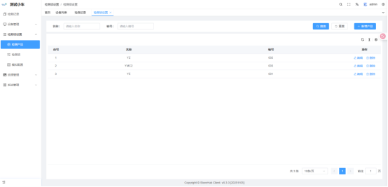

功能说明：

1. 列表：检测产品列表
2. 新增/编辑产品：创建/编辑产品类型

|              |                                      |
| ------------ | ------------------------------------ |
| 参数         | 描述                                 |
| 检测产品名称 | 名称，必填                           |
| 检测产品编号 | 编号，必填                           |
| 描述         | 产品描述，目前放的是产品对应测检测项 |
| 图片         | 产品图片，非必填                     |

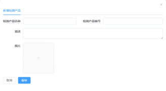

3.删除：可以删除检测产品

## 4.2 检测项

界面展示：

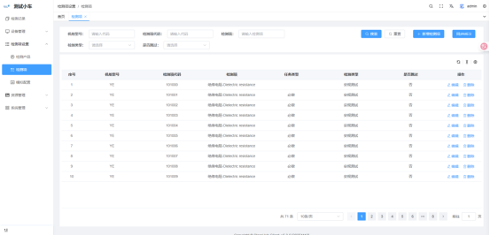

功能说明：

1. 列表：不同机组型号的检测项信息显示
2. 新增/编辑检测项：新增或修改检测项内容

|            |                                                                                                                                                           |
| ---------- | --------------------------------------------------------------------------------------------------------------------------------------------------------- |
| 参数       | 描述                                                                                                                                                      |
| 机组型号   | 下拉选择检测产品                                                                                                                                          |
| 检测项代码 | 必填                                                                                                                                                      |
| 检测项     | 检测项名称，必填                                                                                                                                          |
| 检测标签   | 检测标签                                                                                                                                                  |
| 检测类型   | 下拉选择检测类型                                                                                                                                          |
| 是否能跳过 | 是否可以跳过                                                                                                                                              |
| 任务类型   | 比做或选做                                                                                                                                                |
| 模型名称   | 大屏里模型区域，对应检测步骤高亮的名称，多个高亮区域以英文逗号给开，需要显示文字以;隔开 `  `例如：`  `503431500870001_stp,071W09841_312_stp;W |
| 检测描述   | 检测项描述信息                                                                                                                                            |

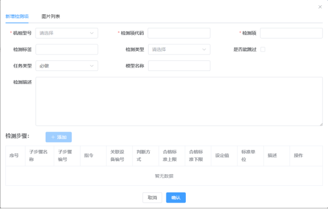

3.检测步骤：

|                |                                                                                                                    |
| -------------- | ------------------------------------------------------------------------------------------------------------------ |
| 参数           | 描述                                                                                                               |
| 子步骤名称     | 步骤名称，如果有按钮，显示为按钮名称                                                                               |
| 子步骤编号     | 步骤编号                                                                                                           |
| 指令           | 下拉选择指令                                         |
| 关联设备       | 选择测试设备：安规仪、PANNEL、EQ                                                                                   |
| 判断方式       | 自动：PDA 检测时获取值后自动判断检测项通过或失败 `  `手动：PDA 检测时显示通过、不通过、NA 按钮，可以人工选择 |
| 设定值         | 检测项通过的标准值                                                                                                 |
| 合格标准上限   | 检测值通过的上限值                                                                                                 |
| 合格标准下限   | 检测值通过的下限值                                                                                                 |
| 标准单位       | 检测值的单位显示                                                                                                   |
| 输入框前置文本 | PDA 页面人工输入框前面显示的文本配置                                                                               |
| 描述           | 人工判断时，PDA 显示需要判断的内容                                                                                 |
| 指令信息       | 指令文本配置，具体参考文档《后台 json 配置》                                                                       |

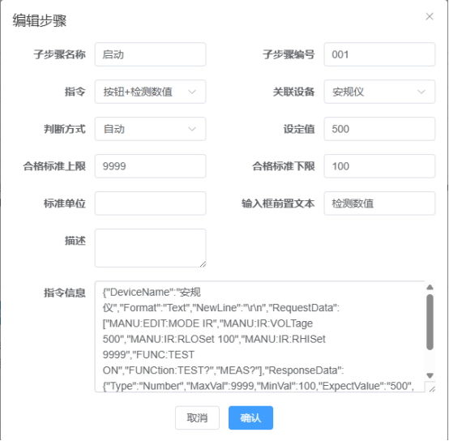

4.添加图片

添加图片：点击添加，可在资源列表根据名称进行搜索，添加需要的图片

删除：鼠标放在添加的图片上，显示删除按钮，点击删除，可以删除图片

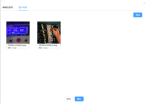 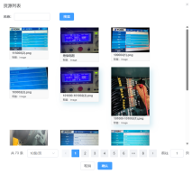

5.同步 mes：同步江森 3 种机组型号的检测项内容

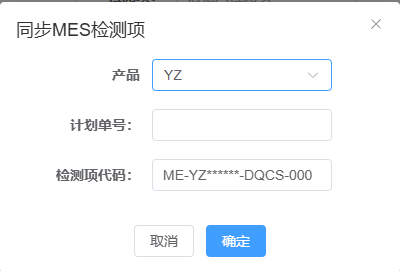

6.删除：可以删除创建的检测项

7.搜索：可以根据机组型号、检测项代码、检测项、检测类型、是否跳过进行查询

## 4.3 模拟配置

界面展示

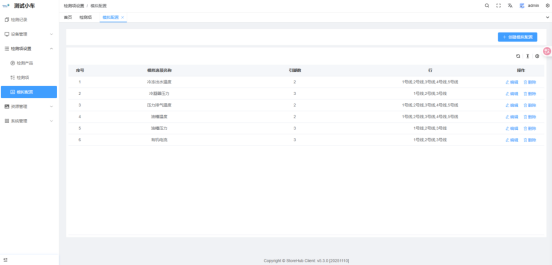

功能说明：

1. 列表：显示需要模拟测试的内容
2. 创建/编辑模拟配置

|              |                  |
| ------------ | ---------------- |
| 参数         | 描述             |
| 模拟选项名称 | 模拟选项名称     |
| 引脚数       | 线的引脚数设置   |
| 行           | 可以连接哪几根线 |

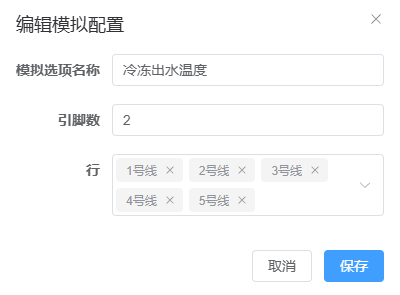

3.删除：可以删除模拟测试的内容

# 5.资源管理

## 5.1 资源包

界面展示

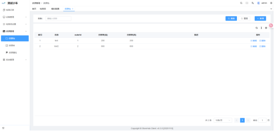

功能说明：

1. 资源包列表：导入一个资源包文件，会自动生成一个资源包
2. 新增：创建资源包，添加资源，将多个资源设置成一个分组

   

3. 删除：可以删除资源包

## 5.2 资源库

界面展示

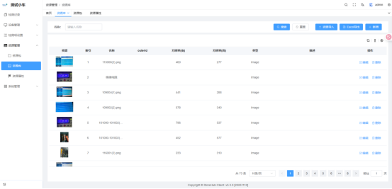

功能说明

1. 资源列表：显示所有上传的资源图片
2. 新增/编辑：可以手动添加或修改图片

   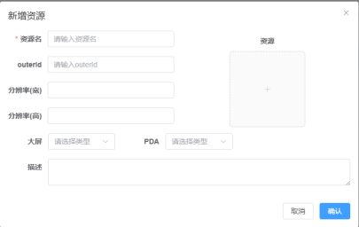

3. zip 包导入：将图片整理成表格，压缩成 zip 包后进行导入
4. 删除：可以删除资源文件

# 系统设置

## 6.1 账户管理

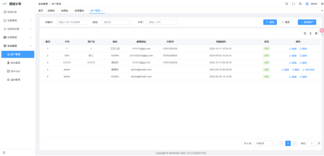

**功能说明：**

用户列表：显示创建的用户

搜索：可以根据用户名、卡号等进行查询

创建/编辑用户：可以新增或修改用户信息

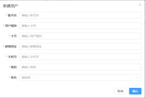

删除：可以删除用户信息

更改密码：可以重新修改密码

## 6.2 角色管理

界面展示：

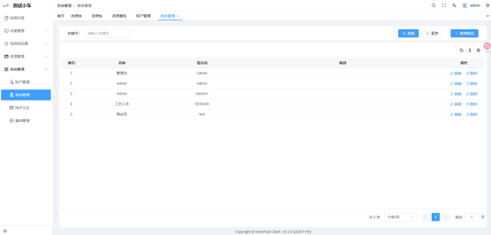

**功能说明：**

**列表：** 显示创建的角色列表

**搜索：** 可根据名称搜索用户角色

**编辑：** 可以修改用户的角色名称和权限

**删除：** 可以删除用户角色

**新增角色**：可以创建不同的角色，勾选不同的权限目录

## 6.3 同步日志

界面展示

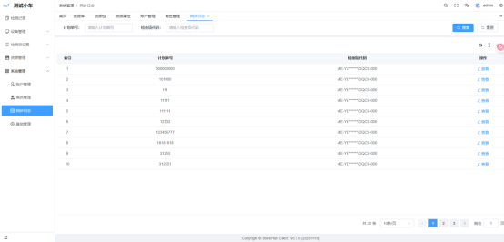

功能说明：

**列表：** 显示查询 mes 计划单任务的数据列表

**查询**：可以根据计划单号和检测项代码搜索推送数据

**查看：** 点击查看，可以查看具体的信息

## 6.4 基础管理

界面展示：

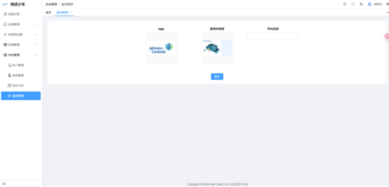

功能说明：

登录页的背景和 logo 配置（无需修改）
