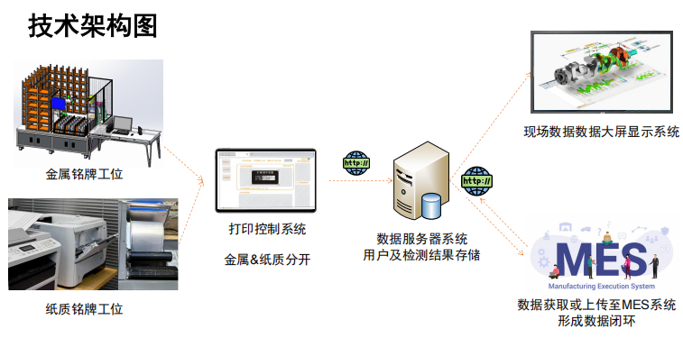
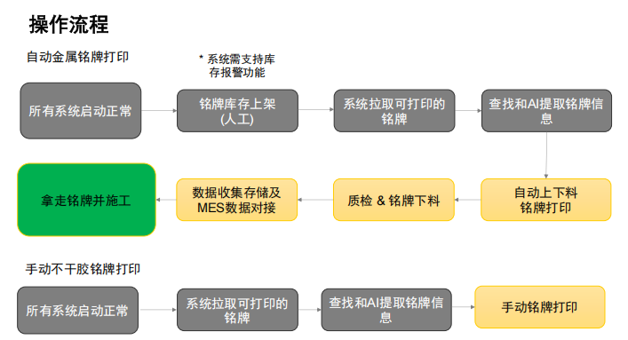

# 1.江森铭牌项目介绍

1.简介：全自动金属铭牌柔性打印系统(可兼容手动):，最深刻度为 0.1mm，铭牌尺寸 1.支持激光打印，种类多大几十种。支持纸质打印，纸质打印机设备由客户提供 。柔性自动上下料机构。铭牌内容信息来源多样，MES 系统，设计图纸等，需要自动获取信息，特殊情况可人工干预。铭牌控制系统，把获取的铭牌信息，根据型号，可控制机械部分进行打印，同时提供友好的人工操作界面。

项目信息文件 NAS 地址：\\192.168.3.8\实施交付\2025 年项目交付备份\2025.2.28 江森铭牌打印

2.整体架构

3.操作流程

4.设备要求

| 名称                              | 技术栈/要求                  | 作用                     | 软硬件要求                                                                                                                                                                                    | 江森部署                                                                |
| --------------------------------- | ---------------------------- | ------------------------ | --------------------------------------------------------------------------------------------------------------------------------------------------------------------------------------------- | ----------------------------------------------------------------------- |
| 上位机                            | net core9.0 Wpf C# | 提供工位的检测界面及功能 | 上位机安装位置提供网线或能被足够强度的无线网络覆盖，固定 IP 地址 PLC 设备接入和上位机的同一网络，固定 IP 地址                                                                            |                                                                         |
| 数据库                            | SQL                          | 存储检测数据             | 1.SQL Server 2016 及以上 2.硬件要求:4 核 CPU，内存 16G 或以上，存储 500G 3.江森数据库：c-wuxvm31                                                                                    | 数据库是：WXAC_TroncellHub                                              |
| Web Api 服务 Api Web App     | asp.net core 8.0 C#     | 提供业务逻辑及数据访问   | 1.Windows server 2016 及以上，IIS 7.0 及以上 2.CPU4 核 CPU，内存 16G 或以上，存储 500G 3.https tls1.2 及以上 A 端口 ：8082（目前是 http） 4.江森服务器部署地址：10.111.32.23   | 访问地址：http://10.111.32.23:8082/swagger/index.html                   |
| Web 管理后台 Admin Pages App | Vue3.0 Vite Html   | 提供管理操作界面         | 1.Windows server2016 及以上，IIS 7.0 及以上 2.硬件要求 4 核 CPU，内存 16G 或以上，存储 500G 3.https tls1.2 及以上端口 ：8850（目前是 http） 4.江森服务器部署地址：10.111.32.23 | 访问地址：http://10.111.32.23:8850 用户名：admin 密码：123qwe |

# 2.仓库地址

| 分类         | 仓库地址                                                                                                         | 说明      |
| ------------ | ---------------------------------------------------------------------------------------------------------------- | --------- |
| hub 前端仓库 | https://github.com/troncell/sensinghub_front/tree/nameplate                                                      | vue3+vite |
| 上位机软件   | https://github.com/troncell/Sensing.Automation.Laser                                                             |           |
| hub 后端仓库 | https://github.com/troncell/sensingHub_backend                                                                   |           |
| 原型图地址   | https://modao.cc/proto/bDFH1ayso9r6sIfo8h6qr/sharing?view_mode=read_only&screen=rbpUdKIFzVaEnbM1v #铭牌打印-分享 | 墨刀      |
| 视觉服务     | https://github.com/troncell/AI.Drawings.git                                                                      | python    |

# 3.文档手册

| 序号 | 分类       | 文档名称                     | 描述                                                                                                                              | 文档地址                                                                                                                                                                                                                                                                                                                                       |
| ---- | ---------- | ---------------------------- | --------------------------------------------------------------------------------------------------------------------------------- | ---------------------------------------------------------------------------------------------------------------------------------------------------------------------------------------------------------------------------------------------------------------------------------------------------------------------------------------------- |
| 1    | 视觉       | 标定手册                     | 金属铭牌视觉标定文档。当摄像头安装位置发生移动时，需按文档流程重新执行标定操作，确保视觉识别精度。                                | [SensingDocs/Project Docs/Johnson/江森铭牌/标定手册.md at main · troncell/SensingDocs](https://github.com/troncell/SensingDocs/blob/main/Project%20Docs/Johnson/%E6%B1%9F%E6%A3%AE%E9%93%AD%E7%89%8C/%E6%A0%87%E5%AE%9A%E6%89%8B%E5%86%8C.md) \\192.168.3.8\实施交付\2025 年项目交付备份\2025.2.28 江森铭牌打印\使用手册（陈泽维护）\手册 |
| 2    | 视觉       | 偏移校正操作步骤             | 当铭牌网格区域打印的文字出现偏移出格子的现象时，大概率为激光打印机自身偏移量异常，可参考文档执行偏移校正操作。                    | [\\192.168.3.8\实施交付\2025 年项目交付备份\2025.2.28 江森铭牌打印\使用手册（陈泽维护）\手册](https://github.com/troncell/SensingDocs/blob/main/Project%20Docs/Johnson/%E6%B1%9F%E6%A3%AE%E9%93%AD%E7%89%8C/%E6%9D%A5%E6%BA%90%E9%80%BB%E8%BE%91.md)                                                                                           |
| 3    | 视觉       | 视觉标注手册                 | 货道与铭牌视觉标注专用文档，涵盖货道铭牌数量识别、铭牌文本框位置定位的标注规则与操作流程。                                        | [\\192.168.3.8\实施交付\2025 年项目交付备份\2025.2.28 江森铭牌打印\使用手册（陈泽维护）\手册](https://github.com/troncell/SensingDocs/blob/main/Project%20Docs/Johnson/%E6%B1%9F%E6%A3%AE%E9%93%AD%E7%89%8C/%E6%9D%A5%E6%BA%90%E9%80%BB%E8%BE%91.md)                                                                                           |
| 4    | 视觉       | 视觉配置说明                 | 视觉服务模块的核心参数信息，包括参数含义、配置范围、调整方法等，为视觉系统调试提供依据。                                          | \\192.168.3.8\实施交付\2025 年项目交付备份\2025.2.28 江森铭牌打印\使用手册（陈泽维护）\手册                                                                                                                                                                                                                                                    |
| 5    | 打印机     | BSL 软件打印操作说明         | 激光打印机厂家配套程序的操作手册                                                                                                  | \\192.168.3.8\实施交付\2025 年项目交付备份\2025.2.28 江森铭牌打印\使用手册（陈泽维护）\手册                                                                                                                                                                                                                                                    |
| 6    | 摄像头     | 摄像机名称修改               | 当上位机软件无法识别摄像机时，可能因上位机引用的摄像机名称与厂家软件中注册的名称不一致导致，文档说明名称修改的具体操作流程。      | \\192.168.3.8\实施交付\2025 年项目交付备份\2025.2.28 江森铭牌打印\使用手册（陈泽维护）\手册                                                                                                                                                                                                                                                    |
| 7    | 示教器     | 示教器操作手册               | 用于优化调整机械臂空间停留位置（如抓取动作偏移、补光灯角度偏差等场景），详细说明通过示教器编辑设备位置参数的操作方法。            | \\192.168.3.8\实施交付\2025 年项目交付备份\2025.2.28 江森铭牌打印\使用手册（陈泽维护）\手册                                                                                                                                                                                                                                                    |
| 8    | 金属设备   | 初始化流程手册               | 适用于金属铭牌设备。当系统上电开机、电脑重启，或打印系统出现故障导致设备异常时，需按文档流程对 PLC 等核心设备执行重新初始化操作。 | \\192.168.3.8\实施交付\2025 年项目交付备份\2025.2.28 江森铭牌打印\使用手册（陈泽维护）\手册                                                                                                                                                                                                                                                    |
| 9    | 金属设备   | 设备断电断网恢复             | 设备遭遇断电、断网故障后恢复运行时，若机械臂出现动作异常（如撞臂），需使用示教器辅助执行恢复校准操作。                            | \\192.168.3.8\实施交付\2025 年项目交付备份\2025.2.28 江森铭牌打印\使用手册（陈泽维护）\手册                                                                                                                                                                                                                                                    |
| 10   | 模板制作   | 纸质模板制作软件手册         | Bartender 软件纸质铭牌模板制作文档                                                                                                | \\192.168.3.8\实施交付\2025 年项目交付备份\2025.2.28 江森铭牌打印\使用手册（陈泽维护）\手册                                                                                                                                                                                                                                                    |
| 11   | 上位机软件 | 上位机运行环境               | 明确上位机软件运行所需的 PC 硬件配置、操作系统版本、依赖组件安装等环境要求的配置文档。                                            | \\192.168.3.8\实施交付\2025 年项目交付备份\2025.2.28 江森铭牌打印\使用手册（陈泽维护）\手册                                                                                                                                                                                                                                                    |
| 12   | 上位机     | 纸质上位机软件安装手册       | 纸质上位机软件环境安装和参数修改文档                                                                                              | \\192.168.3.8\实施交付\2025 年项目交付备份\2025.2.28 江森铭牌打印\使用手册（陈泽维护）\手册                                                                                                                                                                                                                                                    |
| 13   | 上位机     | 纸质上位机使用手册           | 上位机操作手册                                                                                                                    | \\192.168.3.8\实施交付\2025 年项目交付备份\2025.2.28 江森铭牌打印\使用手册（陈泽维护）\手册                                                                                                                                                                                                                                                    |
| 14   | 后台       | 铭牌后台操作手册             | 后台说明文档，包含铭牌模板制作，打印任务信息等                                                                                    | [SensingDocs/Project Docs/Johnson/江森铭牌/铭牌后台操作手册.md at main · troncell/SensingDocs](https://github.com/troncell/SensingDocs/blob/main/Project%20Docs/Johnson/%E6%B1%9F%E6%A3%AE%E9%93%AD%E7%89%8C/%E9%93%AD%E7%89%8C%E5%90%8E%E5%8F%B0%E6%93%8D%E4%BD%9C%E6%89%8B%E5%86%8C.md)                                                      |
| 15   | 后台       | 来源逻辑                     | 铭牌字段来源逻辑文档                                                                                                              | [SensingDocs/Project Docs/Johnson/江森铭牌/来源逻辑.md at main · troncell/SensingDocs](https://github.com/troncell/SensingDocs/blob/main/Project%20Docs/Johnson/%E6%B1%9F%E6%A3%AE%E9%93%AD%E7%89%8C/%E6%9D%A5%E6%BA%90%E9%80%BB%E8%BE%91.md)                                                                                                  |
| 16   | 后台       | 打印任务创建以及打印深度调整 | 打印测试场景专用文档，包含模拟打印任务创建、打印次数设置、打印深浅度参数优化等操作                                                | \\192.168.3.8\实施交付\2025 年项目交付备份\2025.2.28 江森铭牌打印\使用手册（陈泽维护）\手册                                                                                                                                                                                                                                                    |
| 17   | PLC        | 铭牌打印系统 HMI 操作手册    | 监测设备运行状态，可以手动控制设备                                                                                                | \\192.168.3.8\实施交付\2025 年项目交付备份\2025.2.28 江森铭牌打印\使用手册（陈泽维护）\手册                                                                                                                                                                                                                                                    |
