铭牌来源配置

## 1.来源为图纸的 logic 个格式

&nbsp;{

&nbsp;   "c_field": "设计压力(管程)", //中文名

&nbsp;   "e_field": "DESIGN PRESSURE(TUBE SIDE)", //英文名

&nbsp;   "source": \[

&nbsp;     {

&nbsp;       "from": "Drawing", //来源为图纸

&nbsp;       "logic": \[

&nbsp;         {

&nbsp;           "table": "设计数据表", //表的名字

&nbsp;           "row": \["设计压力"\], //表里行的名称

&nbsp;           "col": \["管程 TUBE SIDE"\], //表里列的名称

“form”:”normal/asme/ted” //铭牌类型

&nbsp;         },

&nbsp;         {

&nbsp;           "extra": { //额外的逻辑

&nbsp;             "from": "ConfigurationTable", 通过配置表找到蒸发或冷凝的设计压力

&nbsp;             "position": "col" //将找到的压力传给下面 table 的列名里

&nbsp;           },

&nbsp;           "table": "设计数据表",

&nbsp;           "row": \["设计压力"\],

&nbsp;           "col": \[\],

&nbsp;           "regular": "-?\\\\d+\\\\.?\\\\d\*/?-?\\\\d+\\\\.?\\\\d\*" //正则表达式

&nbsp;         },

&nbsp;         {

&nbsp;           "extra": {

&nbsp;             "from": "Drawing",

&nbsp; "table": "表 2 /TABLE 2"，

&nbsp;             "partNo": "row", //从 mes 台账里找到的 pn 号，在 table 里找到对应的行

&nbsp;             "position": "col", //找到对应的列为下面 table 里的列名

&nbsp;             "col": \["设计压力"\]

&nbsp;

&nbsp;           },

&nbsp;           "table": "设计数据表",

&nbsp;           "row": \["设计压力"\],

&nbsp;           "col": \[\]

&nbsp;         }

&nbsp;       \]

&nbsp;     }

&nbsp;   \]

&nbsp; },

### 1.1.行和列的解释

1. row": \["设计压力"\], "col": \["管程"\]，行和列的对应名称

注意：名称在 pdf 里可以搜索到

例如：

{

"c_field": "压力容器类别",

"e_field": "PV.CATEGORY",

"source": \[

{

"from": "Drawing", //来源图纸

"logic": \[

{

"table": "设计数据表", //图纸里表名

"row": \["压力容器类别"\], //行名

col": \["管程"\] //列名

"regular": "\[Ⅰ-Ⅹ\]" //正则表达式

}

\]

}

\]

},

1. col=\[""\] ，值来自于 extra，暂时没有列名通过查找确定
2. col 没有默认就是 1
3. col=\["0"\] row=\["0"\] 第一行第一列
4. 跨列的用&， col1&col2

   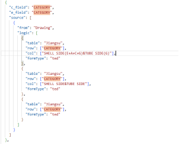

### 1.2.正则表达式

1.只取数字和符号

取：-?：-可以有或没有，\\\\d+：取后面一堆数字，\\\\.? ：点.可以有或没有，\\\\d\*：数字，/?：/可以有或没有，

if \_\_name\_\_ == "\__main_\_":

&nbsp;   # 测试代码

&nbsp;   texts = \[r"-1234567/-890.98\\r\\n 我爱你","1234567/-890","2.1"\]

&nbsp;   regular = "-?\\\\d+\\\\.?\\\\d\*/?-?\\\\d+\\\\.?\\\\d\*"

&nbsp;   # regular = "\\\\d+\\\\.\\\\d+/\\\\d+"

&nbsp;   for text in texts:

&nbsp;       final = get_value_in_regular(text, regular)

&nbsp;       print(f"{text} -->{final}")

2.取英文

if \_\_name\_\_ == "\__main_\_":

&nbsp;   # 测试代码

&nbsp;   texts = \[r"乙二醇溶液 WATER/E.G","WATER","R507(氟利昂)与润滑油  R507 AND REF. OIL"\]

&nbsp;   regular = "(?:\[A-Z0-9-\]+\[\\/\\-()\]\*)\[A-Z./\\s&-\]+"

&nbsp;   # regular = "\\\\d+\\\\.\\\\d+/\\\\d+"

&nbsp;   for text in texts:

&nbsp;       final = get_value_in_regular(text, regular)

&nbsp;       print(f"{text} -->{final}")

3.取中文

"regular": "(?:\[A-Z0-9-\]+\[/\\\\-\]?)?\[\\\\u4e00-\\\\u9fa5()（）/\\\\-\]+",

4.正则表达式只取第一行《前面的，1.后面的

&nbsp;"regular": "\\\\.(.\*?)\\\\s+《"

&nbsp;"regular": "1\\\\.\\\\s\*(\[^《\]+)"

5.中英文名称，取中文名称

"regular": "\[\\\\u4e00-\\\\u9fa5()（）/\\\\-\]+"

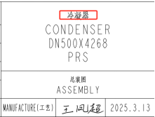

6.中英文名称，取中文翻译后的名称并去掉后面多余的字段

"regular": "\\\\n(.\*?)\\\\n"

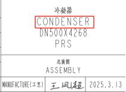

7.只取数字，有中文不取

&nbsp;"regular": "^\\\\d+$"

**代码运行查看：**

运行文件：D:\工作\code\AI.Drawings\pdfsearch\pdf_search_impl.py，修改文件里的 tests 和 regular，运行文件可以测试正则表达式是否正确

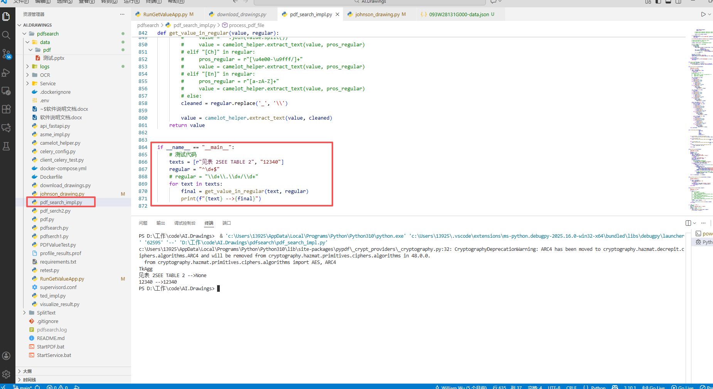

### 1.3format 添加单位

"format":"{0} MPa"，在找到 VALUE 值的后面添加单位 Mpa

### 1.4 form 铭牌类型

**三种铭牌类型：normal/asme/ted**

不写默认就是 normal

Normal：正常的铭牌

Asme：asme 铭牌

Ted：ted 特殊的铭牌

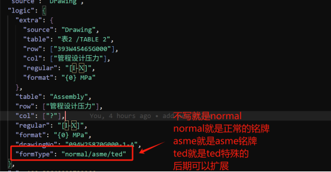

Ted：如果增加了新的行，需要在视觉代码里 johnson_drawing.py 添加行的名称

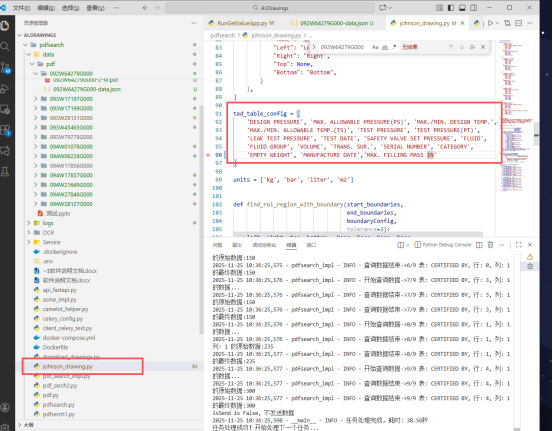

## 2.来源为 MES 查询接口字段的 logic 格式

**注释：mes 查询结果获得**

查询接口：

https://wuximes-prod.jci.com/Apriso/httpServices/operations/JCI_Wbs_06601_I_MES_GetVesselInfoByWipOrderNo

返回结果：{

&nbsp;   "Outputs": {

&nbsp;       "JSON": "{\\"VesselPV\\":\\"V319859\\",\\"PN\\":\\"393W01504G004\\",\\"DrawingNo\\":\\"093W01504G000\\",\\"DrawingNoVersion\\":\\"S\\",\\"EquipmentCode\\":\\"2519859\\",\\"MORemarks\\":null,\\"VesselName\\":\\"蒸发器\\"}"

&nbsp;   }

}

例如：

\[

{

"c_field": "产品编号",

"e_field": "SERIAL NUMBER",

"source": \[

{

"from": "StandingBook", //来源 mes 查询的返回字段

"logic": \[

{

"key": "VesselPV" //接口返回里的字段

}

\]

}

\]

},

## 3.来源为任务推送里的字段

任务推送接口：http://10.111.32.23:8082/api/services/app/JobTask/CreateJobTaskFromMes

推送字段：

"{\\"input\\":{\\"json\\":\[{\\"wipOrderNo\\":\\"V318583\\",\\"sn\\":\\"V318583\\",\\"wipOrderType\\":\\"205\\",\\"productCategory\\":\\"\\",\\"machine\\":\\"YK\\",\\"productModel\\":\\"YKR979K35DEH/EG22BERL\\",\\"pn\\":\\"393W12692G003L180\\",\\"productDesc\\":\\"蒸发器 4816-18 150-WHG YKH\\",\\"sapMo\\":\\"5017905764\\",\\"soType\\":\\"221\\",\\"sapNo\\":\\"6118962L180\\",\\"so\\":\\"303205433-30\\",\\"processModel\\":\\"\\",\\"customerType\\":\\"\\",\\"ec\\":\\"E25-132,E25-180,E25-223,E25-131\\",\\"moduleName\\":\\"\\"}\],\\"details\\":\[{\\"sapNo\\":\\"144193\\",\\"pn\\":\\"029W20971-001\\"},{\\"sapNo\\":\\"144167\\",\\"pn\\":\\"029W23311-000\\"},{\\"sapNo\\":\\"364692\\",\\"pn\\":\\"029W25023-000\\"},{\\"sapNo\\":\\"6103247\\",\\"pn\\":\\"029W28334-000\\"},{\\"sapNo\\":\\"6103520\\",\\"pn\\":\\"029W28337-000\\"},{\\"sapNo\\":\\"138723\\",\\"pn\\":\\"166W40002-000\\"},{\\"sapNo\\":\\"726102\\",\\"pn\\":\\"392W07918-000\\"},{\\"sapNo\\":\\"5179163\\",\\"pn\\":\\"392W13465-101\\"},{\\"sapNo\\":\\"5567866\\",\\"pn\\":\\"729-96184Q010W\\"},{\\"sapNo\\":\\"5563234\\",\\"pn\\":\\"775-96118-061\\"}\]}}"

例如：

&nbsp;{

&nbsp;   "c_field": "机型",

&nbsp;   "e_field": "MODEL NO",

&nbsp;   "source": \[

&nbsp;     {

&nbsp;       "from": "Special", //特殊来源

&nbsp;       "logic": \[

&nbsp;         {

&nbsp;           "type": "mes", //类型是 mes 推送任务接口

&nbsp;           "key": "ProductModel" //推送里的字段

&nbsp;         }

&nbsp;       \]

&nbsp;     }

&nbsp;   \]

&nbsp; },

## 来源为江森配置表--ABS/AC 接口

ABS:https://c-wuxts01.go.johnsoncontrols.com/oif_api/oif_api.asmx/Return_ABS_Spec

AC：https://c-wuxts01.go.johnsoncontrols.com/oif_api/oif_api.asmx/Return_AC_OrderInfo

4.1 返回字段做处理

&nbsp;{

&nbsp;   "c_field": "拔管空间",

&nbsp;   "e_field": "FOR TUBE MAINTENANCE SIDE.",

&nbsp;   "source": \[

&nbsp;     {

&nbsp;       "from": "ConfigurationTable_ABS", //来源

&nbsp;       "logic": \[

&nbsp;         {

&nbsp;           "keys": \["ORDER_LongitudinalDirectionForOT"\] //接口返回字段

&nbsp;         },

&nbsp;         {

&nbsp;           "keys": \["ORDER_LongitudinalDirectionForOT"\],

&nbsp;           "multi": 1000 //返回字段值\*1000

&nbsp;         },

&nbsp; {

&nbsp;           "keys": \["SYSTEM_RefrigerantCharge"\],

&nbsp;           "splitBy": \["/", "-"\], //返回字段里有-或/

&nbsp;           "index": 0 //取-或/前面的还是后面的，0 取符号前面，1 取符号后面

&nbsp;         },

&nbsp;{

&nbsp;           "keys": \["SYSTEM_Capacity_KW_H"\],

&nbsp;           "splitBy": \["/", "-"\],

&nbsp;           "index": 0,

&nbsp;           "depend": "热泵" //取到值需要看 REVIEW_UnitFunc 返回的是否是热泵，如果不是则为空

&nbsp;         },

&nbsp;{

&nbsp;       "from": "ConfigurationTable_AC",

&nbsp;       "logic": \[

&nbsp;         {

&nbsp;           "keys": \["ORDER_PowerVolts", "ORDER_PowerPhase", "ORDER_PowerHZ"\], //多个字段拼接

&nbsp;           "combine": "/" //多个字段以/隔开

&nbsp;         }

&nbsp;       \]

&nbsp;     }

&nbsp;       \]

&nbsp;     }

&nbsp;   \]

&nbsp; },

## 5.来源为默认信息

{

&nbsp;   "c_field": "许可证编号",

&nbsp;   "e_field": "LICENCE NUMBER",

&nbsp;   "source": \[

&nbsp;     {

&nbsp;       "from": "Special", //特殊来源

&nbsp;       "logic": \[

&nbsp;         {

&nbsp;           "type": "FixedValue", //类型为默认值

&nbsp;           "value": "TS2232031-2026" //默认值，可以为空

&nbsp;         }

&nbsp;       \]

&nbsp;     }

&nbsp;   \]

&nbsp; },

## 6.来源为 EDOC 配置表

&nbsp;{

&nbsp;   "c_field": "制冷剂",

&nbsp;   "e_field": "REFRIGERANT",

&nbsp;   "source": \[

&nbsp;     {

&nbsp;       "from": "ConfigurationTable_Edoc", //来源为 EDOC 配置表（表格）

&nbsp;       "logic": \[

&nbsp;         {

&nbsp;           "sheets": \["铭牌参数", "出口", "附页 1"\], //表格 sheet 名称

&nbsp;           "head": "制冷剂", //表格里关键文本

&nbsp;           "col": \[1\] //head 的后一列

&nbsp;         },

&nbsp;{

&nbsp;           "sheets": \["附页 1"\],

&nbsp;           "head": "电机额定功率",

&nbsp;           "row": \[1\] //head 下一行

&nbsp;         },

&nbsp;{

&nbsp;           "sheets": \["配置表 A 面", "配置表 B 面"\],

&nbsp;           "head": "撬块名称",

&nbsp;           "row_Dy": "${skidName}" //撬块名称不确定依据任务里的 moduleName 来确定行

&nbsp;         }

&nbsp;       \]

&nbsp;     }

&nbsp;   \]

&nbsp; },

## 7.来源为后台间隙表

&nbsp;{

&nbsp;   "c_field": "换热面积", //只有热换面积和折流板间距

&nbsp;   "e_field": "HEAT TRANSFER AREA",

&nbsp;   "source": \[

&nbsp;     {

&nbsp;       "from": "IntervalTable", //来源为后台间隙表

&nbsp;       "logic": \[

&nbsp;         {

&nbsp;           "key": "ExchangeArea" //来源为后台间隙表对应字段

&nbsp;         }

&nbsp;       \]

&nbsp;     }

&nbsp;   \]

&nbsp; },

&nbsp;{

&nbsp;   "c_field": "折流板间距",

&nbsp;   "e_field": "BAFFLE GAP",

&nbsp;   "source": \[

&nbsp;     {

&nbsp;       "from": "IntervalTable",

&nbsp;       "logic": \[

&nbsp;         {

&nbsp;           "key": "BafflePlateDistance"

&nbsp;         }

&nbsp;       \]

&nbsp;     }

&nbsp;   \]

&nbsp; }

## 8.来源不确定

可以配置多个来源，每个来源都去查找，查找到有值的进行填入

 {

    "c_field": "满载电流-热回收",

    "e_field": "AMPS",

    "source": [

    {

    "from": "ConfigurationTable_AC",

    "logic": [

    {

    "keys": ["ORDER_FullLoadAmps_HR"],

    "depend": "热回收"

    }

    ]

    },

    {

    "from": "NotSure",

    "logic": [

    {

    "source": [

    {

    "from": "ConfigurationTable_AC",

    "logic": {

    "keys": ["ORDER_FullLoadAmps_Heat"],

    "depend": "热泵"

    }

    },

    {

    "from": "ConfigurationTable_AC",

    "logic": {

    "keys": ["ORDER_FullLoadAmps_Heat"],

    "depend": "热回收"

    }

    }

    ]

    }

    ]

    }

    ]

  },

## 9.json 后台部署

登录铭牌后台

## 10.Pdf 和扫描框现场部署

1.部署目录

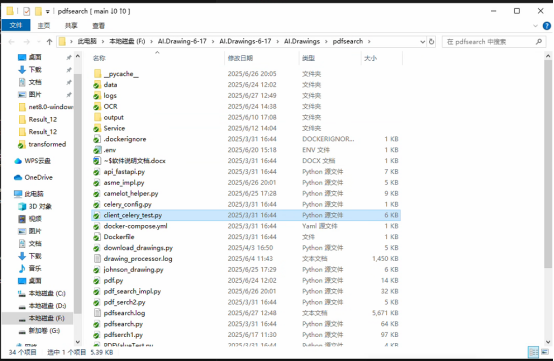

2.找到文件 RunGetValueApp.py，

isLocalDebug = True  # 是否在本地调试模式下运行要改成 false

3.进入文件夹路径，cmd

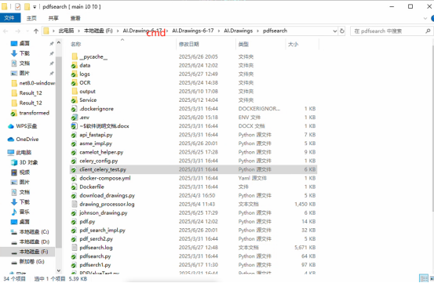

4.命令：python RunGetValueApp.py

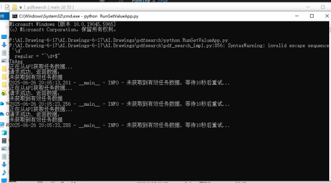

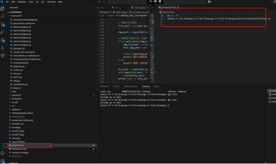

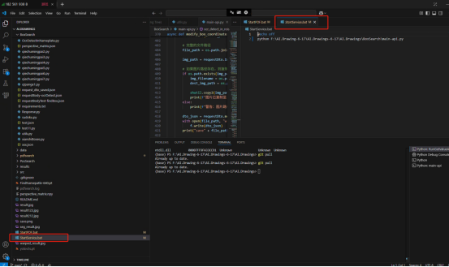

5.扫描框运行，在 AI.Drawings\\BoxSearch 下面 cmd

命令：python main-api.py

## 11 配置文件修改

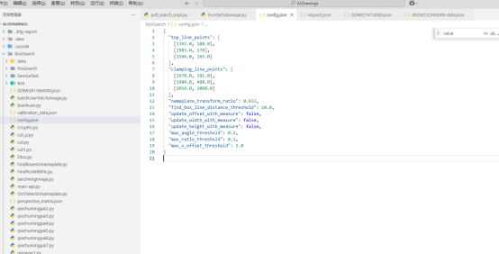

{

&nbsp; "top_line_points": \[

&nbsp;   \[1392.0, 188.0\],

&nbsp;   \[1983.0, 178\],

\[2566.0, 165.0\]

//顶部线上的点，可以有多个（可以用 psd 测量）

&nbsp; \],

&nbsp; "clamping_line_points": \[

&nbsp;   \[1978.0, 181.0\],

&nbsp;   \[1984.0, 488.0\],

\[2016.0, 2060.0\]

//打印台中心线的点，可以有多个

&nbsp; \],

&nbsp; "nameplate_transform_ratio": 0.933,

//目前是视觉识别值和创思识别的值的比例，实际是因为铭牌有厚度需要铭牌顶部到边缘的长的和铭牌底部到边缘长的比例

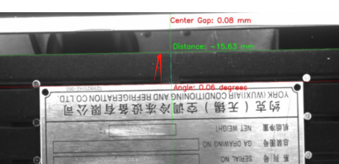

&nbsp; "find_box_line_distance_threshold": 10.0,

//找框的阈值，实际配置的框和识别的框相差 10 个像素以上则不修正

&nbsp; "update_offset_with_measure": false,

//是否使用我们的测量的偏移量值

&nbsp; "update_width_with_measure": false,

//是否使用我们测量的宽度值

&nbsp; "update_height_with_measure": false,

//是否使用我们测量的高度值

&nbsp; "max_angle_threshold": 0.2,

//偏移角度，如果偏移角度大于 0.2 则过滤不打印，目前设置的 0.4

&nbsp; "max_ratio_threshold": 0.1,

//长宽高的比例差很大也不打

&nbsp; "max_x_offset_threshold": 2.0

//中心线偏差超过 2mm 也不打

}

## 12地模拟找图纸来源

1.找到文件 RunGetValueApp.py，

isLocalDebug = True  # 是否在本地调试模式下运行要改成 True

2.装备好数据包含视觉的任务 json 和图纸存在目录 D:\工作\code\AI.Drawings1\pdfsearch\data\pdf 下（可以以图纸得文件名命名）

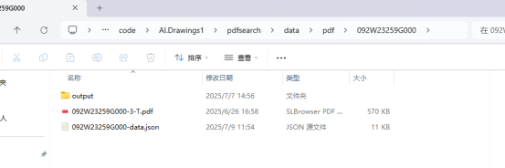

视觉任务 json 获取来源，创建一个第三方的来源为图纸的任务，然后调用获取来源为图纸的任务接口

3.RunGetValueApp.py 文件里添加需要运行的数据

&nbsp; localfile = r'data/pdf/092W51695G000/092W51695G000-data.json'

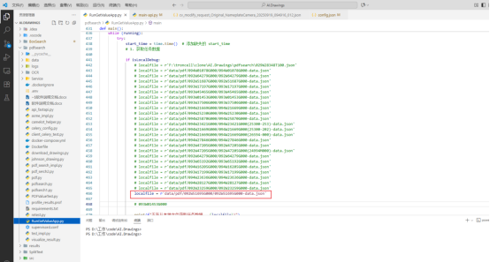

4.运行 RunGetValueApp.py

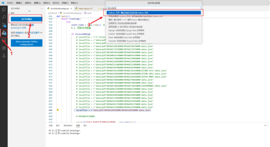

5.显示找出来的数据

|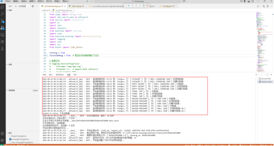
