标定手册

标定工作如下:

1\. 标定板进行标定，要求底板四周，标定板在摄像机下完全可见，大概 8-9 张

2\. 1-2 个真实的铭牌，平整的，可以不用最大的那种，测量出宽高，以及四个点的像素位置

3\. top 和中心线修改

## 1.标定板标定

**标定板拍照：标定板放置 6 个位置来标定（所有标定板放置需要在镜头范围内）**

（1）夹紧装置松开拍两张如上

如图所示：

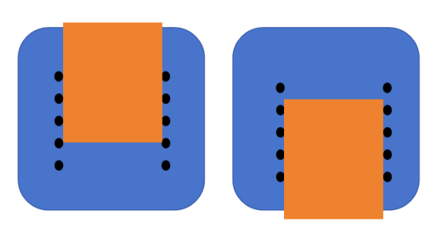

实物图：

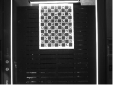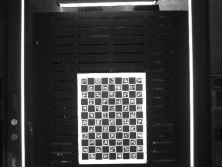

(2)夹紧装置合并，左右上下各拍四张图，如下

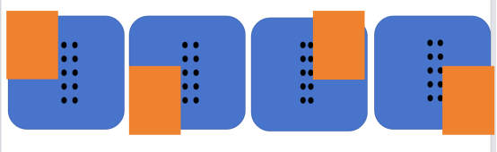

实物图：

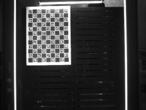 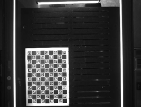

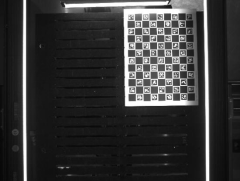 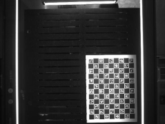

## 标定板图片矫正

### 3.1 安装环境

在 AI.Drawings\\BoxSearch 下右击后点击在终端打开，执行命令 pip install -r requirements.txt

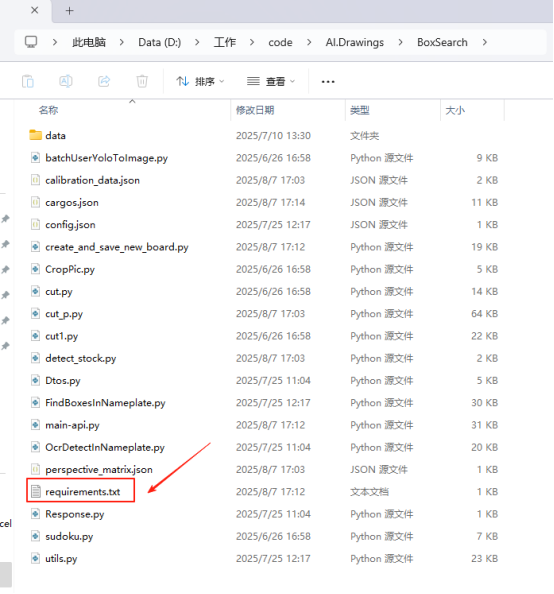

### 3.2.创建文件夹 calibImages

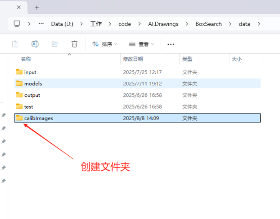

将标定板拍摄的原始照片，获取相机的内参和畸变系数,照片放在 data/calibImages 目录下

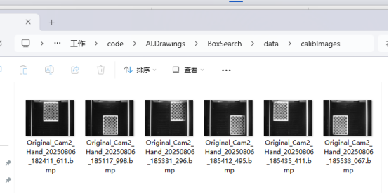

### 3.3 代码里修改图片路径

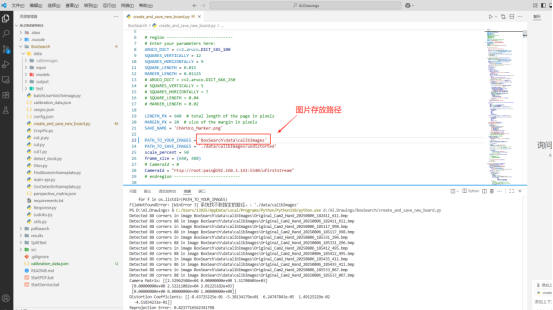

### 3.4 执行文件

1. 打开文件 create_and_save_new_board.py

执行文件里：calibrate_and_save_parameters(save_parameters=True, fish_eye=False)

2.点击运行 Python 文件

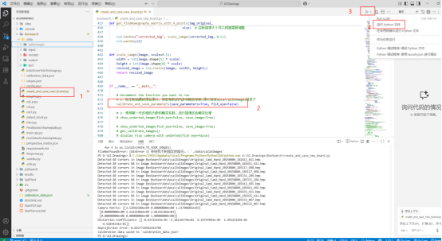

3.出现下方的图片一直按回车

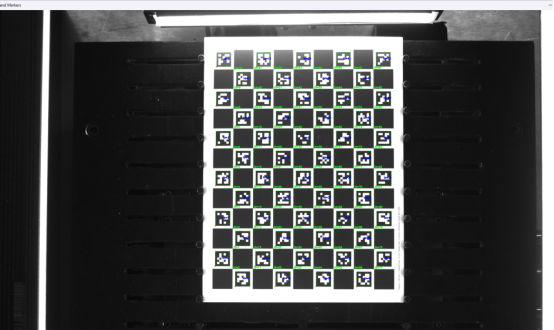

4.执行完成后提示下方 88 corners 信息，则矫正结束

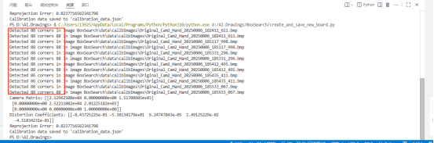

5.生成矫正数据 calibration_data.json（完成后可以删除标定板图片）

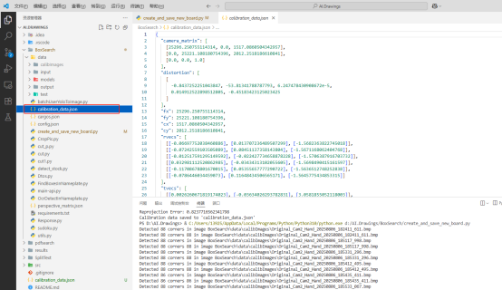

## 4 真实铭牌图片矫正

使用第一步的相机内参和畸变系数，进行图像的去畸变处理，选择一个铭牌然后放在底板上，拍照保存

### 4.1.存放图片

将拍摄的铭牌照片放在 data/calibImages 目录下，并修改矫正后的图片存放路径

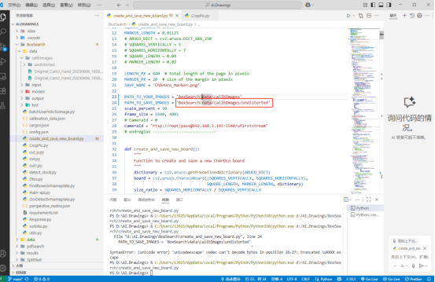

### 4.2 执行文件

1.打开文件 create_and_save_new_board.py

执行文件里：show_undorted_image(fish_eye=False, save_image=True)

2.点击运行 Python 文件

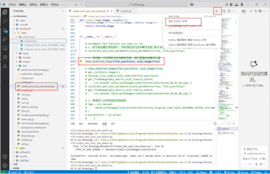

3.出现图片后按回车，在存储的目录下看到矫正后的图片

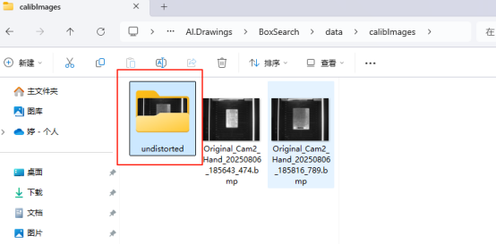

## 5.真实铭牌标注

### 5.1 测量出铭牌实际大小

第 4 步里拍照的铭牌，量出实际的长和宽。（测量多次取平均值）

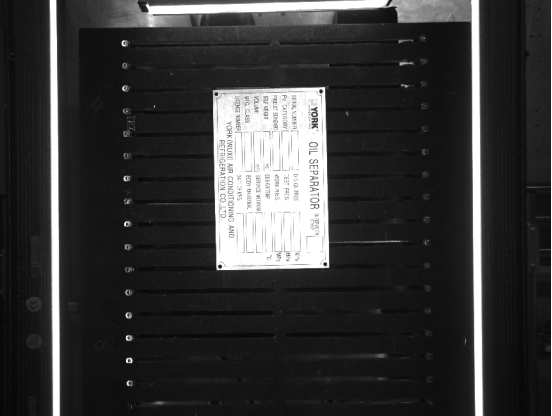

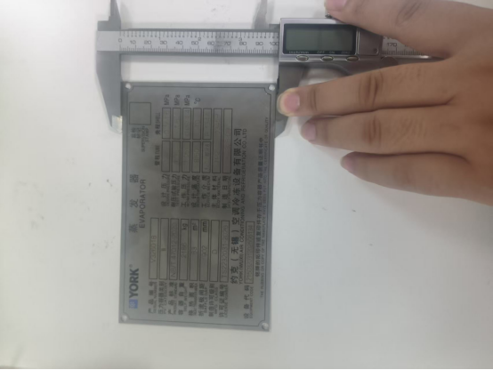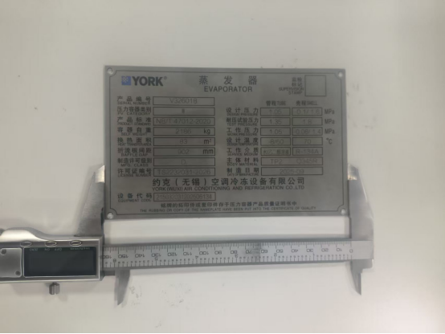

### 5.2 铭牌上下左右 4 个点进行标注

PSD 打开图片（第 4 步骤里矫正后的图片），标注铭牌的 4 个点的像素位置

使用下图圈出的工具在铭牌四角画出圆圈

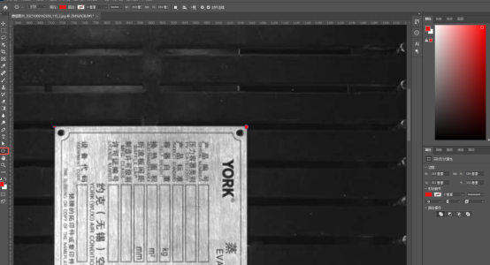

选中圆圈，右侧功能栏中被红框圈出的即为该点坐标，其余三点同理

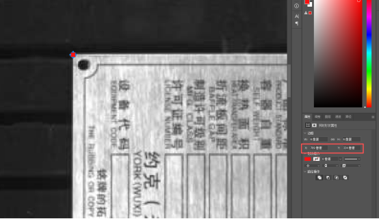

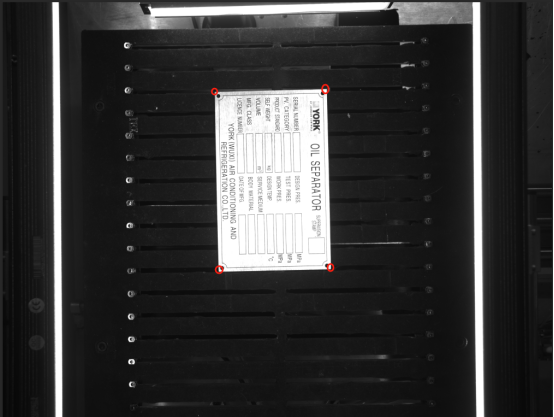

\[

&nbsp;           \[1552 ,656\],  # 左上

&nbsp;           \[2372, 635\],  # 右上

&nbsp;           \[1581, 1972\],  # 左下

&nbsp;           \[2403, 1953\]  # 右下（这里的数据是演示用不可直接使用）

&nbsp;       \],

### 5.3 代码理修改 4 个点位置参数和铭牌大小

使用四个点获取透视变换矩阵

修改四个点的参数和铭牌实际尺寸大小

注意：铭牌尺寸为 99.55\*159.338，real_width 和 real_height 需要 x10 再填入

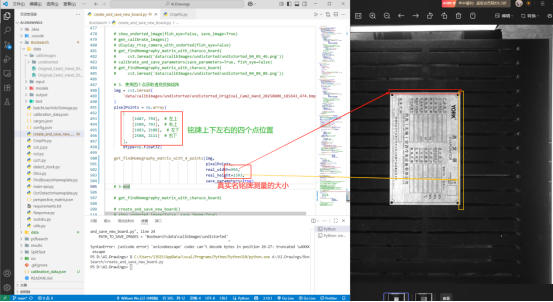

矫正后的图片路径修改

img = cv2.imread(

&nbsp;       'data/calibImages/undistorted/undistorted_Original_Cam2_Hand_20250806_185643_474.bmp'

&nbsp;   )

### 5.4 执行文件

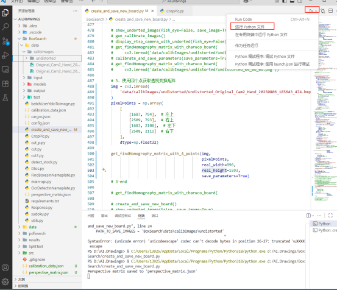

### 5.5 查看裁剪后的图片

执行后查看裁出的铭牌，出现下方的图片，可根据图片重新修改 4 个点的位置，重新裁剪

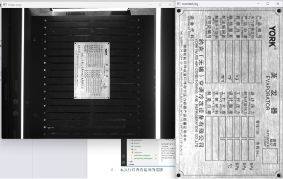

### 5.6 生成矫正文件 perspective_matrix.json

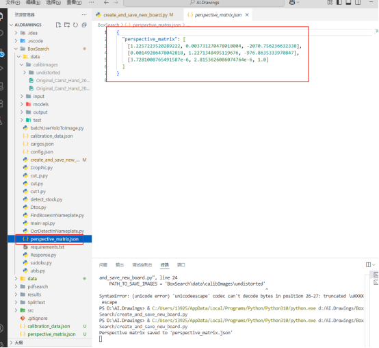

## 6.top 和中心线修改

视觉配置文件修改

{

&nbsp; "top_line_points": \[

&nbsp;   \[1392.0, 188.0\],

&nbsp;   \[1983.0, 178\],

\[2566.0, 165.0\]

//顶部线上的点，可以有多个（可以用 psd 画出一条线进行测量）图片要用矫正过后的图片（需要用目录 4 里面校正后的图片）

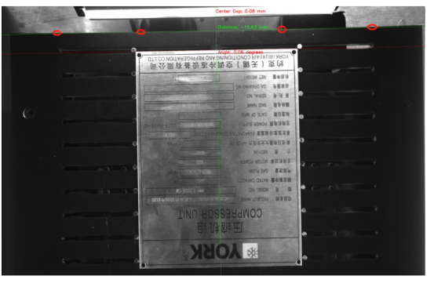

&nbsp; \],

&nbsp; "clamping_line_points": \[

&nbsp;   \[1978.0, 181.0\],

&nbsp;   \[1984.0, 488.0\],

\[2016.0, 2060.0\]

//打印台中心线的点，圈出打印板上顶部和底部左右的两个点，算出中线点后，画出中心线，然后在中心线上圈出 3 个点。将 3 个点的像素位置写入 clamping_line_points 里（需要用目录 4 里面校正后的图片）

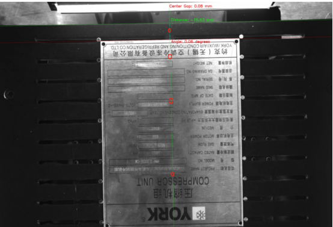

&nbsp; \],

&nbsp; "nameplate_transform_ratio": 0.933,

//目前是视觉识别值和创思识别的值的比例，实际是因为铭牌有厚度需要铭牌顶部到边缘的长的和铭牌底部到边缘长的比例

&nbsp; "find_box_line_distance_threshold": 10.0,

//找框的阈值，实际配置的框和识别的框相差 10 个像素以上则不修正

&nbsp; "update_offset_with_measure": false,

//是否使用我们的测量的偏移量值

&nbsp; "update_width_with_measure": false,

//是否使用我们测量的宽度值

&nbsp; "update_height_with_measure": false,

//是否使用我们测量的高度值

&nbsp; "max_angle_threshold": 0.2,

//偏移角度，如果偏移角度大于 0.2 则过滤不打印，目前设置的 0.4

&nbsp; "max_ratio_threshold": 0.1,

//长宽高的比例差很大也不打

&nbsp; "max_x_offset_threshold": 2.0

//中心线偏差超过 2mm 也不打

}

## 7.视觉模拟测试

当现场打印失败时（尤其是 AI 判断的 CMD 命令行窗体中报 400 错误），可能是多个故障引发，其中一个可能性就是 AI 生成的 JSON 有问题。此处提供检查 AI 生成的 json 文件是否正确的一个方法。模拟测试的优势就是，无需在客户现场的上位机上操作，自己的电脑安装好相关软件后就可以进行相同的测试操作：

1.文件准备：在 AI.Drawings\\BoxSearch\\data\\input 文件夹下存放任务编号的文件，上位机拍照后会生成对应的文件，将文件拷贝过来，主要需要下方的一个 json 文件和图片

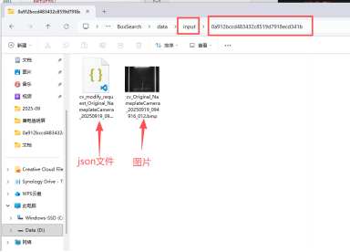

2.json 文件内容修改

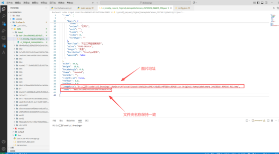

3.运行 main-api.py

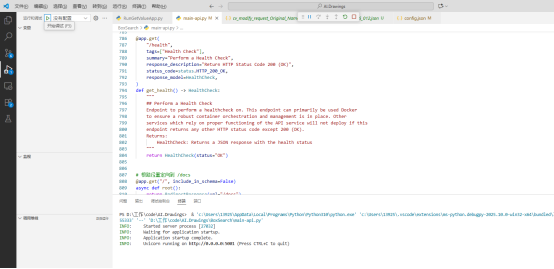

4.打开 swagger 地址：http://localhost:5001/docs#

将 input 文件夹里的 json 进行复制，执行接口/AI/Box/ModifyCoordinatesNameplate

例如：{

"Items": \[

{

"c_field": "位号 1-位号牌",

"e_field": "",

"source": "BitNoAndSignBoard",

"x": 21.166666666666668,

"y": 1.058333333333333,

"w": 46.03750000000001,

"h": 7.6729166666666675,

"fontSize": 5.55625,

"isEnter": false,

"isTextBold": false,

"fontColor": "#F90808",

"logic": {

"type": "",

"sheet": "",

"column": "位号 1",

"unit": "",

"table": "",

"index": 0,

"formType": ""

},

"fontType": "方正兰亭超细黑简体",

"value": "VE01-903A\\n",

"target": "无框",

"fontMethod": "TrueType 字体",

"updated": false

}

\],

"Width": 89.0,

"Height": 10.0,

"RotateAngle": 0.0,

"Shape": "rounded",

"OuterId": "",

"IsVertical": false,

"YOffset": 0.0,

"XOffset": 0.0,

"ImagePath": "D:\\\\工作\\\\code\\\\AI.Drawings\\\\BoxSearch\\\\data\\\\input\\\\0a912bccd483432c8519d7918ecd341b\\\\cv_Original_NameplateCamera_20250919_094916_012.bmp",

"JobNo": "0a912bccd483432c8519d7918ecd341b"

}

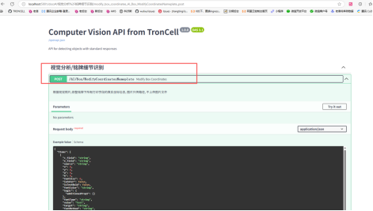

执行后生成的文件地址配置：

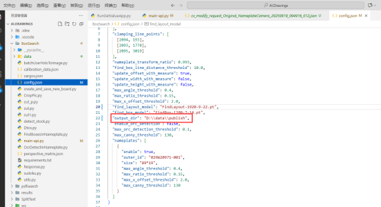

生成的文件信息，在配置的目录下生成对应的文件夹和图片

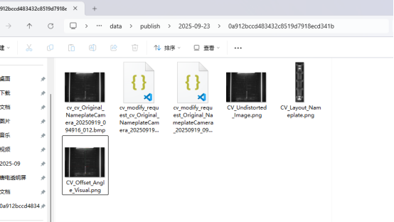

