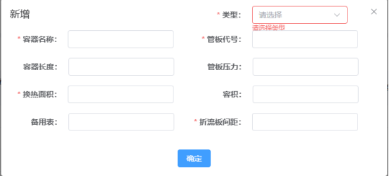
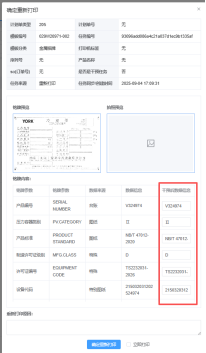

铭牌后台操作手册

## 后台操作系统地址

后台地址：[http://10.111.32.23:8850/#/login](http://10.111.32.23:8850/#/login)

# 2.登录

**界面展示：**

**功能说明：**

输入账户、密码登录后台

账户：admin

密码：123qwe

# 3.首页

**界面展示：**

**功能描述：**

**状态筛选**：包含缺货和库存紧张的货道

**补货完成按钮**：若对应货道已完成补货，可以勾选对应货道，点击补货完成，货道会自动切换成有货状态

# 人工干预

**界面展示：**

**功能说明：**

**列表：** 显示金属、纸质找到模板但是来源未找到的任务；显示所有未找到模板的空任务。

**查询：** 可根据计划单类型、计划单号、模板编号、so 订单号、模板分类、任务编号、任务来源、序列号进行查询

**查看：** 查看任务信息

**重新获取：** 点击重新获取，开始重新查找来源，任务状态改为处理中

**删除：** 点击删除，后台删除当前任务

## 4.1 未找到模板

1.选择模板：点击选择模板按钮-选择对应模板-点击保存，后台会重新找逻辑，任务状态显示为处理中

2.关闭任务：点击关闭任务-确认关闭。任务状态会变成关闭

## 4.2 找到模板，未找到来源--金属

（1）容器或机组铭牌

- **修改字段信息：** 可以修改铭牌里参数信息
- **立即打印：** 勾选后，点击保存加入队列，待打印的任务会显示在上方
- **保存：** 修改后保存铭牌信息，任务依然在人工干预列表，可以再次修改
- **保存并加入队列：** 修改后保存铭牌信息，任务进入待打印列表
- **手动打印：** 任务进入打印历史

  

- 位号牌、电气位号牌、标示铭牌

(1))如果只打印一个，可以直接在文本框里填写需要打印的参数进行保存。

(2))如果需要打印多张铭牌，可以下载导入模板，填写数据后进行导入，保存后会创建多个子任务。

## 4.3 找到模板，未找到来源--纸质

显示多个打印机的铭牌信息，点击查看，可以查看当前打印机需要打印的铭牌数据，可以人工修改参数信息，点击保存（只会保存当前查看的铭牌信息，如果修改多个，每个都需要点保存按钮）

# 5.铭牌字段

## 5.1 字段来源

**界面展示：**

**功能说明：**

- 铭牌上所有字段的来源逻辑配置
- **编辑：** 修改所有字段的来源逻辑配置（不用更改）
- **保存**：保存所有字段的来源逻辑配置

## 5.2 间隙表

**界面展示：**

**功能说明：**

- 显示热换面积和折流板间距的信息（一般由设计录入和修改）
- **查询：** 可根据容器名称、与应用类型、机组能效/蒸冷型号、冷量、管板代号、管板压力、类型查询数据
- **新增：** 可以创建不同类型的热换面积和折流板间距的信息

  

- **编辑**：可以修改不同类型的热换面积和折流板间距的信息
- **删除：** 可以删除热换面积和折流板间距的信息
- **导入：** 可以下载导入模板，整理不同产品的热换面积和折流板间距的信息进行导入

  

- **导出**：可以导入后台已经录入的热换面积和折流板间距的信息

# 打印历史

**界面展示：**

**功能说明：**

- **列表：** 显示纸质和金属打印完成的任务
- **查询：** 可根据计划单类型、计划单号、模板编号、so 订单号、模板分类、打印结果、任务编号、任务来源、序列号、是否是干预任务、时间进行查询
- **导出：** 导出列表任务信息
- **查看：** 查看单个任务的打印信息

点击铭牌预览图：可查看打印铭牌上的具体信息

- **重新打印：** 点击重新打印，可以重新创建打印任务

确定重新打印：可以修改打印参数后，点击确定重新打印，会重新创建当前模板的打打印任务。（在待打印列表显示）
立即打印：勾选立即打印，创建的任务显示在待打印列表的上方

# 7.打印任务

**界面展示：**

**功能说明：**

- **列表：** 显示纸质和金属铭牌的打印任务。按任务推送时间排序，位号牌、标示牌的任务默认显示在最后，若勾选了立即打印，任务会显示在上方。
- **查询**：可根据计划单类型、计划单号、模板编号、so 订单号、模板分类、任务编号、任务来源、序列号、时间进行查询
- **查看**：查看打印任务信息

（1）金属铭牌（单个任务）： （2）金属铭牌（子任务）

 
（3）纸质铭牌（多个打印机的任务信息）：点击预览可查看对应铭牌的打印信息，点击删除，可以删除子任务

- **删除**：删除打印任务（包含当前任务里的子任务信息）
- **创建任务：**

**（1）金属任务创建：** 选择模板-输入打印字段信息-点击确定

**（2）金属模板任务创建（位号、标示牌）：**

创建单个任务：输入位号/标识牌模板编号-手动添加字段信息-点击确定

创建多个子任务：输入位号/标识牌模板编号-点击下载模板-添加后点击导入模板-点击确定（只会创建表格里导入的任务）

(3))纸质任务：输入纸质模板编号-自动显示四台打印机（可以勾选需要打印的打印机标签选择对应的模板）-输入打印信息-点击确定。

# 8.模板列表

## 8.1 模板分类

界面展示：

功能说明：

**列表**：显示铭牌分类信息

**搜索**：可根据分类名称、分类编码查询数据

**新增分类：** 输入分类名称、分类编码创建分类（目前固定，无需再建）

**编辑分类：** 可以修改分类名称和编码

**删除：** 点击删除，可以删除分类（都是创建好的，不要删除）

**子分类**：父分类下可以创建多个子分类

## 8.2 创建模板

界面展示：

**列表：** 显示所有铭牌模板

**查询：** 可以根据模板编号、sap 号、模板分类和打印机标签查询模板

**创建副本：** 点击创建副本，可以生成一个参数一样的名牌，可以修改信息进行创建

**编辑：** 可以修改创建的铭牌参数信息

**删除**：可以删除创建的铭牌

### 8.2.1.铭牌信息

| 字段         | 描述                                                                                                             |
| ------------ | ---------------------------------------------------------------------------------------------------------------- |
| 模板编号     | 模板 PN 号，必填且不能重复                                                                                       |
| 模板分类     | 选择金属铭牌/纸质铭牌                                                                                            |
| 模板尺寸     | 铭牌真实尺寸，必填                                                                                               |
| SAP 号       | 模板老号，必填                                                                                                   |
| 文字深度     | 打印深度，非必填（目前未使用到此字段）                                                                           |
| 是否有子任务 | 是否有子任务，例如位号、电气位号、标识牌会有子任务                                                               |
| 版本号       | 铭牌版本，非必填（目前未使用到此字段）                                                                           |
| 属性         | 非必填，如果是标识牌、电气、位号牌、ABS 位号牌，需要下拉选择                                                     |
| 横板/竖版    | 必选，打印机打印时是横的方向或竖的方向打印铭牌（纸质无需选择）                                                   |
| 货道         | 铭牌绑定的货道（无需填写，绑定后自动显示）                                                                       |
| 图纸编号     | 非必填，用于纸质使用的图纸号                                                                                     |
| 形状         | 必选，更具铭牌形状选择：矩形、带圆角矩形、圆形                                                                   |
| 硬件配置     | 配置铭牌打印速度、功率和次数{"Speed":500,"Ratio":95,"Times":12}                                                  |
| 图片         | 上传铭牌图片，请仅上传铭牌的完整图片，图片内容需包含铭牌全貌，且不得夹杂其他无关图像、杂物，确保铭牌信息完整呈现 |
| 添加         | 添加铭牌的参数信息                                                                                               |
| 预览         | 铭牌预览图，可以修改铭牌里打印参数的文本框、位置信息等                                                           |

### 8.2.2.添加参数

1.点击添加按钮，显示铭牌字段信息的弹窗，可通过搜索查找字段

2.选择参数后，模板内容里显示添加的参数，有的字段有不同的来源，可以下拉选择来源，在选择不同的逻辑

### 8.2.3.预览

- 底部显示上传的铭牌图片
- 选中添加的参数，画布上对应的文本框会高亮，或者直接选中红色文本框，将对应的参数文本框移动到铭牌上对应文本框的位置
- 右侧基础信息

| 参数          | 描述                                                                                           |
| ------------- | ---------------------------------------------------------------------------------------------- |
| 名称          | 选中文本框的名称                                                                               |
| X,Y           | 文本框 X，Y 的像素位置，下方对应的是铭牌上实际测量的位置                                       |
| W,H           | 文本框的长度和高度，下方对应的是铭牌上实际测量的长和宽                                         |
| 字号          | 打印文字的像素大小，下方是实际大小。但是真实打印时，英文：设置的高度\*90%中文：设置的高度\*75% |
| 字体方式/字体 | 下拉选择字体方式和字体（纸质无需填写）                                                         |
| 属性          | 下拉选择实际铭牌打印的区域是有框、无框、线（纸质无需填写）                                     |
| 是否换行      | 文字过多时，是否需要换行（纸质无需填写）                                                       |
| 测试文本      | 测试文字，可以查看文字显示（测试完后需要删除）                                                 |
| 打印源名称    | 金属无需填写，用于纸质，需要和 BarTender 做的模板里文本框的来源一致                            |

# 9.货架列表

界面展示：

**功能说明：**

- 列表：显示货架列表
- 创建：可以创建货架（目前都已创建好无需再创建）
- 编辑：可以修改货架名称等信息
- 查询：可以根据货架名称查询货架
- 删除：可以删除货架（现有的货架不要删除）

## 9.1 货道信息

功能说明：

- 显示整个货架，每个货道放置的铭牌
- 详情：点击货道，可以查看货道的详情信息

| 参数     | 描述                                                                                                                                                                                                                                                        |
| -------- | ----------------------------------------------------------------------------------------------------------------------------------------------------------------------------------------------------------------------------------------------------------- |
| 货道名称 | 货道的名称，必填                                                                                                                                                                                                                                            |
| 货道编号 | 货道的编号，必填，一般和名称保持一致                                                                                                                                                                                                                        |
| 库存容量 | 货道里铭牌的容量                                                                                                                                                                                                                                            |
| 尺寸     | 货道的大小                                                                                                                                                                                                                                                  |
| 备注     | 机械臂的货道号（不能随意修改）                                                                                                                                                                                                                              |
| 选择铭牌 | 货道绑定的铭牌 1.货道已绑定铭牌：显示解绑按钮  解绑：点击解绑，货道变为空，按钮显示绑定  2.货道位绑定铭牌：显示绑定按钮 绑定：文本框中，输入铭牌 PN 号，选择后点击绑定，货道会显示绑定的铭牌信息  3.点击铭牌号，可以查看铭牌的信息 |
| 库存     | 货道里铭牌的数量                                                                                                                                                                                                                                            |
| 库存状态 | 下拉选择货道的库存状态 0：无货 1-5：库存紧张 5 以上：有货                                                                                                                                                                                    |

# 10.账户管理

界面展示：

**功能说明：**

用户列表：显示创建的用户

搜索：可以根据用户名、卡号等进行查询

创建/编辑用户：可以新增或修改用户信息

删除：可以删除用户信息

更改密码：可以重新修改密码

# 11.角色管理

界面展示：

**功能说明：**

**列表：** 显示创建的角色列表

**搜索：** 可根据名称搜索用户角色

**编辑：** 可以修改用户的角色名称和权限

**删除：** 可以删除用户角色

**新增角色**：可以创建不同的角色，勾选不同的权限目录

# 同步日志

界面展示：

功能说明：

**列表：** 显示 mes 推过来的数据列表

**查询**：可以根据时间搜索推送数据

**查看：** 点击查看，可以查看具体的推送信息

# 基础设置

界面展示：

功能说明：

登录页的背景和 logo 配置（无需修改）
