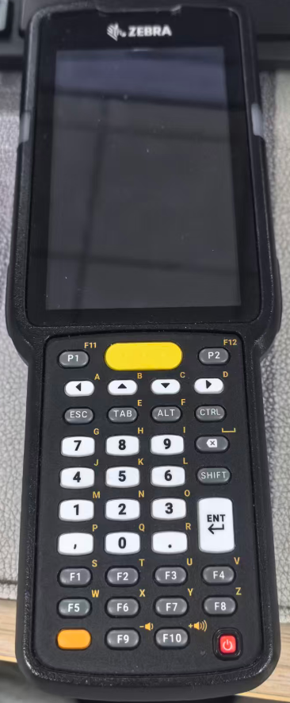
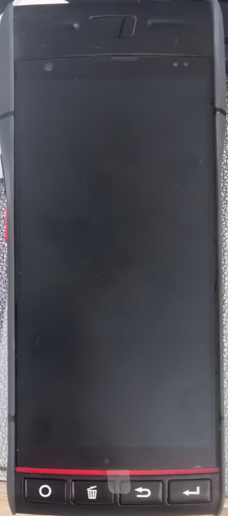

# 1.介绍

1.防错扫码枪

是一款主打 “双重扫描校验” 功能的便捷式数据采集设备，核心用于通过两次扫描比对，判断读取数据是否一致，确保信息采集的准确性。

详细安装说明请参考：[防错 APK 文档介绍](https://github.com/troncell/SensingDocs/blob/main/Project%20Docs/%E6%98%93%E5%B8%86%E7%89%B9/%E9%98%B2%E9%94%99apk%E6%96%87%E6%A1%A3%E4%BB%8B%E7%BB%8D.md)

2.自带出纸扫码枪

是一款主打 “扫描后自动打印条码” 即时联动功能的智能数据采集设备，集成扫码读取与自带出纸打印模块，实现 “扫描即打印” 的高效操作，满足数据采集与现场记录同步完成的需求。

详细安装说明请参考：[自带出纸的扫码枪 APK 文档](https://github.com/troncell/SensingDocs/blob/main/Project%20Docs/%E6%98%93%E5%B8%86%E7%89%B9/%E9%98%B2%E9%94%99apk%E6%96%87%E6%A1%A3%E4%BB%8B%E7%BB%8D.md)

# 2.代码仓库地址
