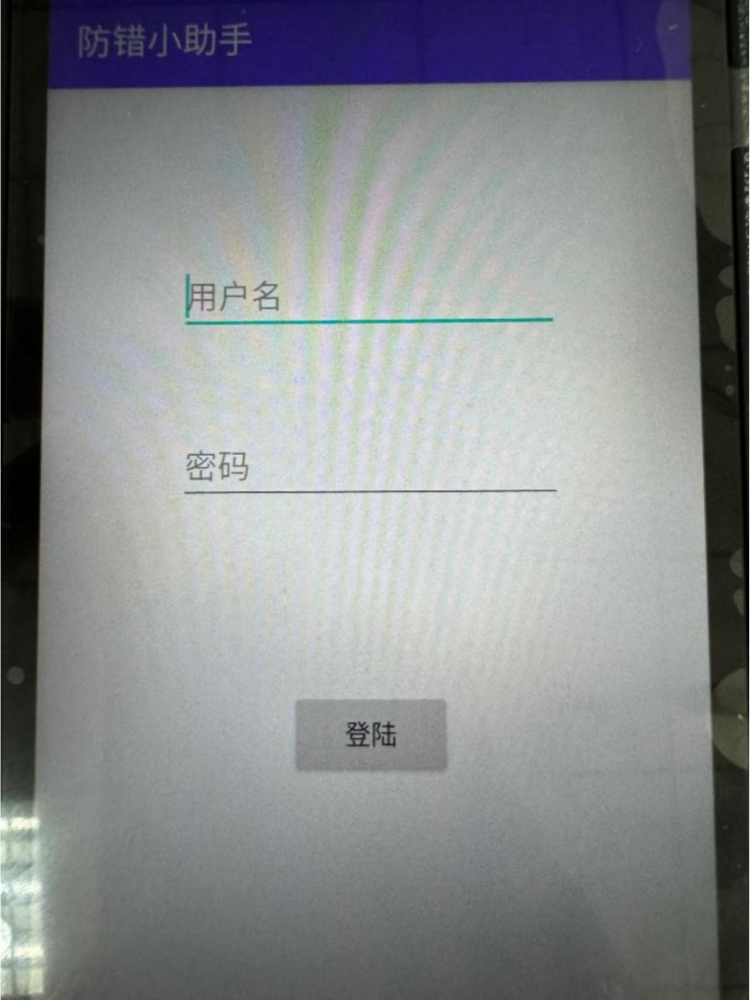

防错 apk

1. 登录页面

输入用户名和密码，点击登录

例如：admin 2021

1. 参数设置页面

   

**一致匹配**：第一次扫货物二维码和第二次扫货物二维码要一致

**前缀匹配：**需要设置前缀匹配参数，设置完成后，将匹配该设置参数后面的信息。

**传输匹配：**寻找扫码枪本地数据库里是否匹配过，如果匹配过提示正确。如果没有匹配过提示错误并存储当前扫的货物二维码

**结尾字符：Enter、TAB：**用于扫描货物二维码后的操作。可配置扫码后触发 Enter 或 Tab 事件。还和扫码枪自身设置有关，扫码枪软件 DataWedge-Profile0(default)-基本数据格式化里，勾选发送 Tab 键或发送 ENTER 键。

**是否转换为大写再比对：**如果不勾选，首次和再次扫描货物二维码时，必须大小写一致才能匹配成功；若勾选，则不区分大小写，只要字母相同即可匹配成功。

**是否开启前缀校验：需要设置前缀校验参数。**一致匹配时，同一个条码扫两遍。会在此基础上多判断一次，当第一次扫描时，先判断扫描的条码第一位是不是开启前缀检验的字母，如果是，则光标跳入第二个框，再扫描第二个条码直接与第一个匹配就行。如果不是，则报错，清空，光标继续定位第一个框。

**确认：**保存设置的参数

**返回选择页面：**回到主页面
