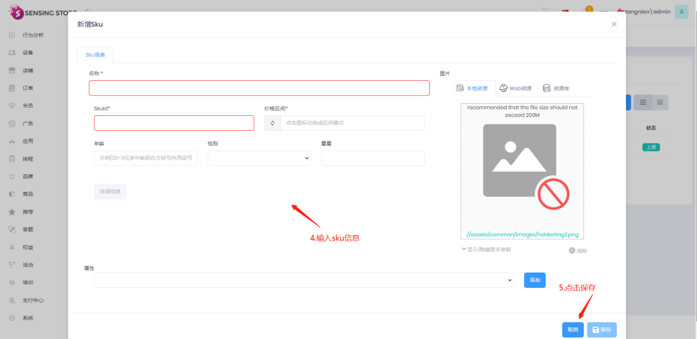

# 货架介绍

云货架既具备了无人时品牌广告展示的能力，也具备了有人时展示交互界面的能力。能够陈列全库存商品，通过筛选工具可以快速找到自己需要的商品。还能通过筛选颜色、款式等信息浏览感兴趣的商品。还会根据会员以往的消费喜好推荐相似商品，依据性别、年龄、妆容进行智能搭配，提升了客户洞察。在云货架页面领取专属优惠券，扫码购买或加入购物车后再做选择。优惠券同时也支持线上使用，实现了线上、线下深度融合。可支持APPPOD输入设备秘钥，下载商品、广告等内容。

云货架样例：

    A.无人操作时，播放广告页

    B.用户点击屏幕显示商品列表

    C.点击商品可查看商品详情

   

# 显示信息配置文档

# 1登录后台
## 1.1登录准备

1.为确保最佳兼容性，请使用 chrome浏览器 登录系统
2.在chrome浏览器中，进入https://test5.sensingstore.com/account/login

##  1.2 租户登录
前提：已创建过租户

操作步骤：
点击修改→切换至租户为勾选状态→输入租户名称→点击切换至此租户→输入用户名、密码→点击登录

租户名：输入租户名称，仅能输入英文与数字
用户名：输入用户名称或用于注册账号的登陆邮箱亦可
密码：输入登陆密码，若为第一次登陆未设置密码，需要在邮箱中的验证邮件中找到随机密码并修改
登陆：若确认账号信息无误却无法登陆，可进入host账户查看或重新设置密码

操作步骤图示：

登录成功后如下图：

注：（不同的账号根据拥有的权限登录后初始页面可能会有变化）

# 2. 设备

## 2.1 新增设备

**操作步骤：** 应用列表 → 点击需要添加应用的编辑按钮 → 点击授权一览 → 点击添加按钮 →保存信息

**操错步骤图示：**

| **参数** | **描述** |
| --- | --- |
| 名称 | 输入设备名称 例：云货架 |
| 设备类型 | 选择设备类型：多屏拼接设备 |
| 系统类型 | 系统类型：Windows |
| 电商类别 | 选择电商类别，类别来自于商品电商信息里选择的类别 |

## 2.2 上线设备

**操作步骤：** 设备列表 → 勾选下线设备 → 点击批量操作 → 点击上线选中 → 点击发送

**操错步骤图示：**

# 3. 商品

## 3.1 创建分类

**操作步骤：** 商品分类 → 新建根分类 → 输入分类名称 → 点击保存

**操错步骤图示：**

## 3.2 创建属性

**操作步骤：**
新增商品属性：点击商品下的商品属性→点击新增商品属性→编辑号信息后→点击保存

添加商品属性值：选择创建的商品属性→点击操作下的编辑按钮→点击属性值→填写属性值名称后→点击保存

设置关键属性：点击已创建属性的编辑按钮→设置显图属性后→点击保存

**操作步骤图示：**

**添加商品属性：**

添加属性值：

设置关键属性

## 3.3 新建商品

**操作步骤：** 商品列表 → 新增商品 → 输入商品信息 → 点击保存

**操错步骤图示：**

| 参数 | 描述 |
| --- | --- |
| 名称 | 商品名称 |
| 编号 | 商品唯一编码，必填且不能重复 |
| 商品分类 | 选择商品的所属类别 |
| 价格 | 商品价格 |
| 图片 | 商品主图 |
| 描述 | 商品详情图 |

## 3.4 添加资源图片

**操作步骤：** 商品列表 → 点击编辑 → 点击资源列表 → 添加图片后 → 点击保存

**操错步骤图示：**

## 3.5 新建sku

**操作步骤：** 选择要添加sku的商品，单击编辑按钮→单击sku → 单击新增 sku→ 编辑信息→点击保存

**操作步骤图示：**

| **参数** | **描述** |
| --- | --- |
| 名称 | Sku名称 |
| Skuid | Sku唯一编码，不能重复 |
| 价格 | 输入sku价格 |
| 属性 | 添加商品属性和属性值 |

## 3.6 sku添加电商平台

## 3.7上线商品和sku

**操作步骤：** 点击商品列表→选中需要上架的商品→点击批量操作→点击上线选中

**操作步骤图示：**

## 3.8发布商品

## 3.9商品导入

### 3.9.1表格数据：

商品（SPU）sheet:

单品（SKU）sheet：

单品线上库存(SKU-Online-Stock)

线下库存(Instore-Stock)sheet：

### 3.9.2后台导入

